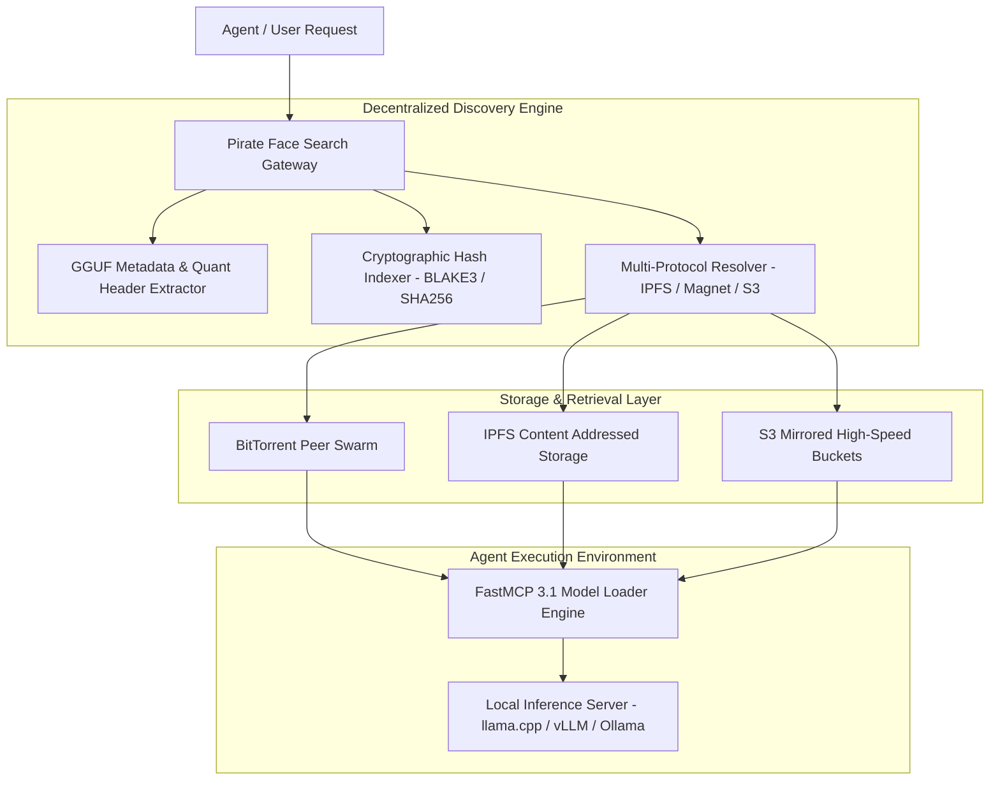
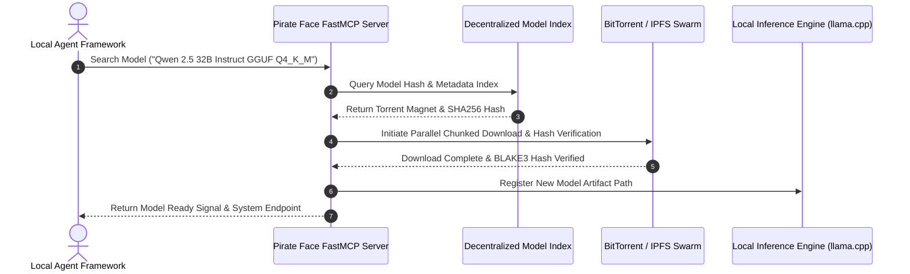

# Pirate Face

## What it is
Pirate Face is an open-source decentralized model indexer, repository discovery protocol, and distributed artifact sharing platform for local Large Language Models (LLMs), quantized GGUF weights, and fine-tuning checkpoints. Designed as a peer-to-peer and community-indexed alternative to centralized hubs, Pirate Face enables local AI enthusiasts, researchers, and developers to search, verify, and stream model weights across distributed storage backends (IPFS, BitTorrent, magnet links, and S3 mirrors).

Operating in 2027, Pirate Face provides cryptographic weight verification (SHA256/BLAKE3 model hashes), automated metadata parsing for GGUF architecture headers, and FastMCP 3.1 tool integration for local agents (e.g. LM Studio, Ollama, Jan) to discover and pull model weights programmatically.



## What problem it solves
- **Centralized Hub Vulnerabilities**: Complete reliance on single centralized model hubs leaves local AI workflows vulnerable to rate limits, bandwidth throttling, unexpected content removals, and platform outages.
- **Large Weight Bandwidth Costs**: Downloading multi-gigabyte open-weight models (e.g. 70B+ param GGUF files) across standard HTTPS endpoints often suffers from interrupted downloads and slow throughput.
- **Model Tampering & Poisoning**: Downloading model files from untrusted mirrors carries security risks without cryptographic payload verification.
- **Agentic Model Procurement**: Local agent workflows lack standardized MCP protocols for querying, selecting, and downloading specific quantization variants (e.g., Q4_K_M vs Q8_0) automatically.

Pirate Face addresses these problems by decentralizing model weight distribution via P2P protocols, enforcing content-addressed BLAKE3 hashing, and offering FastMCP 3.1 APIs for seamless agentic model retrieval.

## Where it fits in the stack
**Category**: [AI Knowledge & Frontier Providers](index.md) / Local Model Management & Distribution Infrastructure.

Pirate Face operates as a model discovery and acquisition layer for local AI ecosystems:
- **Distribution & Storage Layer**: Bridges P2P distribution networks (BitTorrent, IPFS) with local storage volumes.
- **Metadata & Indexing Layer**: Extracts architecture details, tensor shapes, quantization levels, andcontext limits directly from GGUF headers.
- **Agent Integration Layer**: Exposes FastMCP 3.1 endpoints enabling agentic frameworks (Claude Code, OpenClaw, AutoGen) to inspect and fetch missing local models dynamically.



## Typical use cases
- **Decentralized Model Weight Sharing**: Mirroring and distributing community fine-tunes and specialized GGUF quantizations without depending on centralized hosting providers.
- **Automated Local Agent Tooling**: Enabling FastMCP 3.1 agents to query, verify, and pull necessary LLM weight files when executing local offline workflows.
- **High-Speed Swarm Downloads**: Leveraging multi-peer BitTorrent swarming to saturate gigabit connections when downloading 100GB+ quantized LLM artifacts.
- **Tamper-Proof Artifact Verification**: Validating downloaded model files against cryptographic hashes before loading into GPU memory.

## Strengths
- **Resilient Decentralization**: Operates over distributed P2P protocols (BitTorrent, IPFS), rendering downloads immune to centralized server downtime.
- **Cryptographic Model Safety**: Mandates content-addressed BLAKE3 and SHA256 verification to prevent model tampering or malicious payload injection.
- **Native GGUF Inspection**: Parses model architecture attributes (context size, layer counts, quant type) directly from file headers before downloading.
- **FastMCP 3.1 Native**: Provides built-in MCP tool endpoints for agentic workflow integration.

## Limitations
- **Swarm Seed Dependence**: Download speed for rare or niche model quantizations depends on active community seeders.
- **ISP Throttling**: Certain network environments or ISPs throttle P2P traffic, requiring configured VPNs or WebTorrent fallback relays.
- **Storage Consumption**: High-capacity local NVMe storage is required to hold multiple model versions and torrent cache chunks.

## When to use it
- When building resilient, offline-first local AI infrastructure.
- When automating model downloads and weight management via agentic pipelines using FastMCP 3.1.
- When distributing custom fine-tuned GGUF/EXL2 models to distributed edge nodes without centralized bandwidth costs.

## When not to use it
- When exclusively using cloud-hosted proprietary API endpoints (OpenAI, Anthropic, Gemini).
- In strictly enterprise corporate environments where outbound P2P/BitTorrent protocols are blocked by firewall rules (use direct S3 mirrors or private Hugging Face instances instead).

## Getting started

### 1. Installation
Install the Pirate Face CLI and Python bindings alongside FastMCP 3.1:

```bash
pip install pirate-face-cli fastmcp pydantic
```

### 2. Initializing the Local Index
Sync the latest model catalog index:

```bash
pirate-face sync-index
```

### 3. Basic Python Search
```python
from pirate_face import ModelIndex

index = ModelIndex()
results = index.search(query="Qwen-2.5-Coder-32B", quant="Q4_K_M")

for model in results:
    print(f"Title: {model.title} | Quant: {model.quant_type} | Hash: {model.blake3_hash[:12]}")
```

## CLI examples

### Searching for Model Weights
Search for quantized GGUF weights from the command line:

```bash
pirate-face search "Llama-3.1-8B-Instruct" --quant Q4_K_M
```

### Downloading Model Artifact via Torrent Magnet
Initiate a verified P2P download using model hash:

```bash
pirate-face download --hash "b3_e3b0c44298fc1c149afbf4c8996fb924" --verify
```

## API examples

### FastMCP 3.1 Local Model Management Server
The following Python script creates a **FastMCP 3.1** server that enables local agents to search and pull model weights programmatically:

```python
import os
from typing import List, Dict, Any, Optional
from pydantic import BaseModel, Field
from fastmcp import FastMCP

mcp = FastMCP(
    "pirate-face-model-server",
    instructions="FastMCP 3.1 server for searching and downloading local model weights via Pirate Face P2P."
)

class ModelSearchQuery(BaseModel):
    query: str = Field(..., description="Model name or architecture keyword (e.g. Qwen, Llama-3, DeepSeek)")
    preferred_quant: Optional[str] = Field(default="Q4_K_M", description="Preferred quantization format (e.g., Q4_K_M, Q8_0, FP16)")

class ModelSearchResult(BaseModel):
    model_name: str
    quant_type: str
    size_bytes: int
    blake3_hash: str
    magnet_uri: str
    seeders: int

@mcp.tool()
def search_local_models(params: ModelSearchQuery) -> Dict[str, Any]:
    """
    Search the Pirate Face index for local model weights matching criteria.
    """
    try:
        # Mock search results representing Pirate Face index query
        results = [
            ModelSearchResult(
                model_name=f"{params.query}-GGUF",
                quant_type=params.preferred_quant or "Q4_K_M",
                size_bytes=19800000000,
                blake3_hash="b3_7a8f9102830192830192830192830192",
                magnet_uri="magnet:?xt=urn:btih:7a8f9102830192830192830192830192",
                seeders=142
            )
        ]
        return {
            "status": "success",
            "results": [r.model_dump() for r in results]
        }
    except Exception as e:
        return {
            "status": "error",
            "message": str(e)
        }

if __name__ == "__main__":
    mcp.run()
```

### Pydantic v2 Schema for Model Artifact Manifests
Enforce strict validation for model weight metadata:

```python
from typing import List, Optional
from pydantic import BaseModel, Field, ValidationError

class GGUFHeaderMetadata(BaseModel):
    architecture: str = Field(..., description="Model architecture type (e.g. llama, qwen2, gemma2)")
    context_length: int = Field(..., ge=1024, description="Maximum supported context length")
    block_count: int = Field(..., ge=1, description="Number of transformer layers")
    embedding_length: int = Field(..., ge=128)

class ModelArtifactManifest(BaseModel):
    artifact_id: str = Field(..., description="Unique model artifact identifier")
    title: str = Field(..., description="Human-readable model title")
    blake3_hash: str = Field(..., pattern=r"^b3_[a-f0-9]{32,64}$", description="BLAKE3 cryptographic hash")
    gguf_metadata: GGUFHeaderMetadata
    is_verified: bool = Field(default=True)

def parse_model_manifest(raw_data: dict) -> ModelArtifactManifest:
    """
    Validates model manifest against Pydantic v2 schema.
    """
    return ModelArtifactManifest.model_validate(raw_data)

if __name__ == "__main__":
    sample_manifest = {
        "artifact_id": "pirate-llama-3-8b-q4",
        "title": "Meta Llama 3.1 8B Instruct Q4_K_M GGUF",
        "blake3_hash": "b3_7a8f9102830192830192830192830192",
        "gguf_metadata": {
            "architecture": "llama",
            "context_length": 131072,
            "block_count": 32,
            "embedding_length": 4096
        },
        "is_verified": True
    }
    manifest = parse_model_manifest(sample_manifest)
    print(f"Validated Model: {manifest.title}, Architecture: {manifest.gguf_metadata.architecture}")
```

## Related tools / concepts
- [Ollama](../../services/ollama.md) — Local LLM runner and management server.
- [text-generation-webui](../infrastructure/text-generation-webui.md) — Gradio web UI for local LLM text generation.
- [vLLM](../infrastructure/vllm.md) — High-throughput local LLM serving engine.
- [Local LLMs](local_llms.md) — Overview of open-weights models for local deployment.

## Sources / References
- [Pirate Face Reddit Announcement](https://www.reddit.com/r/LocalLLaMA/comments/1wnxhji/pirate_face_pirate_bay_for_llms/)
- [Model Context Protocol Specification](https://modelcontextprotocol.io)
- [GGUF Specification](https://github.com/ggerganov/ggml/blob/master/docs/gguf.md)

---
## Contribution Metadata
- Last reviewed: 2027-01-07
- Confidence: high
