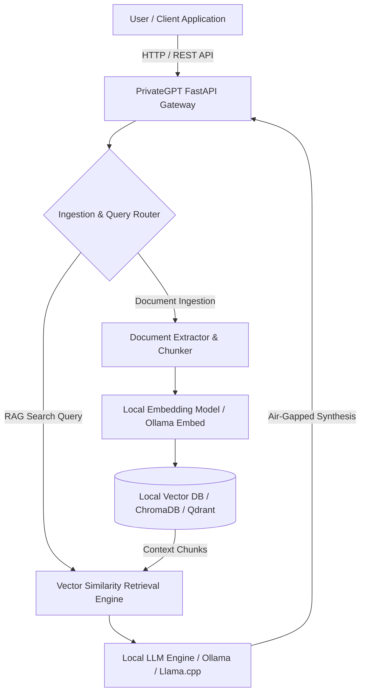

# PrivateGPT

## What it is
PrivateGPT is a production-ready, open-source AI framework designed to enable 100% private, local document processing, semantic search, and retrieval-augmented generation (RAG) over structured and unstructured files (PDFs, Word documents, text files, Markdown, and audio transcriptions) without transmitting proprietary data to external cloud LLM providers. Built with Python, LlamaIndex, FastAPI, and Gradio, PrivateGPT abstracts the complexity of vector embeddings, chunking, storage, and local LLM execution into a unified API server and web interface.



## What problem it solves
Organizations, health systems, financial firms, and homelab engineers frequently handle sensitive documents—including tax filings, medical records, legal contracts, and intellectual property code bases—that cannot be transmitted across external public LLM APIs without violating privacy boundaries or strict compliance frameworks (e.g., HIPAA, GDPR, SOC 2). PrivateGPT addresses these risks by providing an air-gapped, turnkey RAG stack that binds local embedding models (e.g., HuggingFace BGE, Nomic) and local inference runtimes (e.g., Ollama, llama.cpp, vLLM) directly to local vector engines, ensuring zero data egress.

## Where it fits in the stack
**AI Assistants & Knowledge**. PrivateGPT acts as a privacy-centric knowledge retrieval application and API middleware layer. It bridges raw file ingest sources (Paperless-ngx, local file directories, Obsidian vaults) with local vector memory indexes and offline LLM execution backends.

## Typical use cases
- **Air-Gapped Corporate RAG**: Indexing proprietary engineering specifications, HR policies, and financial models for secure internal chat.
- **Offline Personal Document Search**: Querying family medical histories, tax returns, and legal documents without internet dependency.
- **Local MCP Tool Backend**: Serving as a privacy-preserving Model Context Protocol (MCP) tool source for local agentic workflows (e.g., Claude Code, Cursor, AutoGen).
- **Multimodal Transcription Analysis**: Processing local Whisper audio transcriptions alongside written transcripts for comprehensive offline research synthesis.

## Strengths
- **100% Air-Gapped Privacy**: Guarantees zero cloud telemetry or outbound external HTTP calls during document chunking, indexing, and synthesis.
- **Turnkey Dual Interface**: Offers both a clean REST API compliant with OpenAI OpenAPI specs and a interactive Gradio web browser client out of the box.
- **Modular Ecosystem Adapter**: Seamlessly swaps vector backends (ChromaDB, Qdrant, PGVector) and inference runners (Ollama, llama.cpp, OpenAI-compatible local servers) via simple YAML configuration files.
- **High-Performance Ingestion**: Optimized multi-threaded document parsing pipeline capable of processing large multi-page PDF batches efficiently.

## Limitations
- **Hardware-Dependent Latency**: Query synthesis speed and ingestion throughput depend directly on available GPU VRAM and local host CPU performance.
- **Single-Tenant Architectural Focus**: Designed primarily for single-user homelabs, edge nodes, or small team deployments rather than massive multi-tenant multi-region SaaS clusters.
- **Context Window Constraints**: Context window sizes are bound by the underlying local model's context capacity (e.g., 8k to 32k tokens on edge devices).

## When to use it
- When you require a complete, turnkey local RAG solution with a pre-configured REST API and web UI for sensitive documents.
- When regulatory compliance or strict air-gap requirements prevent any communication with third-party LLM vendors.
- When integrating offline document retrieval capabilities into local automation frameworks, scripts, or FastMCP agent tools.

## When not to use it
- When searching massive multi-terabyte public web-scale datasets that require distributed cloud search clusters (e.g., Elasticsearch, Zilliz Cloud).
- When lightweight keyword-based file search (e.g., ripgrep, standard grep) is sufficient for raw text files without vector embedding requirements.

## Getting started
Deploying PrivateGPT with `uv` package manager connected to a local Ollama server running Llama 3 or Qwen models:

```bash
# 1. Install PrivateGPT using uv package runner
uv tool install --python 3.11 \
  --find-links https://wheels.privategpt.dev/packages/ \
  "private-gpt[core]"

# 2. Configure environment variables pointing to local Ollama server
export OPENAI_API_BASE="http://localhost:11434/v1"
export OPENAI_EMBEDDING_API_BASE="http://localhost:11434/v1"

# 3. Launch PrivateGPT API server
private-gpt serve
```

## CLI examples

```bash
# Launch PrivateGPT with the pre-configured Ollama profile
PGPT_PROFILES=ollama private-gpt serve

# Ingest a folder of private PDF contracts into the local vector store
python scripts/ingest_folder.py --dir /data/contracts/2026 --watch

# Check PrivateGPT health status via HTTP endpoint
curl -s http://localhost:8080/health | jq .
```

## API examples

### Python FastMCP 3.1 & Pydantic v2 RAG Tool Integration
The following code snippet demonstrates integrating PrivateGPT as a FastMCP 3.1 tool with Pydantic v2 schemas:

```python
import json
import urllib.request
from typing import List, Optional
from pydantic import BaseModel, Field
from mcp.server.fastmcp import FastMCP

# Define Pydantic v2 schemas for PrivateGPT RAG request and response
class PrivateGPTQueryRequest(BaseModel):
    prompt: str = Field(..., description="Semantic search prompt or question to ask the local document store.")
    use_context: bool = Field(default=True, description="Whether to perform RAG vector retrieval over ingested files.")
    include_sources: bool = Field(default=True, description="Whether to include source file citations in the response.")

class SourceNode(BaseModel):
    file_name: str = Field(..., description="Name of the source document file.")
    content_snippet: str = Field(..., description="Relevant chunk text retrieved from vector store.")
    score: float = Field(..., description="Similarity score of the retrieved chunk.")

class PrivateGPTQueryResponse(BaseModel):
    answer: str = Field(..., description="Synthesized answer generated by the local LLM.")
    sources: List[SourceNode] = Field(default_factory=list, description="List of source file citations.")

# Initialize FastMCP 3.1 server
mcp = FastMCP("privategpt-rag-server")

@mcp.tool()
async def query_private_knowledge(request: PrivateGPTQueryRequest) -> PrivateGPTQueryResponse:
    """Queries the local air-gapped PrivateGPT instance for document synthesis."""
    url = "http://localhost:8080/v1/chat/completions"
    payload = {
        "messages": [{"role": "user", "content": request.prompt}],
        "use_context": request.use_context,
        "include_sources": request.include_sources
    }

    req = urllib.request.Request(
        url,
        data=json.dumps(payload).encode("utf-8"),
        headers={"Content-Type": "application/json"}
    )

    with urllib.request.urlopen(req) as response:
        raw_res = json.loads(response.read().decode("utf-8"))

    answer = raw_res["choices"][0]["message"]["content"]
    sources = []
    if "sources" in raw_res:
        for src in raw_res["sources"]:
            sources.append(SourceNode(
                file_name=src.get("document", {}).get("doc_metadata", {}).get("file_name", "unknown"),
                content_snippet=src.get("text", ""),
                score=src.get("score", 0.0)
            ))

    return PrivateGPTQueryResponse(answer=answer, sources=sources)

if __name__ == "__main__":
    mcp.run()
```

## Related tools / concepts
- [Ollama](../../services/ollama.md) — Local LLM inference server.
- [ChromaDB](../infrastructure/chroma.md) — Local embedded vector database.
- [Local Embedding Models](../infrastructure/local-embeddings.md) — Offline vector embeddings.
- [Qdrant](../infrastructure/qdrant.md) — High-performance vector search engine.

## Sources / references
- [PrivateGPT GitHub Repository](https://github.com/zylon-ai/private-gpt)
- [PrivateGPT Documentation](https://docs.privategpt.dev/)

## Contribution Metadata
- Last reviewed: 2027-01-07
- Confidence: high
