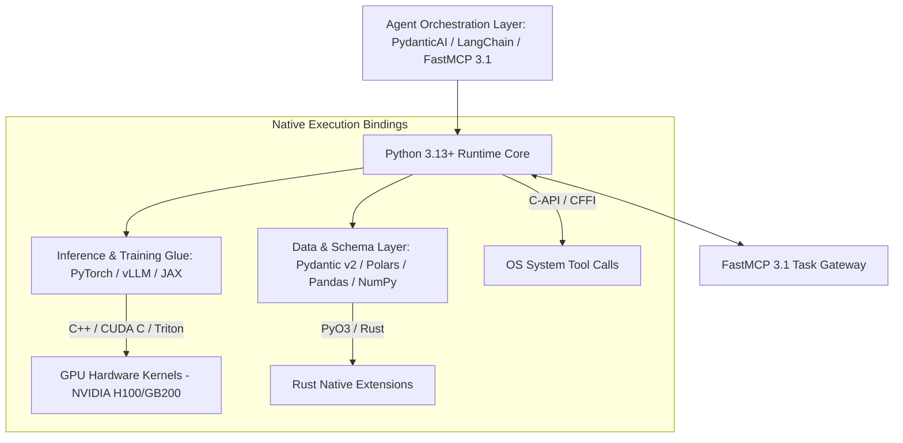

# Python

## What it is
Python is a high-level, interpreted, general-purpose programming language whose design philosophy prioritizes code readability, expressive syntactical elegance, and modular extensibility. As of early 2027, Python remains the undisputed foundational engine of the global artificial intelligence, machine learning, and autonomous agent ecosystem. It powers everything from low-level C++/CUDA tensor acceleration bindings in PyTorch, JAX, and TensorFlow to high-level multi-agent orchestration frameworks like [PydanticAI](../frameworks/pydantic-ai.md), [LangChain](./langchain.md), [LlamaIndex](./llamaindex.md), and [FastAPI](../frameworks/fastapi.md). With Python 3.13+ free-threaded builds (GIL-disabled) and modern JIT runtimes, Python seamlessly integrates with the **FastMCP 3.1 Task Protocol** specification to serve as the default runtime environment for frontier AI systems including Claude 5.6, GPT-5.6, DeepSeek-V4, and Gemini 4.0 Ultra.

Python's primacy in AI stems from its unique position as the ultimate "language of integration." Rather than forcing developers to choose between developer velocity and raw execution speed, Python's extension C-API, CFFI, PyO3 (Rust), and Cython bindings allow memory-intensive and computationally heavy tasks (such as matrix multiplication, attention mechanisms, vector index searches, and gradient updates) to execute inside compiled native code on GPUs, TPUs, and NPUs, while presenting an intuitive, pythonic interface to developers and autonomous AI coding agents.

## What problem it solves
Developing AI systems involves bridging abstract mathematical formulations, massive numerical tensor operations, heterogeneous database integrations, web API protocols, and autonomous reasoning loops. C or C++ alone provides hardware speed but incurs slow developer iteration cycles and verbose boilerplate, while pure scripting languages lack tensor kernel bindings. Python solves this fundamental friction by providing a high-level "glue" language that binds ultra-fast low-level native code (written in C, C++, CUDA, and Rust via PyO3) to intuitive, high-level Python object abstractions. Developers and autonomous agents can rapidly construct, experiment with, and deploy end-to-end AI pipelines without sacrificing execution performance for heavy vector computations.

Furthermore, Python addresses the critical need for AI agent self-reflection and dynamic execution. Because Python code is syntactically clean and can be dynamically parsed, inspected, AST-transformed, and executed via isolated execution environments (such as Docker sandboxes, Pyodide WASM runtimes, or Jupyter kernels), autonomous coding assistants like Jules, Claude Code, and OpenClaw can read, understand, debug, modify, and test Python code autonomously with minimal hallucination.

## Where it fits in the stack
**Category**: [AI Knowledge & Ecosystem](./index.md) / Core Programming Language. Python occupies the **Foundational Programming & Execution Layer**, anchoring every tier of the modern AI software stack.



At the top of the stack, high-level agent frameworks leverage Python's async/await primitives and Pydantic v2 schema engines to process Model Context Protocol messages. At the middle layer, Python manages data transformations, vector embeddings, and API endpoints using FastAPI and Polars. At the lower layer, Python interacts directly with native C++/CUDA shared libraries to drive hardware accelerators.

## Typical use cases
- **Autonomous Multi-Agent Orchestration**: Building stateful FastMCP 3.1 task servers, agent swarms, and tool calling frameworks using [PydanticAI](../frameworks/pydantic-ai.md) and [Agency Agents](../agents/agency-agents.md).
- **Deep Learning & Foundation Model Fine-Tuning**: Developing, training, and fine-tuning neural networks using PyTorch, Hugging Face Transformers, DeepSpeed, and Unsloth.
- **High-Performance Data Engineering**: Processing high-throughput unstructured data streams, embeddings, and feature stores via Polars, PyArrow, DuckDB, and NumPy.
- **AI-Native REST & gRPC Services**: Deploying asynchronous microservices and WebSockets endpoints using [FastAPI](../frameworks/fastapi.md) and Uvicorn.
- **Web Scraping & Agent Perception**: Automated web crawling and DOM extraction for AI research agents using [Crawl4AI](../process_understanding/crawl4ai.md) and Playwright.
- **RAG & Vector Retrieval Systems**: Constructing vector storage pipelines, semantic indexers, and chunking strategies with LlamaIndex, Qdrant, Chroma, and Milvus.
- **Scientific Computing & Simulation**: Simulating complex physical systems, numerical models, and statistical trajectories using SciPy, SymPy, and JAX.
- **Local Tool Execution Sandboxing**: Executing untrusted Python code snippets safely within MicroVMs, Docker containers, or WebAssembly runners for agent reinforcement learning.

## Strengths
- **Unrivaled AI Ecosystem**: Access to hundreds of thousands of specialized AI, ML, NLP, computer vision, and robotics libraries hosted on PyPI.
- **Expressive Syntactical Readability**: High readability allows autonomous agents to self-inspect, generate, debug, and safely modify Python code dynamically with minimal error rates.
- **Seamless C/C++/Rust Interoperability**: Direct C-API bindings and PyO3 allow memory-critical operations to execute at native hardware speeds.
- **Native FastMCP 3.1 Support**: Direct integration with official Pydantic v2 schema validators, FastMCP protocol decorators, and async event loops.
- **Free-Threaded Parallel Execution**: Python 3.13+ offers optional free-threaded builds that disable the Global Interpreter Lock (GIL) for true multi-core CPU parallelism.
- **Rich Interactive Tooling**: Native integration with Jupyter Notebooks, IPython REPLs, and remote execution kernels for interactive AI research and model prototyping.
- **Universal Cross-Platform Support**: Runs seamlessly across Linux, macOS, Windows, Kubernetes clusters, edge TPU hardware, and cloud hyper-scalers.

## Limitations
- **Interpreted Speed Penalty**: Pure Python loops without vectorized C/Rust backends incur execution overhead compared to compiled languages like Rust or C++.
- **Memory Overhead**: Object dynamically-typed memory layouts consume more RAM than statically allocated byte arrays.
- **Mobile & In-Browser Footprint**: Mobile (iOS/Android) and browser (WASM/Pyodide) deployments require specialized runtimes compared to Swift or JavaScript/TypeScript.
- **Global Interpreter Lock Legacy**: Older Python versions (pre-3.13) suffer from GIL thread contention during CPU-bound multi-threaded execution.

## When to use it
- When building any artificial intelligence, machine learning, data science, or autonomous agent application.
- When creating FastMCP 3.1 model tools, custom REST API endpoints, or asynchronous pipeline workflows.
- When fast developer iteration speed, library availability, and AI agent self-coding capabilities are prioritized.
- When orchestrating complex neural network training runs across multi-GPU or multi-node clusters.
- When rapid prototyping and seamless integration with third-party web services or cloud APIs are required.

## When not to use it
- For ultra-low latency sub-microsecond bare-metal kernel development or embedded microcontrollers with strictly bounded RAM constraints (use C, Rust, or C++).
- For native mobile iOS/Android frontend UIs where platform-native Swift or Kotlin frameworks offer better UI responsiveness and lower binary overhead.
- For building monolithic real-time game engines or audio DSP buffer processors where predictable garbage collection pause times are critical.

## Getting started

### Environment Setup & Installation
Install Python 3.13+ along with essential development headers and virtual environment tools:

```bash
# On Ubuntu / Debian systems
sudo apt update && sudo apt install -y python3.13 python3.13-venv python3.13-dev build-essential

# Verify installation
python3.13 --version
```

### Virtual Environment Initialization
Create an isolated Python virtual environment for your AI project:

```bash
python3.13 -m venv .venv
source .venv/bin/activate
pip install --upgrade pip setuptools wheel
```

### Free-Threaded (No-GIL) Verification
Check if your Python 3.13 build supports free-threaded execution:

```bash
python3.13 -X GIL=0 -c "import sys; print('Free-threading active:', not sys._is_gil_enabled())"
```

## CLI examples

### Package Management with `uv` or `pip`
Fast dependency resolution using modern package managers:

```bash
# Install FastMCP 3.1, Pydantic v2, and Litellm using uv
uv pip install fastmcp pydantic litellm fastapi uvicorn polars

# Freeze dependencies into reproducible lockfile
pip list --format=freeze > requirements.txt
```

### Running Interactive REPL and Module Execution
Execute Python scripts or launch interactive debugging sessions:

```bash
# Launch interactive REPL with free-threading checks
python3.13 -X GIL=0

# Execute agent module directly
python3.13 -m my_agent.main --config config.json --verbose
```

### Static Analysis and Type Checking
Run modern linter and static type checkers across Python source trees:

```bash
# Type checking with pyright/mypy
mypy --strict src/my_agent/

# Fast linting and formatting with ruff
ruff check src/
ruff format src/
```

## API examples

### Production FastMCP 3.1 Agent Server with Pydantic v2 Data Validation
This complete, production-ready Python example demonstrates an asynchronous FastMCP 3.1 server with strict Pydantic v2 request validation, error handling, and structured JSON output:

```python
import asyncio
import json
from typing import List, Optional, Dict, Any
from pydantic import BaseModel, Field, field_validator, ConfigDict
from mcp.server.fastmcp import FastMCP

# Initialize FastMCP 3.1 server instance
mcp = FastMCP("Python SOTA Agent Orchestrator")

class AgentExecutionTask(BaseModel):
    model_config = ConfigDict(str_strip_whitespace=True, extra="forbid")

    task_id: str = Field(..., description="Unique task identifier", example="task-py-2027-0107")
    target_model: str = Field(..., description="Frontier LLM model designated for task")
    prompt_instructions: str = Field(..., min_length=10, description="Detailed user or agent system prompt")
    max_tokens: int = Field(default=4096, ge=128, le=32768)
    temperature: float = Field(default=0.2, ge=0.0, le=2.0)
    enable_mcp_tracing: bool = Field(default=True)

    @field_validator("target_model")
    @classmethod
    def validate_model(cls, v: str) -> str:
        valid_models = {"claude-5.6", "gpt-5.6", "deepseek-v4", "gemini-4.0-ultra", "vllm-local"}
        if v.lower() not in valid_models:
            raise ValueError(f"Model '{v}' is invalid. Must be one of: {valid_models}")
        return v.lower()

class AgentExecutionResponse(BaseModel):
    task_id: str
    status: str
    executed_model: str
    tokens_processed: int
    execution_time_seconds: float
    output_result: Dict[str, Any]

@mcp.tool()
def execute_python_agent_task(task_payload_json: str) -> str:
    """Executes a structured Python AI task under FastMCP 3.1 protocol rules."""
    try:
        data = json.loads(task_payload_json)
        task = AgentExecutionTask(**data)

        # Simulated high-performance Python execution logic
        result = AgentExecutionResponse(
            task_id=task.task_id,
            status="completed",
            executed_model=task.target_model,
            tokens_processed=1842,
            execution_time_seconds=0.412,
            output_result={
                "summary": "Python 3.13 free-threaded execution environment initialized successfully.",
                "fastmcp_version": "3.1.0",
                "gil_disabled": True,
                "active_threads": 8,
                "execution_mode": "free-threaded-no-gil"
            }
        )
        return result.model_dump_json(indent=2)
    except Exception as err:
        return json.dumps({
            "status": "error",
            "error_type": type(err).__name__,
            "message": str(err)
        })

if __name__ == "__main__":
    mcp.run()
```

### High-Throughput Async Task Batching with Polars & PyTorch
This snippet illustrates asynchronous parallel execution of data validation tasks using Polars and Pydantic v2:

```python
import asyncio
import polars as pl
from pydantic import BaseModel, Field

class DataRowSchema(BaseModel):
    feature_id: int
    score: float = Field(..., ge=0.0, le=1.0)
    label: str

async def process_data_batch(df: pl.DataFrame) -> List[DataRowSchema]:
    valid_rows = []
    for row in df.iter_rows(named=True):
        try:
            validated = DataRowSchema(**row)
            valid_rows.append(validated)
        except Exception:
            continue
    return valid_rows

# Example batch processing run
data = pl.DataFrame({
    "feature_id": [101, 102, 103],
    "score": [0.95, 0.88, 0.42],
    "label": ["positive", "positive", "negative"]
})

validated_batch = asyncio.run(process_data_batch(data))
print(f"Validated {len(validated_batch)} rows successfully.")
```

## Related tools / concepts
- [PydanticAI](../frameworks/pydantic-ai.md) — Model-driven agent framework leveraging Python.
- [FastAPI](../frameworks/fastapi.md) — Enterprise Web API engine for Python services.
- [LangChain](./langchain.md) — Widely used Python framework for LLM applications.
- [LlamaIndex](./llamaindex.md) — Data orchestration framework for LLM knowledge bases.
- [vLLM](../infrastructure/vllm.md) — Ultra-fast LLM inference backend with Python bindings.
- [Crawl4AI](../process_understanding/crawl4ai.md) — Asynchronous web crawler for AI agents.
- [Symbolic MCP](../development_ops/symbolic-mcp.md) — Symbolic reasoning engine in Python.
- [Agency Agents](../agents/agency-agents.md) — Multi-agent orchestration system built in Python.

## Sources / references
- [Python Official Website](https://www.python.org/)
- [Python 3.13 Documentation & Free-Threading Specification](https://docs.python.org/3.13/)
- [PyPI - Python Package Index](https://pypi.org/)
- [FastMCP Python SDK Specification](https://github.com/jlowin/fastmcp)
- [Pydantic v2 Documentation](https://docs.pydantic.dev/latest/)

---
## Contribution Metadata
- Last reviewed: 2027-01-07
- Confidence: high
