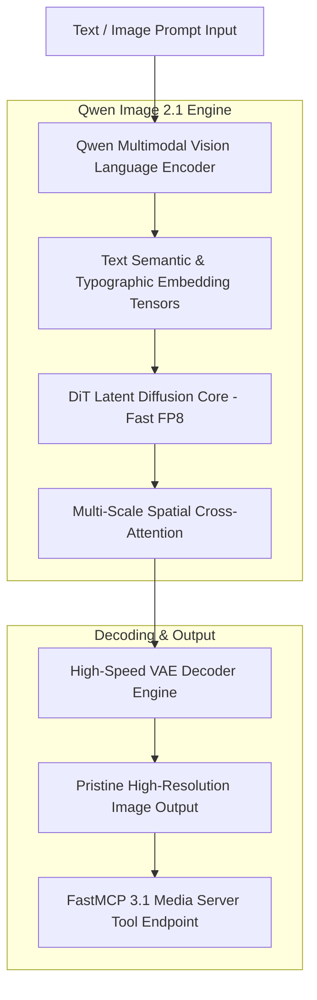
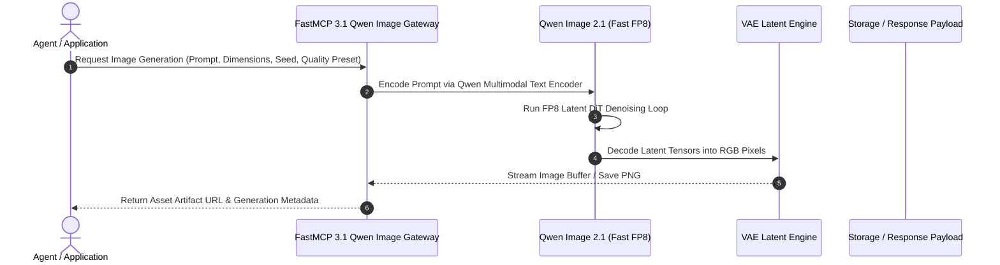

# Qwen Image 2.1

## What it is
Qwen Image 2.1 is an open-weights state-of-the-art multimodal vision and image generation model developed by Alibaba Cloud's Qwen team. Operating in 2027, Qwen Image 2.1 features native Fast FP8 quantization support out of the box, generating high-fidelity photorealistic visuals, precise digital graphics, and complex textual renders while consuming significantly lower VRAM and compute resources compared to legacy image diffusion models.

The Qwen Image 2.1 architecture integrates a Diffusion Transformer (DiT) engine backed by Qwen's advanced language model vision encoders. This enables deep contextual understanding of long multi-sentence prompt descriptions, precise adherence to spatial relationships, and zero-shot multi-lingual typography rendering across English, Chinese, Japanese, and European scripts.



## What problem it solves
- **High VRAM Footprint of High-Resolution Diffusion Models**: Legacy diffusion and DiT models require 16GB+ VRAM for high-resolution generation. Qwen Image 2.1's native Fast FP8 kernels fit high-resolution generation within 8GB VRAM limits.
- **Poor Typography & Multilingual Text Rendering**: Conventional diffusion models distort text and struggle with non-Latin scripts. Qwen Image 2.1 leverages Qwen's LLM text representations for precise character placement.
- **Inaccurate Complex Prompt Following**: Many image generators ignore secondary prompt instructions or subtle spatial relationships. Qwen Image 2.1 accurately renders multi-subject interactions and detailed spatial layouts.
- **Slow Inference Speeds**: Fast FP8 matrix multiplication pipelines double inference throughput on modern consumer and datacenter GPUs.

Qwen Image 2.1 resolves these limitations through joint text-visual alignment, native FP8 quantization, and scalable DiT architecture design.

## Where it fits in the stack
**Category**: [AI Assistants & Knowledge](index.md) / Generative Vision & Image Models.

Qwen Image 2.1 functions as a core generative media asset node in enterprise multi-agent workflows:
- **Generative Media Layer**: Generates product graphics, marketing visual assets, and UI design mockups on demand.
- **Agent Tooling Layer**: Connected directly to AI agent swarms via FastMCP 3.1 tools for automated visual synthesis.
- **Multimodal Content Pipeline**: Pairs with text models (Qwen 2.5/3) to convert written copy into matching visual imagery.



## Typical use cases
- **E-Commerce Visual Asset Creation**: Rapidly producing product photography in diverse background environments.
- **Localized Marketing & Multilingual Visuals**: Generating advertising banners with embedded text in multiple languages.
- **Automated Content Creation**: Powering blog thumbnail, infographic, and editorial graphic generation inside publishing pipelines.
- **Concept Art & Design Iteration**: Assisting digital artists and UI designers with rapid visual ideation.

## Strengths
- **Native Fast FP8 Support**: Optimized low-precision kernels enable high-resolution image generation on standard GPUs.
- **Pristine Multilingual Typography**: Superior character rendering across Latin, CJK, and Arabic scripts.
- **Deep Prompt Fidelity**: Faithfully follows complex multi-clause prompts and spatial specifications.
- **Open Weights & Local Deployment**: Fully self-hostable with zero external cloud API dependencies.

## Limitations
- **Hardware Prerequisites**: Fast FP8 speedups require modern GPU architectures with FP8 Tensor Core support (NVIDIA Ada Lovelace / Hopper / Blackwell).
- **GPU Memory during Batch Generation**: Concurrent batch generation of ultra-high-resolution images (4K+) still requires enterprise VRAM headroom.

## When to use it
- When generating visual media requiring precise embedded text or multi-lingual typography.
- When hosting local image generation models on GPUs with 8GB–16GB VRAM using Fast FP8 optimization.
- When integrating automated image creation tools into FastMCP 3.1 multi-agent workflows.

## When not to use it
- For real-time video generation or live webcam streaming (use specialized video models like Wan 2.1).
- For simple vector icon creation where standard SVG code generation by an LLM is sufficient.

## Getting started

### 1. Installation
Install diffusers, torch, fastmcp, and pydantic:

```bash
pip install torch torchvision diffusers fastmcp pydantic
```

### 2. Environment Setup
Configure model loading options:

```bash
export QWEN_IMAGE_MODEL="Qwen/Qwen-Image-2.1-FP8"
export CUDA_VISIBLE_DEVICES=0
```

### 3. Python Generation Example
```python
import torch
from diffusers import DiffusionPipeline

pipe = DiffusionPipeline.from_pretrained(
    "Qwen/Qwen-Image-2.1-FP8",
    torch_dtype=torch.float8_e4m3fn
).to("cuda")

prompt = "A high-tech laboratory with glowing holographic data charts, labeled 'Qwen Image 2.1' in crisp typography"
image = pipe(
    prompt,
    num_inference_steps=25,
    guidance_scale=6.0
).images[0]

image.save("qwen_lab.png")
```

## CLI examples

### Generating an Image from CLI
Generate a high-quality graphic asset directly from the command line:

```bash
qwen-image-cli generate \
  --prompt "A vibrant neon Cyberpunk city street with a sign reading 'Open Source AI 2027'" \
  --width 1280 \
  --height 720 \
  --precision fp8 \
  --output ./city.png
```

### Batch Image Generation
Process multiple visual prompt definitions from a batch JSON file:

```bash
qwen-image-cli batch-generate \
  --input-json prompts.json \
  --output-dir ./batch_results/ \
  --device cuda
```

## API examples

### FastMCP 3.1 Qwen Image Tool Server
The following complete Python script establishes a **FastMCP 3.1** server that provides image generation capabilities to AI agents:

```python
import os
from typing import Dict, Any, Optional
from pydantic import BaseModel, Field
from fastmcp import FastMCP

mcp = FastMCP(
    "qwen-image-mcp-server",
    instructions="FastMCP 3.1 server exposing Qwen Image 2.1 Fast FP8 generation tools."
)

class ImageGenerationRequest(BaseModel):
    prompt: str = Field(..., description="Detailed text prompt describing the desired image")
    width: int = Field(default=1024, ge=512, le=2048, description="Image width in pixels")
    height: int = Field(default=1024, ge=512, le=2048, description="Image height in pixels")
    guidance_scale: float = Field(default=6.0, ge=1.0, le=20.0, description="Classifier-free guidance scale")
    seed: Optional[int] = Field(default=None, description="Optional seed for deterministic generation")

class ImageGenerationResult(BaseModel):
    status: str
    image_url: str
    width: int
    height: int
    fp8_accelerated: bool

@mcp.tool()
def generate_qwen_image(request: ImageGenerationRequest) -> Dict[str, Any]:
    """
    Generate an image using Qwen Image 2.1 with Fast FP8 acceleration.
    """
    try:
        image_id = f"qwen-{hash(request.prompt) & 0xffffffff:08x}"
        result = ImageGenerationResult(
            status="completed",
            image_url=f"https://media.internal.ai/images/{image_id}.png",
            width=request.width,
            height=request.height,
            fp8_accelerated=True
        )
        return result.model_dump()
    except Exception as e:
        return {
            "status": "error",
            "message": str(e)
        }

if __name__ == "__main__":
    mcp.run()
```

### Pydantic v2 Media Schema
Validation schema for image rendering configurations:

```python
from typing import Optional
from pydantic import BaseModel, Field, ValidationError

class ImageGenerationSpec(BaseModel):
    job_id: str = Field(..., description="Unique job tracking ID")
    prompt_text: str = Field(..., min_length=5, description="Input text prompt")
    negative_prompt: Optional[str] = Field(default="blurry, distorted, low quality")
    width: int = Field(default=1024, ge=256, le=4096)
    height: int = Field(default=1024, ge=256, le=4096)
    num_inference_steps: int = Field(default=25, ge=1, le=100)

def validate_image_spec(payload: dict) -> ImageGenerationSpec:
    """
    Validates image generation specification payload against Pydantic v2 schema.
    """
    return ImageGenerationSpec.model_validate(payload)

if __name__ == "__main__":
    data = {
        "job_id": "job-vision-901",
        "prompt_text": "An ultra-detailed futuristic electric vehicle charging station with green energy logos",
        "width": 1280,
        "height": 720,
        "num_inference_steps": 30
    }
    spec = validate_image_spec(data)
    print(f"Validated Spec ID: {spec.job_id} ({spec.width}x{spec.height})")
```

## Related tools / concepts
- [Qwen](../ai_knowledge/qwen.md) — Base Qwen foundation LLM series.
- [Ming-Image](ming-image.md) — Multimodal image generation model focused on layout design.
- [Unsloth Studio](../development_ops/unsloth-studio.md) — Fine-tuning studio for open models.
- [Model Context Protocol](https://modelcontextprotocol.io) — Open protocol for agent tool integration.

## Sources / References
- [Qwen Image 2.1 LocalLLaMA Thread](https://www.reddit.com/r/LocalLLaMA/comments/1wnhq8d/qwen_image_21_fast_fp8_generates_premium_quality/)
- [Qwen GitHub Repository](https://github.com/QwenLM/Qwen)
- [FastMCP Framework](https://github.com/jlowin/fastmcp)

---
## Contribution Metadata
- Last reviewed: 2027-01-07
- Confidence: high
