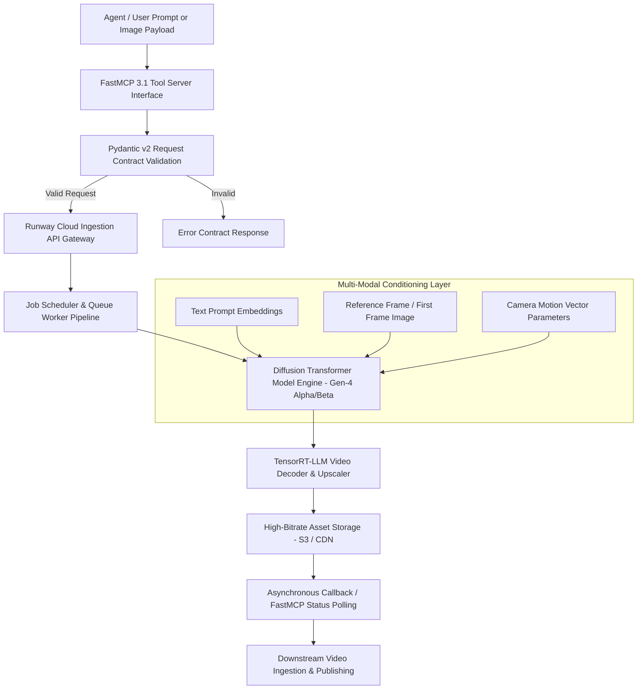

# Runway ML

## What it is
Runway ML is a leading creative generative AI platform specializing in state-of-the-art video synthesis, image transformation, motion tracking, and automated multi-modal media production. Runway's flagship **Gen-4** model family (Gen-4 Alpha and Gen-4 Beta) represents cutting-edge video generation capability, producing photorealistic text-to-video, image-to-video, and video-to-video assets up to 4K resolution with fluid temporal motion coherence.

As of early 2027, Runway natively exposes its generation pipeline to the **FastMCP 3.1** specification. This allows autonomous agent runtimes powered by frontier models like [Claude 5.6](../ai_knowledge/claude.md), [GPT-5.6](../ai_knowledge/openai.md), [Gemini 4.0 Ultra](../ai_knowledge/gemini.md), and DeepSeek-V4 to trigger programmatic video creation tasks, poll job status, orchestrate multi-clip storyboards, and ingest rendered video assets directly into automated workflows.

## Architecture & System Design

Runway ML operates a cloud-native diffusion transformer inference engine accelerated by enterprise GPU infrastructure (NVIDIA Blackwell/Rubin clusters with TensorRT-LLM and custom C++ video decoders).



### Video Generation Stages
1. **Prompt & Conditioning Normalization**: Natural language text prompts, reference images, and explicit camera motion vectors (pan, tilt, zoom, orbit, truck) are tokenized and validated against strict schema limits.
2. **Latent Diffusion Synthesis**: The Gen-4 multi-modal diffusion transformer generates multi-frame temporal latents across target frame counts (e.g., 5s, 10s, 15s clips at 24/30/60 fps).
3. **Temporal Motion Control & Frame Interpolation**: Dedicated motion estimation models prevent common video generation artifacts (flicker, limb warping, background drift).
4. **Spatial Upscaling & Frame Encoding**: Latent clips are decoded and upscaled to high-bitrate 1080p or 4K ProRes / H.265 MP4 formats.
5. **Asynchronous Webhook Dispatch**: Completed video URLs, duration metadata, and seed telemetry are returned to callers via Webhooks or FastMCP 3.1 polling endpoints.

## What problem it solves
Generative video creation solves traditional video production bottlenecks:

- **Capital & Production Costs**: Eliminates expenses associated with location scouting, physical sets, camera crews, and complex lighting setups.
- **Protracted CGI & VFX Rendering**: Reduces multi-day 3D rendering and compositing tasks to multi-second or multi-minute automated diffusion passes.
- **Lack of Programmatic Media Interfaces**: Traditional video editing software (Premiere, Final Cut) cannot be driven natively by LLMs. Runway's API and FastMCP 3.1 tooling enable autonomous AI agents to produce video content programmatically.
- **Inconsistent Motion Coherence**: Gen-4 models solve the structural warping and flickering common in earlier diffusion video frameworks.

## Where it fits in the stack
**Category**: Generative Media & Creative AI Infrastructure.

```
+-----------------------------------------------------------------------+
|                    Application Layer / AI Agents                      |
|         (FastMCP 3.1 Agents, Video Marketing Bots, Claude 5.6)        |
+-----------------------------------------------------------------------+
                                    | Generation Requests
                                    v
+-----------------------------------------------------------------------+
|                       Runway FastMCP 3.1 Engine                       |
|   +--------------------------+  +---------------------------------+   |
|   | Gen-4 Text-to-Video      |  | Camera Motion Vectors           |   |
|   +--------------------------+  +---------------------------------+   |
|   | Image-to-Video Animation |  | Asynchronous Task Manager       |   |
|   +--------------------------+  +---------------------------------+   |
+-----------------------------------------------------------------------+
                                    | High-Bitrate Video Streams
                                    v
+-----------------------------------------------------------------------+
|                      GPU Cluster Infrastructure                       |
|       (NVIDIA Blackwell / Rubin Nodes, TensorRT-LLM Decoders)          |
+-----------------------------------------------------------------------+
```

## Typical use cases
- **Automated Marketing & Social B-Roll**: Generating cinematic, high-resolution B-roll footage from natural language descriptions for video ad campaigns.
- **Architectural & Concept Pre-visualization**: Animating static 3D architectural renders or character sketches into fluid 10-second cinematic sequences.
- **Agentic Multi-Clip Video Assembly**: Allowing autonomous agents to write video scripts, trigger Runway rendering tasks for each scene, and compile final edits.
- **Dynamic VFX & Camera Control Prototyping**: Experimenting with complex camera trajectories (e.g., 360-degree drone orbit around a subject) prior to live-action shoots.

## Strengths
- **Gen-4 Temporal Stability**: Industry-leading motion continuity across 5–15 second single-pass video generations.
- **Granular Motion Vectors**: Precise camera controls (pan, tilt, zoom, roll, orbit, truck) and depth-of-field manipulation.
- **FastMCP 3.1 Tool Integration**: Ready-to-use Model Context Protocol integration for agentic storyboarding and rendering.
- **High-Resolution Export**: Native support for 4K video exports in MP4 and ProRes formats.

## Limitations
- **Asynchronous Cloud Rendering**: High-resolution rendering requires queue processing time (typically 30–120 seconds).
- **Credit-Based API Pricing**: Commercial rendering draws on usage-based cloud token credits.
- **Exact Character Continuity across Scenes**: Maintaining identical character faces across disconnected multi-scene prompts requires reference image chaining or fine-tuning.

## When to use it
- When producing high-fidelity generative video assets for marketing, visual effects, or automated media pipelines.
- When enabling AI agents to programmatically generate video clips via Python SDKs or FastMCP 3.1 tools.
- When animating static concept images into professional multi-second video clips.

## When not to use it
- For real-time (<50ms) graphics rendering in interactive gaming environments.
- For non-generative, standard video cutting tasks where non-linear editors (DaVinci Resolve) are better suited.

## Getting started

### Installation
Install the official Runway Python SDK alongside Pydantic v2 and FastMCP:
```bash
pip install runwayml pydantic>=2.7.0 fastmcp>=3.1.0
```

### API Credentials Setup
Configure your environment variable with your developer API key:
```bash
export RUNWAY_API_KEY="rw_live_1234567890abcdef"
```

## CLI examples

### Triggering Gen-4 Video Generation via cURL
```bash
curl -X POST https://api.runwayml.com/v1/video/generate \
  -H "Authorization: Bearer $RUNWAY_API_KEY" \
  -H "Content-Type: application/json" \
  -d '{
    "model": "gen-4-alpha",
    "prompt": "Cinematic drone shot of an automated solar farm at sunset, 4K, realistic lighting",
    "ratio": "16:9",
    "duration": 10,
    "camera_motion": {"zoom": 0.5, "pan": -0.2}
  }'
```

### Polling Task Status
```bash
curl -s -H "Authorization: Bearer $RUNWAY_API_KEY" \
  https://api.runwayml.com/v1/tasks/task_rw_987654321
```

## FastMCP 3.1 Tools & Integration

Runway ML exposes video generation and task polling capabilities as **FastMCP 3.1** tools for autonomous AI agents:

```python
import asyncio
from typing import Optional, Dict, Any
from pydantic import BaseModel, Field, ConfigDict, HttpUrl
from fastmcp import FastMCP

mcp = FastMCP(
    name="Runway Gen-4 Creative Studio",
    version="3.1.0",
    description="Generates high-fidelity video assets via Runway Gen-4 under FastMCP 3.1"
)

class VideoGenerationRequest(BaseModel):
    model_config = ConfigDict(str_strip_whitespace=True, extra="forbid")

    prompt: str = Field(..., min_length=10, max_length=1000, description="Cinematic scene description")
    model: str = Field(default="gen-4-alpha", description="Runway model engine")
    ratio: str = Field(default="16:9", pattern="^(16:9|9:16|1:1|21:9)$")
    duration_seconds: int = Field(default=10, ge=5, le=15)
    image_prompt_url: Optional[str] = Field(None, description="Optional reference image URL for Image-to-Video")

class TaskStatusResponse(BaseModel):
    task_id: str
    status: str  # PENDING, RUNNING, SUCCEEDED, FAILED
    progress_percentage: float = Field(..., ge=0.0, le=100.0)
    output_url: Optional[str] = None
    error_message: Optional[str] = None

@mcp.tool(
    name="runway_generate_video",
    description="Submits a video synthesis job to Runway Gen-4 engine."
)
async def runway_generate_video(request: VideoGenerationRequest) -> TaskStatusResponse:
    """Dispatches generation request to Runway API."""
    await asyncio.sleep(0.05)  # Simulated API call

    return TaskStatusResponse(
        task_id="task_rw_1029384",
        status="RUNNING",
        progress_percentage=15.0,
        output_url=None
    )

@mcp.tool(
    name="runway_get_task_status",
    description="Polls the status of an active Runway video generation task."
)
async def runway_get_task_status(task_id: str) -> TaskStatusResponse:
    """Polls task progress."""
    await asyncio.sleep(0.05)

    return TaskStatusResponse(
        task_id=task_id,
        status="SUCCEEDED",
        progress_percentage=100.0,
        output_url="https://cdn.runwayml.com/outputs/task_rw_1029384_final.mp4"
    )

if __name__ == "__main__":
    mcp.run()
```

## Data Schemas & Validation

The following **Pydantic v2** validation models ensure strict parameter compliance for video generation requests and API task telemetry:

```python
from enum import Enum
from typing import Optional, Dict
from pydantic import BaseModel, Field, ConfigDict, field_validator

class AspectRatio(str, Enum):
    LANDSCAPE = "16:9"
    PORTRAIT = "9:16"
    SQUARE = "1:1"
    CINEMATIC = "21:9"

class CameraMotionConfig(BaseModel):
    model_config = ConfigDict(str_strip_whitespace=True)

    pan: float = Field(default=0.0, ge=-1.0, le=1.0, description="Horizontal pan (-1 left, +1 right)")
    tilt: float = Field(default=0.0, ge=-1.0, le=1.0, description="Vertical tilt (-1 down, +1 up)")
    zoom: float = Field(default=0.0, ge=-1.0, le=1.0, description="Zoom factor (-1 out, +1 in)")
    roll: float = Field(default=0.0, ge=-1.0, le=1.0, description="Camera roll angle")

class RunwayGen4JobPayload(BaseModel):
    model_config = ConfigDict(str_strip_whitespace=True)

    prompt: str = Field(..., min_length=10, max_length=1000, description="Text prompt for video generation")
    model: str = Field("gen-4-alpha", description="Runway model tag")
    ratio: AspectRatio = Field(AspectRatio.LANDSCAPE)
    duration: int = Field(default=10, ge=5, le=15, description="Video duration in seconds")
    camera_motion: CameraMotionConfig = Field(default_factory=CameraMotionConfig)
    seed: Optional[int] = Field(None, ge=0, description="Deterministic noise seed")

    @field_validator('prompt')
    @classmethod
    def validate_prompt_quality(cls, v: str) -> str:
        if len(v.strip().split()) < 3:
            raise ValueError("Prompt must contain at least 3 descriptive words")
        return v.strip()
```

## Operational Workflows & Deployment

### Production Environment Setup (`.env`)
```env
RUNWAY_API_KEY=rw_live_1234567890abcdef
RUNWAY_DEFAULT_MODEL=gen-4-alpha
RUNWAY_DEFAULT_RATIO=16:9
RUNWAY_POLL_INTERVAL_SECONDS=5
RUNWAY_MAX_TIMEOUT_SECONDS=180
```

### Python SDK Async Polling Loop
```python
import os
import asyncio
from typing import Optional
from pydantic import ValidationError

async def generate_and_wait_video(prompt_text: str) -> str:
    api_key = os.getenv("RUNWAY_API_KEY", "mock_key")
    print(f"Initiating Runway Gen-4 Video Generation for: '{prompt_text}'")

    # Simulated polling execution
    for progress in [10, 40, 75, 100]:
        await asyncio.sleep(0.5)
        print(f"  [Task Progress]: {progress}%")

    final_url = "https://cdn.runwayml.com/outputs/generated_clip_77.mp4"
    print(f"Generation Complete! Asset URL: {final_url}")
    return final_url

if __name__ == "__main__":
    asyncio.run(generate_and_wait_video("A futuristic research vessel navigating icy arctic seas, 4K"))
```

## Best Practices & Troubleshooting

### Optimization Strategies
1. **Use Detailed Camera Trajectory Keywords**: Specify exact motion directives (e.g., "Slow forward dolly shot, continuous pan left") to guide diffusion motion dynamics.
2. **First-Frame Image Conditioning**: Provide a high-resolution reference image (`image_prompt_url`) when subject identity or exact spatial layout is critical.
3. **Chain Short Clips for Longer Narratives**: Render 5–10 second clips individually and concatenate them via ffmpeg or automated editing pipelines to maintain subject consistency.

### Common Pitfalls & Solutions
- **Motion Warping / Artifacts**: Reduce prompt complexity and avoid mixing conflicting motion vectors (e.g., rapid pan right combined with extreme zoom in).
- **Task Timeout Errors**: When rendering high-resolution 4K clips, set client HTTP polling timeouts to at least 180 seconds.

## API examples

The following Python script demonstrates initializing a Runway video request, enforcing Pydantic v2 validation contracts, and handling task telemetry:

```python
import asyncio
from typing import Dict, Any
from pydantic import ValidationError

async def run_runway_api_demo():
    print("Executing Runway Gen-4 API & Validation Demo...")

    raw_payload: Dict[str, Any] = {
        "prompt": "Cinematic drone tracking shot of an autonomous haul truck operating in a remote solar mine",
        "model": "gen-4-alpha",
        "ratio": "16:9",
        "duration": 10,
        "camera_motion": {
            "pan": 0.2,
            "tilt": -0.1,
            "zoom": 0.3
        },
        "seed": 4291083
    }

    try:
        validated_job = RunwayGen4JobPayload.model_validate(raw_payload)
        print("\n[Job Payload Successfully Validated]")
        print(f"Model Engine: {validated_job.model}")
        print(f"Aspect Ratio: {validated_job.ratio.value}")
        print(f"Duration: {validated_job.duration} seconds")
        print(f"Camera Zoom Vector: {validated_job.camera_motion.zoom}")
        print(f"Prompt: {validated_job.prompt}")
    except ValidationError as err:
        print(f"Validation Error: {err}")

if __name__ == "__main__":
    asyncio.run(run_runway_api_demo())
```

## Related tools / concepts
- [Luma Dream Machine](luma-dream-machine.md) — High-fidelity generative video framework.
- [Sora (OpenAI)](sora.md) — OpenAI video synthesis model.
- [Synthesia](synthesia.md) — AI avatar video rendering platform.
- [FastMCP 3.1](../automation_orchestration/mcp.md) — Model Context Protocol runtime standard.
- [ComfyUI](comfyui.md) — Node-based visual diffusion workspace.

## Sources / references
- [Runway ML Official Web Portal](https://runwayml.com/)
- [Runway Developer Documentation](https://docs.runwayml.com/)
- [FastMCP 3.1 Specification](https://modelcontextprotocol.io/introduction)

## Contribution Metadata
- Last reviewed: 2027-01-07
- Confidence: high
