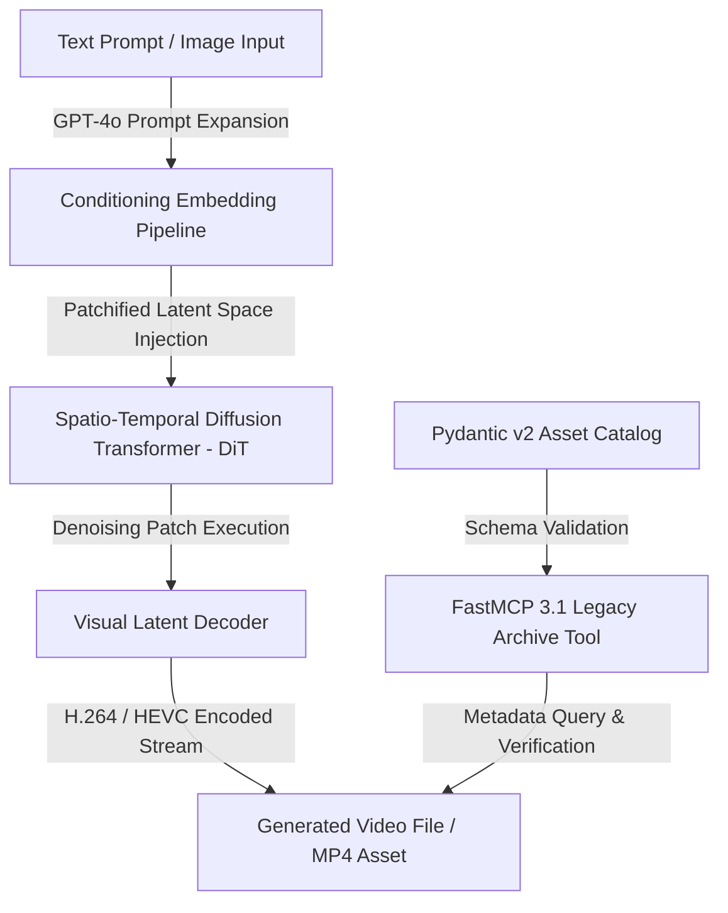

# Sora (OpenAI)

> [!CAUTION]
> **Decommissioned / Sunset**: OpenAI officially sunsetted Sora web and application user experiences in April 2026, and fully decommissioned the Sora API on September 24, 2026. This documentation serves as a historical architectural reference, legacy asset migration guide, and technical post-mortem analysis for generative media engineers.

## What it is
Sora was a landmark, large-scale spatio-temporal diffusion transformer (DiT) text-to-video generative model developed by OpenAI. Operating as a diffusion model trained over variable-size visual patch latent spaces, Sora generated high-fidelity, high-resolution videos (up to 1080p) lasting up to 60 seconds with spatial consistency, realistic physics approximations, and multi-angle cinematic coherence.



## What problem it solves
Prior to Sora, video generation models suffered from severe temporal distortion, visual warping over extended frame durations (>5 seconds), restricted aspect ratio constraints, and failure to model basic physical interactions (such as liquid splashes, reflections, or object persistence). Sora solved these fundamental generative media limitations by scaling transformer architectures over visual patch tokens, effectively establishing the technical paradigm for modern spatio-temporal world simulators.

## Where it fits in the stack
**AI Assistants & Knowledge / Generative Media**. Historically positioned as OpenAI's flagship generative video architecture and cloud API; currently maintained as a legacy archival dataset reference and historical benchmark in generative media pipelines.

## Typical use cases
- **Cinematic Prototyping & Storyboarding**: Generating high-fidelity previz sequences for film directors and narrative teams (Historical).
- **Physical World Simulation**: Evaluating model ability to learn 3D visual persistence, camera movement dynamics, and light transport (Historical).
- **Digital Marketing & Visual Assets**: Rapidly synthesizing custom video clips from descriptive textual prompts (Historical).
- **Legacy Asset Migration & Archive Indexing**: Extracting, cataloging, and re-indexing historical Sora video files and prompt metadata using FastMCP 3.1 tools and Pydantic v2 schemas.

## Strengths
- **Spatio-Temporal Consistency**: Maintained continuous object identity, character features, and background geometry across multi-second camera passes.
- **Variable Frame Geometry & Aspect Ratios**: Natively supported 1920x1080, 1080x1920, and square 1080x1080 resolutions without cropping or stretching.
- **Visual Patch Latent Architecture**: Scaled video generation analogous to language modeling by treating video slices as sequence tokens.

## Limitations
- **Full API Decommissioning**: Cloud API endpoints, WebSocket streams, and web client interfaces were entirely shut down by OpenAI in late 2026.
- **Complex Causal Physics Failures**: Frequently struggled with exact cause-and-effect physical interactions (e.g., biting a sandwich without removing material).
- **Extreme Computational Overhead**: High-resolution video sampling required massive multi-GPU cluster compute, leading to higher inference costs relative to 2027 real-time video diffusion architectures.

## When to use it
- **Historical Technical Research**: Studying the architectural transition from UNet diffusion to Spatio-Temporal Diffusion Transformers (DiT).
- **Legacy Archive Migration**: Parsing, validating, and migrating local historical Sora MP4 video archives and JSON metadata exports.

## When not to use it
- **Active Video Generation Pipelines**: Do not attempt to invoke OpenAI Sora endpoints. Use active 2027 video generation tools such as Luma Dream Machine 3, Runway Gen-4, or open-weights video models instead.
- **Real-Time Interactive Framing**: Sora's offline sampling architecture was not designed for sub-second real-time interactive generation.

## Getting started

> [!NOTE]
> OpenAI Sora is fully decommissioned. Active API access is no longer available. Instructions below cover legacy archive processing and metadata parsing.

### Installation & Environment Setup
Install tools required for inspecting local video files, parsing legacy JSON metadata, and running FastMCP 3.1 verification tools:

```bash
# Install Pydantic v2 and FastMCP 3.1 for archive management
pip install "pydantic>=2.0.0" "mcp>=1.0.0" requests

# Ensure ffmpeg and ffprobe are available for video validation
sudo apt-get update && sudo apt-get install -y ffmpeg jq
```

## CLI examples

### 1. Batch Verifying Local Archive Video Integrity
Run `ffmpeg` diagnostic checks across archived Sora video output files to verify stream health:

```bash
find ./sora_archive -type f -name "*.mp4" -exec ffmpeg -v error -i {} -f null - \;
```

### 2. Extracting Stream Properties via `ffprobe`
Query video resolution, frame rate, and codec parameters from historical Sora MP4 files:

```bash
ffprobe -v quiet -print_format json -show_format -show_streams ./sora_archive/vid_sora_2026_001.mp4 | jq .
```

### 3. Parsing Prompt Metadata Records with `jq`
Filter and extract prompt descriptions and video IDs from legacy bulk exports:

```bash
jq -r '.assets[] | "ID: \(.video_id) | Duration: \(.duration_seconds)s | Prompt: \(.prompt)"' sora_export_archive.json
```

## API examples

### Python FastMCP 3.1 & Pydantic v2 Archive Catalog Integration
The following code snippet demonstrates building a FastMCP 3.1 server that indexes, validates, and serves historical Sora video archive assets using Pydantic v2 data models:

```python
import os
import json
from typing import List, Optional
from pydantic import BaseModel, Field, field_validator
from mcp.server.fastmcp import FastMCP

# Define Pydantic v2 models for legacy Sora asset validation
class SoraLegacyAsset(BaseModel):
    video_id: str = Field(..., description="Unique Sora video generation identifier (e.g., 'sora_2026_001').")
    prompt: str = Field(..., description="Text prompt used during original video generation.")
    duration_seconds: int = Field(default=60, ge=1, le=60, description="Video clip length in seconds.")
    resolution: str = Field(default="1920x1080", description="Video stream spatial resolution.")
    file_path: str = Field(..., description="Local file path to archived MP4 file.")
    archived_at: str = Field(..., description="ISO 8601 timestamp when asset was ingested into archive.")

    @field_validator("video_id")
    @classmethod
    def validate_video_id(cls, value: str) -> str:
        if not (value.startswith("sora_") or value.startswith("vid_")):
            raise ValueError("Legacy Sora video_id must begin with 'sora_' or 'vid_' prefix.")
        return value

class SoraCatalogSearchRequest(BaseModel):
    query_term: str = Field(..., description="Search keyword to query against archived prompts.")
    max_results: int = Field(default=10, ge=1, le=50, description="Maximum number of matched assets to return.")

class SoraCatalogSearchResponse(BaseModel):
    total_matches: int = Field(..., description="Total count of matching historical assets.")
    assets: List[SoraLegacyAsset] = Field(default_factory=list, description="List of matched Sora assets.")

# Initialize FastMCP 3.1 server
mcp = FastMCP("sora-archive-catalog-server")

ARCHIVE_METADATA_FILE = "/tmp/sora_archive_catalog.json"

@mcp.tool()
async def search_sora_archive(request: SoraCatalogSearchRequest) -> SoraCatalogSearchResponse:
    """Searches historical Sora video generation archives by prompt keywords using Pydantic v2 schemas."""
    if not os.path.exists(ARCHIVE_METADATA_FILE):
        return SoraCatalogSearchResponse(total_matches=0, assets=[])

    with open(ARCHIVE_METADATA_FILE, "r") as f:
        raw_data = json.load(f)

    matched_assets = []
    for item in raw_data.get("assets", []):
        if request.query_term.lower() in item.get("prompt", "").lower():
            asset = SoraLegacyAsset(**item)
            matched_assets.append(asset)
            if len(matched_assets) >= request.max_results:
                break

    return SoraCatalogSearchResponse(
        total_matches=len(matched_assets),
        assets=matched_assets
    )

if __name__ == "__main__":
    mcp.run()
```

## Related tools / concepts
- [Runway ML](runwayml.md) — Multimodal AI video generation platform and Gen-3/Gen-4 diffusion engines.
- [Luma Dream Machine](luma-dream-machine.md) — High-speed spatio-temporal video generation model.
- [OpenAI](openai.md) — AI research organization behind GPT-4o, DALL-E 3, and Sora.
- [Project Genie](project-genie.md) — Interactive world generation model for real-time spatial environments.
- [Model Context Protocol (FastMCP 3.1)](../../tools/automation_orchestration/mcp.md) — Standardized tool execution framework.

## Sources / references
- [OpenAI Sora Formal Discontinuation & Sunset Announcement](https://help.openai.com/en/articles/20001152-what-to-know-about-the-sora-discontinuation)
- [OpenAI API Deprecation Schedule & Decommission Records](https://developers.openai.com/api/docs/deprecations)
- [OpenAI Sora Technical Paper & Video Patch Architecture](https://openai.com/sora)

## Contribution Metadata
- Last reviewed: 2027-01-07
- Confidence: high
