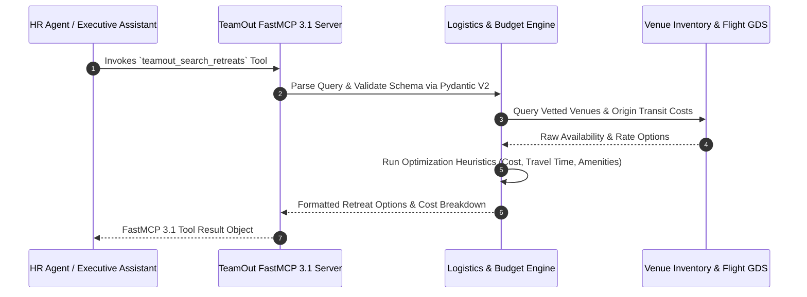

# TeamOut

## What it is
TeamOut is an AI-native enterprise platform and domain-specific agent system designed for corporate retreat planning, offsite logistics, and event orchestration. Utilizing advanced agentic decision-making workflows, TeamOut automates venue discovery, budget allocation, flight/transit route optimization, activity curation, contract negotiation, and real-time itinerary generation.

In early 2027, TeamOut serves as an AI agent platform for corporate offsite logistics, offering native **FastMCP 3.1** (Model Context Protocol) integration. This allows enterprise AI assistants, HR copilots, and executive scheduling agents (e.g., in Claude Code, Cursor, or internal Slack/Microsoft Teams bots) to invoke venue sourcing and event planning tools programmatically.

## What problem it solves
Planning corporate retreats manually for distributed engineering or executive teams requires weeks of operational overhead—coordinating calendar availability across timezones, gathering attendee dietary/lodging constraints, querying dozens of hotel conference sites, negotiating group rates, and formatting multi-day agendas.

TeamOut eliminates these bottlenecks by providing:
1. **Automated Multi-Constraint Sourcing**: Evaluating company parameters (team size, budget caps, travel origin hubs, required AV/WiFi bandwidth, breakout space counts) against a curated global network of vetted corporate retreat locations.
2. **AI-Driven Rate Negotiation & Budgeting**: Utilizing specialized LLMs (such as Claude 5.1, GPT-5.5, and Gemini 4.0 Pro) to generate cost breakdowns, simulate transit fees, and negotiate bulk room blocks automatically.
3. **Attendee Preferences Synthesis**: Processing employee survey responses (e.g., dietary restrictions, mobility needs, team-building activity preferences) using structured NLP to generate personalized itineraries.
4. **FastMCP 3.1 Enterprise Agent Connectivity**: Interfacing with corporate calendar tools, Slack channels, and HR systems (e.g., Workday, BambooHR) to handle end-to-end offsite execution without manual data entry.

## Where it fits in the stack
**AI & Knowledge / Domain-Specific Logistics Agents & Services**. TeamOut sits between corporate internal communication tools (Slack, Microsoft Teams, Google Workspace) and travel vendor inventory databases, communicating via standard FastMCP 3.1 tool bindings.

```
+-----------------------------------------------------------------------+
|               Enterprise Assistant / Agent Client                     |
|      (Claude Code, HR Slack Bot, Microsoft Copilot, Executive EA)    |
+-----------------------------------------------------------------------+
                                   | (FastMCP 3.1 Tool Call)
                                   v
+-----------------------------------------------------------------------+
|                         TeamOut Agent Engine                          |
|  +-----------------------------------------------------------------+  |
|  | Venue Search Engine | Budget Simulator | Itinerary Generator    |  |
|  +-----------------------------------------------------------------+  |
|  | FastMCP 3.1 Server Interface  | Pydantic V2 Contract Layer     |  |
|  +-----------------------------------------------------------------+  |
|  | Survey NLP Analyzer           | Calendar / Flight Transit Sync  |  |
+-----------------------------------------------------------------------+
                                   |
         +-------------------------+-------------------------+
         | (GDS / Hotel API)                                 | (Corporate HR / Calendar APIs)
         v                                                   v
+-----------------------------------+               +-----------------------------------+
| Vetted Retreat Inventory Database |               | Google Calendar / Outlook / Slack |
| (Hotels, Resorts, Venues)         |               | (Attendee Availability & Sync)    |
+-----------------------------------+               +-----------------------------------+
```

## Typical use cases
- **Enterprise Engineering Retreat Planning**: Sourcing venue options for 50 to 500+ engineers with dedicated gigabit fiber internet, 24/7 hackathon spaces, and nearby airport transit hubs.
- **Executive Leadership Summits**: Curation of private, high-security boutique resorts with private dining, executive boardrooms, and bespoke team-building activities.
- **Budget-Constrained Regional Offsites**: Simulating multi-destination cost trade-offs (e.g., comparing Austin vs. Denver vs. Lisbon) based on real-time flight costs from distributed team origins.
- **Survey-Driven Custom Itineraries**: Ingesting team survey results to generate balanced multi-day agendas combining workshops, outdoor activities, and unstructured collaboration time.

## Strengths
- **Logistics-Trained Agent Models**: Specialized prompts and fine-tuned models trained on corporate travel contracts, cancellation policies, and conference room layouts.
- **Native FastMCP 3.1 Integration**: Standardized Model Context Protocol server endpoints allow external AI agents to invoke venue searches, fetch quotes, and update itineraries seamlessly.
- **Structured Pydantic V2 Data Models**: Exposes clean, validated JSON Schema contracts for easy integration into existing enterprise Python/TypeScript automation pipelines.
- **Vetted Corporate Inventory**: Pre-qualified network of retreat venues audited for internet speeds, group catering capabilities, and workspace acoustics.

## Limitations
- **Corporate Offsite Focus**: Tailored specifically for group events and corporate offsites (10–1000 attendees); not intended for consumer leisure vacations or single-passenger flight booking.
- **Proprietary Venue Network Fees**: Full booking execution and contract guarantee features require a active TeamOut enterprise account subscription.

## When to use it
- When planning team offsites, corporate retreats, or engineering summits requiring complex venue and transit coordination.
- When automating event proposals and budget estimates directly inside an internal AI agent or Slack assistant.
- When consolidating attendee preferences and calendar availability into an actionable event itinerary.

## When not to use it
- For single-passenger individual business trips or standard single-hotel night stays (use traditional travel portals like Navan or Concur).
- For daily office desk booking or internal facility management.

## Getting started

### Installation
Install the official TeamOut Python SDK alongside Pydantic V2:

```bash
pip install teamout-sdk pydantic>=2.0
```

### Authentication & Quickstart
1. Generate an API Key in your [TeamOut Enterprise Dashboard](https://app.teamout.com).
2. Export your API token to your local environment:
```bash
export TEAMOUT_API_KEY="to_live_998124719283719"
```

## Architecture / Key Components



### Core Architectural Layers
1. **FastMCP 3.1 Server Gateway**: Exposes tools (`teamout_search_retreats`, `teamout_generate_itinerary`, `teamout_book_venue`) over standard MCP transports (stdio, SSE).
2. **Constraint Engine**: Calculates composite score metrics considering team origin distances, total flight expenses, venue daily rates, and required workshop space.
3. **Itinerary Synthesis Pipeline**: Converts selected activities, meal reservations, and session topics into structured iCal and JSON schedule payloads.

## CLI examples

Interact with TeamOut tasks and export generated event proposals directly via the CLI:

```bash
# Check status of an ongoing AI venue search task
teamout status --retreat-id R_2027_9012

# Trigger a search from a local JSON query file
teamout search --config ./retreat_requirements.json

# Export an approved proposal to Markdown for executive review
teamout export --retreat-id R_2027_9012 --format markdown --output ./Proposal_Offsite_2027.md

# Validate FastMCP 3.1 tool connectivity
teamout mcp verify
```

## API examples

The following Python script demonstrates invoking TeamOut APIs via a FastMCP 3.1 tool integration layer, using Pydantic V2 models for query validation, budget constraints, and venue recommendation parsing:

```python
import os
import json
from typing import List, Optional, Literal
from pydantic import BaseModel, Field, field_validator, model_validator
from teamout import TeamOutClient  # Hypothetical enterprise SDK

# 1. Define Pydantic V2 input schema for retreat query
class AmenityRequirement(BaseModel):
    category: Literal["workspace", "connectivity", "lodging", "dining", "recreation"]
    name: str = Field(description="Name of required amenity, e.g., fiber_wifi, breakout_rooms")
    is_mandatory: bool = True

class RetreatSearchQuery(BaseModel):
    company_name: str = Field(min_length=2, description="Target enterprise name")
    team_size: int = Field(gt=0, le=1000, description="Total headcount attending")
    target_region: str = Field(description="Geographic preference, e.g., Pacific Northwest, Western Alps")
    max_total_budget_usd: float = Field(gt=1000.0, description="Maximum total offsite budget")
    duration_days: int = Field(default=3, ge=2, le=10)
    required_amenities: List[AmenityRequirement] = Field(default_factory=list)

    @field_validator("team_size")
    @classmethod
    def validate_team_size(cls, v: int) -> int:
        if v > 500:
            print("Notice: Team sizes over 500 require dedicated enterprise account manager oversight.")
        return v

    @model_validator(mode="after")
    def validate_budget_per_head(self) -> "RetreatSearchQuery":
        per_head = self.max_total_budget_usd / self.team_size
        if per_head < 300.0:
            raise ValueError(f"Budget per attendee (${per_head:.2f}) is below minimum threshold ($300.00/head).")
        return self

# 2. Define output models
class VenueRecommendation(BaseModel):
    venue_id: str
    venue_name: str
    location: str
    estimated_total_cost_usd: float
    wifi_bandwidth_mbps: int
    match_score: float = Field(ge=0.0, le=1.0)
    available_breakout_rooms: int

class RetreatSearchResult(BaseModel):
    query_id: str
    recommendations: List[VenueRecommendation]
    savings_estimate_usd: float

# 3. FastMCP 3.1 Tool Execution Wrapper
def teamout_search_retreats_tool(raw_input_json: str) -> str:
    """FastMCP 3.1 tool handler for TeamOut venue search."""
    try:
        query = RetreatSearchQuery.model_validate_json(raw_input_json)
        print(f"Executing TeamOut search for '{query.company_name}' ({query.team_size} attendees)...")

        # Mock API execution
        results = RetreatSearchResult(
            query_id="TO-QUERY-2027-88A",
            recommendations=[
                VenueRecommendation(
                    venue_id="VEN-CASCADE-01",
                    venue_name="Cascadia Mountain Lodge & Innovation Hub",
                    location="Snoqualmie, WA",
                    estimated_total_cost_usd=query.max_total_budget_usd * 0.88,
                    wifi_bandwidth_mbps=1000,
                    match_score=0.96,
                    available_breakout_rooms=6
                )
            ],
            savings_estimate_usd=4500.00
        )
        return results.model_dump_json(indent=2)
    except Exception as e:
        return json.dumps({"error": str(e)})

if __name__ == "__main__":
    sample_json_call = """
    {
        "company_name": "Acme AI Corp",
        "team_size": 40,
        "target_region": "Pacific Northwest",
        "max_total_budget_usd": 50000.0,
        "duration_days": 4,
        "required_amenities": [
            {"category": "workspace", "name": "breakout_rooms", "is_mandatory": true},
            {"category": "connectivity", "name": "fiber_wifi", "is_mandatory": true}
        ]
    }
    """
    tool_output = teamout_search_retreats_tool(sample_json_call)
    print("\n=== FastMCP 3.1 Tool Execution Result ===")
    print(tool_output)
```

## Related tools / concepts
- [Model Context Protocol (FastMCP 3.1)](../automation_orchestration/mcp.md) — Protocol for connecting AI agents to tools.
- [Pydantic V2](../frameworks/pydantic.md) — Standard schema and validation library for Python.
- [Claude 5.1](../providers/anthropic.md) — Frontier LLM engine powering complex logistics reasoning.
- [Make](../automation_orchestration/make.md) — Visual workflow automation for travel intake forms.

## Sources / references
- [TeamOut Enterprise Portal](https://app.teamout.com/)
- [TeamOut API Developer Documentation](https://docs.teamout.com/)
- [Model Context Protocol Specification](https://modelcontextprotocol.io/)

## Contribution Metadata
- Last reviewed: 2027-01-07
- Confidence: high
