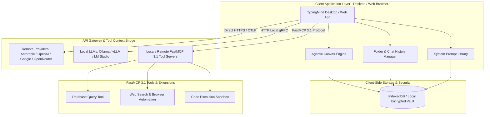

# TypingMind

## What it is
TypingMind is a feature-rich, Bring Your Own Key (BYOK) AI chat client, visual agent orchestration platform, and multi-model workspace. Available as a cross-platform web application, native desktop software (macOS, Windows, Linux), and self-hosted enterprise workspace ("TypingMind Teams"), TypingMind allows power users, developers, and organizations to interface directly with remote foundation model provider APIs (Claude 3.7 Sonnet, GPT-5, Gemini 2.5 Pro, DeepSeek-V3), local model runners (Ollama, vLLM, LM Studio), and custom **FastMCP 3.1** tool servers.

Distinction from basic model consumer interfaces stems from its client-side storage architecture, privacy-preserving IndexedDB data persistence, visual "Agentic Canvas" node-based workflow builder, offline execution capabilities, and extensive customization options. Users retain total sovereignty over their data, API keys, system prompt libraries, and agent tool execution chains without being bound to vendor subscription caps or forced cloud-side model context retention.



## What problem it solves
First-party web interfaces provided by cloud AI vendors create severe workflow bottlenecks for power users and software engineers: subscription rate limits throttle heavy developer workflows; chat histories remain locked inside proprietary vendor clouds without structured nested folder organization; data privacy policies risk sensitive prompt exposure; and custom tool invocation options are restricted to predefined vendor ecosystems.

TypingMind addresses these constraints through several core technical solutions:

- **BYOK Rate Limit Bypass & Cost Optimization**: Enables direct API key connections to Anthropic, OpenAI, Google Gemini, DeepSeek, and OpenRouter. Users pay raw per-token API charges, bypassing arbitrary monthly Web UI subscription caps while routing queries dynamically to the most cost-effective model backend.
- **Client-Side Data Privacy & Encryption**: Stores all chat transcripts, prompt templates, system personas, and tool outputs locally in browser IndexedDB or AES-256 encrypted local desktop file stores. No prompt or user telemetry is transmitted through intermediary TypingMind servers.
- **Advanced Workspace Organization**: Provides nested folder hierarchies, project tags, full-text search indexing across thousands of local chat threads, and bulk workspace exports in JSON/Markdown formats.
- **Visual Agentic Canvas Orchestration**: Features a drag-and-drop node graph builder for constructing multi-agent chains, visual logic branching, memory context sharing, and FastMCP 3.1 tool call pipelines without writing boilerplate glue code.
- **Unified FastMCP 3.1 Integration**: Connects client-side agent workflows directly to FastMCP 3.1 tool endpoints running locally on the user's workstation or on remote internal networks.

## Where it fits in the stack
TypingMind operates as the **Interaction, Presentation, Prompt Management, and Client-Side Agent Orchestration Layer** in modern AI application stacks. It sits directly between user operating environments and heterogeneous foundation model endpoints.

```
+-----------------------------------------------------------------------------------+
|                        User Environment & Operating System                        |
|              (macOS Desktop, Windows Desktop, Linux, Web Browsers)                |
+-----------------------------------------------------------------------------------+
                                          |
                                          v
+-----------------------------------------------------------------------------------+
|                          TypingMind BYOK Client Workspace                         |
|  +--------------------+  +--------------------+  +-----------------------------+  |
|  | Agentic Canvas     |  | Local IndexedDB    |  | System Prompt Library       |  |
|  | Node Graph Builder |  | Encrypted Vault    |  | & Workspace Folders         |  |
|  +--------------------+  +--------------------+  +-----------------------------+  |
|  +-----------------------------------------------------------------------------+  |
|  |                 FastMCP 3.1 Client-Side Tool Bridge                       |  |
|  +-----------------------------------------------------------------------------+  |
+-----------------------------------------------------------------------------------+
                                          |
                        +-----------------+-----------------+
                        |                                   |
                        v (HTTPS Direct API)                v (FastMCP / Local HTTP)
+-------------------------------------------------+ +-------------------------------+
|             Remote Model Providers              | |   Local Models & Tool Servers |
| (Anthropic Claude, OpenAI, Google, OpenRouter)  | |  (Ollama, vLLM, FastMCP 3.1)  |
+-------------------------------------------------+ +-------------------------------+
```

## Typical use cases
- **Multi-Model Research & Engineering**: Conducting comparative evaluation across Claude 3.7 Sonnet, DeepSeek-V3, and GPT-5 within parallel workspace threads while keeping research organized in nested topic folders.
- **Local FastMCP 3.1 Tool Calling**: Connecting local developer desktop tools (file system access, local database querying, git repository manipulation) directly to web and desktop LLMs via client-side FastMCP servers.
- **Enterprise BYOK Workspace Management**: Deploying "TypingMind Teams" across software development organizations to centralize API key management, enforce model usage permissions, and share standardized prompt templates across engineering pods.
- **Visual Multi-Agent Chain Construction**: Building multi-agent pipelines where an initial researcher agent synthesizes background context, passes output to a coding agent, and routes final verification through a testing agent using the Agentic Canvas.
- **Privacy-Sensitive Code & Document Analysis**: Interfacing with local LLMs (Ollama/vLLM) serving models like Llama 3.3 or Qwen 2.5 on air-gapped workstations for confidential code review.

## Strengths
- **Unmatched Workspace Productivity**: Best-in-class UI features including nested drag-and-drop chat folders, custom tags, smart search, pinned prompt variables, and side-by-side model response comparisons.
- **Native FastMCP 3.1 Support**: Direct integration with local and remote FastMCP servers, enabling rich tool augmentation for web and desktop client sessions.
- **Visual Agentic Canvas**: Intuitive node-based workflow editor for designing multi-agent graph workflows without complex code orchestration frameworks.
- **Total Data Privacy**: Local IndexedDB/file storage ensures zero central server tracking or model training on user prompts.
- **Broad Model Ecosystem Support**: Native support for Anthropic, OpenAI, Google Gemini, OpenRouter, Azure OpenAI, Mistral, Perplexity, and local OpenAI-compatible REST endpoints.

## Limitations
- **Commercial License Required for Advanced Features**: Features such as the Agentic Canvas, cloud sync, and enterprise team administration require commercial license purchases.
- **User Key & Endpoint Management**: Users are responsible for managing API keys, tracking provider usage billing, and configuring local model ports.
- **Client Resource Footprint for Large Chat Databases**: Indexing and maintaining massive local IndexedDB stores (tens of thousands of chat threads) can lead to browser memory overhead during deep searches.

## When to use it
- When you use multiple foundation model APIs daily and require a unified, highly organized productivity interface.
- When you want to construct visual multi-agent workflows and execute FastMCP 3.1 tools locally on your desktop.
- When working with privacy-sensitive code or proprietary data that must remain on local client storage or local LLM instances.
- When building engineering teams that require shared prompt libraries and centralized BYOK API key administration.

## When not to use it
- For casual consumers who prefer a zero-setup, subscription-based web interface like ChatGPT or Claude.ai.
- When organizational policy mandates a 100% open-source client codebase (where LibreChat or Open WebUI should be used).

## Getting started

### Application Access & Licensing
1. Launch TypingMind via web browser at [typingmind.com](https://www.typingmind.com/) or install the native desktop application for macOS/Windows.
2. Enter your License Key under **Settings** > **License Key** to enable Pro features, including the Agentic Canvas and FastMCP integration.

### Setting Up AI Provider Endpoints (BYOK)
1. Open **Settings** > **AI Providers**.
2. Select your desired provider (e.g., **Anthropic**, **OpenAI**, **OpenRouter**, **Ollama**).
3. Input your API key or endpoint URL:
   - **Anthropic**: Input API Key `sk-ant-api03-...`
   - **OpenRouter**: Input API Key `sk-or-v1-...`
   - **Ollama**: Set API Endpoint `http://localhost:11434/v1`

### Configuring FastMCP 3.1 Tool Servers
1. Navigate to **Settings** > **Plugins & MCP Servers**.
2. Click **Add Custom MCP Server**.
3. Select transport type (**Server-Sent Events / SSE** or **HTTP Stream**) and input your local FastMCP server endpoint:
   `http://localhost:8088/mcp`
4. Test connection and toggle enabled tools for active chat sessions.

## CLI examples

> [!NOTE]
> TypingMind is a client GUI application. Command-line engineers working alongside TypingMind use terminal tools like `claude-code`, `aider`, or custom FastMCP server runners:

### Launching Local FastMCP 3.1 Tool Server for TypingMind
```bash
# Install FastMCP Python SDK
pip install fastmcp pydantic>=2.0

# Start custom FastMCP tool server on localhost port 8088
fastmcp run server.py --port 8088 --transport sse
```

### Running Local Ollama Endpoint for TypingMind BYOK
```bash
# Pull local model weights
ollama pull llama3.3:70b

# Start local Ollama server with CORS enabled for TypingMind web client
OLLAMA_ORIGINS="https://www.typingmind.com,app://typingmind" ollama serve
```

### CLI Inspection of Local TypingMind Export Backup
```bash
# Inspect chat count in exported TypingMind JSON backup
jq '.chats | length' typingmind_backup_2027_01_07.json

# Extract all system prompt titles from workspace export
jq '.prompts[].title' typingmind_backup_2027_01_07.json
```

## API examples

### Pydantic v2 Schema for TypingMind Workspace Configurations & Plugins
The following Python module defines strict Pydantic v2 schemas for validating TypingMind system prompt templates, chat folder structures, custom provider definitions, and FastMCP plugin manifests prior to import.

```python
import json
from typing import List, Dict, Any, Optional, Literal
from pydantic import BaseModel, Field, HttpUrl, field_validator, ConfigDict


class TypingMindPromptTemplate(BaseModel):
    """Pydantic v2 schema for TypingMind system prompt library entries."""
    model_config = ConfigDict(extra="forbid")

    id: str = Field(..., description="Unique prompt identifier")
    title: str = Field(..., max_length=100, description="Display title for prompt template")
    content: str = Field(..., description="System prompt content with optional {{variable}} placeholders")
    tags: List[str] = Field(default_factory=list, description="Categorization tags")
    icon: Optional[str] = Field(default="💡", description="Emoji or icon identifier")

    @field_validator("title")
    @classmethod
    def validate_title_non_empty(cls, v: str) -> str:
        if not v.strip():
            raise ValueError("Prompt title cannot be blank.")
        return v.strip()


class TypingMindChatFolder(BaseModel):
    """Pydantic v2 schema for nested workspace folder organization."""
    model_config = ConfigDict(extra="forbid")

    id: str = Field(..., description="Folder identifier")
    name: str = Field(..., description="Folder display name")
    parent_folder_id: Optional[str] = Field(default=None, description="Parent folder ID for nested hierarchies")
    color: Optional[str] = Field(default="#3B82F6", description="HEX color code for folder icon")


class TypingMindCustomProviderSpec(BaseModel):
    """Pydantic v2 schema for importing custom BYOK API provider configurations."""
    model_config = ConfigDict(extra="forbid")

    provider_id: str = Field(..., description="Unique provider ID e.g. local_vllm_gateway")
    provider_name: str = Field(..., description="Display label in TypingMind UI")
    base_url: str = Field(..., description="OpenAI-compatible API base URL")
    api_key_header: str = Field(default="Authorization", description="Header key for API credentials")
    supported_models: List[Dict[str, Any]] = Field(..., description="List of available model objects")


class TypingMindPluginManifest(BaseModel):
    """Pydantic v2 schema for custom TypingMind plugin manifests."""
    model_config = ConfigDict(extra="forbid")

    plugin_id: str = Field(...)
    name: str = Field(...)
    description: str = Field(...)
    version: str = Field(default="1.0.0")
    mcp_endpoint: Optional[str] = Field(default=None, description="FastMCP 3.1 server SSE/HTTP endpoint")
    user_settings: Dict[str, Any] = Field(default_factory=dict)


def validate_typingmind_import():
    """Demonstrates validation of prompt template and provider config."""
    prompt = TypingMindPromptTemplate(
        id="prompt_code_reviewer_v2",
        title="Senior Python & Security Reviewer",
        content="You are a principal software engineer. Review the following code for security vulnerabilities and PEP8 compliance: {{code_snippet}}",
        tags=["python", "security", "code-review"]
    )

    provider = TypingMindCustomProviderSpec(
        provider_id="fastmcp_vllm_cluster",
        provider_name="Local vLLM Cluster Gateway",
        base_url="http://192.168.1.100:8000/v1",
        supported_models=[
            {"id": "qwen2.5-coder-32b", "name": "Qwen 2.5 Coder 32B", "context_window": 131072},
            {"id": "deepseek-r1-distill-llama-70b", "name": "DeepSeek R1 Distill 70B", "context_window": 65536}
        ]
    )

    print("Validated Prompt Template JSON:", prompt.model_dump_json(indent=2))
    print("Validated Provider Config JSON:", provider.model_dump_json(indent=2))


if __name__ == "__main__":
    validate_typingmind_import()
```

### FastMCP 3.1 Tool Integration Server for TypingMind
The following FastMCP 3.1 server provides custom workspace utility tools that connect to TypingMind web/desktop clients over SSE or HTTP transport.

```python
import os
import json
from typing import Dict, Any, List, Optional
from fastmcp import FastMCP, Context
from pydantic import BaseModel, Field

# Initialize FastMCP 3.1 Server for TypingMind Integration
mcp = FastMCP(
    name="TypingMindWorkspaceServer",
    version="3.1.0",
    description="FastMCP 3.1 Server providing search, prompt formatting, and workspace automation for TypingMind"
)


class FormatPromptInput(BaseModel):
    template_content: str = Field(..., description="Prompt string containing {{variable}} placeholders")
    variables: Dict[str, str] = Field(..., description="Dictionary mapping variable names to replacement values")


class SearchLocalRepoInput(BaseModel):
    query: str = Field(..., description="Search term or regex pattern")
    file_extension: str = Field(default=".py", description="Target file extension filter")


@mcp.tool(
    name="format_prompt_template",
    description="Formats a structured system prompt template by populating variables for TypingMind."
)
async def format_prompt_template(input_data: FormatPromptInput, ctx: Context) -> Dict[str, Any]:
    """Replaces placeholders in prompt templates with supplied variable values."""
    ctx.info("Formatting prompt template for TypingMind client session")

    formatted = input_data.template_content
    for var_name, var_value in input_data.variables.items():
        placeholder = f"{{{{{var_name}}}}}"
        formatted = formatted.replace(placeholder, var_value)

    return {
        "status": "success",
        "formatted_prompt": formatted,
        "variables_applied": list(input_data.variables.keys())
    }


@mcp.tool(
    name="search_local_codebase",
    description="Searches local workspace directory for code snippets to provide context to TypingMind models."
)
async def search_local_codebase(input_data: SearchLocalRepoInput, ctx: Context) -> Dict[str, Any]:
    """Searches local files for matching code snippets."""
    ctx.info(f"Searching local repository for query '{input_data.query}'")

    matches = []
    root_dir = os.getcwd()

    for dirpath, _, filenames in os.walk(root_dir):
        for fname in filenames:
            if fname.endswith(input_data.file_extension):
                fpath = os.path.join(dirpath, fname)
                try:
                    with open(fpath, "r", encoding="utf-8") as f:
                        for line_num, line in enumerate(f, 1):
                            if input_data.query.lower() in line.lower():
                                rel_path = os.path.relpath(fpath, root_dir)
                                matches.append({
                                    "file": rel_path,
                                    "line": line_num,
                                    "snippet": line.strip()
                                })
                                if len(matches) >= 20:
                                    break
                except Exception:
                    continue

    return {
        "query": input_data.query,
        "total_matches": len(matches),
        "results": matches
    }


if __name__ == "__main__":
    mcp.run()
```

## Related tools / concepts
- [LibreChat](librechat.md) - Open-source, self-hosted multi-model workspace with agent tool calling support.
- [Chatbox AI](chatbox-ai.md) - Open-source desktop and mobile client for BYOK model access.
- [Model Context Protocol (MCP)](../automation_orchestration/mcp.md) - Open standard for connecting clients to agent tool servers.
- [OpenRouter](openrouter.md) - Multi-provider LLM aggregator gateway.
- [Ollama](../../services/ollama.md) - Local runner for running open-weights LLMs on workstation hardware.
- [Claude](../ai_knowledge/claude.md) - Anthropic foundation model family.
- [Open WebUI](../../services/open-webui.md) - Self-hosted ChatGPT-style web UI for Ollama and OpenAI-compatible gateways.

## Sources / references
- [TypingMind Official Platform Website](https://www.typingmind.com/)
- [TypingMind User Guide & Documentation](https://docs.typingmind.com/)
- [TypingMind Teams Platform](https://www.typingmind.com/teams)
- [FastMCP 3.1 Specification](https://github.com/jlowin/fastmcp)

## Contribution Metadata
- Last reviewed: 2027-01-07
- Confidence: high
