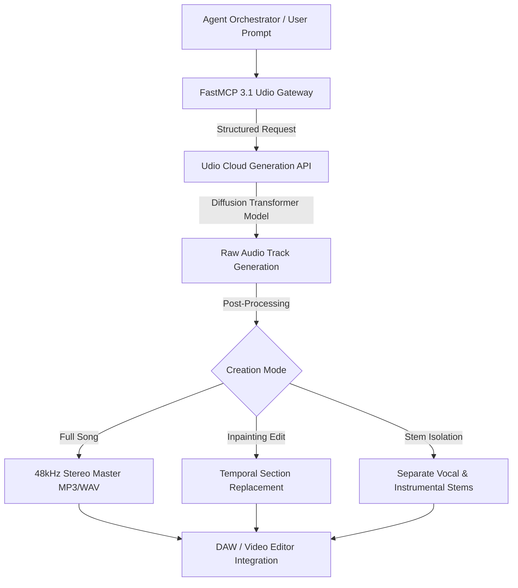

# Udio

## What it is

Udio is a state-of-the-art generative AI music creation platform that synthesizes full-fidelity audio tracks with natural vocals, multi-instrumental arrangements, custom lyrics, and spatial production effects from natural language text prompts. Built by former Google DeepMind researchers, Udio provides advanced temporal and structural audio controls—including track extensions, stem separation, inpainting, and custom song arrangement parameters—for musicians, media scoring artists, content creators, and audio engineers.

Operating via web interface and REST APIs, Udio generates high-definition stereo audio at 48kHz sampling rates. Its underlying diffusion-transformer architecture enables seamless genre blending (such as pairing classical chamber strings with modern synthwave rhythms) while preserving vocal clarity, acoustic realism, and musical coherence across multi-minute compositions.

## What problem it solves

Creating professional-quality musical compositions historically required specialized performance mastery, arrangement expertise, expensive studio software, physical instruments, and costly mastering engineers. Royalty-free stock music libraries often lack emotional resonance, custom duration fit, or exact genre alignment for modern media productions.

Udio eliminates these barriers by translating structured text prompts into polished, studio-mastered audio tracks in seconds. It allows creators to extend song durations dynamically, rewrite specific lyrics or instrumental passages via temporal inpainting, isolate individual vocal/instrumental stems for DAW editing, and rapidly iterate on musical ideas without production overhead.

## Where it fits in the stack

**AI & Knowledge / Generative Audio Platform**. Udio sits in the generative sound synthesis and creative audio layer of the AI stack, alongside platforms like [Suno](suno.md), [Google Lyria](google-lyria.md), and [ElevenLabs](elevenlabs.md). In automated agent pipelines, it acts as an audio rendering engine for multimedia synthesis.



## Typical use cases

- **Media & Game Scoring**: Composing tailored cinematic themes, ambient backgrounds, and dynamic soundtrack cues for video games, podcasts, and indie film trailers.
- **Music Production & Track Extension**: Generating introductory hooks, chorus transitions, or extending 30-second clips into full 3-minute arrangements.
- **Vocal & Lyric Experimentation**: Testing vocal harmonies, lyric delivery styles, foreign language pronunciations, and genre shifts across synthetic vocal models.
- **Stem Inpainting & Temporal Editing**: Replacing specific 5-second sections inside a track with new solo instruments or modified lyric phrases without re-generating the entire song.
- **Automated Content Generation**: Pairing Udio audio output with video synthesis models like [Sora](sora.md) or [Luma Dream Machine](../ai_knowledge/luma-dream-machine.md) inside automated media creation pipelines.

## Strengths

- **Inpainting & Section Editing**: Precise temporal controls allowing users to rewrite, re-instrument, or fix specific time windows within a generated track.
- **Exceptional Audio Fidelity**: High spatial imaging, clear vocal separation, and authentic resonance across acoustic and electronic instruments.
- **Dynamic Track Extension**: Seamlessly adds custom intro sections, extended choruses, bridge variations, and faded outros to existing track checkpoints.
- **Stem Separation Capabilities**: Enables exporting isolated vocal, drum, bass, and instrumental stems directly for external DAW mixing in Ableton, Logic, or Pro Tools.
- **Flexible REST API**: Enterprise endpoints supporting programmatic track generation, batch processing, and status polling for developer workflows.

## Limitations

- **Cloud-Only Execution**: Proprietary hosted architecture that cannot be deployed offline or run on local edge hardware.
- **Generation Latency**: Multi-section track generation and high-fidelity rendering can take 15 to 45 seconds per turn.
- **Commercial Licensing**: Commercial usage rights depend on subscription tiers and licensing agreements.
- **Precise Timing Alignment**: Exact millisecond-level beat sync with visual keyframes requires manual DAW alignment post-generation.

## When to use it

- When requiring precise control over song structure, track extension, or inpainting specific vocal/instrumental segments.
- For generating high-fidelity music tracks with realistic vocal performances and multi-genre blending.
- When integrating music generation into automated cloud workflows or agentic media production pipelines via REST APIs.
- For exporting stem files to perform professional mixing and mastering in digital audio workstations.

## When not to use it

- For offline, zero-dependency, or self-hosted audio synthesis on low-power edge devices (use [AudioCPP](audiocpp.md)).
- When generating purely spoken dialogue, audiobook narration, or voiceovers without musical elements (use [ElevenLabs](elevenlabs.md) or [Gemini Flash TTS](gemini-flash-tts.md)).
- When requiring real-time MIDI parameter manipulation inside a live DAW performance environment.

## Getting started

### Account & API Setup
1. Sign up for access on [udio.com](https://www.udio.com/).
2. Obtain an API key from user account developer settings.
3. Install required Python packages for API requests and validation:

```bash
pip install requests fastmcp pydantic
```

## CLI examples

Trigger generation and poll track status via cURL:

```bash
# Trigger a new audio synthesis request
curl -X POST https://api.udio.com/v1/generate \
  -H "Authorization: Bearer $UDIO_API_KEY" \
  -H "Content-Type: application/json" \
  -d '{
    "prompt": "Cinematic orchestral theme with heavy brass, energetic percussion, and epic crescendo",
    "duration": 30,
    "genre_tags": ["orchestral", "cinematic", "epic"]
  }'

# Infill/edit a 5-second window inside an existing track
curl -X POST https://api.udio.com/v1/inpaint \
  -H "Authorization: Bearer $UDIO_API_KEY" \
  -H "Content-Type: application/json" \
  -d '{
    "track_id": "udio_trk_91234",
    "start_time": 10.0,
    "end_time": 15.0,
    "prompt": "Add a soaring electric guitar solo over the drum rhythm"
  }'

# Poll track status
curl -X GET https://api.udio.com/v1/tracks/udio_trk_91234 \
  -H "Authorization: Bearer $UDIO_API_KEY"
```

## API examples

### FastMCP 3.1 Audio Generation Tool
The following example wraps Udio music synthesis inside a **FastMCP 3.1** tool server for integration with multimedia agent systems.

```python
import os
import time
from fastmcp import FastMCP
from pydantic import BaseModel, Field, conint, confloat

# Initialize FastMCP Server for Udio audio tool integration
mcp = FastMCP("Udio Generative Audio Server")

class UdioGenerateRequest(BaseModel):
    prompt: str = Field(..., min_length=10, max_length=1000, description="Musical style, mood, and instrumentation prompt")
    duration_seconds: conint(gt=5, le=180) = Field(30, description="Target duration in seconds")
    tempo_bpm: conint(gt=40, le=240) = Field(120, description="Target tempo in Beats Per Minute")
    has_vocals: bool = Field(True, description="Whether to include synthesized vocal tracks")

class UdioInpaintRequest(BaseModel):
    track_id: str = Field(..., description="Target Udio track identifier")
    start_time: confloat(ge=0.0) = Field(..., description="Inpaint start timestamp in seconds")
    end_time: confloat(gt=0.0) = Field(..., description="Inpaint end timestamp in seconds")
    edit_prompt: str = Field(..., min_length=5, description="New sound, lyrics, or instruments to insert")

class UdioAudioResult(BaseModel):
    track_id: str
    status: str
    audio_url: str
    duration: int
    bpm: int

@mcp.tool()
def generate_music_track(request: UdioGenerateRequest) -> UdioAudioResult:
    """Generate a high-fidelity audio track using the Udio generative music API."""
    # Simulated Udio API integration call
    track_id = f"udio_trk_{int(time.time())}"

    return UdioAudioResult(
        track_id=track_id,
        status="completed",
        audio_url=f"https://cdn.udio.com/tracks/{track_id}.mp3",
        duration=request.duration_seconds,
        bpm=request.tempo_bpm
    )

@mcp.tool()
def inpaint_audio_segment(request: UdioInpaintRequest) -> UdioAudioResult:
    """Inpaint or replace a temporal audio segment within an existing Udio track."""
    return UdioAudioResult(
        track_id=request.track_id,
        status="inpainted",
        audio_url=f"https://cdn.udio.com/tracks/{request.track_id}_edit.mp3",
        duration=30,
        bpm=120
    )

if __name__ == "__main__":
    mcp.run()
```

### Python: Request Validation with Pydantic v2
Validate complex Udio API payloads using strict Pydantic v2 validation before dispatching HTTP calls.

```python
from typing import List, Optional
from pydantic import BaseModel, Field, conint, confloat, field_validator

class TrackInpaintWindow(BaseModel):
    start_sec: confloat(ge=0.0) = Field(..., description="Start window offset")
    end_sec: confloat(gt=0.0) = Field(..., description="End window offset")

    @field_validator("end_sec")
    @classmethod
    def validate_window(cls, v: float, info) -> float:
        start = info.data.get("start_sec", 0.0)
        if v <= start:
            raise ValueError("end_sec must be strictly greater than start_sec")
        if (v - start) > 30.0:
            raise ValueError("Maximum single inpaint window length is 30 seconds")
        return v

class UdioProductionJob(BaseModel):
    job_id: str = Field(..., description="Unique workflow identifier")
    style_prompt: str = Field(..., min_length=10)
    inpaint_window: Optional[TrackInpaintWindow] = None
    tags: List[str] = Field(default_factory=list)

# Validate production job configuration
job_data = {
    "job_id": "JOB-2027-0891",
    "style_prompt": "Ambient electronic synthwave with warm analog pads and driving 808 bassline",
    "inpaint_window": {"start_sec": 15.0, "end_sec": 25.0},
    "tags": ["synthwave", "ambient", "electronic"]
}

validated_job = UdioProductionJob(**job_data)
print(f"Validated Udio Production Job [{validated_job.job_id}]: Window {validated_job.inpaint_window.start_sec}s -> {validated_job.inpaint_window.end_sec}s")
```

## Related tools / concepts

- [Suno](suno.md) — AI music and song generation platform.
- [Google Lyria](google-lyria.md) — Google DeepMind's generative music architecture.
- [ElevenLabs](elevenlabs.md) — Generative audio and voice synthesis engine.
- [AudioCPP](audiocpp.md) — Portable C++ audio synthesis framework.
- [Gemini Flash TTS](gemini-flash-tts.md) — High-speed speech synthesis model.
- [Sora](sora.md) — Generative video model requiring soundtrack integration.
- [Project Genie](project-genie.md) — Generative world model pairing with sound design.

## Sources / references

- [Udio Official Platform](https://www.udio.com/)
- [Udio Product Overview & Documentation](https://www.udio.com/about)

## Contribution Metadata

- Last reviewed: 2027-01-07
- Confidence: high
