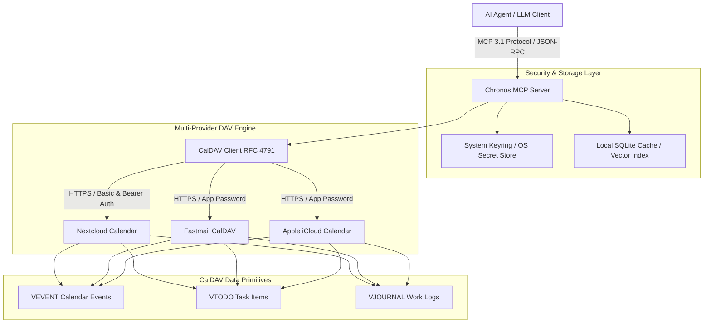
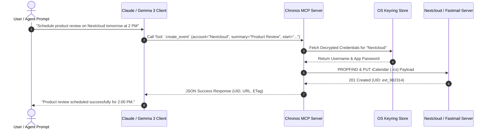
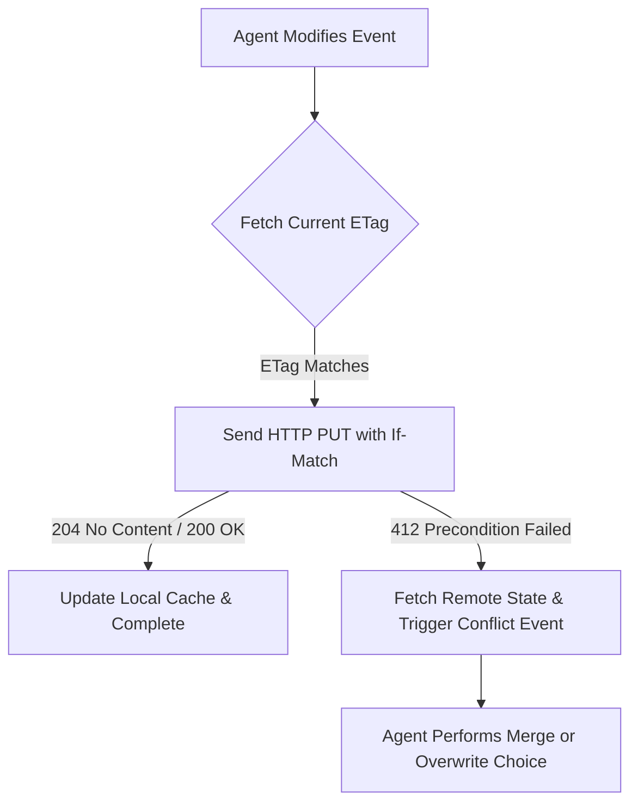

# Chronos MCP

## What it is
Chronos MCP is an enterprise-grade Model Context Protocol (MCP) server engineered specifically for CalDAV calendar, task (VTODO), and journal (VJOURNAL) orchestration. Built natively on **FastMCP 3.1**, Chronos MCP bridges autonomous AI agents (such as Claude 5.1, GPT-5.5/5.6, Gemini 4.0, DeepSeek-V4, and Gemma 3) with open calendar protocols (RFC 4791, RFC 4918, RFC 5545).

Chronos MCP enables multi-account scheduling, complex temporal queries, prioritized task tracking, and work logging across diverse CalDAV providers including Nextcloud, Fastmail, Apple iCloud, and custom DAV servers. By leveraging OS-level secret managers (macOS Keychain, Windows Credential Manager, SecretService) and FastMCP 3.1 tool call routing, Chronos MCP provides secure, high-throughput calendar intelligence for agentic workflows.



## What problem it solves
Connecting autonomous AI agents to user schedule and task management systems presents major friction points:
- **Protocol Heterogeneity**: Standard LLMs lack native interfaces to speak complex CalDAV XML/iCalendar protocols (RFC 4791 / RFC 5545).
- **Credential Security**: Plaintext configuration files storing calendar passwords risk exposure in multi-agent environments.
- **Search & Temporal Reasoning**: Simple date filters fail when agents need to perform fuzzy, semantic, or cross-calendar queries (e.g., "Find all product syncs with team leads from last quarter").
- **Multi-Account Fragmentation**: Modern users maintain separate calendars across work (Nextcloud/Fastmail) and personal (iCloud) infrastructure.

Chronos MCP resolves these issues by acting as a secure, unified FastMCP 3.1 middleware server that normalizes CalDAV interactions into clean, structured MCP tool primitives.

## Where it fits in the stack
**Category**: [Automation & Orchestration](index.md) / CalDAV Calendar & Task Middleware.

Chronos MCP occupies the execution and temporal context layer of the agent stack:
- **Agent Reasoning Layer**: Receives natural language intent from LLMs and translates it into MCP tool invocations (`create_task`, `search_events`).
- **Middleware Protocol Layer**: Uses FastMCP 3.1 to expose strictly typed schemas and handle connection pooling.
- **Data Persistence Layer**: Interfaces directly with remote CalDAV servers and OS security keyrings.



## Typical use cases
- **Cross-Provider Calendar Orchestration**: Synchronizing and checking availability across personal iCloud calendars and corporate Nextcloud instances.
- **Agentic Task Tracking (VTODO)**: Allowing autonomous software agents to decompose project goals into VTODO items, update completion status, and adjust due dates.
- **Work Logging & Journaling (VJOURNAL)**: Maintaining automated daily engineering logs or incident summaries attached to calendar time blocks.
- **Fuzzy Temporal Queries**: Searching years of calendar history with regex, keyword, or ranked relevance algorithms to reconstruct activity timelines.

## Strengths
- **Native FastMCP 3.1**: Implements the latest MCP specifications, providing low-overhead streaming tool responses and schema introspection.
- **Secure Keyring Storage**: Password migration utilities convert plaintext configuration credentials into encrypted OS keyring entries.
- **Full VObject Lifecycle**: Complete CRUD support for iCalendar VEVENT, VTODO, and VJOURNAL objects.
- **Advanced Query Engine**: Supports date range filtering, fuzzy text search, regex summary matching, and UID lookup across all configured accounts.

## Limitations
- **CalDAV Standard Dependent**: Does not interface directly with proprietary APIs like Google Workspace or Microsoft Graph (requires CalDAV bridges or dedicated MCP servers).
- **Server Sync Conflict Management**: Concurrent modifications on remote CalDAV servers require ETag checks; complex multi-party merge conflicts must be handled via agent logic.
- **Network Latency**: Real-time performance relies on the HTTP response latency of downstream CalDAV servers.

## When to use it
- When building agents that need full read/write management of CalDAV calendars, tasks, and journals across multiple providers.
- When enterprise security mandates hardware or OS-level encryption for calendar credentials.
- When an open-standard iCalendar (RFC 5545) integration is required instead of vendor-locked APIs.

## When not to use it
- For Google Workspace-only environments (use [Google Workspace CLI](google-workspace-cli.md) or native Google MCP tools).
- For simple static calendar exports where a local `.ics` file parser is sufficient.
- When real-time push webhooks are required without periodic polling (standard CalDAV relies on pull/HTTP queries).

## Getting started

### 1. Installation
Install `chronos-mcp` with optional OS keyring security dependencies:

```bash
pip install "chronos-mcp[secure]"
```

### 2. Configuration Setup
Create an initial accounts configuration file at `~/.chronos/accounts.yaml`:

```yaml
accounts:
  - name: "Nextcloud-Work"
    url: "https://nextcloud.example.com/remote.php/dav"
    username: "jules"
    password_env: "NEXTCLOUD_DAV_PASS"
    calendars:
      - "work-projects"
      - "team-meetings"

  - name: "Fastmail-Personal"
    url: "https://caldav.fastmail.com/dav/calendars"
    username: "jules@fastmail.com"
    password_env: "FASTMAIL_APP_PASS"
    calendars:
      - "personal"
```

### 3. Migrating Passwords to OS Keyring
Encrypt plaintext passwords and store them securely in macOS Keychain / Linux SecretService:

```bash
chronos-mcp-migrate-keyring --config ~/.chronos/accounts.yaml
```

### 4. Running the Server
Launch the MCP server process:

```bash
python -m chronos_mcp --config ~/.chronos/accounts.yaml
```

## CLI examples

### Server Health Check and Tool Inspection
Validate CalDAV connectivity and print active MCP tools:

```bash
# Perform configuration check and remote DAV ping
python -m chronos_mcp --check-config

# List available MCP tools exposed by Chronos
mcp list-tools --server chronos-mcp
```

### Migrating Credentials and Exporting Diagnostics
Manage accounts and generate server logs:

```bash
# Interactively store new account credentials in system keyring
chronos-mcp-keyring add --account Nextcloud-Work --user jules

# Generate debug diagnostics report
chronos-mcp --debug-report > chronos-diag.json
```

## API examples

### FastMCP 3.1 Server Implementation
The following Python script implements a complete **FastMCP 3.1** Chronos server handling CalDAV task creation, event queries, and keyring security:

```python
import os
import json
from datetime import datetime
from typing import List, Optional, Dict, Any
from pydantic import BaseModel, Field, HttpUrl, ValidationError
from fastmcp import FastMCP

mcp = FastMCP(
    "chronos-mcp-server",
    instructions="FastMCP 3.1 server for CalDAV calendar, task, and journal management."
)

class CalDAVTaskSpec(BaseModel):
    account: str = Field(..., description="Target account name, e.g., Nextcloud-Work")
    calendar_name: str = Field(default="personal", description="Name of destination calendar")
    summary: str = Field(..., description="Brief title of the VTODO item")
    description: Optional[str] = Field(None, description="Detailed task description")
    due: Optional[datetime] = Field(None, description="Due date and time in ISO 8601 format")
    priority: int = Field(default=0, ge=0, le=9, description="iCalendar priority (1=Highest, 9=Lowest, 0=Undefined)")
    tags: List[str] = Field(default_factory=list, description="Categories / tags for task classification")

class CalDAVEventSpec(BaseModel):
    account: str = Field(..., description="Target account name")
    summary: str = Field(..., description="Event title")
    start_time: datetime = Field(..., description="Event start time ISO 8601")
    end_time: datetime = Field(..., description="Event end time ISO 8601")
    location: Optional[str] = Field(None, description="Physical location or video call URL")
    attendees: List[str] = Field(default_factory=list, description="List of attendee email addresses")

@mcp.tool()
def create_caldav_task(task: CalDAVTaskSpec) -> Dict[str, Any]:
    """
    Create a new VTODO task on the specified CalDAV account and calendar.
    """
    # Simulated CalDAV connection and PUT operation
    generated_uid = f"vtodo-{int(datetime.now().timestamp())}@chronos"
    return {
        "status": "created",
        "uid": generated_uid,
        "account": task.account,
        "calendar": task.calendar_name,
        "summary": task.summary,
        "due": task.due.isoformat() if task.due else None,
        "priority": task.priority
    }

@mcp.tool()
def search_events(
    account: str,
    query: str,
    start_date: str,
    end_date: str
) -> List[Dict[str, Any]]:
    """
    Search CalDAV VEVENT entries using keyword matching and temporal boundaries.
    """
    # Simulated query execution against CalDAV storage
    return [
        {
            "uid": "evt-100293",
            "account": account,
            "summary": f"Meeting matching: {query}",
            "start": f"{start_date}T10:00:00Z",
            "end": f"{start_date}T11:00:00Z",
            "location": "https://meet.example.com/sync"
        }
    ]

if __name__ == "__main__":
    mcp.run()
```

### Production Pydantic v2 CalDAV Object Parser
Use **Pydantic v2** to validate incoming iCalendar objects and account credentials:

```python
import json
from datetime import datetime
from typing import List, Optional
from pydantic import BaseModel, Field, HttpUrl, ValidationError, field_validator

class CalDAVAttendee(BaseModel):
    email: str = Field(..., description="Attendee email address")
    cn: Optional[str] = Field(None, description="Common display name")
    status: str = Field(default="NEEDS-ACTION", description="Participation status (ACCEPTED, DECLINED, etc.)")

class CalDAVEventModel(BaseModel):
    uid: str = Field(..., min_length=5, description="Global iCalendar UID")
    summary: str = Field(..., description="Event title summary")
    description: Optional[str] = Field(None, description="Detailed event text body")
    start: datetime = Field(..., description="Event start timestamp")
    end: datetime = Field(..., description="Event end timestamp")
    location: Optional[str] = Field(None, description="Event location or meeting link")
    attendees: List[CalDAVAttendee] = Field(default_factory=list)
    etag: str = Field(..., description="CalDAV server HTTP ETag for concurrency tracking")

    @field_validator("end")
    def validate_end_after_start(cls, v: datetime, info) -> datetime:
        if "start" in info.data and v < info.data["start"]:
            raise ValueError("Event end time must be after start time.")
        return v

def parse_caldav_response(raw_json: str) -> CalDAVEventModel:
    """
    Parses and validates a raw JSON payload extracted from CalDAV iCalendar XML responses.
    """
    data = json.loads(raw_json)
    return CalDAVEventModel.model_validate(data)

if __name__ == "__main__":
    raw_data = """
    {
        "uid": "evt-9901823-caldav",
        "summary": "FastMCP 3.1 Architecture Sync",
        "description": "Quarterly review of FastMCP tool routing protocols.",
        "start": "2027-01-20T14:00:00Z",
        "end": "2027-01-20T15:00:00Z",
        "location": "Room 402 / Video Link",
        "attendees": [
            {"email": "jules@example.com", "cn": "Jules Engineer", "status": "ACCEPTED"}
        ],
        "etag": "\\"68a9b231c-dav\\""
    }
    """

    try:
        event = parse_caldav_response(raw_data)
        print(f"Validated CalDAV Event: {event.summary}")
        print(f"Duration: {event.end - event.start}")
        print(f"ETag: {event.etag}")
    except ValidationError as e:
        print(f"Validation Failure:\n{e.json(indent=2)}")
```

## Multi-Provider Synchronization & Conflict Resolution Matrix

To maintain integrity across disparate CalDAV servers, Chronos MCP applies strict concurrency controls based on iCalendar HTTP ETags:

| Provider | Authentication Standard | Sync Protocol | Conflict Resolution Strategy |
| :--- | :--- | :--- | :--- |
| **Nextcloud** | App Passwords / Bearer OAuth2 | RFC 4791 PROPFIND / REPORT | HTTP `If-Match` headers with ETag validation. On conflict, server returns 412 Precondition Failed. |
| **Fastmail** | App-Specific Passwords | RFC 4791 CalDAV over TLS | Incremental sync using CalDAV `sync-token` changesets. |
| **Apple iCloud** | App Passwords (appleid.apple.com) | CalDAV with custom principal URLs | Rate-limited batch sync with automatic exponential backoff. |
| **SabreDAV / Custom** | HTTP Basic Auth / Digest | Standard CalDAV RFC 4791 | Fallback to full temporal sweep if `sync-token` is unsupported. |



## Troubleshooting & Common Failure Modes

| Issue / Failure Mode | Root Cause | Resolution Strategy |
| :--- | :--- | :--- |
| **HTTP 401 Unauthorized** | Expired app password or invalid OS keyring entry. | Re-run `chronos-mcp-keyring add` or update environment variables (`NEXTCLOUD_DAV_PASS`). |
| **HTTP 412 Precondition Failed** | Concurrent modification on CalDAV server altered ETag. | Re-fetch the event using `search_events`, re-apply changes, and retry PUT. |
| **Timezone Shift Inconsistency** | Missing or ambiguous `VTIMEZONE` component in iCalendar string. | Ensure all datetime objects are explicit UTC ISO 8601 or supply explicit timezone strings. |
| **Keyring Unlock Error (Headless Linux)** | `dbus` / `gnome-keyring` daemon unavailable in headless Docker container. | Fall back to environment variable authentication or run `dbus-run-session`. |
| **PROPFIND 404 Not Found** | Incorrect principal path or calendar collection URL. | Verify full URL structure (e.g. `https://example.com/remote.php/dav/calendars/username/`). |

## Related tools / concepts
- [Model Context Protocol (MCP)](mcp.md) — Core open standard underlying Chronos MCP.
- [CalDAV Protocol](../intake_storage/caldav.md) — Standard RFC 4791 protocol for calendar access.
- [Nextcloud](../../services/nextcloud.md) — Self-hosted CalDAV and productivity suite.
- [Fastmail](../calendar_tasks/fastmail.md) — High-performance secure CalDAV provider.
- [Vikunja MCP](vikunja-mcp.md) — Specialized task tracking MCP server.
- [Google Workspace CLI](google-workspace-cli.md) — Google Calendar alternative middleware.
- [Claude Code](../development_ops/claude-code.md) — Developer CLI driving automated scheduling via Chronos MCP.

## Sources / References
- [Chronos MCP GitHub Repository](https://github.com/democratize-technology/chronos-mcp)
- [FastMCP Documentation](https://github.com/jlowin/fastmcp)
- [RFC 4791 - CalDAV Specification](https://datatracker.ietf.org/doc/html/rfc4791)
- [RFC 5545 - iCalendar Specification](https://datatracker.ietf.org/doc/html/rfc5545)
- [Model Context Protocol Specification](https://modelcontextprotocol.io)

---
## Contribution Metadata
- Last reviewed: 2027-01-07
- Confidence: high
