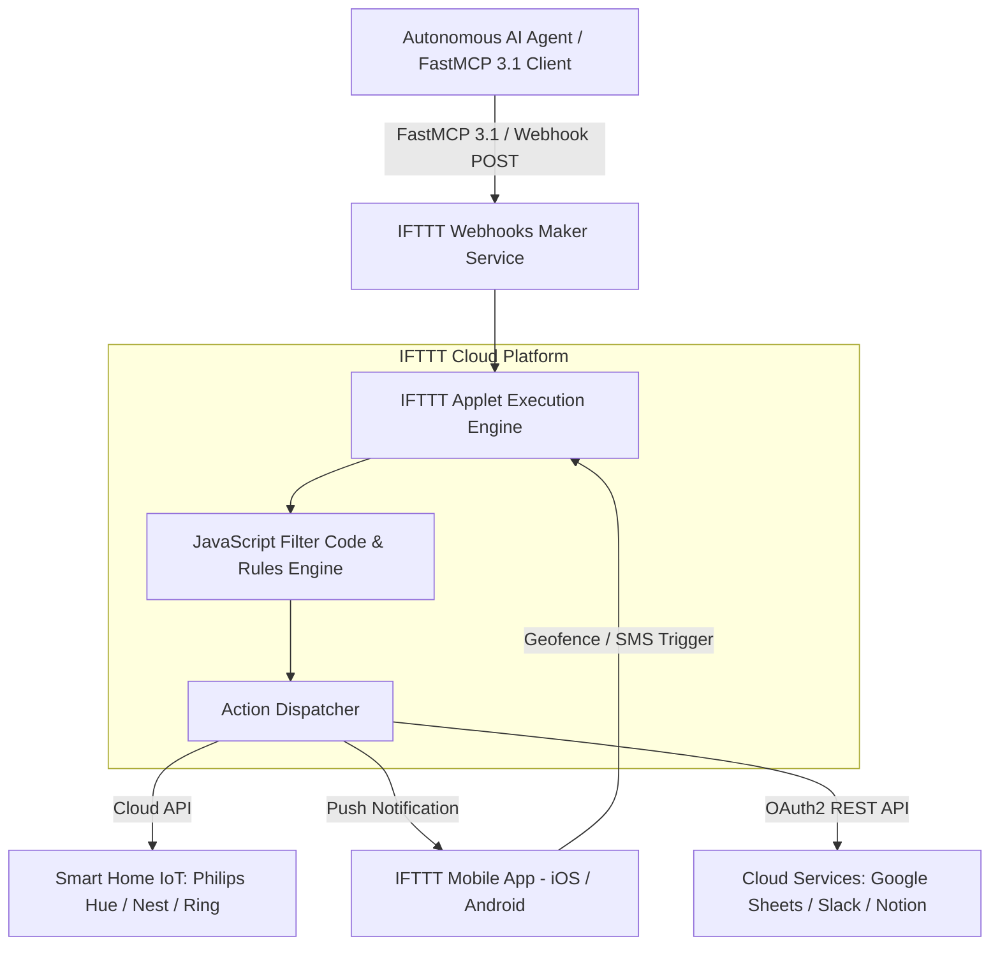

# IFTTT (If This Then That)

## What it is
IFTTT (If This Then That) is a leading consumer and lightweight enterprise cloud automation platform designed to bridge web services, mobile OS events, smart home IoT hardware, and custom API endpoints using simple conditional logic statements called "Applets". As of early 2027, IFTTT features dedicated Webhooks integrations, AI-assisted applet generation, multi-action Filter Code scripting (JavaScript runtime), and native **FastMCP 3.1** task protocol connectors. This allows autonomous AI agents, LLM tool runners, and home automation servers to trigger physical actions across thousands of consumer devices (e.g., Philips Hue, LIFX, Nest, Ring, iRobot, Strava, Roomba) and web APIs.

By functioning as a universal "API aggregator for the physical world," IFTTT abstracts away complex device-specific authentication, vendor protocol differences, and mobile OS background execution rules into clean HTTP REST webhooks and Model Context Protocol actions.

## What problem it solves
Integrating autonomous AI agents and web software with consumer physical hardware and proprietary mobile OS events usually requires building individual OAuth2 authentication flows, maintaining device drivers, handling WebSockets connection states, and managing vendor API schemas for hundreds of isolated IoT platforms. IFTTT solves this integration barrier by providing a unified cloud middleware layer. Instead of managing complex device-specific SDKs, developers and AI agents can dispatch standardized HTTP POST Webhook triggers or FastMCP 3.1 tool calls to IFTTT, which translates and routes the request to target hardware or cloud services instantaneously.

Furthermore, IFTTT enables bidirectional communication between mobile OS capabilities (such as cellular geofences, SMS messages, Wi-Fi network switches, and battery telemetry) and backend cloud services or AI agents without requiring developers to write, compile, and publish native iOS or Android applications.

## Where it fits in the stack
**Category**: [Automation & Orchestration](./index.md) / Consumer IoT & Cloud Service Connector. IFTTT operates at the **Physical IoT & External Service Integration Layer**, serving as a consumer hardware gateway that bridges AI agent reasoning engines with real-world physical devices and third-party SaaS applications.



At the top layer, LLMs and FastMCP 3.1 servers generate structured automation payloads (`value1`, `value2`, `value3`). At the middleware layer, IFTTT executes JavaScript Filter Code rules to format data and enforce conditionals. At the output layer, actions are routed across smart home hardware, mobile push channels, or cloud database integrations.

## Typical use cases
- **AI Agent Real-World Notifications**: Dispatching physical notifications (e.g., flashing smart lights red, sounding a smart chime) when an AI agent detects a critical system alert.
- **Smart Home Physical Control**: Triggering HVAC adjustments, robotic vacuum cleaning cycles, or smart door lock routines based on AI agent decision loops.
- **Mobile OS Geofence & Battery Triggers**: Ingesting mobile location events, Wi-Fi connections, or battery state changes into automated agent logging pipelines.
- **Lightweight Multi-SaaS Sync**: Synchronizing data rows between consumer tools like Google Sheets, Todoist, Evernote, Strava, and iOS Reminders without complex server deployment.
- **Hands-Free FastMCP 3.1 Tool Triggers**: Invocating physical applets directly from LLMs via structured FastMCP 3.1 JSON RPC function calls.
- **Automated Social & Community Dispatch**: Crossposting content or sending automated status updates to Twitter/X, Discord, Telegram, and Slack channels.
- **Geofenced Automated Security Schedules**: Arming home security cameras or locking smart deadbolts automatically when an engineer leaves the office or home network.

## Strengths
- **Massive IoT Hardware Ecosystem**: Out-of-the-box support for thousands of consumer smart home appliances, wearables, and mobile OS triggers.
- **Zero Infrastructure Setup**: Fully managed cloud service eliminating the need to host custom webhook relay infrastructure or manage OAuth credentials.
- **Simple Webhook Interface**: Standardized Maker Webhook API accepts straightforward JSON payloads (`value1`, `value2`, `value3`).
- **Native Mobile Integration**: Ingests native iOS and Android sensors, including geofencing, cell tower switches, SMS triggers, and push alerts.
- **Extensible Filter Code**: Supports embedded JavaScript snippets within Applets for dynamic conditional filtering and data formatting.
- **High Accessibility**: Intuitive visual applet builder enables non-technical users to pair with AI agents effortlessly.
- **Multi-Brand Compatibility**: Interconnects devices from competing hardware vendors without vendor-lockin.

## Limitations
- **Latency Variability**: Polling-based triggers can introduce delays of up to several minutes compared to real-time Webhook subscriptions.
- **Limited Multi-Step Branching**: Complex multi-conditional workflows with multiple conditional paths are more restricted compared to dedicated platforms like [n8n](../../services/n8n.md) or [Make](./make.md).
- **Cloud Internet Dependency**: Complete reliance on IFTTT cloud servers prevents offline execution during local network outages (unlike [Home Assistant](../../services/home-assistant.md)).
- **Payload Parameter Limits**: Standard Webhooks triggers restrict unstructured payloads to three main values (`value1`, `value2`, `value3`) unless parsed via custom Filter Code.

## When to use it
- When connecting AI agents, scripts, or FastMCP 3.1 servers to consumer smart home hardware or mobile device events.
- For lightweight single-trigger, single-action integrations where full-scale enterprise workflow engines are unnecessary.
- When mobile OS native capabilities (e.g., location geofencing, device push alerts) are required as automation inputs or outputs.
- When rapid prototyping of IoT triggers is needed without writing custom hardware API drivers.

## When not to use it
- When building complex enterprise business processes requiring deep data transformations and multi-branch database transactions (use [n8n](../../services/n8n.md) or [Zapier](./zapier.md)).
- When local, offline, sub-10ms smart home automation is mandatory (use [Home Assistant](../../services/home-assistant.md)).
- For high-frequency messaging requiring per-second real-time streaming guarantees.
- When strict data privacy requirements forbid routing event telemetry through third-party cloud aggregators.

## Getting started

### Account & Webhook Service Setup
Establish your IFTTT Webhook credentials:

1. Create an account at [ifttt.com](https://ifttt.com/).
2. Navigate to [IFTTT Webhooks Service](https://ifttt.com/maker_webhooks) and click **Connect**.
3. Go to **Documentation** to retrieve your unique Webhooks secret key (`https://maker.ifttt.com/use/YOUR_WEBHOOK_KEY`).

### Creating a Custom Webhook Applet
1. Click **Create** in the IFTTT interface.
2. **If This**: Select **Webhooks** -> **Receive a web request**. Name the event (e.g., `ai_agent_alert`).
3. **Then That**: Select target action (e.g., **Philips Hue** -> **Blink lights**, or **Google Sheets** -> **Add row to spreadsheet**).
4. Save and enable the Applet.

## CLI examples

### Triggering an IFTTT Webhook Event via cURL
Dispatch a JSON payload containing up to three parameter values to an active IFTTT Webhook Applet:

```bash
curl -X POST "https://maker.ifttt.com/trigger/ai_agent_alert/with/key/YOUR_IFTTT_WEBHOOK_KEY" \
     -H "Content-Type: application/json" \
     -d '{
       "value1": "Claude 5.6 Agent",
       "value2": "Critical System Warning: High GPU Temperature",
       "value3": "Server Rack B-04"
     }'
```

### Inspecting Webhook Response Status
Verify HTTP 200 response status and delivery verification:

```bash
curl -i -s -X POST "https://maker.ifttt.com/trigger/test_ping/with/key/YOUR_IFTTT_WEBHOOK_KEY"
```

### Testing Multi-Value Webhook Payloads
Test sending complex telemetry strings inside parameters:

```bash
curl -X POST "https://maker.ifttt.com/trigger/telemetry_sync/with/key/YOUR_IFTTT_WEBHOOK_KEY" \
     -H "Content-Type: application/json" \
     -d '{
       "value1": "battery_level_92",
       "value2": "location_office_zone",
       "value3": "wifi_mesh_5g"
     }'
```

## API examples

### Production FastMCP 3.1 IFTTT Gateway Server with Pydantic v2
This comprehensive Python implementation provides a production-ready FastMCP 3.1 server that validates IFTTT Webhook payloads using Pydantic v2 and executes asynchronous event dispatches:

```python
import asyncio
import json
import os
import requests
from typing import Optional, Dict, Any
from pydantic import BaseModel, Field, field_validator, ConfigDict
from mcp.server.fastmcp import FastMCP

# Initialize FastMCP 3.1 Server for IFTTT Automation
mcp = FastMCP("IFTTT AI Automation Gateway")

class IFTTTEventRequest(BaseModel):
    model_config = ConfigDict(str_strip_whitespace=True, extra="forbid")

    event_name: str = Field(..., min_length=2, max_length=64, description="Name of the IFTTT webhook trigger event")
    webhook_key: str = Field(..., min_length=10, description="IFTTT Maker Webhook secret key")
    value1: Optional[str] = Field(default=None, description="First parameter value passed to IFTTT Applet")
    value2: Optional[str] = Field(default=None, description="Second parameter value passed to IFTTT Applet")
    value3: Optional[str] = Field(default=None, description="Third parameter value passed to IFTTT Applet")

    @field_validator("event_name")
    @classmethod
    def validate_event_name(cls, v: str) -> str:
        if not v.replace("_", "").replace("-", "").isalnum():
            raise ValueError("Event name must contain only alphanumeric characters, underscores, or hyphens.")
        return v

class IFTTTResponseStatus(BaseModel):
    event_name: str
    status_code: int
    success: bool
    ifttt_response_message: str

@mcp.tool()
def trigger_ifttt_applet(payload_json: str) -> str:
    """Dispatches an asynchronous webhook trigger to an IFTTT Applet under FastMCP 3.1."""
    try:
        data = json.loads(payload_json)
        request = IFTTTEventRequest(**data)

        url = f"https://maker.ifttt.com/trigger/{request.event_name}/with/key/{request.webhook_key}"
        body = {
            "value1": request.value1,
            "value2": request.value2,
            "value3": request.value3
        }

        response = requests.post(url, json=body, timeout=8.0)

        result = IFTTTResponseStatus(
            event_name=request.event_name,
            status_code=response.status_code,
            success=response.status_code == 200,
            ifttt_response_message=response.text
        )
        return result.model_dump_json(indent=2)
    except Exception as err:
        return json.dumps({
            "success": False,
            "error_type": type(err).__name__,
            "message": str(err)
        })

if __name__ == "__main__":
    mcp.run()
```

### JavaScript Filter Code Snippet for IFTTT Applets
Custom IFTTT Filter Code written in JavaScript to format incoming agent JSON parameters before triggering target actions:

```javascript
// Filter Code inside IFTTT Applet Editor
let source = MakerWebhooks.event.Value1;
let message = MakerWebhooks.event.Value2;
let location = MakerWebhooks.event.Value3;

if (source.includes("Agent")) {
  PhilipsHue.changeColor.setHue("Red");
  IFTTT.email.setMessage(`[URGENT AGENT ALERT] ${message} at ${location}`);
} else {
  IFTTT.email.skip("Non-agent event ignored.");
}
```

## Related tools / concepts
- [Zapier](./zapier.md) — Cloud-native SaaS enterprise workflow platform.
- [n8n](../../services/n8n.md) — Open-source self-hosted automation engine with visual workflows.
- [Home Assistant](../../services/home-assistant.md) — Open-source local home automation platform.
- [Make](./make.md) — Visual integration platform for complex multi-branch API workflows.
- [Model Context Protocol](../automation_orchestration/mcp.md) — Open protocol for linking AI models with IFTTT tools.

## Sources / references
- [IFTTT Official Platform Website](https://ifttt.com/)
- [IFTTT Webhooks Service Documentation](https://ifttt.com/maker_webhooks)
- [IFTTT Developer Portal & Filter Code Docs](https://developer.ifttt.com/)

---
## Contribution Metadata
- Last reviewed: 2027-01-07
- Confidence: high
