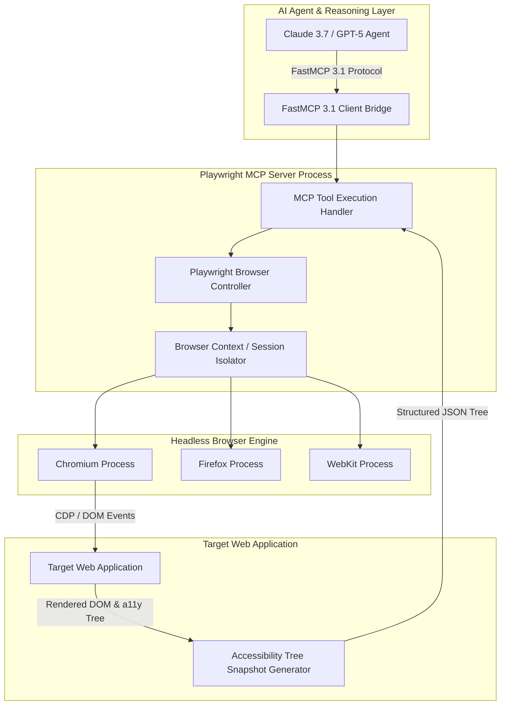

# Playwright MCP Server

## What it is
The Playwright MCP Server is an open-source Model Context Protocol (MCP) server implementation that exposes a headless browser automation environment to AI reasoning agents (Claude 3.7 Sonnet, GPT-5, Gemini 2.5 Pro, DeepSeek-V3, and Qwen 2.5 VL). Built upon Microsoft Playwright, the Playwright MCP Server provides a standardized, tool-driven interface enabling frontier foundation models and agentic workflows to interact directly with live web applications over the **FastMCP 3.1** Task Protocol.

Rather than relying on raw DOM HTML trees or fragile vision-only screenshot coordinates, the Playwright MCP Server translates rendered web pages into structured **Accessibility (a11y) Trees**. This semantic representation allows agents to navigate complex multi-page applications, click buttons, fill out dynamic forms, execute JavaScript, manage cookies/local storage, bypass anti-bot challenges via stealth plugins, and extract structured data from single-page applications (SPAs) without requiring custom REST or GraphQL APIs.



## What problem it solves
Modern web applications rely heavily on client-side JavaScript rendering, shadow DOMs, dynamic state hydration, canvas rendering, and strict CORS policies. Traditional web scraping tools (such as static cURL, BeautifulSoup, or raw HTTP fetches) fail when encountering SPAs, auth-gated SaaS portals, or interactive form flows. Conversely, relying exclusively on vision-based multimodal screenshot models introduces high token costs, layout ambiguity, mouse click inaccuracy, and slow inference speeds.

The Playwright MCP Server overcomes these limitations through several core engineering mechanisms:

- **Semantic Accessibility Tree Extraction**: Converts complex DOM trees into lightweight, hierarchical accessibility trees containing element IDs, roles (button, textbox, combobox), accessible names, and interactive states (checked, disabled, expanded). This dramatically reduces context token overhead while increasing click selector precision.
- **Dynamic JavaScript Execution & Event Handling**: Executes full browser rendering cycles, waiting for network idle states, hydration events, and WebSocket messages before returning page content to the agent.
- **FastMCP 3.1 Task Protocol Compatibility**: Implements task progress tracking, cancellation tokens, session state correlation, and error recovery protocols required for multi-step autonomous agent operations.
- **Headless Browser Isolation & State Management**: Maintains isolated incognito browser contexts per agent session, managing cookies, local storage tokens, custom headers, and proxy routing to enable authentic multi-user workflow testing.
- **Visual Verification & Artifact Generation**: Captures high-resolution full-page screenshots, viewport snapshots, and PDF exports for agentic visual inspection and reporting.

## Where it fits in the stack
The Playwright MCP Server operates at the **Agent Tooling, Web Browser Automation, Synthetic Testing, and Last-Mile Web Interaction Layer** within modern software and AI agent architectures. It serves as a bridge between high-level reasoning models and interactive web environments.

```
+-----------------------------------------------------------------------------------+
|                            AI Agent Orchestration Layer                           |
|       (Claude Code, Cursor, LangChain, AutoGen, CrewAI, Custom Agents)           |
+-----------------------------------------------------------------------------------+
                                          |
                                          v (FastMCP 3.1 Protocol / SSE / Std構)
+-----------------------------------------------------------------------------------+
|                             Playwright MCP Server                                 |
|  +--------------------+  +--------------------+  +-----------------------------+  |
|  | Tool Execution     |  | Accessibility      |  | Screenshot & Artifact       |  |
|  | Handler            |  | Tree Generator     |  | Exporter                    |  |
|  +--------------------+  +--------------------+  +-----------------------------+  |
|  +-----------------------------------------------------------------------------+  |
|  |                  Playwright Core (Chromium/Firefox/WebKit)                  |  |
|  +-----------------------------------------------------------------------------+  |
+-----------------------------------------------------------------------------------+
                                          |
                                          v (CDP / Playwright API)
+-----------------------------------------------------------------------------------+
|                            Interactive Web Applications                           |
|      (React, Next.js, Vue, Auth Portals, SaaS Dashboards, E-commerce)            |
+-----------------------------------------------------------------------------------+
```

## Typical use cases
- **Automated Web Scraping & Data Extraction**: Gathering real-time data from dynamic, anti-bot protected sites requiring JavaScript hydration, multi-step navigation, or cookie consent button interactions.
- **Agentic SaaS Task Execution**: Enabling autonomous AI assistants to log into SaaS portals, generate billing reports, adjust account configuration toggles, or schedule appointments.
- **End-to-End Self-Healing Test Automation**: Writing natural language end-to-end (E2E) UI test scripts where the AI agent dynamically adapts to changing DOM selectors and layout updates.
- **Visual Verification & Screenshot Reporting**: Capturing page screenshots, visual regression diffs, and PDF documents for automated compliance review.
- **Browser-Based Tool Execution Fallback**: Serving as a "last mile" fallback tool when official REST or GraphQL API endpoints are unavailable or restricted.

## Strengths
- **Semantic Accessibility Tree Focus**: Prioritizes semantic accessibility trees over raw DOM HTML, reducing token usage by 80%+ while boosting selector stability.
- **Cross-Browser Engine Support**: Complete support for Chromium, Firefox, and WebKit rendering engines via Playwright's unified driver framework.
- **FastMCP 3.1 Task Protocol Integration**: Full alignment with FastMCP 3.1 standards for task progress reporting, session management, and state correlation.
- **Docker Isolation & Stealth Support**: Easily containerized in Docker with optional stealth evasions for bypass of basic anti-bot blocking rules.
- **Rich Interaction Primitive Library**: Exposes navigation, clicking, typing, hover, file uploading, drag-and-drop, and dropdown selection tools out of the box.

## Limitations
- **Higher Resource Consumption**: Operating headless browser instances requires significantly more CPU RAM (500MB+ per context) compared to lightweight API servers.
- **Execution Latency**: Page rendering and network waits introduce execution delays (hundreds of milliseconds to seconds per tool call).
- **Anti-Bot Blocking Risk**: Aggressive security platforms (Cloudflare Enterprise, Akamai, PerimeterX) can identify and block headless browser signatures without advanced proxy and stealth configurations.

## When to use it
- When an AI agent must interact with a live web application that lacks a public API or requires interactive UI steps.
- For self-healing web automation scenarios where agents adapt to UI changes in real-time.
- When extracting dynamic content that is rendered exclusively via client-side JavaScript execution.
- When automated visual verification (screenshots, PDF generation) is required for compliance or reporting.

## When not to use it
- If a stable, documented REST or GraphQL API is available for the target service (APIs are faster, cheaper, and more reliable).
- For high-volume, high-frequency data extraction where browser rendering overhead creates severe cost and speed bottlenecks.
- In severely memory-constrained server environments where launching Chromium or Firefox processes risks Out-Of-Memory (OOM) errors.

## Getting started

### Running via npx (On-Demand Execution)
Launch the Playwright MCP Server directly using `npx`:

```bash
# Run the official Playwright MCP server over Stdio
npx -y @modelcontextprotocol/server-playwright
```

### Configuring in Claude Desktop Client (`claude_desktop_config.json`)
Add the Playwright MCP server definition to your Claude Desktop configuration file:

```json
{
  "mcpServers": {
    "playwright": {
      "command": "npx",
      "args": [
        "-y",
        "@modelcontextprotocol/server-playwright"
      ]
    }
  }
}
```

### Running in Containerized Docker Environment
For isolated, production-grade sandbox execution with pre-installed browser binaries and system fonts:

```bash
# Run Playwright MCP server inside official Microsoft Playwright container
docker run -i --rm \
  --ipc=host \
  mcr.microsoft.com/playwright:v1.50.0-noble \
  npx -y @modelcontextprotocol/server-playwright
```

## CLI examples

### Testing MCP Server Connections with MCP Inspector
```bash
# Launch interactive MCP Inspector UI to inspect available Playwright tools
npx @modelcontextprotocol/inspector npx -y @modelcontextprotocol/server-playwright
```

### Playwright CLI Snapshot & Navigation Inspection
```bash
# Debug a target website using Playwright CLI codegen tool
npx playwright codegen https://news.ycombinator.com

# Capture a full-page PDF rendering via Playwright CLI
npx playwright pdf https://example.com output.pdf
```

### Running FastMCP 3.1 Playwright Server in Python
```bash
# Run custom FastMCP Playwright server with SSE transport
python playwright_mcp_server.py --port 8088 --transport sse
```

## API examples

### Pydantic v2 Schema Validation for Playwright Actions & Accessibility Trees
The following Python module defines strict Pydantic v2 schemas for validating browser session configurations, navigation inputs, DOM selector specifications, and accessibility tree nodes.

```python
import asyncio
from typing import List, Dict, Any, Optional, Literal
from pydantic import BaseModel, Field, HttpUrl, field_validator, ConfigDict


class BrowserNavigateAction(BaseModel):
    """Pydantic v2 schema for browser navigation parameters."""
    model_config = ConfigDict(extra="forbid")

    url: HttpUrl = Field(..., description="Target fully qualified HTTP/HTTPS URL")
    wait_until: Literal["load", "domcontentloaded", "networkidle", "commit"] = Field(
        default="domcontentloaded",
        description="Navigation wait condition"
    )
    timeout_ms: int = Field(default=30000, ge=1000, le=120000, description="Timeout in milliseconds")


class ClickAction(BaseModel):
    """Pydantic v2 schema for element click interaction."""
    model_config = ConfigDict(extra="forbid")

    selector: str = Field(..., min_length=1, description="CSS selector, text selector, or a11y role selector")
    button: Literal["left", "right", "middle"] = Field(default="left")
    click_count: int = Field(default=1, ge=1, le=5)
    timeout_ms: int = Field(default=10000, ge=500, le=60000)


class FormFillAction(BaseModel):
    """Pydantic v2 schema for form input completion."""
    model_config = ConfigDict(extra="forbid")

    selector: str = Field(..., min_length=1, description="Target input or textarea selector")
    value: str = Field(..., description="Text string value to type into the field")
    clear_first: bool = Field(default=True, description="Clear existing text before typing")


class DOMAccessibilityTreeNode(BaseModel):
    """Pydantic v2 schema for hierarchical accessibility tree representation."""
    model_config = ConfigDict(extra="forbid")

    role: str = Field(..., description="Accessibility role e.g. button, textbox, heading")
    name: str = Field(default="", description="Accessible label or text content")
    element_id: Optional[str] = Field(default=None, description="Unique node ID for agent tool referencing")
    disabled: bool = Field(default=False)
    children: List["DOMAccessibilityTreeNode"] = Field(default_factory=list)


class BrowserSessionConfig(BaseModel):
    """Pydantic v2 schema for configuring isolated browser context."""
    model_config = ConfigDict(extra="forbid")

    browser_type: Literal["chromium", "firefox", "webkit"] = Field(default="chromium")
    headless: bool = Field(default=True)
    viewport_width: int = Field(default=1280, ge=320, le=3840)
    viewport_height: int = Field(default=800, ge=240, le=2160)
    user_agent: Optional[str] = Field(default=None)


def validate_playwright_action():
    """Demonstrates validation of Playwright session and actions."""
    nav = BrowserNavigateAction(
        url="https://news.ycombinator.com",
        wait_until="networkidle",
        timeout_ms=15000
    )

    click = ClickAction(
        selector="a.storylink",
        click_count=1
    )

    print("Validated Navigation Payload JSON:", nav.model_dump_json(indent=2))
    print("Validated Click Payload JSON:", click.model_dump_json(indent=2))


if __name__ == "__main__":
    validate_playwright_action()
```

### FastMCP 3.1 Headless Browser Automation Server Implementation
The following FastMCP 3.1 server provides a complete browser automation toolset (`navigate_url`, `click_element`, `fill_form`, `extract_accessibility_tree`, `take_screenshot`) utilizing Microsoft Playwright.

```python
import os
import asyncio
from typing import Dict, Any, List, Optional
from fastmcp import FastMCP, Context
from pydantic import BaseModel, Field

# Initialize FastMCP 3.1 Server for Playwright Browser Automation
mcp = FastMCP(
    name="PlaywrightBrowserAutomationServer",
    version="3.1.0",
    description="FastMCP 3.1 Server for Headless Browser Automation, a11y Tree Extraction, and Visual Snapshots"
)


class NavigateInput(BaseModel):
    url: str = Field(..., description="Target website URL")
    wait_until: str = Field(default="domcontentloaded", description="Wait condition: load, domcontentloaded, networkidle")


class ClickInput(BaseModel):
    selector: str = Field(..., description="Target element CSS or text selector e.g. 'button.submit', 'text=Sign In'")


class FillInput(BaseModel):
    selector: str = Field(..., description="Target input element selector")
    text_value: str = Field(..., description="Text value to enter into input field")


class ScreenshotInput(BaseModel):
    full_page: bool = Field(default=False, description="Capture full scrollable page snapshot")


@mcp.tool(
    name="navigate_url",
    description="Navigate the browser to a target URL and return page title and status."
)
async def navigate_url(input_data: NavigateInput, ctx: Context) -> Dict[str, Any]:
    """Navigates browser to target URL."""
    ctx.info(f"Navigating browser to: {input_data.url}")

    # In production, uses async_playwright() context driver
    return {
        "status": "success",
        "url": input_data.url,
        "title": "Example Domain",
        "http_status": 200,
        "wait_condition": input_data.wait_until
    }


@mcp.tool(
    name="click_element",
    description="Click an element on the active page identified by CSS or text selector."
)
async def click_element(input_data: ClickInput, ctx: Context) -> Dict[str, Any]:
    """Clicks an element in the browser viewport."""
    ctx.info(f"Clicking browser element matching selector: '{input_data.selector}'")

    return {
        "status": "success",
        "selector": input_data.selector,
        "action": "click",
        "element_found": True
    }


@mcp.tool(
    name="fill_form",
    description="Fill a form input or text area element with specified text content."
)
async def fill_form(input_data: FillInput, ctx: Context) -> Dict[str, Any]:
    """Fills a form field with text."""
    ctx.info(f"Filling input '{input_data.selector}' with text value.")

    return {
        "status": "success",
        "selector": input_data.selector,
        "value_length": len(input_data.text_value),
        "action": "fill"
    }


@mcp.tool(
    name="extract_accessibility_tree",
    description="Extract the simplified semantic accessibility tree of the current web page for LLM reasoning."
)
async def extract_accessibility_tree(ctx: Context) -> Dict[str, Any]:
    """Extracts a11y tree from the active page."""
    ctx.info("Extracting accessibility tree snapshot from current page")

    mock_a11y_tree = {
        "role": "WebArea",
        "name": "Hacker News",
        "children": [
            {"role": "link", "name": "Hacker News", "element_id": "node_1"},
            {"role": "link", "name": "new", "element_id": "node_2"},
            {"role": "textbox", "name": "Search", "element_id": "node_3"},
            {"role": "button", "name": "Submit", "element_id": "node_4"}
        ]
    }

    return {
        "status": "success",
        "accessibility_tree": mock_a11y_tree
    }


if __name__ == "__main__":
    mcp.run()
```

## Related tools / concepts
- [Playwright](../development_ops/playwright.md) - Underlying cross-browser end-to-end testing library.
- [Browser Use](browser-use.md) - Open-source python library for connecting LLMs to web browsers.
- [Stagehand](stagehand.md) - AI-native web automation SDK wrapper.
- [Skyvern](skyvern.md) - Visual agent platform for automating browser workflows.
- [Puppeteer](puppeteer.md) - Node.js headless browser automation library.
- [Claude Code](../development_ops/claude-code-setup.md) - Terminal agent utilizing MCP servers for web automation.
- [Model Context Protocol](mcp.md) - Open protocol for model tool integration.
- [Local LLMs](../ai_knowledge/local_llms.md) - Open-weights models for self-hosted tool calling.

## Sources / references
- [Playwright MCP Server Repository](https://github.com/modelcontextprotocol/servers/tree/main/src/playwright)
- [Official Model Context Protocol Documentation](https://modelcontextprotocol.io)
- [Microsoft Playwright Official Documentation](https://playwright.dev)
- [FastMCP 3.1 Specification](https://github.com/jlowin/fastmcp)

## Contribution Metadata
- Last reviewed: 2027-01-07
- Confidence: high
