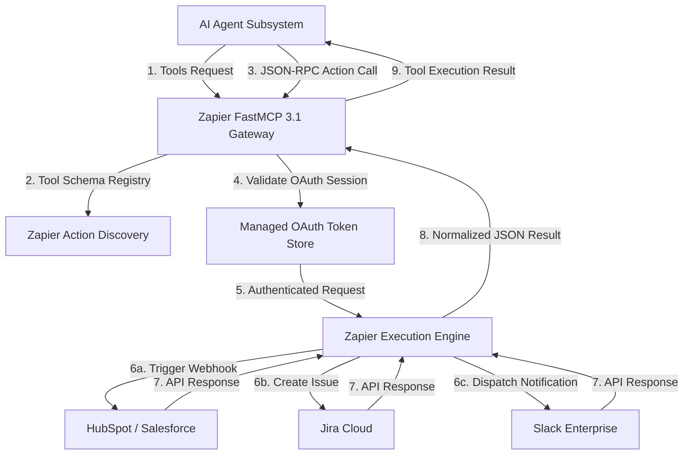

# Zapier

## What it is
Zapier is a leading enterprise-grade cloud automation platform that connects over 9,000 SaaS applications and native cloud microservices through automated event pipelines called "Zaps" and the **Zapier MCP Server**. In the 2027 enterprise AI ecosystem, Zapier functions as the primary interoperability bridge between frontier AI agents (such as Claude 5.6, GPT-5.5, Gemini 4.0 Ultra, and Llama 4 Maverick) and legacy or proprietary SaaS platforms lacking dedicated Model Context Protocol (MCP) implementations.

By translating high-level natural language tool calls into structured, authenticated REST/GraphQL API invocations across thousands of external services, Zapier eliminates the need for developers to maintain thousands of custom API integrations.

```
+-----------------------------------------------------------------------------------+
|                            Zapier Agent Architecture                              |
+-----------------------------------------------------------------------------------+
|                                                                                   |
|  +-----------------------+                    +--------------------------------+  |
|  |  Frontier AI Agent    |                    | Zapier MCP Server / Router     |  |
|  | (Claude / GPT / Llama)| -- FastMCP 3.1 --> |  - Dynamic Tool Discovery      |  |
|  +-----------------------+     (SSE/STDIO)    |  - OAuth Session Pool          |  |
|                                               |  - Payload Normalization       |  |
|                                               +---------------+----------------+  |
|                                                               |                   |
|                                                               v                   |
|                                               +--------------------------------+  |
|                                               | Enterprise Zapier Pipeline     |  |
|                                               |  - Webhook Listener / Paths    |  |
|                                               |  - Code by Zapier (JS/Python)  |  |
|                                               +---------------+----------------+  |
|                                                               |                   |
|                                       +-----------------------+-----------------------+
|                                       |                       |                       |
|                                       v                       v                       v
|                                +--------------+        +--------------+        +--------------+
|                                | Salesforce / |        | Slack /      |        | Jira /       |
|                                | HubSpot CRM  |        | Teams Comms  |        | GitHub Ops   |
|                                +--------------+        +--------------+        +--------------+
|                                                                                   |
+-----------------------------------------------------------------------------------+
```

## What problem it solves
In complex enterprise software environments, AI agents frequently encounter integration fragmentation. Connecting an autonomous agent to enterprise software (e.g., Salesforce, Jira, HubSpot, Zendesk, Marketo, QuickBooks) traditionally required creating custom API wrappers, managing complex OAuth token refreshing mechanisms, handling vendor-specific rate limits, and parsing inconsistent response payloads.

Zapier solves these problems by:
1. **Unifying API Access**: Exposing a single, standardized MCP interface for over 9,000 cloud services.
2. **Abstracting Authentication**: Handling multi-tenant OAuth2 flows, API key rotated secrets, and session refresh tokens automatically.
3. **Preventing API Drift**: Abstracting upstream API breaking changes so AI agent tool definitions remain stable over time.
4. **Providing Governance & Audit**: Supplying centralized logging, retry mechanisms, rate-limit queueing, and role-based access controls for agent-initiated webhooks.

## Where it fits in the stack
**Automation & Orchestration Layer**. Zapier operates as a managed cloud-native automation service. It acts as the cloud companion to self-hosted orchestration platforms such as [n8n](../../services/n8n.md). While n8n excels at self-hosted, privacy-isolated, and high-frequency data pipelines, Zapier dominates in scenarios requiring instant turn-key integration with long-tail SaaS platforms, zero-maintenance OAuth management, and enterprise cross-organization Zaps.

## System Architecture & Technical Deep-Dive



### 1. Zapier MCP Protocol Layer
The Zapier Model Context Protocol (MCP) server converts standard Zapier "Actions" into dynamically discoverable MCP tools. When an agent connects via standard input/output (STDIO) or Server-Sent Events (SSE), the MCP server exposes schema-validated function signatures matching the user's enabled Zaps and connected actions.

### 2. OAuth Token Manager & Credential Isolation
Zapier manages authentication tokens in encrypted vault clusters. When an agent requests an action (e.g., `zapier_slack_send_message`), the agent does not receive or handle sensitive raw API keys. Instead, the request is cryptographically signed and executed within Zapier's isolated execution sandbox using stored OAuth credentials.

### 3. Payload Normalization & Code Transforms
Data emitted from diverse SaaS platforms often includes vendor-specific schema quirks. Zapier Zaps can incorporate inline JavaScript or Python transform steps ("Code by Zapier") to filter, transform, and sanitize raw API responses before returning concise JSON structures to the AI agent, minimizing unnecessary context token overhead.

## Typical use cases
- **Agentic SaaS Operations**: Empowering autonomous agents to create Jira tickets, update CRM leads in HubSpot, and trigger PagerDuty alerts without hardcoded custom connectors.
- **Enterprise Notification Routing**: Automatically digesting technical audit alerts and routing multi-channel updates across Slack, Microsoft Teams, and email.
- **Cross-Organization Webhook Ingestion**: Ingesting webhooks from external vendors or IoT platforms (e.g., Home Assistant) and transforming data into enterprise analytics storage.
- **Automated Document Processing**: Linking document intake events from cloud storage (Google Drive, Box) to AI parsing models and downstream database updates.

## Strengths
- **Massive Tool Library**: Access to 9,000+ pre-built SaaS app connectors, representing the largest cloud integration catalog.
- **FastMCP 3.1 & Model Context Protocol Support**: Native support for modern agentic tool calls, SSE transports, and interactive tool schema discovery.
- **Managed OAuth Pipeline**: Handles complex authentication renewals and OAuth token refresh cycles behind the scenes.
- **High Availability & Scale**: Enterprise cloud infrastructure designed to automatically handle burst webhook spikes, retries, and rate limiting.
- **No-Code & Low-Code Flexibility**: Combines visual drag-and-drop pipeline construction with inline JavaScript/Python code steps.

## Limitations
- **Cloud Dependency**: SaaS-only architecture without self-hosted execution options; unsuitable for strictly air-gapped or on-premise data environments.
- **Task-Based Usage Pricing**: High-frequency webhook pipelines can become significantly more expensive than self-hosted alternatives like [n8n](../../services/n8n.md).
- **Execution Latency**: Cloud network hops add tens-to-hundreds of milliseconds compared to local direct API calls.
- **Complex Branching Restrictions**: Multi-path conditional branching requires higher tier subscription plans.

## When to use it
- When an AI agent needs instant access to niche or enterprise SaaS platforms without writing custom API client libraries.
- When development teams want to avoid maintaining custom OAuth integration code and secret rotation infrastructure.
- When non-technical stakeholders need to modify or audit post-processing automation steps.

## When not to use it
- When processing sensitive data subject to strict sovereignty or air-gapped on-premise policies (use [n8n](../../services/n8n.md)).
- When executing high-throughput, low-latency microsecond microservice calls.
- When costs must be strictly flat-rate regardless of execution volume.

## Getting started

To configure Zapier MCP for local or agentic workflows:

1. **Provision MCP Endpoint**: Access `mcp.zapier.com` and generate a dedicated MCP server configuration token.
2. **Authorize SaaS Connections**: Connect target SaaS applications (Slack, Jira, Salesforce) within your Zapier account settings.
3. **Select Exposed Actions**: Enable specific actions (e.g., `jira_create_issue`, `slack_post_message`) to expose to the agent context.
4. **Configure Local Agent Environment**:
   Add the Zapier server settings to your agent config (`claude_desktop_config.json` or FastMCP configuration file):

```json
{
  "mcpServers": {
    "zapier": {
      "command": "npx",
      "args": [
        "-y",
        "@zapier/mcp-server",
        "--api-key",
        "zap_live_secret_key_883921038"
      ]
    }
  }
}
```

## CLI examples

### Installing and Auth via Zapier SDK CLI
The Zapier CLI enables developer control over custom app builds and integrations:

```bash
# Install the Zapier SDK globally
npm install -g zapier-platform-cli

# Authenticate local terminal with Zapier deploy credentials
zapier login

# Validate existing integration build files
zapier validate
```

### Testing Integrations Locally
Run local unit and integration tests against Zapier custom app triggers:

```bash
# Execute local test suites for custom Zaps
zapier test

# Push a new integration version to draft status
zapier push
```

### Invoking Webhook Endpoints
Simulate enterprise webhook events hitting a Zapier catch-hook endpoint:

```bash
curl -X POST https://hooks.zapier.com/hooks/catch/991823/ab821x/ \
  -H "Content-Type: application/json" \
  -d '{
    "event_type": "security_audit_alert",
    "severity": "critical",
    "source_system": "fastmcp-gateway-01",
    "details": {
      "unauthorized_attempts": 3,
      "ip_address": "192.168.100.45"
    }
  }'
```

## API examples

### FastMCP 3.1 Python Gateway Integration
The following code demonstrates establishing a FastMCP 3.1 tool proxy server that wraps Zapier Webhooks and action calls with robust error handling and execution logging:

```python
import os
import requests
from typing import Dict, Any, Optional
from mcp.server.fastmcp import FastMCP
from pydantic import BaseModel, Field, HttpUrl

# Initialize FastMCP 3.1 server instance
mcp = FastMCP(
    name="Zapier Enterprise Bridge",
    instructions="Production MCP gateway for executing Zapier multi-app enterprise actions"
)

# Pydantic v2 validation models
class ZapierActionRequest(BaseModel):
    action_id: str = Field(..., description="Unique Zapier action identifier (e.g. slack_send_message)")
    target_webhook_url: HttpUrl = Field(..., description="Target Zapier catch webhook URL")
    payload: Dict[str, Any] = Field(..., description="Structured key-value payload required by the Zap")
    correlation_id: str = Field(..., description="Tracing identifier for agent sub-task tracking")

class ZapierActionResponse(BaseModel):
    success: bool
    status_code: int
    attempt_id: str = Field(..., alias="attemptId")
    message: str

@mcp.tool()

def dispatch_zapier_action(request_data: Dict[str, Any]) -> Dict[str, Any]:
    """
    Dispatches a validated action request to Zapier enterprise catch-hooks.
    """
    try:
        # Validate incoming dictionary against Pydantic schema
        req = ZapierActionRequest.model_validate(request_data)

        headers = {
            "Content-Type": "application/json",
            "X-Correlation-ID": req.correlation_id,
            "User-Agent": "FastMCP-Zapier-Bridge/3.1"
        }

        # Execute HTTP POST to Zapier Webhook Endpoint
        res = requests.post(
            str(req.target_webhook_url),
            json=req.payload,
            headers=headers,
            timeout=10.0
        )

        response_payload = {
            "success": res.status_code in (200, 201, 202),
            "status_code": res.status_code,
            "attemptId": res.headers.get("X-Zapier-Attempt-ID", f"zap_{req.correlation_id}"),
            "message": "Action dispatched successfully" if res.status_code < 400 else res.text
        }

        validated_res = ZapierActionResponse.model_validate(response_payload)
        return validated_res.model_dump(by_alias=True)

    except Exception as e:
        return {
            "success": False,
            "status_code": 500,
            "attemptId": "error",
            "message": f"Failed to dispatch Zapier action: {str(e)}"
        }

if __name__ == "__main__":
    # Start FastMCP server in STDIO mode
    mcp.run()
```

### Advanced Pydantic v2 Schema for Zapier Session & Webhook Management
This module implements full verification of Zapier OAuth session status, task execution records, and error handling using **Pydantic v2**.

```python
from datetime import datetime, timezone
from typing import List, Optional, Dict, Any
from pydantic import BaseModel, Field, HttpUrl, EmailStr, field_validator

class ZapierUserCredential(BaseModel):
    user_id: str = Field(..., description="Enterprise user identifier")
    email: EmailStr = Field(..., description="User corporate email address")
    account_tier: str = Field("enterprise", pattern="^(free|professional|team|enterprise)$")

class ZapierOAuthSession(BaseModel):
    session_id: str = Field(..., description="Active session ID for Zapier MCP connector")
    app_slug: str = Field(..., description="Slug of connected SaaS application (e.g. jira, slack)")
    is_active: bool = Field(True, description="State of OAuth refresh token validity")
    expires_at: datetime = Field(..., description="Timestamp of token expiration")
    scopes: List[str] = Field(default_factory=list, description="Granted OAuth permission scopes")

    @field_validator("expires_at")
    @classmethod
    def check_future_expiration(cls, value: datetime) -> datetime:
        if value <= datetime.now(timezone.utc):
            raise ValueError("OAuth session token has already expired")
        return value

class ZapierExecutionLog(BaseModel):
    zap_id: str = Field(..., description="Zap identifier string")
    execution_id: str = Field(..., description="Unique execution log ID")
    status: str = Field(..., pattern="^(success|filtered|halted|error)$")
    duration_ms: int = Field(..., ge=0, description="Duration of Zap execution in milliseconds")
    input_data: Dict[str, Any]
    output_data: Optional[Dict[str, Any]] = None
    error_details: Optional[str] = None

def verify_and_log_zap(session: ZapierOAuthSession, log: ZapierExecutionLog) -> bool:
    """Verifies that execution occurred within a valid session window."""
    if not session.is_active:
        print(f"Session {session.session_id} for app {session.app_slug} is inactive.")
        return False

    print(f"Verified Zap execution {log.execution_id} on app {session.app_slug}.")
    print(f"Status: {log.status} | Execution Time: {log.duration_ms}ms")
    return True

if __name__ == "__main__":
    test_session = ZapierOAuthSession(
        session_id="sess_88102394",
        app_slug="salesforce",
        is_active=True,
        expires_at=datetime(2027, 12, 31, 23, 59, 59, tzinfo=timezone.utc),
        scopes=["crm:read", "crm:write"]
    )

    test_log = ZapierExecutionLog(
        zap_id="zap_991823",
        execution_id="exec_771203",
        status="success",
        duration_ms=245,
        input_data={"lead_name": "Jane Doe", "company": "Acme Corp"},
        output_data={"salesforce_id": "003800000034AAA"}
    )

    is_valid = verify_and_log_zap(test_session, test_log)
    print(f"Validation result: {is_valid}")
```

### JavaScript Data Normalization Step ("Code by Zapier")
Below is an example JS code snippet executed within a Zap step to normalize incoming lead payloads before storing in a CRM:

```javascript
// Clean and structure incoming webhook data for CRM integration
const rawEmail = inputData.email || "";
const rawPhone = inputData.phone || "";

// Normalize Email to lowercase
const cleanEmail = rawEmail.trim().toLowerCase();

// Strip non-numeric characters from phone
const cleanPhone = rawPhone.replace(/\D/g, "");

// Format timestamp to ISO string
const processedTimestamp = new Date().toISOString();

return {
  normalizedEmail: cleanEmail,
  formattedPhone: cleanPhone.length === 10 ? `+1${cleanPhone}` : cleanPhone,
  processedAt: processedTimestamp,
  source: "Zapier Agent Bridge"
};
```

## Related tools / concepts
- [n8n](../../services/n8n.md) — Self-hosted, privacy-focused open-source workflow engine.
- [Make](make.md) — Visual workflow automation with advanced array manipulation.
- [Pipedream](pipedream.md) — Developer-first integration platform built on Node.js/Python code steps.
- [Model Context Protocol (MCP)](mcp.md) — Open standard for AI agent tool integration.
- [FastMCP](https://github.com/jlowin/fastmcp) — Python framework for building MCP tools.
- [Home Assistant](../../services/home-assistant.md) — Local open-source home automation hub.
- [Claude 5.6](../providers/anthropic.md) — Anthropic frontier AI reasoning model.
- [GPT-5.5](../ai_knowledge/openai.md) — OpenAI frontier model suite.

## Sources / references
- [Official Zapier Platform](https://zapier.com/)
- [Zapier Model Context Protocol Dashboard](https://mcp.zapier.com/)
- [Zapier Developer Documentation](https://docs.zapier.com/)
- [Zapier CLI Manual & GitHub Repository](https://github.com/zapier/zapier-platform/tree/main/packages/cli)
- [Zapier Engineering Architecture Blog](https://zapier.com/engineering)

---
## Contribution Metadata
- Last reviewed: 2027-01-07
- Confidence: high
