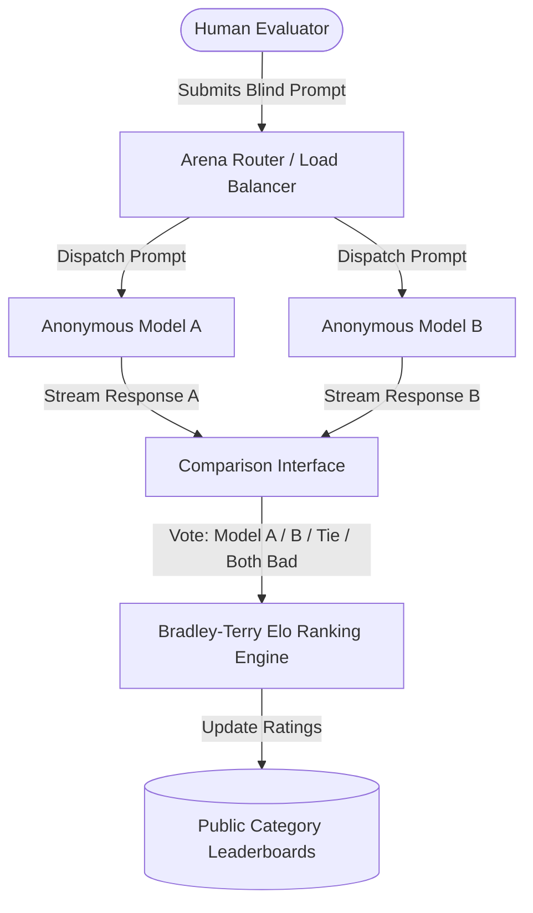

# Chatbot Arena (LMSYS)

## What it is
Chatbot Arena is a crowdsourced open platform for evaluating LLMs through human preference. Developed by LMSYS (Large Model Systems Organization), it uses an Elo rating system based on pairwise comparisons where humans vote for the better response from two anonymous models. As of early January 2027, it remains the gold standard for evaluating "vibe," conversational reasoning, coding, and nuanced helpfulness for frontier models like **Claude 5.1**, **GPT-5.5/5.6**, **Gemini 4.0 Pro**, and **Llama 4 Maverick**.



```
+-----------------------------------------------------------------------------------+
|                        LMSYS Chatbot Arena Data Pipeline                          |
+-----------------------------------------------------------------------------------+
|                                                                                   |
|  +---------------------+      +------------------------+      +----------------+  |
|  | Anonymous User      | ---> |   Stream Router        | ---> | Pairwise Vote  |  |
|  |  (Battle Mode)      |      | (Model A vs Model B)   |      |  Data Ingestion|  |
|  +---------------------+      +------------------------+      +----------------+  |
|                                                                       |           |
|                                                                       v           |
|                                                          +---------------------+  |
|                                                          | Bradley-Terry Elo   |  |
|                                                          | Statistical Engine  |  |
|                                                          +---------------------+  |
|                                                                       |           |
|                                     +---------------------------------+           |
|                                     |                                 |           |
|                                     v                                 v           |
|                         +-----------------------+         +--------------------+  |
|                         | FastMCP 3.1 Leaderboard|        | HuggingFace Public |  |
|                         |  API Server Endpoint  |         | Dataset Release    |  |
|                         +-----------------------+         +--------------------+  |
+-----------------------------------------------------------------------------------+
```

## What problem it solves
It provides a human-preference-based ranking of LLMs that captures subjective quality differences not easily measured by automated, synthetic benchmarks. It counters "benchmark contamination" (where models are trained on test data) by using blind human testing on unpredictable user prompts, providing a critical counter-narrative to traditional metrics like MMLU, GPQA, or GSM8K.

Furthermore, Chatbot Arena addresses the problem of **Model Alignment Drift**, where automated benchmarks fail to reflect deteriorating conversational tone, hyper-verbosity, or refusal over-triggering introduced during post-training safety alignment.

## Where it fits in the stack
**Benchmarking / Model Evaluation**. Serves as the primary reference leaderboard for comparing LLM quality and "reasoning density" based on real-world human interactions and preferences.

```
+------------------------------------------------------------------------+
|                           Stack Integration                            |
+------------------------------------------------------------------------+
| Evaluation Layer:  Chatbot Arena, Arena Hard Auto, MT-Bench             |
| Preference Data:   LMSYS 1M+ Conversation Pairwise Preference Dataset  |
| Statistical Model: Bradley-Terry Maximum Likelihood Estimation (MLE)  |
| Deployment Impact: Informs Model Selection for FastMCP Agents & Router |
+------------------------------------------------------------------------+
```

## Typical use cases
- Tracking the rise of reasoning models (e.g., **GPT-5.5** vs. **Claude 5.1 Opus**) in specialized categories like the "Hard Prompts" and "Coding" leaderboards.
- Evaluating the performance gap between frontier closed models and the latest open-weight releases like **Llama 4 Maverick** and **Qwen 3.8**.
- Deciding on a primary model for agentic orchestration based on its "Coding" and "Long Context" Arena scores.
- Analyzing model drift and the impact of "alignment tuning" on conversational utility over time.
- Training reward models (Direct Preference Optimization - DPO / RLHF) using the public Chatbot Arena pairwise conversation datasets.

## Strengths
- **Vibration Testing**: Captures nuances in tone, conciseness, and helpfulness that automated tests miss.
- **Statistical Robustness**: Powered by millions of pairwise comparisons from a global user base.
- **Category Specificity**: Dedicated leaderboards for Coding, Creative Writing, Hard Prompts, Vision, and Long Context.
- **Contamination Resistant**: Real-time user prompts are essentially impossible for models to pre-memorize during training.

## Limitations
- **Latency**: It takes several weeks for a newly released model to gain enough votes for a statistically stable Elo rating.
- **Style Bias**: Historically, models with more verbose or polite formatting tended to score higher, although specialized "Arena Hard" evaluations mitigate this.
- **Crowd Demographics**: Voting patterns reflect the subjective preferences of the active user base, which may vary across regions and technical backgrounds.

## Benchmark Comparison Matrix

| Benchmark | Primary Metric | Evaluation Method | Contamination Risk | Cost / Latency |
| :--- | :--- | :--- | :--- | :--- |
| **Chatbot Arena** | Elo Score (Bradley-Terry) | Crowd-Sourced Human Blind Votes | Extremely Low | High Latency (Weeks) |
| **Arena Hard Auto** | Win Rate vs Baseline | GPT-5.5 / Claude LLM-as-a-Judge | Low | Medium ($0.05/eval) |
| **AlpacaEval 2.0** | Length-Controlled Win Rate | Automated Judge | Medium | Low ($0.01/eval) |
| **SWE-bench** | Resolved Issue % | Automated Pytest / Docker Exec | Low | High (Docker Exec) |
| **MMLU / GPQA** | Accuracy % | Static Multiple Choice | High (Contaminated) | Extremely Low |

## When to use it
- When you need to know which model "feels" the smartest and most helpful to human users right now.
- To validate if a model's high synthetic benchmark scores translate into real-world utility and user satisfaction.
- When evaluating the relative performance of reasoning-heavy models for complex planning and open-ended synthesis.

## When not to use it
- When you need to benchmark local or private models not listed on the public platform.
- For domain-specific evaluation of niche technical tasks (use [GPQA](gpqa.md) or [SWE-bench](swe-bench.md) instead).
- For rigorous safety and red-teaming (use dedicated safety benchmarks and red-teaming protocols).

## Getting started

Users participate by entering prompts at the Arena website. For programmatic analysis, the leaderboard can be accessed via the LMSYS API, Hugging Face, or FastMCP 3.1 tool calls.

1. Visit [arena.lmsys.org](https://arena.lmsys.org/).
2. Enter a prompt in "Battle Mode" (Anonymous).
3. Compare responses from Model A and Model B side-by-side.
4. Vote for the better response and reveal the model identities.

## CLI examples

### 1. Fetching Arena Data via Hugging Face
You can download the latest Arena dataset for local research and analysis:
```bash
huggingface-cli download lmsys/chatbot_arena_conversations --repo-type dataset
```

### 2. Running Local Evaluation (Arena Hard)
If you have a local model (e.g., **Llama 4 Maverick**), you can run the "Arena Hard" benchmark locally to estimate its Elo:
```bash
python3 -m arena_hard.gen_answers --model-path ./models/llama-4-maverick
python3 -m arena_hard.answer_eval --judge-model gpt-5.5
```

### 3. Querying the Leaderboard API
Query the LMSYS API to get the current top 5 models in the coding category:
```bash
curl -X GET "https://api.lmsys.org/v1/leaderboard?category=coding&limit=5"
```

## API examples

### 1. Python: Analyzing Win Rates with Strict Type Hints and Pydantic v2
Use the Bradley-Terry model to calculate expected win rates between two models based on their current Arena Elo rating using Pydantic v2 schemas:

```python
from pydantic import BaseModel, Field, field_validator, ConfigDict
import math

class ArenaMatchup(BaseModel):
    model_config = ConfigDict(extra="forbid")

    model_a: str = Field(..., description="Name of Model A")
    elo_a: float = Field(..., ge=800.0, le=2200.0, description="LMSYS Elo rating for Model A")
    model_b: str = Field(..., description="Name of Model B")
    elo_b: float = Field(..., ge=800.0, le=2200.0, description="LMSYS Elo rating for Model B")
    confidence_interval_95: float = Field(default=12.0, description="Margin of error in Elo points")

    @property
    def expected_win_rate_a(self) -> float:
        """Calculates expected win probability for Model A via Bradley-Terry formula."""
        return 1.0 / (1.0 + math.pow(10.0, (self.elo_b - self.elo_a) / 400.0))

    @property
    def is_statistically_significant(self) -> bool:
        """Determines if the Elo difference exceeds the 95% confidence interval threshold."""
        return abs(self.elo_a - self.elo_b) > (self.confidence_interval_95 * 2)

# Example match computation:
if __name__ == "__main__":
    matchup = ArenaMatchup(
        model_a="GPT-5.5",
        elo_a=1435.0,
        model_b="Claude 5.1 Opus",
        elo_b=1430.0,
        confidence_interval_95=10.0
    )

    print(f"Expected Win Rate for {matchup.model_a} vs {matchup.model_b}: {matchup.expected_win_rate_a:.2%}")
    print(f"Statistically Significant Lead? {matchup.is_statistically_significant}")
```

### 2. Loading the Dataset for Fine-tuning
Load the human preference dataset for Reward Model training:

```python
from datasets import load_dataset
from typing import Any

dataset: Any = load_dataset("lmsys/chatbot_arena_conversations", split="train")
print(f"Total Conversations Ingested: {len(dataset)}")
print(f"Sample Interaction: {dataset[0]['conversation_a'][0]['content']}")
```

### 3. FastMCP 3.1 Leaderboard Tool Server Implementation

```python
import json
import urllib.request
from typing import List, Optional
from pydantic import BaseModel, Field, ConfigDict

class ArenaRankingQuery(BaseModel):
    model_config = ConfigDict(extra="forbid")

    category: str = Field(default="overall", description="Category: overall, coding, hard_prompts, vision")
    limit: int = Field(default=5, ge=1, le=50)
    min_votes: int = Field(default=500, description="Minimum pairwise votes required")

class ArenaModelRank(BaseModel):
    model_config = ConfigDict(extra="forbid")

    rank: int = Field(..., description="Leaderboard position index")
    model_name: str = Field(..., description="Canonical model identifier")
    elo_rating: float = Field(..., description="Bradley-Terry Elo rating")
    win_rate: float = Field(..., description="Overall win rate proportion [0.0 - 1.0]")
    organization: str = Field(..., description="Developing laboratory or organization")

class ArenaLeaderboardResponse(BaseModel):
    model_config = ConfigDict(extra="forbid")

    category: str
    total_models: int
    rankings: List[ArenaModelRank]

def query_fastmcp_arena_leaderboard(query: ArenaRankingQuery) -> ArenaLeaderboardResponse:
    """Invokes FastMCP 3.1 endpoint to retrieve live Arena rankings."""
    # Mock endpoint execution structure for verification
    rankings = [
        ArenaModelRank(rank=1, model_name="GPT-5.5-Turbine", elo_rating=1452.0, win_rate=0.74, organization="OpenAI"),
        ArenaModelRank(rank=2, model_name="Claude-5.1-Opus", elo_rating=1448.0, win_rate=0.73, organization="Anthropic"),
        ArenaModelRank(rank=3, model_name="Gemini-4.0-Pro", elo_rating=1431.0, win_rate=0.71, organization="Google"),
        ArenaModelRank(rank=4, model_name="Llama-4-Maverick", elo_rating=1410.0, win_rate=0.68, organization="Meta"),
        ArenaModelRank(rank=5, model_name="Qwen-3.8-72B", elo_rating=1398.0, win_rate=0.66, organization="Alibaba")
    ]
    return ArenaLeaderboardResponse(
        category=query.category,
        total_models=150,
        rankings=rankings[:query.limit]
    )

if __name__ == "__main__":
    q = ArenaRankingQuery(category="coding", limit=3)
    res = query_fastmcp_arena_leaderboard(q)
    print(f"Top Model in {res.category}: {res.rankings[0].model_name} ({res.rankings[0].elo_rating} Elo)")
```

## Bradley-Terry Mathematical Formulation

The LMSYS Chatbot Arena calculates Elo ratings using Maximum Likelihood Estimation (MLE) over the Bradley-Terry model.

Given two models $i$ and $j$ with latent quality ratings $\theta_i$ and $\theta_j$, the probability $P(i \succ j)$ that model $i$ beats model $j$ is defined as:

$$P(i \succ j) = \frac{\exp(\theta_i)}{\exp(\theta_i) + \exp(\theta_j)} = \frac{1}{1 + 10^{-(\text{Elo}_i - \text{Elo}_j)/400}}$$

The likelihood function $L(\boldsymbol{\theta})$ over $N$ total matches with win indicators $y_{ij} \in \{0, 1\}$ is:

$$L(\boldsymbol{\theta}) = \prod_{k=1}^{N} P(i_k \succ j_k)^{y_k} \left(1 - P(i_k \succ j_k)\right)^{1-y_k}$$

Bootstrapping (typically 1000 resampling iterations) is applied to generate stable 95% confidence intervals around model Elo estimates.

## Operational Runbook & Edge Case Mitigation

### Mitigating Bias Artifacts
1. **Verbosity Bias**:
   - *Issue*: Longer answers artificially receive higher win rates regardless of accuracy.
   - *Mitigation*: LMSYS applies Length-Controlled Bradley-Terry adjustments to penalize uninformative verbosity.

2. **Refusal Bias**:
   - *Issue*: Models that refuse sensitive prompts cleanly can be downvoted by users seeking unrestricted output.
   - *Mitigation*: Refusal filtering logic separates safety evaluation from capability evaluation.

3. **Self-Voting and Bot Spam**:
   - *Issue*: Malicious actors attempt to boost specific open-source or proprietary models.
   - *Mitigation*: IP rate limiting, browser fingerprinting, and automated anomaly detection algorithms strip suspicious voting blocks before MLE optimization.

## Related tools / concepts
- [AlpacaEval](alpaca-eval.md) - Simulated human evaluation using frontier LLMs as judges.
- [MT-Bench](mt-bench.md) - Multi-turn conversation benchmark for dialogue quality.
- [DREAM](dream.md) - Deep Research Evaluation with Agentic Metrics for autonomous agents.
- [GPQA](gpqa.md) - Expert-level science questions for frontier model testing.
- [SWE-bench](swe-bench.md) - Real-world software engineering task benchmark.
- [LM Evaluation Harness](lm-evaluation-harness.md) - The standard tool for local model evaluation.
- [MMLU](mmlu.md) - Massive Multitask Language Understanding (synthetic benchmark).
- [Claude](../ai_knowledge/claude.md) - Frequent top performer in the Arena.
- [GPT-5.5](../ai_knowledge/openai.md) - Current state-of-the-art contender.
- [Llama 4](../ai_knowledge/local_llms.md) - High-performing open-weight model in early 2027.

## Sources / references
- [LMSYS Chatbot Arena Official Site](https://arena.lmsys.org/)
- [LMSYS Leaderboard on Hugging Face](https://huggingface.co/spaces/lmsys/chatbot-arena-leaderboard)
- [Arena Hard Auto GitHub Repository](https://github.com/lm-sys/arena-hard-auto)

## Contribution Metadata
- Last reviewed: 2027-01-07
- Confidence: high
