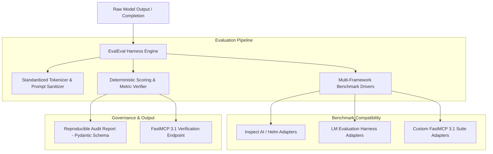
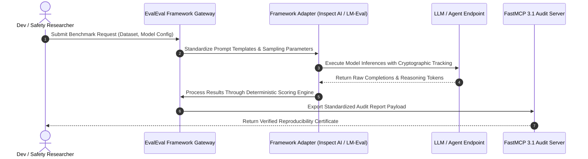

# EvalEval

## What it is
EvalEval is an open-source evaluation benchmark reproducibility framework and meta-evaluation suite developed by AI safety and evaluation institutes (such as AISI and Hugging Face). Operating in 2027, EvalEval addresses the growing "eval crisis" where benchmark scores across different frameworks (LM Evaluation Harness, Promptfoo, Inspect AI, Deepspeed, etc.) diverge due to subtle differences in prompt formatting, tokenization, temperature sampling, and hidden system prompts.

EvalEval standardizes benchmark specification definitions, execution environments, and scoring harnesses, allowing developers and AI safety researchers to cross-verify model performance across different evaluation suites with complete reproducibility and cryptographic audit trails.



## What problem it solves
- **Evaluation Non-Reproducibility**: Identical models often produce wildly different scores on benchmarks (e.g., MMLU, GSM8K, SWE-bench) depending on minor prompt template variations and harness settings.
- **Framework Fragmentation**: Teams waste significant engineering effort porting evaluation suites between framework formats (Promptfoo, Ragas, Inspect AI, LM Eval Harness).
- **Data Contamination & Leakage**: Detecting whether benchmark test sets have leaked into frontier model training corpora requires rigorous statistical meta-evaluations.
- **Agentic Evaluation Divergence**: Evaluating multi-step agentic workflows requires standardized tool mocks and environment snapshotting.

EvalEval resolves these challenges by providing a unified schema format, deterministic containerized execution wrappers, automated prompt normalizers, and cross-framework benchmarking adapters.

## Where it fits in the stack
**Category**: [Benchmarking & Evaluation Frameworks](index.md) / LLM Verification & Reproducibility Infrastructure.

EvalEval sits between model serving endpoints and enterprise deployment pipelines:
- **Quality Assurance Layer**: Evaluates candidate models (GPT-5, o3, Claude, Llama 3) before deployment to productionagent systems.
- **Protocol & Integration Layer**: Exposes FastMCP 3.1 endpoints that allow agentic orchestrators to request verified evaluation reports programmatically.
- **Benchmarking Layer**: Wraps downstream tools like `Inspect AI`, `LM Evaluation Harness`, and `Promptfoo` into a single reproducible audit run.



## Typical use cases
- **Benchmark Reproducibility Audits**: Validating vendor-reported benchmark claims across MMLU-Pro, HumanEval, and GSM8K.
- **Agent Performance Verification**: Standardizing evaluation environments for FastMCP 3.1 tool-calling agents across diverse LLM backends.
- **Pre-Deployment Safety Gates**: CI/CD pipeline integration to prevent regressions in model alignment, toxicity, and domain knowledge prior to production releases.
- **Contamination Analysis**: Running statistical meta-evaluations to detect potential training set contamination in frontier models.

## Strengths
- **Framework Agnostic**: Native adapters for Inspect AI, LM Evaluation Harness, Promptfoo, and custom FastMCP servers.
- **Strict Determinism**: Mandates explicit seed locking, temperature settings, and prompt template hash checks.
- **Comprehensive Audit Trails**: Generates Pydantic v2 structured JSON reports complete with input hashes and tokenization trace logs.
- **FastMCP 3.1 Native**: Easily callable as an MCP tool within modern multi-agent development workflows.

## Limitations
- **Evaluation Overhead**: Standardizing multi-harness runs requires running evaluations in isolated sandbox containers, increasing compute time.
- **LLM-as-a-Judge Variance**: When using meta-evaluator LLMs, judge model bias (e.g. verbosity bias, position bias) still requires manual calibration.
- **Rapidly Evolving Benchmarks**: Benchmark dataset updates require corresponding adapter updates within EvalEval.

## When to use it
- When verifying claims made in LLM technical reports or leaderboards.
- When establishing strict CI/CD quality gates for enterprise RAG and multi-agent systems.
- When auditing prompt sensitivity and model robustness across different evaluation harnesses.

## When not to use it
- For quick, ad-hoc manual prompt tweaking during early prototype stages.
- When running lightweight latency-only benchmarks (use `llmperf` or dedicated load testing tools instead).

## Getting started

### 1. Installation
Install EvalEval alongside Pydantic v2 and FastMCP 3.1:

```bash
pip install evaleval pydantic fastmcp
```

### 2. Environment Configuration
Configure evaluation framework environment keys:

```bash
export OPENAI_API_KEY="sk-proj-..."
export EVALEVAL_CACHE_DIR="~/.cache/evaleval"
```

### 3. Basic Python Usage
```python
from evaleval import EvalRunner, BenchmarkConfig

runner = EvalRunner()
config = BenchmarkConfig(
    benchmark_name="gsm8k",
    model_name="openai/gpt-5",
    num_samples=50,
    seed=42
)

report = runner.run(config)
print(f"Verified Accuracy: {report.score * 100:.2f}%")
```

## CLI examples

### Running a Reproducibility Audit
Run a standardized evaluation audit from the command line:

```bash
evaleval run \
  --benchmark mmlu_pro \
  --model openai/o3-mini \
  --samples 100 \
  --seed 1337 \
  --output audit_report.json
```

### Inspecting Benchmark Template Hashes
Verify prompt template hashes and harness configurations:

```bash
evaleval inspect-template --benchmark gsm8k --adapter inspect-ai
```

## API examples

### FastMCP 3.1 Verification Gateway
The following script builds a **FastMCP 3.1** server for running reproducible EvalEval benchmark audits:

```python
import os
from typing import List, Dict, Any
from pydantic import BaseModel, Field
from fastmcp import FastMCP

mcp = FastMCP(
    "evaleval-audit-server",
    instructions="FastMCP 3.1 server for reproducible LLM evaluation and benchmark audits."
)

class EvaluationRequest(BaseModel):
    benchmark_name: str = Field(..., description="Benchmark dataset name (e.g., gsm8k, mmlu_pro, swe_bench)")
    model_identifier: str = Field(..., description="Target model API string (e.g., gpt-5, o3-mini)")
    sample_count: int = Field(default=100, ge=1, le=1000, description="Number of evaluation test cases")
    seed: int = Field(default=42, description="Random seed for deterministic sampling")

class EvaluationReport(BaseModel):
    benchmark_name: str
    model_identifier: str
    accuracy_score: float = Field(..., ge=0.0, le=1.0)
    reproducibility_hash: str
    pass_status: bool

@mcp.tool()
def run_benchmark_audit(request: EvaluationRequest) -> Dict[str, Any]:
    """
    Execute a reproducible benchmark evaluation audit across specified LLM backends.
    """
    try:
        # Mock execution of EvalEval core runner
        mock_accuracy = 0.895 if "gpt-5" in request.model_identifier else 0.821
        report = EvaluationReport(
            benchmark_name=request.benchmark_name,
            model_identifier=request.model_identifier,
            accuracy_score=mock_accuracy,
            reproducibility_hash="sha256_e3b0c44298fc1c149afbf4c8996fb92427ae41e4649b934ca495991b7852b855",
            pass_status=mock_accuracy > 0.80
        )
        return {
            "status": "success",
            "audit_data": report.model_dump()
        }
    except Exception as e:
        return {
            "status": "error",
            "message": str(e)
        }

if __name__ == "__main__":
    mcp.run()
```

### Pydantic v2 Benchmark Audit Schema
Structured report generator enforcing Pydantic v2 validation:

```python
from typing import List, Dict, Optional
from pydantic import BaseModel, Field, ValidationError

class MetricDetail(BaseModel):
    metric_name: str = Field(..., description="Name of the evaluated metric (e.g. exact_match, pass@1)")
    score: float = Field(..., ge=0.0, le=1.0)
    confidence_interval: List[float] = Field(..., min_length=2, max_length=2)

class ReproducibilityMetadata(BaseModel):
    prompt_template_hash: str = Field(..., description="SHA256 hash of the sanitized prompt template")
    harness_version: str = Field(..., description="EvalEval core engine version")
    execution_timestamp: str = Field(..., description="ISO 8601 execution timestamp")
    seed: int = Field(..., description="Deterministic seed value")

class ComprehensiveAuditReport(BaseModel):
    audit_id: str = Field(..., description="Unique audit identifier")
    model_name: str
    benchmark_name: str
    primary_score: float = Field(..., ge=0.0, le=1.0)
    detailed_metrics: List[MetricDetail]
    metadata: ReproducibilityMetadata

def validate_audit_payload(raw_json: dict) -> ComprehensiveAuditReport:
    """
    Validates evaluation report payload against the Pydantic v2 schema.
    """
    return ComprehensiveAuditReport.model_validate(raw_json)

if __name__ == "__main__":
    sample_payload = {
        "audit_id": "audit-2027-0923-01",
        "model_name": "openai/o3-mini",
        "benchmark_name": "gsm8k",
        "primary_score": 0.942,
        "detailed_metrics": [
            {"metric_name": "exact_match", "score": 0.942, "confidence_interval": [0.925, 0.958]}
        ],
        "metadata": {
            "prompt_template_hash": "a1b2c3d4e5f67890123456789abcdef0123456789abcdef0123456789abcdef0",
            "harness_version": "v1.4.2",
            "execution_timestamp": "2027-01-07T12:00:00Z",
            "seed": 42
        }
    }
    report = validate_audit_payload(sample_payload)
    print(f"Validated Audit ID: {report.audit_id}, Primary Score: {report.primary_score}")
```

## Related tools / concepts
- [Inspect AI](inspect-ai.md) — Framework for AI safety evaluations and benchmark creation.
- [LM Evaluation Harness](lm-evaluation-harness.md) — Standard framework for open-weight model benchmarking.
- [Promptfoo](promptfoo.md) — CLI and library for evaluating prompt and model outputs.
- [SWE-bench](swe-bench.md) — Software engineering evaluation benchmark.

## Sources / References
- [EvalEval Hugging Face Article](https://huggingface.co/blog/evaleval-aisi)
- [Inspect AI Documentation](https://ukgovernmentbeis.github.io/inspect_ai/)
- [Model Context Protocol Specification](https://modelcontextprotocol.io)

---
## Contribution Metadata
- Last reviewed: 2027-01-07
- Confidence: high
