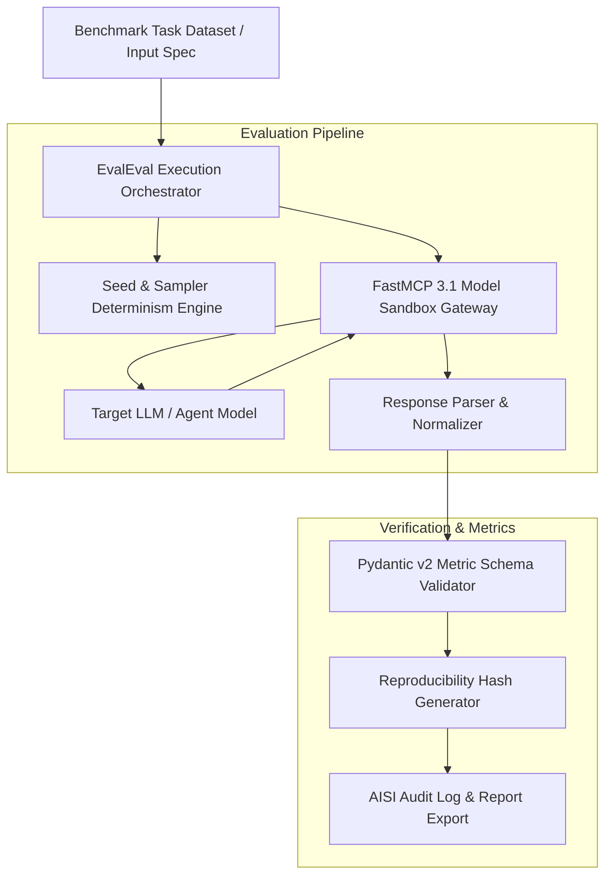
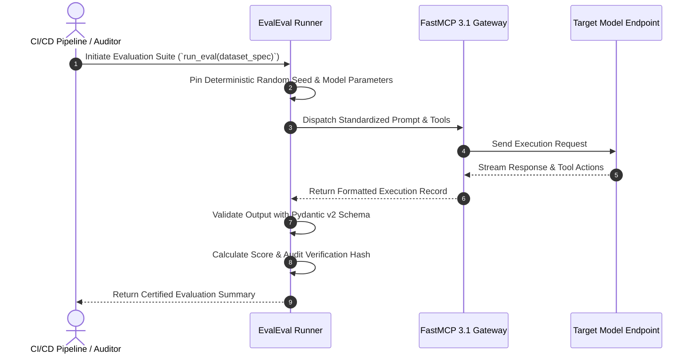

# EvalEval (AISI Evaluation Framework)

## What it is
**EvalEval** is an open-source evaluation protocol and framework developed by the AI Safety Institute (AISI) and Hugging Face. Designed for frontier AI evaluation, EvalEval ensures that benchmark results across large language models (LLMs), vision-language models (VLMs), and agentic systems are fully reproducible, standardized, and audit-ready across heterogeneous execution environments.

EvalEval standardizes prompt templates, sampling hyperparameters, seed management, model response parsing, and metric aggregation. By integrating seamlessly with FastMCP 3.1 tool gateways and Pydantic v2 validation models, EvalEval enables continuous safety, capabilities, and compliance testing within automated KnowledgeOps pipelines.



## What problem it solves
Evaluating frontier AI models presents major engineering and scientific challenges:
- **Benchmark Variance & Non-Reproducibility**: Minor differences in system prompts, stop sequences, temperature, or library versions lead to non-comparable benchmark scores across labs.
- **Flaky Response Parsing**: LLMs output subtle formatting variations that cause naive evaluation parsers to fail or record false negatives.
- **Agentic Evaluation Flakiness**: Evaluating multi-step tool-using agents requires strict environment state restoration and deterministic tool execution tracking.
- **Audit & Governance Compliance**: Enterprise and governmental AI safety guidelines require tamper-evident, deterministic evaluation trace logs.

EvalEval resolves these challenges by locking down token sampling seeds, validating prompt formatting via Pydantic v2 schemas, standardizing model-to-tool interactions via FastMCP 3.1 interfaces, and calculating canonical verification hashes for every benchmark run.

## Where it fits in the stack
**Category**: [Benchmarking](../benchmarking/index.md) / Reproducible Evaluation Infrastructure.

EvalEval sits between model provider endpoints (OpenAI, Anthropic, Hugging Face TGI, vLLM) and CI/CD quality gates:
- **Evaluation Engine Layer**: Drives batch execution of standardized test suites (e.g. MMLU, SWE-bench, GAIA, custom enterprise safety suits).
- **Contract & Validation Layer**: Uses Pydantic v2 schemas to ensure input task definitions and output metrics conform strictly to expected structures.
- **Interface Protocol Layer**: Uses FastMCP 3.1 to inspect model tool calling and agent action traces during multi-turn evaluations.



## Typical use cases
- **Frontier Model Safety & Capabilities Auditing**: Running official AISI safety evaluations to ensure compliance before model deployment.
- **Enterprise Regression Testing**: Evaluating custom fine-tuned or prompt-engineered LLM agents against private enterprise datasets.
- **Leaderboard Verification**: Re-evaluating open-source model claims on Hugging Face using reproducible, deterministic setups.
- **Multi-Agent Protocol Testing**: Verifying agentic tool call correctness and multi-step reasoning capabilities via FastMCP 3.1 interfaces.

## Strengths
- **Rigorous Reproducibility**: Guaranteed deterministic execution via explicit seed controls, standardized token decoding parameters, and content hashing.
- **Seamless FastMCP 3.1 Integration**: Evaluates agent tool use natively across standardized MCP protocol endpoints.
- **Pydantic v2 Schema Enforcement**: Native validation of benchmark specifications, prompt variables, and calculated metric reports.
- **Open-Source & Multi-Provider**: Broad ecosystem support across local models (vLLM, llama.cpp) and cloud APIs (OpenAI, Anthropic, Hugging Face).

## Limitations
- **Evaluation Overhead**: Strict hashing, parsing validation, and detailed trace logging increase evaluation runtime compared to lightweight scripts.
- **Sampling Determinism Limits**: Certain hardware configurations or cloud API providers (e.g., GPU non-determinism at floating-point level) can still introduce slight variance.

## When to use it
- When benchmark scores must be certified, reproducible, and verifiable by external auditors or governance bodies.
- When building automated CI/CD regression testing for enterprise LLM agents and FastMCP tool servers.
- When comparing model performances across multiple cloud providers and local inference backends under identical evaluation conditions.

## When not to use it
- For quick, informal ad-hoc prompt testing during initial prototyping where strict evaluation determinism is not needed.
- For simple static code linting tasks where dedicated SAST tools are more appropriate.

## Getting started

### 1. Installation
Install the EvalEval framework alongside FastMCP 3.1 and Pydantic v2:

```bash
pip install evaleval fastmcp pydantic
```

### 2. Running a Standard Benchmark
Execute a reproducible benchmark using the CLI:

```bash
evaleval run \
  --dataset hf-internal/gsm8k-test \
  --model openai/gpt-5 \
  --seed 42 \
  --output-dir ./eval_results
```

## CLI examples

### Inspecting Evaluation Results & Verification Hash
Verify the integrity of a completed evaluation run:

```bash
# Verify evaluation hash and schema integrity
evaleval verify ./eval_results/gsm8k_gpt5_seed42.json
```

### Comparing Evaluation Runs
Generate a delta report comparing two evaluation runs:

```bash
evaleval diff ./eval_results/run_v1.json ./eval_results/run_v2.json
```

## API examples

### FastMCP 3.1 Evaluation Gateway Server
The following Python server exposes an **EvalEval** scoring service over FastMCP 3.1:

```python
import os
from typing import List, Dict, Any
from pydantic import BaseModel, Field
from fastmcp import FastMCP

mcp = FastMCP(
    "evaleval-mcp-server",
    instructions="FastMCP 3.1 server for executing reproducible EvalEval benchmark evaluations."
)

class EvalTaskSpec(BaseModel):
    task_id: str = Field(..., description="Unique benchmark task identifier")
    prompt: str = Field(..., description="Standardized prompt template")
    expected_answer: str = Field(..., description="Canonical ground-truth answer")
    temperature: float = Field(default=0.0, ge=0.0, le=1.0)
    seed: int = Field(default=42, description="Random seed for deterministic decoding")

class EvalResultSpec(BaseModel):
    task_id: str = Field(..., description="Task identifier")
    model_output: str = Field(..., description="Raw model response")
    is_correct: bool = Field(..., description="Boolean indicating match with expected answer")
    reproducibility_hash: str = Field(..., description="SHA-256 evaluation run checksum")

@mcp.tool()
def evaluate_task(task: EvalTaskSpec, model_output: str) -> Dict[str, Any]:
    """
    Evaluates model output against canonical ground truth and generates an audit hash.
    """
    import hashlib

    normalized_actual = model_output.strip().lower()
    normalized_expected = task.expected_answer.strip().lower()
    is_correct = (normalized_actual == normalized_expected)

    # Compute reproducibility checksum
    hash_input = f"{task.task_id}:{task.seed}:{task.prompt}:{model_output}".encode("utf-8")
    run_hash = hashlib.sha256(hash_input).hexdigest()

    result = EvalResultSpec(
        task_id=task.task_id,
        model_output=model_output,
        is_correct=is_correct,
        reproducibility_hash=run_hash
    )

    return {
        "status": "success",
        "evaluation": result.model_dump()
    }

if __name__ == "__main__":
    mcp.run()
```

### Pydantic v2 Benchmark Schema Definition
Enforce strict validation for benchmark evaluation datasets:

```python
from typing import List, Optional
from pydantic import BaseModel, Field, HttpUrl

class MetricThreshold(BaseModel):
    metric_name: str = Field(..., description="Name of evaluation metric (e.g. accuracy, exact_match)")
    min_score: float = Field(..., ge=0.0, le=1.0, description="Minimum acceptable benchmark threshold")

class BenchmarkSuiteConfig(BaseModel):
    suite_id: str = Field(..., description="Evaluation suite name")
    version: str = Field(..., description="Semantic version of evaluation dataset")
    dataset_url: HttpUrl = Field(..., description="Canonical dataset source URL")
    thresholds: List[MetricThreshold] = Field(default_factory=list)
    require_deterministic_seed: bool = Field(default=True)

if __name__ == "__main__":
    config = BenchmarkSuiteConfig(
        suite_id="aisi-safety-v1",
        version="1.2.0",
        dataset_url="https://huggingface.co/datasets/aisi/safety-eval",
        thresholds=[MetricThreshold(metric_name="exact_match", min_score=0.92)]
    )
    print("Benchmark Configuration Validated:")
    print(config.model_dump_json(indent=2))
```

## Model Matrix & Benchmark Support

| Suite / Benchmark | Target Capabilities | Sampling Strategy | Evaluation Metric |
| :--- | :--- | :--- | :--- |
| **GSM8K / MathEval** | Mathematical & step-by-step reasoning | Greedy decoding (temp=0, seed=42) | Exact Match / Symbolic Equivalence |
| **SWE-bench / AgentEval** | Automated software engineering & refactoring | Multi-turn FastMCP 3.1 tool execution | Unit Test Pass Rate |
| **MMLU-Pro / KnowledgeEval** | Multi-discipline factual reasoning | Few-shot prompt templates | Normalized Accuracy |
| **AISI Safety Suite** | Guardrail compliance & refusal boundary testing | Multi-sampler constraint suite | Refusal & Safety Score |

## Troubleshooting & Common Failure Modes

| Issue / Failure Mode | Root Cause | Resolution Strategy |
| :--- | :--- | :--- |
| **Evaluation Hash Mismatch** | Changing prompt whitespace, library versions, or seed settings. | Lock dependencies in `requirements.txt` and ensure deterministic prompt formatting. |
| **Response Parsing Failures** | Target model returning conversational filler surrounding the answer. | Enable strict output JSON schemas or configure regex normalizers in EvalEval parsing rules. |
| **API Provider Non-Determinism** | Cloud LLM endpoints varying outputs despite temperature=0. | Use dedicated inference instances (vLLM / TGI) or pin specific model API snapshot versions. |

## Related tools / concepts
- [LM Evaluation Harness](../benchmarking/lm-evaluation-harness.md) — Standard open-source benchmark execution framework.
- [Deepeval](../benchmarking/deepeval.md) — Unit testing framework for LLM applications.
- [EvalPlus](../benchmarking/evalplus.md) — Rigorous code synthesis evaluation benchmark.
- [FastMCP 3.1 Protocol Specification](../automation_orchestration/mcp.md) — Standardized tool execution framework.

## Sources / References
- [Hugging Face EvalEval Announcement](https://huggingface.co/blog/evaleval-aisi)
- [AI Safety Institute Evaluation Frameworks](https://www.aisi.gov.uk)
- [EvalEval GitHub Repository](https://github.com/huggingface/evaleval)

---
## Contribution Metadata
- Last reviewed: 2027-01-07
- Confidence: high
