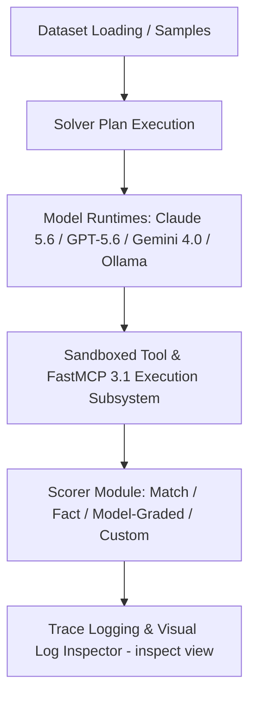

# Inspect AI

## What it is
**Inspect AI** (`inspect-ai`) is an open-source framework for large language model evaluation and agent capability auditing developed by the **UK AI Safety Institute (UK AISI)** and Meridian Labs. Designed for rigorous technical safety research, benchmark execution, and red-teaming, Inspect AI provides standardized abstractions for dataset loading, prompt evaluation, model grading, and visual trace analysis. As of early 2027, Inspect AI features native integration with the **FastMCP 3.1 Task Protocol**, enabling automated sandboxed tool execution and async background evaluation monitoring.

## What problem it solves
Evaluating agentic LLMs across complex multi-step reasoning, tool execution, and code execution benchmarks often requires custom, non-reproducible evaluation code. Inspect AI solves this by standardizing evaluation primitives (Datasets, Solvers, Scorers, and Logs) into a Python-native framework with built-in parallelism, trace logging, and interactive visual debugging utilities.

## Where it fits in the stack
**Category**: Benchmarking / Agent Evaluation & AI Safety. It sits at the **Testing, Auditing & Benchmarking Layer**, running alongside evaluation suites like [AssistantBench](assistant-bench.md), [SWE-bench](swe-bench.md), and [Promptfoo](promptfoo.md).



## Typical use cases
- **Frontier Model Evaluation**: Running standardized capability benchmarks across Claude 5.6, GPT-5.6, Gemini 4.0 Pro, DeepSeek-V4, and Llama 4.
- **Agentic Workflow Red-Teaming**: Auditing multi-agent planning loops, tool call safety, and sandboxed code execution environments.
- **Benchmark Authoring**: Writing modular, reproducible evaluation datasets and custom domain-specific scoring metrics.
- **Visual Log Inspection**: Interactively stepping through multi-turn agent logs via the web-based `inspect view` interface.
- **FastMCP 3.1 Tool Verification**: Auditing agent task completion across structured FastMCP tool calls with background progress streams.

## Strengths
- **UK AISI Safety Standard**: Developed and maintained by leading AI safety researchers, ensuring high rigor and standardized safety audits.
- **Model Agnostic Runtimes**: Supports OpenAI, Anthropic, Google Gemini, Ollama, vLLM, and Hugging Face models via unified interfaces.
- **Rich Visual Diagnostics**: Includes `inspect view`, a web UI for analyzing token traces, tool calls, and failure modes.
- **Native Async & Parallel Execution**: High-throughput parallel model evaluations with automatic rate-limit handling and progress tracking.

## Limitations
- **Python Ecosystem Dependent**: Evaluation scripts and custom solvers must be written in Python.
- **Compute Heavy**: Full benchmark execution across large models requires significant API budget or GPU VRAM.
- **Fast-Moving API**: Framework updates closely follow safety research requirements, requiring ongoing dependency tracking.

## When to use it
- When conducting formal evaluations or red-teaming audits of AI agents and LLM tools.
- When orchestrating benchmarks like AssistantBench, SWE-bench, or custom internal test suites.
- When requiring step-by-step visual trace logs of agent reasoning and tool calls.
- When validating FastMCP 3.1 task protocol execution across complex multi-step agents.

## When not to use it
- For lightweight prompt testing during simple web app development (use [Promptfoo](promptfoo.md) or [Google AI Studio](../providers/google-ai-studio.md)).
- For continuous real-time production APM monitoring (use [Helicone](../process_understanding/helicone.md) or [Cloudflare Agent Tracing](../process_understanding/cloudflare-agent-tracing.md)).

## Getting started

### Installation
Install Inspect AI and optional eval suites via pip:

```bash
pip install inspect-ai inspect-evals pydantic fastmcp
```

### Quickstart minimal working example
Create a simple evaluation file `simple_eval.py` and execute it:

```python
from inspect_ai import eval, Task, task
from inspect_ai.dataset import Sample
from inspect_ai.scorer import match
from inspect_ai.solver import generate

@task
def hello_world_eval() -> Task:
    dataset = [
        Sample(input="What is the capital of France?", target="Paris"),
    ]
    return Task(
        dataset=dataset,
        plan=[generate()],
        scorer=match()
    )

if __name__ == "__main__":
    eval(hello_world_eval(), model="openai/gpt-4o")
```

### Hello-world example
Create a simple evaluation file `simple_eval.py`:

```python
from inspect_ai import Task, task
from inspect_ai.dataset import Sample
from inspect_ai.scorer import match
from inspect_ai.solver import generate

@task
def hello_world_eval() -> Task:
    dataset = [
        Sample(input="What is the capital of France?", target="Paris"),
        Sample(input="What is 2 + 2?", target="4"),
    ]
    return Task(
        dataset=dataset,
        plan=[generate()],
        scorer=match()
    )
```

Run the evaluation using the CLI:

```bash
inspect eval simple_eval.py --model openai/gpt-4o
```

## FastMCP 3.1 Integration Pattern

Inspect AI integrates with FastMCP 3.1 server tools to run agent evaluations inside isolated tool execution environments. The example below demonstrates wrapping an Inspect AI task runner inside a FastMCP tool server:

```python
from fastmcp import FastMCP
from inspect_ai import eval, Task, task
from inspect_ai.dataset import Sample
from inspect_ai.scorer import match
from inspect_ai.solver import generate
from pydantic import BaseModel, Field

mcp = FastMCP("Inspect AI Eval Runner Server")

class TaskEvalRequest(BaseModel):
    task_id: str = Field(..., description="Unique identifier for evaluation run")
    model_name: str = Field("openai/gpt-4o", description="Target LLM model provider/name")
    question: str = Field(..., description="Evaluation prompt")
    expected_answer: str = Field(..., description="Target answer string")

@task
def dynamic_inspect_task(question: str, target: str) -> Task:
    dataset = [Sample(input=question, target=target)]
    return Task(dataset=dataset, plan=[generate()], scorer=match())

@mcp.tool()
def run_inspect_eval(req: TaskEvalRequest) -> dict:
    """Executes an Inspect AI evaluation task dynamically via FastMCP 3.1."""
    eval_task = dynamic_inspect_task(req.question, req.expected_answer)
    logs = eval(eval_task, model=req.model_name)

    if logs:
        log = logs[0]
        return {
            "task_id": req.task_id,
            "status": log.status,
            "total_samples": len(log.samples or []),
            "model": req.model_name
        }
    return {"task_id": req.task_id, "status": "error", "message": "No logs produced"}

if __name__ == "__main__":
    mcp.run()
```

## CLI examples

### 1. Evaluate with Limit and Concurrency
Run an evaluation suite limiting to 10 samples and specifying max parallel connections:

```bash
inspect eval simple_eval.py --model anthropic/claude-3-5-sonnet-20241022 --limit 10 --max-connections 5
```

### 2. Multi-Model Parallel Evaluation
Evaluate across multiple model providers simultaneously:

```bash
inspect eval simple_eval.py --model openai/gpt-4o,anthropic/claude-3-5-sonnet-20241022
```

### 3. Launch Log Viewer UI
Start the web-based interactive evaluation log viewer:

```bash
inspect view
```

## API examples

### Python Evaluation Execution and Result Processing
Run evaluations programmatically within Python scripts and process log outputs with Pydantic v2:

```python
from inspect_ai import eval, Task, task
from inspect_ai.dataset import Sample
from inspect_ai.scorer import model_graded_fact
from inspect_ai.solver import generate
from pydantic import BaseModel, Field, field_validator

class EvalSummary(BaseModel):
    task_name: str = Field(..., description="Name of evaluation task")
    total_samples: int = Field(..., ge=0)
    status: str = Field(...)
    model_provider: str = Field(..., description="Evaluated model string")

    @field_validator('status')
    @classmethod
    def validate_status(cls, v: str) -> str:
        valid_statuses = {"success", "cancelled", "error"}
        if v.lower() not in valid_statuses:
            raise ValueError(f"Status must be one of {valid_statuses}")
        return v.lower()

@task
def math_qa() -> Task:
    return Task(
        dataset=[Sample(input="What is 15 + 27?", target="42")],
        plan=[generate()],
        scorer=model_graded_fact()
    )

if __name__ == "__main__":
    # Execute evaluation programmatically
    results = eval(math_qa(), model="openai/gpt-4o")

    if results:
        log = results[0]
        summary = EvalSummary(
            task_name=log.eval.task,
            total_samples=len(log.samples or []),
            status=log.status,
            model_provider=log.eval.model
        )
        print(f"Task '{summary.task_name}' completed with status: {summary.status}")
```

## Related tools / concepts
- [AssistantBench](assistant-bench.md) — Real-world web navigation evaluation suite.
- [Promptfoo](promptfoo.md) — CLI evaluation tool for LLM prompts and security.
- [HELM](helm.md) — Holistic Evaluation of Language Models.
- [OpenAI](../ai_knowledge/openai.md) — Model provider interface.
- [Anthropic](../providers/anthropic.md) — Model provider interface.
- [Model Context Protocol (MCP)](../automation_orchestration/mcp.md) — Standardized tool and task protocol.

## Sources / references
- [Inspect AI Official Documentation](https://inspect.ai-safety-institute.org.uk/)
- [Inspect AI GitHub Repository](https://github.com/UKGovernmentBEIS/inspect_ai)
- [UK AI Safety Institute Research](https://www.gov.uk/government/organisations/ai-safety-institute)

## Contribution Metadata
- Last reviewed: 2027-01-07
- Confidence: high
