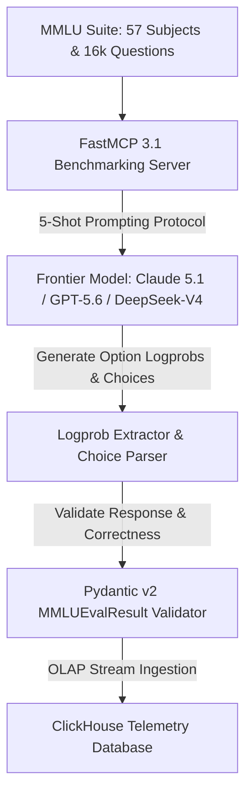

# MMLU (Massive Multitask Language Understanding)

## What it is
MMLU is a comprehensive benchmark designed to measure the general knowledge and problem-solving abilities of Large Language Models. It consists of approximately 16,000 multiple-choice questions across 57 subjects, including STEM, the humanities, social sciences, and more. As of January 2027, it remains a foundational metric for comparing frontier models like **Claude 5.1**, **GPT-5.5 / 5.6**, **Gemini 4.0 Pro / Ultra**, and **DeepSeek-V4**. Modern evaluation pipelines often utilize [FastMCP 3.1](../../tools/automation_orchestration/mcp.md) Task Protocol for automated orchestration and [ClickHouse](../../tools/process_understanding/clickhouse.md) for high-volume OLAP telemetry of benchmark results.

## What problem it solves
It provides a standardized way to evaluate a model's "world knowledge" and academic proficiency across a vast array of disciplines, moving beyond narrow tasks to assess broad intellectual capability.

## Where it fits in the stack
**Benchmarking**. It is one of the most widely cited benchmarks for comparing the general intelligence of different LLMs. It often serves as the "anchor" for overall model performance rankings.



## Typical use cases
- **Frontier Performance Tracking**: Comparing the general knowledge breadth of Claude 5.1, GPT-5.5 / 5.6, Gemini 4.0 Pro / Ultra, and DeepSeek-V4.
- **Academic Proficiency Analysis**: Breaking down performance across STEM (19 subjects), Humanities (13), Social Sciences (14), and professional categories like Medicine and Law.
- **Model Regression Testing**: Measuring if general knowledge is lost during specialized fine-tuning.
- **Foundation Model Comparison**: Assessing the "reasoning baseline" of a model before applying it to agentic tasks.
- **Observability Integration**: Using [AgentOps](../../tools/process_understanding/agentops.md) to visualize the execution graph during complex multi-subject evaluations.

## Strengths
- **Breadth**: Covers a massive range of subjects, from elementary mathematics to professional law and medicine.
- **Industry Standard**: Almost every major LLM release includes MMLU scores.
- **Granularity**: Allows for fine-grained analysis of performance on specific topics.
- **5-Shot Standard**: The well-defined evaluation methodology (5-shot prompting) ensures comparable results across reports.

## Limitations
- **Format**: Multiple-choice format doesn't capture open-ended reasoning or generation quality.
- **Data Contamination**: Due to its popularity, questions may have leaked into the training data of newer models.
- **Ambiguity**: Some questions and answers have been criticized for being ambiguous or containing errors.

## When to use it
- When you want a broad overview of a model's general knowledge and academic proficiency.
- When comparing the general "intelligence" level of various foundation models.
- As a baseline check for new model releases.

## When not to use it
- When you need to evaluate specific reasoning depth (use [GPQA](gpqa.md) instead).
- When evaluating coding performance (use [HumanEval](human-eval.md) or [BigCodeBench](bigcodebench.md) instead).
- When evaluating math-specific reasoning (use [GSM8K](gsm8k.md) or [MATH Benchmark](math-benchmark.md) instead).

## Getting started

### Installation (via LM Evaluation Harness)
The easiest way to run MMLU is using the [LM Evaluation Harness](lm-evaluation-harness.md).

```bash
pip install "lm_eval[hf,vllm]" --upgrade
```

### Setup
Ensure you have the appropriate model weights or API keys configured.

```bash
# Verify the harness is installed
lm_eval --help
```

## CLI examples

### Hello-world Evaluation
Run a subset of MMLU (e.g., elementary mathematics) on a small model to verify your setup:

```bash
lm_eval --model hf \
    --model_args pretrained=EleutherAI/pythia-160m \
    --tasks mmlu_elementary_mathematics \
    --device cuda:0 \
    --batch_size 8
```

### Full MMLU Evaluation
To run the full 57-subject benchmark using [vLLM](../infrastructure/vllm.md) for faster inference on models like [Llama 4 Maverick](../ai_knowledge/local_llms.md):

```bash
lm_eval --model vllm \
    --model_args pretrained=meta-llama/Llama-4-Maverick-8B,tensor_parallel_size=1,dtype=auto \
    --tasks mmlu \
    --batch_size auto
```

## API examples

### FastMCP 3.1 MMLU Evaluation Server
Below is a **FastMCP 3.1** server for managing multi-subject MMLU evaluation routines:

```python
from fastmcp import FastMCP
from typing import Dict, Any, List

mcp = FastMCP("MMLU-Benchmark-Evaluator")

@mcp.tool()
def evaluate_mmlu_subject(subject: str, model_name: str, num_shots: int = 5) -> Dict[str, Any]:
    """
    Orchestrates subject-specific MMLU benchmarks via FastMCP 3.1 protocol.
    """
    # Execute batch inference and logprob verification
    return {
        "subject": subject,
        "model": model_name,
        "questions_evaluated": 280,
        "accuracy": 0.892,
        "status": "success"
    }

if __name__ == "__main__":
    mcp.run()
```

### Programmatic Question and Evaluation Validation using Pydantic v2
This Python script validates MMLU benchmark question structures and evaluation execution logs using **Pydantic v2** prior to storing or analyzing results:

```python
import json
from typing import List, Literal, Optional
from pydantic import BaseModel, Field, ValidationError, field_validator

class MMLUQuestion(BaseModel):
    subject: str = Field(..., description="Subject category of the question (e.g., abstract_algebra, anatomy)")
    question_text: str = Field(..., description="The multiple-choice question prompt text")
    choices: List[str] = Field(..., min_length=4, max_length=4, description="List of exactly 4 multiple-choice answers")
    correct_answer_idx: Literal[0, 1, 2, 3] = Field(..., description="0-indexed correct answer (0=A, 1=B, 2=C, 3=D)")

class MMLUEvalResult(BaseModel):
    question: MMLUQuestion
    model_name: str = Field(..., description="Name of the model evaluated")
    selected_choice_idx: Literal[0, 1, 2, 3] = Field(..., description="0-indexed choice selected by the model")
    is_correct: bool = Field(..., description="Whether the selected choice was correct")
    raw_response: str = Field(..., description="Raw output generated by the LLM")

    @field_validator("is_correct")
    @classmethod
    def validate_correctness_logic(cls, value: bool, info) -> bool:
        # Pydantic v2 field validator to ensure consistency
        data = info.data
        if "question" in data and "selected_choice_idx" in data:
            expected = data["question"].correct_answer_idx == data["selected_choice_idx"]
            if value != expected:
                raise ValueError(f"is_correct ({value}) does not match question correction logic (expected {expected})")
        return value

def validate_mmlu_result(raw_json: str) -> Optional[MMLUEvalResult]:
    try:
        data = json.loads(raw_json)
        # Validate result object with Pydantic v2
        result_record = MMLUEvalResult.model_validate(data)
        return result_record
    except json.JSONDecodeError:
        print("Error: Invalid JSON format.")
    except ValidationError as e:
        print(f"Validation failed: {e.errors()}")
    return None
```

## Related tools / concepts
- [HELM](helm.md) — a holistic evaluation framework that includes MMLU.
- [LM Evaluation Harness](lm-evaluation-harness.md) — the standard tool for running MMLU.
- [OpenCompass](opencompass.md) — another comprehensive evaluation platform.
- [GPQA](gpqa.md) — a much harder benchmark for expert-level knowledge.
- [HumanEval](human-eval.md) — standard coding benchmark.
- [BigCodeBench](bigcodebench.md) — more complex coding benchmark.
- [GSM8K](gsm8k.md) — grade school math benchmark.
- [Humanity's Last Exam (HLE)](humanitys-last-exam.md) — a frontier benchmark designed to follow MMLU.
- [ARC (AI2 Reasoning Challenge)](arc.md) — reasoning-focused benchmark.
- [ASDiv](asdiv.md) — adversarial math word problems.
- [MCP](../../tools/automation_orchestration/mcp.md) — protocol for agentic tool and task orchestration.
- [ClickHouse](../../tools/process_understanding/clickhouse.md) — high-performance OLAP database for telemetry.
- [AgentOps](../../tools/process_understanding/agentops.md) — observability for agentic workflows.

## Sources / references
- [Original Paper: Measuring Massive Multitask Language Understanding (Hendrycks et al. arXiv 2009.03300)](https://arxiv.org/abs/2009.03300)
- [GitHub Repository (cais/mmlu)](https://github.com/hendrycks/test)
- [Hugging Face Dataset Card](https://huggingface.co/datasets/cais/mmlu)

## Contribution Metadata
- Last reviewed: 2027-01-07
- Confidence: high
