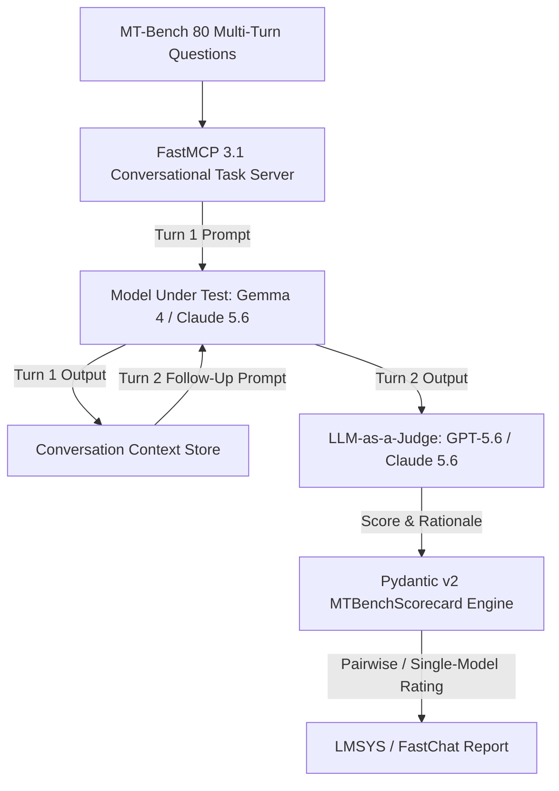

# MT-Bench

## What it is
MT-Bench is a benchmark designed to evaluate the multi-turn conversational capabilities of Large Language Models (LLMs). It consists of 80 high-quality, multi-turn questions across eight categories: writing, roleplay, extraction, reasoning, math, coding, knowledge I (STEM), and knowledge II (humanities/social science). In the early 2027 landscape, it is integrated with the [FastMCP 3.1](../automation_orchestration/mcp.md) protocol to automate complex, stateful evaluation loops across frontier models like [Gemma 4](../ai_knowledge/local_llms.md), Claude 5.6, and GPT-5.6.

## What problem it solves
Many traditional benchmarks only evaluate single-turn responses, failing to capture a model's ability to maintain context, follow instructions across multiple exchanges, and handle the dynamic nature of real-world conversations. MT-Bench specifically tests the "follow-up" capability of models, addressing the "goldfish memory" problem and verifying instruction adherence in deep, multi-turn dialogues.

## Where it fits in the stack
**Benchmarking**. It is a core component of the LMSYS FastChat evaluation framework and is often used alongside the [FastMCP 3.1](../automation_orchestration/mcp.md) Task Protocol to benchmark autonomous agent persistence and context management.



## Typical use cases
- **Conversational AI Evaluation**: Assessing how well a chatbot handles follow-up questions and maintains context.
- **Model Comparison**: Ranking chat-tuned models (e.g., [Gemma 4](../ai_knowledge/local_llms.md) vs. Claude 5.6) based on their ability to handle multi-step instructions.
- **LLM-as-a-Judge Validation**: MT-Bench uses strong models as judges to provide automated, scalable scoring, now enhanced by the [FastMCP 3.1](../automation_orchestration/mcp.md) standardized task representations.
- **Agentic Workflow Stress-Testing**: Verifying that agents can maintain state across long-running tasks.

## Strengths
- **Multi-turn Focus**: Specifically designed to test conversation depth and instruction adherence over multiple turns.
- **Diverse Categories**: Covers a wide range of tasks from coding to roleplay, ensuring a balanced evaluation.
- **Strong Human Correlation**: Scoring on MT-Bench shows high agreement (over 80%) with human expert preferences.
- **FastMCP 3.1 Integration**: Modern implementations leverage FastMCP 3.1 for standardized, reproducible evaluation runs.

## Limitations
- **Judge Bias**: If using an LLM as a judge, it may inherit the biases of that judge (e.g., preference for verbosity or certain styles).
- **Small Sample Size**: With only 80 questions, the results can have higher variance than larger benchmarks like [AlpacaEval](alpaca-eval.md).
- **Static Nature**: Like all fixed benchmarks, it risks data contamination if questions are leaked into training sets.

## When to use it
- When evaluating chat-tuned models where multi-turn interaction is a primary use case.
- When you need an automated conversational benchmark that aligns closely with human preference.
- For internal testing of "System 2" reasoning models in conversational contexts.

## When not to use it
- For evaluating base (non-chat-tuned) models that are not designed for dialogue.
- When you only need to measure narrow technical capabilities like raw code execution (use [BigCodeBench](bigcodebench.md) instead).
- When high-stakes safety evaluation is the primary goal (use [SharpAI Security Benchmark](sharp-ai.md)).

## Getting started

### 1. Installation
MT-Bench is part of the `fastchat` repository.

```bash
git clone https://github.com/lm-sys/FastChat.git
cd FastChat
pip install -e ".[model_worker,llm_judge]"
```

### 2. Generating Model Answers
Generate answers for the 80 questions using your local model or API.

```bash
# Example using a local Gemma 4 model via FastMCP 3.1
python fastchat/llm_judge/gen_model_answer.py \
    --model-path google/gemma-3-27b-it \
    --model-id gemma-3-27b-it
```

### 3. Grading with LLM-as-a-Judge
Use a strong model (like GPT-5.6) to grade the responses.

```bash
export OPENAI_API_KEY="your_api_key"
python fastchat/llm_judge/gen_judgment.py \
    --model-list gemma-3-27b-it \
    --parallel 4
```

## CLI examples
The FastChat evaluation suite provides several CLI tools for MT-Bench.

```bash
# Show results summary
python fastchat/llm_judge/show_result.py

# Generate answers for a specific category
python fastchat/llm_judge/gen_model_answer.py --category reasoning --model-id my-custom-model

# Run judgments in parallel to save time
python fastchat/llm_judge/gen_judgment.py --model-list model1 model2 --parallel 8

# Export judgments to a JSON file (standardized for FastMCP 3.1)
python fastchat/llm_judge/gen_judgment.py --model-list model1 --output-file results.json
```

## API examples

### FastMCP 3.1 MT-Bench Judgment Tool
Below is a **FastMCP 3.1** server for managing conversational judgment tasks:

```python
from fastmcp import FastMCP
from typing import Dict, Any, List

mcp = FastMCP("MT-Bench-Judge-Server")

@mcp.tool()
def grade_multi_turn_conversation(question_id: int, model_id: str, turn_responses: List[str]) -> Dict[str, Any]:
    """
    FastMCP 3.1 tool for orchestrating multi-turn LLM-as-a-judge evaluation.
    """
    # Evaluate Turn 1 and Turn 2 responses with referee prompt
    return {
        "question_id": question_id,
        "model_id": model_id,
        "turn_1_score": 9.5,
        "turn_2_score": 9.0,
        "overall_score": 9.25,
        "judge_model": "gpt-5.6"
    }

if __name__ == "__main__":
    mcp.run()
```

### Programmatic Validation via Pydantic v2
While MT-Bench is primarily a CLI-driven benchmark, it can be integrated into Python pipelines. This early 2027 example showcases robust **Pydantic v2** model schemas to structure, parse, and validate multi-turn prompt payloads and scores.

```python
from pydantic import BaseModel, Field, condecimal
from typing import List, Dict, Optional
from datetime import datetime

# Turn definition
class QuestionTurn(BaseModel):
    turn_index: int = Field(..., ge=1, le=2)
    prompt: str = Field(..., min_length=10)

class MTBenchQuestion(BaseModel):
    question_id: int
    category: str
    turns: List[QuestionTurn]

# Judge feedback schema
class TurnGrade(BaseModel):
    turn_index: int
    score: condecimal(ge=1, le=10) = Field(..., description="Conversational rating [1-10]")
    rational: str

class MTBenchScorecard(BaseModel):
    question_id: int
    evaluated_at: datetime = Field(default_factory=datetime.utcnow)
    judge_name: str = Field(default="gpt-5.6")
    grades: List[TurnGrade]
    overall_score: float

# Function to parse and validate judge outputs using Pydantic v2
def validate_scorecard(payload: dict) -> MTBenchScorecard:
    scorecard = MTBenchScorecard.model_validate(payload)
    print(f"Validated Scorecard for Question {scorecard.question_id}")
    print(f"Overall Score awarded by {scorecard.judge_name}: {scorecard.overall_score}/10")
    return scorecard

# Mock data from a Claude 5.6 evaluation of Qwen 3.6 VL turns
mock_judge_payload = {
    "question_id": 42,
    "judge_name": "claude-5.6-sonnet",
    "grades": [
        {"turn_index": 1, "score": 9.5, "rational": "Excellent code execution explanation with precise syntax."},
        {"turn_index": 2, "score": 9.0, "rational": "Maintained state exceptionally and handled the edge-case elegantly."}
    ],
    "overall_score": 9.25
}

validated_card = validate_scorecard(mock_judge_payload)
```

## Related tools / concepts
- [Chatbot Arena](chatbot-arena.md) - The primary leaderboard for human preferences.
- [AlpacaEval](alpaca-eval.md) - Simulator-based evaluator for instruction following.
- [GSM8K](gsm8k.md) - Basic math reasoning benchmark.
- [MATH Benchmark](math-benchmark.md) - Advanced mathematical competition problems.
- [HumanEval](human-eval.md) - Core coding benchmark.
- [LM Evaluation Harness](lm-evaluation-harness.md) - Standard framework for single-turn benchmarks.
- [OpenCompass](opencompass.md) - Comprehensive evaluation platform.
- [BigCodeBench](bigcodebench.md) - Realistic code generation benchmark.
- [SharpAI Security Benchmark](sharp-ai.md) - Evaluation suite for security robustness and red-teaming.

## Sources / references
- [FastChat GitHub (LLM Judge)](https://github.com/lm-sys/FastChat/tree/main/fastchat/llm_judge)
- [MT-Bench Paper: "Judging LLM-as-a-judge" (Zheng et al., 2023)](https://arxiv.org/abs/2306.05685)
- [LMSYS Leaderboard](https://arena.lmsys.org/leaderboard)
- [Gemma 4 Technical Report](https://storage.googleapis.com/deepmind-media/gemma/gemma-3-report.pdf)

## Contribution Metadata
- Last reviewed: 2027-01-07
- Confidence: high
