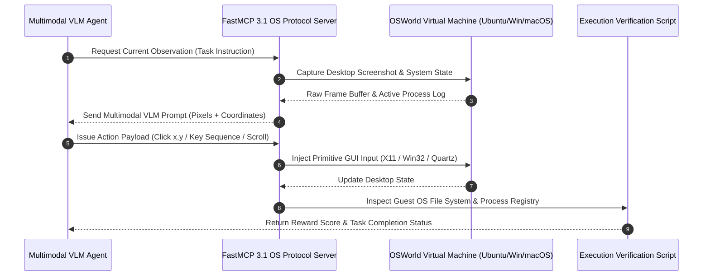

# OSWorld

## What it is
OSWorld is a scalable, real computer environment designed for benchmarking multimodal agents. It supports unified task setup, execution-based evaluation, and interactive reinforcement learning across desktop operating systems such as Ubuntu, Windows, and macOS. As of early 2027, OSWorld is the premier environment for testing 'Computer Use', FastMCP 3.1 OS-level tool execution, and desktop control capabilities of frontier models.

## Architecture & Computer Use Agent Loop



## What problem it solves
Most agent benchmarks are constrained to isolated web sandboxes or mock APIs. OSWorld provides an interactive "OS-in-a-box" environment for assessing open-ended computer tasks that involve arbitrary desktop applications, native file I/O, terminal commands, and workflows spanning multiple programs. It evaluates an agent's ability to act as a 'Digital Twin' or fully autonomous desktop assistant, handling real-world OS noise and FastMCP 3.1 Task Protocol multi-step execution.

## Where it fits in the stack
**Eval / Environment**. It provides benchmarking tasks and virtualized runtime infrastructure (Docker, VirtualBox, VMware) required for executing and validating agentic computer control actions. It is a cornerstone of the evaluation layer for testing visual grounding and GUI navigation in VLMs.

## Typical use cases
- **Desktop Agent Evaluation**: Benchmarking autonomous agents interacting with native OS elements (e.g., system menus, file managers, desktop configurations).
- **Multi-App GUI Workflows**: Testing an agent's ability to orchestrate tasks across applications, such as copying data from a spreadsheet, querying a web browser, and generating a local markdown report.
- **Multimodal Visual Grounding**: Evaluating the ability of Vision-Language Models (VLMs) to translate pixel-level GUI screenshots into accurate click, drag, type, and scroll coordinates.
- **Computer Use Research**: Training and assessing agents (e.g., Claude 5.6, GPT-5.6, Gemini 4.0 Ultra, DeepSeek-V4, Gemma 4, Qwen 3.6 VL) on raw keyboard and mouse control without custom tool-specific APIs.

## Strengths
- **Real OS Deployments**: Integrates with actual operating systems (Ubuntu, Windows, macOS) hosted inside secure virtual machines or containers.
- **Rich Task Suite**: Over 369 diverse tasks modeled after real-world professional workflows.
- **Execution-based State Verification**: Verifies success by running background scripts that inspect the final state of the file system or application registries rather than simple string-matching on logs.
- **Comprehensive GUI Event Tracking**: Captures drag-and-drop, right-clicks, keyboard shortcuts, and complex mouse maneuvers.

## Limitations
- **Heavy Infrastructure Demands**: Running full virtualization software (VMware/VirtualBox) requires significant local CPU, RAM, and disk resources.
- **High Setup Friction**: Initial VM image installation, snapshot configuration, and display server configuration can be complex.
- **Inference Latency**: Incorporating multimodal screenshots into the agent loop can create execution and billing overhead due to massive visual token usage.

## When to use it
- When developing or testing "Computer Use" agents or visual operating system controllers.
- When evaluating VLM grounding and coordinate-mapping capabilities on raw desktop interfaces.
- For academic or enterprise research in multimodal agentic planning, navigation, and self-correction.

## When not to use it
- For lightweight, non-visual agent benchmarking (use [GAIA](./gaia.md) or [AssistantBench](./assistant-bench.md) instead).
- If your development environment lacks the hardware resources to support multiple parallel VM instances.
- For testing pure text-based reasoning models that do not have visual processing (VLM) inputs.

## Getting started
OSWorld is run by cloning its repository, configuring the hypervisor backend (Docker, VMware, or VirtualBox), and loading the target OS virtual machine images.

### 1. Installation
Clone the repository and install standard dependencies:
```bash
git clone https://github.com/xlang-ai/OSWorld
cd OSWorld
pip install -r requirements.txt
```

### 2. Configure VM/Container Backend
Ensure Docker is running (for Ubuntu-only tasks) or VMware/VirtualBox is configured on your host. Download required virtual machine snapshots as instructed in OSWorld documentation.

## CLI examples

### Executing a Single Task
Evaluate an agent on a specific Docker-based Ubuntu task using a frontier model:
```bash
python run_task.py \
    --task_id "ubuntu-123" \
    --model "anthropic/claude-5.6" \
    --env_type "docker"
```

### Running Benchmark Set
Execute a full evaluation suite against a defined configuration file using a GPT model:
```bash
python run_benchmark.py \
    --config configs/ubuntu_all.json \
    --model "openai/gpt-5.6"
```

### Recording Agent Trajectories
Instruct OSWorld to record video of the desktop interaction for auditability and step-by-step diagnostic review:
```bash
python run_task.py \
    --task_id "windows-456" \
    --record_video \
    --output_dir ./recordings/ \
    --model "qwen/qwen-3.6-vl"
```

## API examples

### Programmatic Environment Setup with FastMCP 3.1 & Pydantic v2 Validation
To structure, monitor, and validate desktop observations and generated actions programmatically, use strict **Pydantic v2** validation models integrated into a **FastMCP 3.1 Task Protocol** tool server:

```python
import json
from typing import Dict, Any, Union, Optional
from pydantic import BaseModel, Field, ValidationError
from mcp.server.fastmcp import FastMCP

# Initialize FastMCP 3.1 Server for OSWorld Control
mcp = FastMCP("OSWorld-ComputerUse-Server", version="3.1")

class FastMCPTaskState(BaseModel):
    task_id: str
    protocol_version: str = Field("3.1", pattern=r"^3\.1$")
    current_step: int = Field(0, ge=0)

class OSWorldObservation(BaseModel):
    screenshot_path: str = Field(..., description="VLM-compatible screenshot frame file path")
    instruction: str = Field(..., description="Task objective or user prompt to achieve")
    task_state: Optional[FastMCPTaskState] = None

class OSWorldAction(BaseModel):
    action_type: str = Field(..., description="The primitive action type (e.g., click, key_type, scroll)")
    parameters: Dict[str, Any] = Field(default_factory=dict, description="Coordinates, keyboard keys, or dynamic options")

@mcp.tool(name="execute_os_action", description="Validates and executes a primitive computer-use action in OSWorld.")
def execute_os_action(action_payload: Dict[str, Any], obs_payload: Dict[str, Any]) -> str:
    try:
        validated_obs = OSWorldObservation.model_validate(obs_payload)
        validated_action = OSWorldAction.model_validate(action_payload)

        # Map validated action parameters to execution payload
        execution_report = {
            "task_id": validated_obs.task_state.task_id if validated_obs.task_state else "unknown",
            "executed_action": validated_action.action_type,
            "params": validated_action.parameters,
            "status": "success"
        }
        return json.dumps(execution_report, indent=2)

    except ValidationError as e:
        return json.dumps({"error": "Validation failed", "details": e.errors()})

if __name__ == "__main__":
    sample_obs = {
        "screenshot_path": "/tmp/osworld/frame_01.png",
        "instruction": "Open Terminal and create a file named invoice.csv",
        "task_state": {"task_id": "ubuntu-task-42", "protocol_version": "3.1", "current_step": 1}
    }
    sample_action = {
        "action_type": "click",
        "parameters": {"x": 450, "y": 300}
    }
    print(execute_os_action(sample_action, sample_obs))
```

### State-Verification Script Structure
OSWorld executes target verification scripts inside the guest OS to determine task completion:
```python
def verify_task_completion():
    import os
    # Success condition: User must have downloaded the correct file and moved it
    target_path = "/home/user/Desktop/invoice_jan_2027.csv"
    if os.path.exists(target_path):
        with open(target_path, "r") as f:
            if "total_due,4500.0" in f.read():
                return True
    return False
```

## Related tools / concepts
- [PA-bench](./pa-bench.md) — Web navigation benchmark.
- [GAIA](./gaia.md) — General AI assistant benchmark.
- [AssistantBench](./assistant-bench.md) — Multi-step web mission benchmark.
- [Claude Code](../development_ops/claude-code.md) — Agentic CLI for development.
- [OpenHands](../development_ops/openhands.md) — Agentic software engineering platform.
- [Terminal-Bench](./terminal-bench.md) — Benchmarking direct shell interactions.
- [Inspect AI](./inspect-ai.md) — Framework for running agentic evaluations.
- [Open WebUI Computer](../automation_orchestration/open-webui-computer.md) — Open workstation interface.
- [Browser Use](../automation_orchestration/browser-use.md) — Library for web interaction.
- [Tool Calling & MCP](../../knowledge_base/patterns/tool-calling-and-mcp.md) — Foundational protocol for agent tool use.

## Licensing and cost
- **Open Source**: Yes (Apache 2.0).
- **Cost**: The benchmark code is completely free. Executing visual GUI agents over multiple tasks requires significant local computing hardware and substantial multimodal LLM API token costs.

## Sources / references
- [OSWorld: Benchmarking Multimodal Agents for Open-Ended Tasks (ArXiv)](https://arxiv.org/abs/2404.07972)
- [OSWorld Project Website](https://os-world.github.io/)
- [OSWorld GitHub Repository](https://github.com/xlang-ai/OSWorld)

## Contribution Metadata
- Last reviewed: 2027-01-07
- Confidence: high
