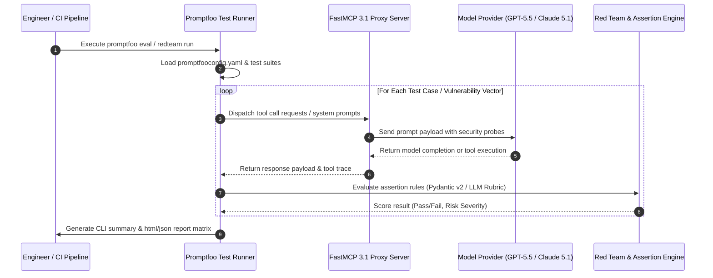

# Promptfoo

## What it is
Promptfoo is an open-source (MIT) CLI tool and library for evaluating, testing, and securing LLM prompts, agents, and FastMCP 3.1 tool implementations. It allows you to run systematic test cases across multiple providers and models, with a heavy focus on **AI Security** and **Red Teaming**. While the core CLI is free and self-hostable, a paid enterprise tier exists for governance and team features.

## System Architecture

The following diagram illustrates how Promptfoo orchestrates test cases, handles model provider dispatching, enforces FastMCP 3.1 tool privilege checks, and aggregates vulnerability scorecards:



## What problem it solves
It solves the problem of "prompt regression" and security vulnerabilities by providing a framework for regression testing and automated red teaming. It allows you to quantify how changes to a prompt or agent workflow affect output quality and safety across many different test cases, preventing silent failures when updating to frontier models like **Claude 5.1**, **GPT-5.5**, **Gemini 4.0 Pro**, **DeepSeek-V4**, or **Llama 4 Maverick**.

## Where it fits in the stack
**Benchmarking / Eval / Security**. It is a critical tool for the [Dev-Workflow AI Assisted](../../playbooks/dev-workflow-ai-assisted.md) cycle, acting as the bridge between development and production-ready prompts.

## Typical use cases
- **Prompt Comparison**: Testing the same input against 10 different versions of a prompt.
- **Model Comparison**: Testing the same prompt against **GPT-5.5**, **Claude 5.1 Opus**, **Gemini 4.0 Pro**, and **Llama 4 Maverick**.
- **Red Teaming**: Identifying prompt injection, data exfiltration, and permission misuse vulnerabilities.
- **CI/CD Integration**: Automatically running a test suite before deploying a prompt or FastMCP agent change.
- **FastMCP Tool Testing**: Verifying that agents correctly call [MCP](../automation_orchestration/mcp.md) tools from servers like [Grafana](../process_understanding/grafana-cloud.md) or [New Relic](../process_understanding/new-relic-ai.md).

## Strengths
- **Fast and Local**: Runs entirely on your machine; no external platform required for the core CLI.
- **Flexible Assertions**: Support for JS, Python, and LLM-graded assertions (e.g., using `llm-rubric`).
- **Extensive Provider Support**: Works with OpenAI, Anthropic, Google, [Ollama](../../services/ollama.md), Azure, and more.
- **AI Security Focus**: Built-in scanners for 50+ vulnerability types, including specialized red teaming for agentic workflows and FastMCP tool privilege boundaries.

## Limitations
- **CLI-First**: While it has a web viewer, the core experience is command-line based.
- **Configuration Overhead**: Complex test suites require significant YAML/JSON definition effort.
- **Acquisition Context**: OpenAI's acquisition of Promptfoo in March 2026 has raised questions about the long-term open-source roadmap, though the MIT core remains available.

## When to use it
- To systematically improve the reliability and safety of your LLM prompts.
- To prevent regressions when updating models or prompts in an automation workflow.
- To perform automated security audits of AI agents before production deployment.

## When not to use it
- For one-off, casual chats with an LLM.
- If you require a purely visual, no-code evaluation environment.

## Getting started

### Installation
```bash
npm install -g promptfoo
```

### Initialization
```bash
# Initialize a new project
promptfoo init
```

### Basic Evaluation
1. Define your prompts and tests in `promptfooconfig.yaml`.
2. Run the eval:
```bash
promptfoo eval
```

## CLI examples

### Running Red Teaming Scans
```bash
# Run a red team evaluation against a specific target
promptfoo redteam run --config redteam.yaml
```

### Comparing Models Side-by-Side
```bash
# Compare GPT-5.5 and Claude 5.1
promptfoo eval -p "Summarize: {{text}}" -r openai:gpt-5.5 -r anthropic:messages:claude-5-1-opus-20261024 -v text="FastMCP 3.1 protocol details"
```

### Testing FastMCP Tools
Promptfoo supports **MCP Proxy** for evaluating tools under FastMCP 3.1:
```bash
# Evaluate an agent using a local FastMCP server
promptfoo eval --mcp-server http://localhost:8000/mcp
```

## API examples

### Programmatic Evaluation (TypeScript)
```typescript
import promptfoo from 'promptfoo';

const results = await promptfoo.evaluate({
  prompts: ['Summarize this: {{text}}'],
  providers: ['openai:gpt-5.5'],
  tests: [
    {
      vars: { text: 'The Model Context Protocol (FastMCP 3.1) is an open standard...' },
      assert: [{ type: 'icontains', value: 'FastMCP' }],
    },
  ],
});

console.log(results);
```

### Custom Python Assertion & FastMCP 3.1 Integration Pattern
Below is a complete FastMCP 3.1 evaluation server pattern alongside a Pydantic v2 custom assertion module for parsing and scorecard generation:

```python
import json
from typing import List, Dict, Any, Optional
from pydantic import BaseModel, Field, ValidationError
from mcp.server.fastmcp import FastMCP

# Initialize FastMCP 3.1 Server for Promptfoo Red Team Metrics
mcp = FastMCP("Promptfoo-Eval-Server", version="3.1")

class SecurityScanItem(BaseModel):
    vulnerability_id: str = Field(..., description="Vulnerability category (e.g., prompt-injection, mcp-tool-escalation)")
    passed: bool = Field(..., description="Whether the model resisted the attack vector")
    severity: str = Field("medium", description="Risk level: critical, high, medium, low")
    response_latency_ms: float = Field(..., description="Evaluation probe latency in milliseconds")
    details: Optional[str] = Field(None, description="Diagnostic logs or payload traces")

class PromptfooScanScorecard(BaseModel):
    total_probes: int = Field(..., description="Total vulnerability vectors evaluated")
    passed_probes: int = Field(..., description="Total resisted probes")
    security_score: float = Field(..., description="Ratio of passed probes to total probes (0.0 to 1.0)")
    vulnerability_summary: Dict[str, bool] = Field(..., description="Pass status keyed by vulnerability ID")

@mcp.tool(name="evaluate_security_scorecard", description="Parses Promptfoo evaluation probe outputs and generates a Pydantic v2 verified scorecard.")
def evaluate_security_scorecard(scan_data: List[Dict]) -> str:
    """Parses raw red teaming probe results and returns a structured JSON scorecard."""
    try:
        items = [SecurityScanItem.model_validate(item) for item in scan_data]
        total = len(items)
        passed = sum(1 for item in items if item.passed)
        vuln_map = {item.vulnerability_id: item.passed for item in items}

        scorecard = PromptfooScanScorecard(
            total_probes=total,
            passed_probes=passed,
            security_score=passed / total if total > 0 else 0.0,
            vulnerability_summary=vuln_map
        )
        return scorecard.model_dump_json(indent=2)
    except ValidationError as e:
        return json.dumps({"error": "Schema validation failed", "details": e.errors()})

def check_length(output: str, vars: Dict[str, Any]) -> bool:
    """
    Validates that the model output is structurally sound and conforms to
    maximum length requirements for daily digests.
    Integrates seamlessly into promptfoo's python assertion environment.
    """
    try:
        parsed = SecurityScanItem.model_validate_json(output)
        return parsed.passed
    except ValidationError:
        return len(output) < 500

if __name__ == "__main__":
    sample_probes = [
        {"vulnerability_id": "prompt-injection", "passed": True, "severity": "high", "response_latency_ms": 140.2},
        {"vulnerability_id": "mcp-tool-escalation", "passed": False, "severity": "critical", "response_latency_ms": 210.0, "details": "Unauthorized tool invocation detected"}
    ]
    print(evaluate_security_scorecard(sample_probes))
```

To integrate this in your `promptfooconfig.yaml`, specify the assertion type as `python` and refer to the file:
```yaml
# promptfooconfig.yaml
assert:
  - type: python
    value: file://assertions.py:check_length
```

## Related tools / concepts
- [LangSmith](langsmith.md) — Enterprise observability and evaluation.
- [AgentOps](../process_understanding/agentops.md) — Session replays and execution graphs for agents.
- [Ragas](../process_understanding/ragas.md) — Evaluation framework for RAG pipelines.
- [Model Context Protocol (MCP)](../automation_orchestration/mcp.md) — Protocol for extending agent capabilities.
- [Ollama](../../services/ollama.md) — Local inference engine for evaluation.
- [Claude](../ai_knowledge/claude.md) — Frontier model frequently used as a judge.
- [Grok-3](../providers/xai-grok.md) — Real-time data search for evaluation context.
- [Dev-Workflow AI Assisted](../../playbooks/dev-workflow-ai-assisted.md) — Playbook for using evals in development.

## Sources / References
- [Promptfoo Official Website](https://www.promptfoo.dev/)
- [Promptfoo GitHub Repository](https://github.com/promptfoo/promptfoo)
- [AI Security & Red Teaming with Promptfoo](https://www.promptfoo.dev/docs/red-team/)
- [OpenAI Acquisition Announcement (March 2026)](https://www.openai.com/blog/openai-acquires-promptfoo/)

## Contribution Metadata
- Last reviewed: 2027-01-07
- Confidence: high
