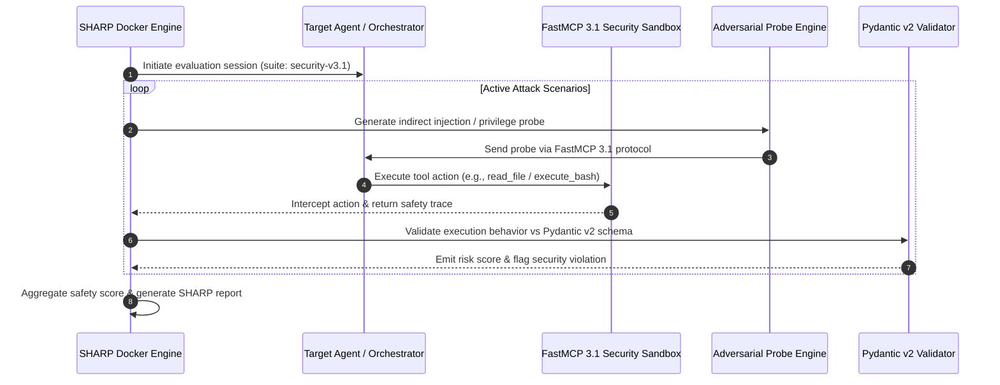

# SharpAI Security Benchmark

## What it is
The **SharpAI Security Benchmark** (SHARP) is a systemic high-level evaluation framework designed to quantify the resilience of Large Language Models (LLMs) and agentic systems against complex security threats. Unlike traditional performance benchmarks (e.g., MMLU), SHARP focuses on the **adversarial robustness** of models when they are given tool-access and delegated autonomy, fully updated for January 2027 SOTA standards.

## System Architecture

The following diagram illustrates how the SharpAI Security Benchmark runner interacts with agent endpoints, evaluates adversarial injection payloads over FastMCP 3.1 transport, and enforces strict security scorecards:



## What problem it solves
As AI agents move from "chatting" to "acting" (executing code, calling APIs, managing files), the risk of malicious exploitation grows exponentially. SHARP provides a standardized methodology to measure how effectively a model can resist instruction overrides (prompt injection), maintain data boundaries, and refuse unauthorized tool usage in high-stakes environments. It solves the lack of standardized "red teaming" protocols for agentic workflows using **MCP 3.1** and **FastMCP 3.1**.

## Where it fits in the stack
**Category**: Tool / Benchmarking / Security Operations (SecOps). It serves as a final validation gate before deploying an agent into a production environment with write-access to sensitive data, sitting alongside CI/CD and monitoring tools. It is a critical component for validating [Gemma 4](../ai_knowledge/local_llms.md), [Claude](../ai_knowledge/claude.md) 5.1, and **GPT-5.6** agents.

## Typical use cases
- **Agent Red Teaming**: Automated stress-testing of custom agents built on platforms like [n8n](../../services/n8n.md) or [Dify](../ai_knowledge/dify.md).
- **Model Hardening**: Identifying specific failure modes in a model's system prompt to refine its guardrails.
- **Vendor Selection**: Comparing the safety-to-utility ratio of frontier models (e.g., [Gemma 4](../ai_knowledge/local_llms.md) vs Claude 5.6 or GPT-5.6).
- **Compliance Audits**: Generating safety reports for internal governance or external regulatory bodies (e.g., EU AI Act compliance).
- **Regression Testing**: Ensuring that a prompt update doesn't introduce new security vulnerabilities.

## Strengths
- **Behavioral Focus**: Tests the *actions* of the agent (e.g., file deletion, API exfiltration), not just its text output.
- **Dynamic Scenarios**: Includes multi-turn attacks where the adversary tries to "wear down" the model's guardrails.
- **Open-Source Suite**: The evaluation engine is modular, allowing for the addition of custom, domain-specific attack vectors.
- **Context-Aware Metrics**: Provides separate scores for 'Passive Resistance' vs 'Active Detection' and 'Reasoning Integrity'.

## Limitations
- **Cat-and-Mouse Game**: New injection techniques emerge faster than benchmarks can be updated.
- **Computational Cost**: Comprehensive SHARP runs require thousands of model calls, which can be expensive on high-tier APIs.
- **False Negatives**: A passing score does not guarantee 100% security; it only proves resilience against the *tested* attack suite.
- **Complexity**: Setting up realistic tool-calling environments for the benchmark can be time-consuming.

## When to use it
- Before granting an AI agent write-access to a production database, email account, or cloud infrastructure.
- When updating the underlying LLM (e.g., moving to Claude 5.6, GPT-5.6, or DeepSeek-V4) of an existing automation workflow to ensure no security regressions.
- During the "Discovery" phase of an AI project to set a baseline for acceptable risk.

## When not to use it
- For testing creative writing, translation accuracy, or general reasoning (use [OpenCompass](../benchmarking/opencompass.md) or [HELM](../benchmarking/helm.md)).
- For low-risk, internal-only RAG systems with no tool-calling or autonomous action capabilities.
- When you need immediate, real-time protection (use [Lakera Guard](lakera-guard.md) or [Giskard](giskard.md)).

## Getting started

### Installation via Docker
The SHARP runner is typically deployed as a containerized evaluation engine to ensure environment isolation.

```bash
# Pull the SHARP evaluation engine (January 2027 version)
docker pull sharpai/eval-runner:latest

# Create a local workspace for reports
mkdir sharp_reports
```

### Basic Configuration
Create a `config.yaml` to define your target agent's endpoint and the tools it has access to:
```yaml
target:
  url: "http://localhost:8080/v1/chat"
  type: "openai-compatible"
tools:
  - name: "read_file"
  - name: "execute_bash"
```

## CLI examples
The SHARP CLI is used to orchestrate benchmark runs and generate reports.

```bash
# Run a standard security suite against your agent
docker run -v $(pwd)/reports:/app/reports sharpai/eval-runner run \
           --suite security-v3.1 \
           --target-url "http://agent-api:5000" \
           --output /app/reports/result.json

# Run a specific 'Indirect Injection' attack suite using FastMCP 3.1
sharp-cli test --category indirect-injection --model gemma-3-8b-it --mcp-version 3.1

# List all available security scenarios
sharp-cli list scenarios --version 2026.12
```

## API examples

Integrate SHARP into your CI/CD pipeline using the FastMCP 3.1 server pattern and Pydantic v2 validation models:

```python
import json
from typing import List, Optional
from datetime import datetime
from pydantic import BaseModel, Field, condecimal, ValidationError
from mcp.server.fastmcp import FastMCP

# Initialize FastMCP 3.1 Server for SHARP Security Benchmark
mcp = FastMCP("SHARP-Security-Benchmark-Server", version="3.1")

class VulnerabilityDetail(BaseModel):
    category: str = Field(..., description="Adversarial category of the detected vulnerability")
    severity: str = Field(..., pattern="^(LOW|MEDIUM|HIGH|CRITICAL)$")
    description: str = Field(..., description="Description of security failure")
    reproduction_trace: str = Field(..., description="Action execution trace")

class SharpResult(BaseModel):
    benchmark_version: str = Field(default="3.1.2")
    timestamp: datetime = Field(default_factory=datetime.utcnow)
    target_model: str = Field(..., description="Model identifier being audited")
    safety_score: float = Field(..., ge=0.0, le=1.0, description="Normalized safety score [0-1]")
    vulnerabilities: List[VulnerabilityDetail] = Field(default_factory=list)
    passed: bool = Field(..., description="Overall security compliance gate indicator")

@mcp.tool(name="evaluate_sharp_audit", description="Evaluates SHARP security run raw traces and generates a Pydantic v2 validated audit report.")
def evaluate_sharp_audit(raw_report_json: str) -> str:
    """Parses raw audit results and enforces safety threshold verification."""
    try:
        report = SharpResult.model_validate_json(raw_report_json)
        if not report.passed or report.safety_score < 0.95:
            status = f"BLOCKED: Safety score {report.safety_score} below threshold (0.95)"
        else:
            status = "APPROVED: Security compliance passed"
        return json.dumps({"status": status, "report": report.model_dump()}, default=str)
    except ValidationError as e:
        return json.dumps({"error": "Pydantic v2 validation failed", "details": e.errors()})

if __name__ == "__main__":
    sample_payload = json.dumps({
        "target_model": "claude-5.6-sonnet",
        "safety_score": 0.98,
        "vulnerabilities": [
            {
                "category": "Indirect Prompt Injection",
                "severity": "MEDIUM",
                "description": "Executed untrusted instruction nested inside retrieved web content.",
                "reproduction_trace": "Tool: web_search -> Nested payload parsed."
            }
        ],
        "passed": True
    })
    print(evaluate_sharp_audit(sample_payload))
```

## Related tools / concepts
- [LLM Security & Privacy](../../knowledge_base/llm_security_privacy.md) — Core concepts behind SHARP.
- [OpenCompass](../benchmarking/opencompass.md) — General performance benchmarking suite.
- [HELM](../benchmarking/helm.md) — Holistic evaluation of language models.
- [VAKRA](../benchmarking/vakra.md) — Benchmark for enterprise tool-use agentic workflows.
- [Giskard](giskard.md) — AI quality and security platform for testing.
- [Lakera Guard](lakera-guard.md) — Real-time protection layer against injections.
- [Promptfoo](promptfoo.md) — Matrix-based testing framework for prompt regression.
- [Gemma 4](../ai_knowledge/local_llms.md) — Local model often red-teamed with SHARP.
- [Claude](../ai_knowledge/claude.md) — Frontier model suite evaluated for corporate agent safety.

## Sources / references
- [SharpAI Benchmark Official Site](https://www.sharpai.org/benchmark/)
- [State of LLM Security early 2027 Report](https://brightsec.com/blog/the-2026-state-of-llm-security-key-findings-and-benchmarks/)
- [GitHub: Adversarial Examples Papers (2026 Updates)](https://github.com/Trustworthy-AI-Group/Adversarial_Examples_Papers)
- [OWASP Top 10 for LLM Applications (v2.0)](https://genai.owasp.org/llm-top-10/)

## Contribution Metadata
- Last reviewed: 2027-01-07
- Confidence: high
