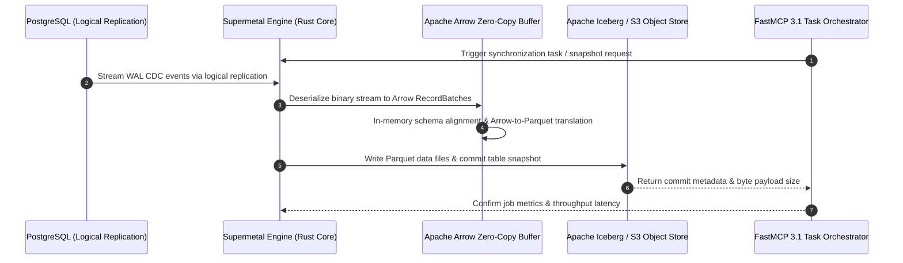

# Supermetal Benchmark

## What it is
Supermetal is a high-performance data movement and processing tool designed for low-latency synchronization between production databases and modern data lake formats. As of January 2027, it is recognized for its industry-leading Postgres-to-Iceberg synchronization speeds, outperforming traditional distributed computing frameworks.

## System Architecture

The following diagram details Supermetal's low-latency Change Data Capture (CDC) pipeline architecture, leveraging zero-copy Apache Arrow buffers and FastMCP 3.1 task orchestration for low-latency sync between Postgres and Apache Iceberg:



## What problem it solves
It addresses the latency and complexity bottlenecks in Change Data Capture (CDC) pipelines. Traditionally, moving data from production databases (like Postgres) to analytics platforms (like Apache Iceberg) required complex setups involving Flink, Kafka Connect, or Spark. Supermetal simplifies this by:
- **Reducing Latency**: Benchmarks show Postgres-to-Iceberg synchronization in as little as 13 minutes for massive datasets, providing high-freshness data for **Claude 5.1**, **GPT-5.5 / 5.6**, and **Gemini 4.0** RAG systems.
- **Simplifying Infrastructure**: Replacing multi-component distributed stacks with a single, high-performance process.
- **Ensuring Consistency**: Maintaining transactional integrity and data accuracy via Apache Arrow's type system.

## Where it fits in the stack
**Category**: Benchmarking / Data Movement. It serves as the high-speed "plumbing" between the operational layer (Postgres) and the analytical layer (Iceberg), often used to provide real-time data for AI training and [vLLM](../infrastructure/vllm.md) RAG pipelines.

## Typical use cases
- **Real-time CDC**: Synchronizing Postgres data to Iceberg for near-instant analytics.
- **Data Stack Consolidation**: Simplifying the infrastructure required for reliable data pipelines.
- **AI Dataset Freshness**: Ensuring that models like Claude 5.1, GPT-5.5 / 5.6, and Gemini 4.0 have access to the most recent production data via high-speed ingestion.

## Strengths
- **Speed**: Optimized for modern hardware and cloud-native storage, achieving throughput that dwarfs open-source alternatives.
- **Simplicity**: Designed to replace more complex distributed computing frameworks for specific data movement tasks.
- **Efficiency**: Written in Rust and utilizing Apache Arrow for zero-copy read capabilities and efficient serialization.

## Limitations
- **Niche Focus**: Specifically optimized for high-speed data movement and specific target formats (Postgres, Iceberg, Snowflake).
- **Target Specificity**: While expanding, its primary advantage is currently concentrated on a few high-value source-sink pairs.

## When to use it
- When you need low-latency synchronization between production databases and an analytical data lake.
- When looking to reduce the operational overhead and cost of Kafka/Spark-based pipelines.
- When the scale of data movement creates a bottleneck for real-time AI features.

## When not to use it
- For small datasets that don't justify the overhead of a dedicated CDC tool.
- If you require complex in-flight data transformations (consider Fivetran or dbt for heavy T in ELT).
- For unsupported source or target systems where traditional connectors remain the only option.

## Getting started
Supermetal operates via an API-driven connector model. To get started, deploy the Supermetal service (often via Docker) and use the REST API to configure your source and sink connectors.

```bash
# Start the Supermetal service (example)
docker run -p 8080:8080 supermetal/service:latest
```

## CLI examples
Management of Supermetal is typically performed via its REST API, which can be interacted with using `curl`.

```bash
# List all active connectors
curl "https://your-supermetal-instance/api/v1/connectors"

# Check the status of a specific synchronization task
curl "https://your-supermetal-instance/api/v1/tasks/my-sync-task"

# Trigger a manual snapshot of a source table
curl -X POST "https://your-supermetal-instance/api/v1/snapshot/source_table_name"
```

## API examples

### FastMCP 3.1 Task Server and Pydantic v2 Connector Schema
Below is a complete FastMCP 3.1 server pattern that validates Supermetal connector payloads using Pydantic v2 and exposes a synchronization management interface:

```python
import json
from typing import Literal, Optional, List, Dict
from pydantic import BaseModel, Field, ValidationError
from mcp.server.fastmcp import FastMCP

# Initialize FastMCP 3.1 Server for Supermetal Data Synchronization
mcp = FastMCP("Supermetal-Sync-Server", version="3.1")

class PostgresConnection(BaseModel):
    host: str = Field(..., description="PostgreSQL host IP or domain")
    port: int = Field(5432, ge=1, le=65535, description="PostgreSQL port")
    user: str = Field(..., description="Database synchronization user")
    password: str = Field(..., description="Database synchronization password")
    database: str = Field(..., description="Source database name")

class PostgresSource(BaseModel):
    connection: PostgresConnection
    replication_type: Literal["logical_replication", "standard_polling"] = Field(
        "logical_replication",
        alias="replicationType",
        description="CDC method used to capture source changes"
    )

class IcebergSink(BaseModel):
    catalog_type: Literal["glue", "hive", "rest"] = Field(..., alias="catalogType")
    database: str = Field(..., description="Target database/schema name in Apache Iceberg")
    warehouse_path: str = Field(..., alias="warehousePath", description="S3 or cloud object warehouse path URI")

class SupermetalConnectorConfig(BaseModel):
    connector_id: str = Field(..., alias="id", description="Unique identifier for this task")
    source: PostgresSource = Field(..., description="PostgreSQL database source configuration")
    sink: IcebergSink = Field(..., description="Apache Iceberg analytical sink configuration")

@mcp.tool(name="validate_and_deploy_connector", description="Validates Supermetal CDC connector configuration JSON using Pydantic v2.")
def validate_and_deploy_connector(raw_json: str) -> str:
    """Parses raw connector config, validates against schema, and returns status JSON."""
    try:
        data = json.loads(raw_json)
        config = SupermetalConnectorConfig.model_validate(data)
        return json.dumps({
            "status": "VALIDATED",
            "connector_id": config.connector_id,
            "validated_config": config.model_dump(by_alias=True)
        }, indent=2)
    except json.JSONDecodeError:
        return json.dumps({"error": "Invalid JSON format"})
    except ValidationError as e:
        return json.dumps({"error": "Schema validation failed", "details": e.errors()})

if __name__ == "__main__":
    sample_payload = """
    {
        "id": "my-pg-to-iceberg",
        "source": {
            "connection": {
                "host": "postgres.internal.net",
                "port": 5432,
                "user": "supermetal_cdc",
                "password": "super-secure-pwd",
                "database": "production_transactions"
            },
            "replicationType": "logical_replication"
        },
        "sink": {
            "catalogType": "glue",
            "database": "lakehouse_analytics",
            "warehousePath": "s3://my-company-lakehouse/warehouse/"
        }
    }
    """
    print(validate_and_deploy_connector(sample_payload))
```

## Related tools / concepts
- [Data Stack Consolidation](../../knowledge_base/landscape-overview.md) — The movement towards simpler, faster data architectures.
- [Model Context Protocol](../automation_orchestration/mcp.md) — Used for discovery of Supermetal-managed datasets.
- [AirOps](../automation_orchestration/airops.md) — For orchestrating the results of Supermetal data syncs.
- [Temporal](../orchestration/temporal.md) — For managing long-running data workflow state.
- [Grafana Cloud](../process_understanding/grafana-cloud.md) — For monitoring Supermetal synchronization performance.
- [ClickHouse](../process_understanding/clickhouse.md) — A common high-speed analytical sink.
- [Snowflake](../process_understanding/snowflake.md) — A common enterprise analytical sink.
- [Real-time Sync Engines](../../knowledge_base/real_time_sync_engines.md) — The ecosystem where Supermetal competes.
- [vLLM](../infrastructure/vllm.md) — Often the consumer of data moved by Supermetal.

## Sources / references
- [Supermetal Architecture Documentation](https://docs.supermetal.io/docs/main/concepts/architecture/)
- [Postgres to Iceberg in 13 minutes: How Supermetal compares](https://thenewstack.io/postgres-iceberg-cdc-benchmarks/)
- [Apache Arrow and the Future of Data Movement](https://arrow.apache.org/)

## Contribution Metadata
- Last reviewed: 2027-01-07
- Confidence: high
