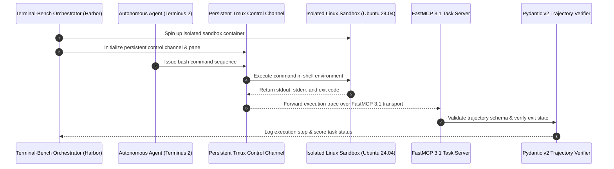

# Terminal-Bench (Terminus 2)

## What it is
Terminal-Bench (including the Terminus 2 research baseline) is a specialized benchmark for evaluating AI agents' ability to operate within a real terminal environment. It goes beyond static code generation by testing the agent's ability to interpret command output, handle stateful bash sessions, and remediate complex system or server failures. In early January 2027, it serves as the premier benchmark for "Terminus 2" patterns where agents manage long-running tmux control channels and interact with sandboxes via the Model Context Protocol (FastMCP 3.1 Task Protocol).

## System Architecture

The following diagram illustrates the interaction flow between the Terminal-Bench orchestrator, Terminus 2 persistent tmux control channels, containerized sandboxes, and FastMCP 3.1 task protocol tools:



## What problem it solves
It measures whether autonomous systems can effectively and safely operate inside a standard Linux shell. Standard benchmarks evaluate model capabilities on isolated snippets or reasoning puzzles; Terminal-Bench evaluates the agent's "Intent-State-Action" loop in real time. It tests key capabilities such as:
- Installing software and fixing configuration mismatches (e.g., mismatched Nginx load balancers).
- Direct LLM-to-tmux shell interaction for persistent session management.
- Navigating isolated system sandboxes to diagnose performance degradation or memory leaks.

## Where it fits in the stack
**Benchmarking**. Positioned in the **Agent Evaluation Layer** of the homelab, used to rigorously evaluate the terminal proficiency of autonomous agent frameworks before they are granted administrative access to self-hosted server environments.

## Typical use cases
- **DevOps Agent Evaluation**: Benchmarking developer-focused agents (such as Aider, OpenHands, or Claude Code) on software configuration and package installation before granting production repository access.
- **Autonomous SysAdmin Research**: Evaluating frontier reasoning models (Claude 5.6, GPT-5.6, Gemini 4.0 Ultra, Gemma 4, DeepSeek-V4, Qwen 3.6 VL) on their ability to execute multi-step scripts, manage process states, and debug networking failures.
- **Persistent tmux Multi-Session Coordination**: Researching the stability of agentic control channels when multiple long-running tasks are handled in parallel.

## Strengths
- **Practical Realism**: Replaces abstract coding challenges with real-world DevOps, site reliability engineering (SRE), and system administration scenarios.
- **Stateful Interaction**: Requires the agent to maintain state and recover from cascading errors in real time.
- **FastMCP 3.1 Protocol Compatibility**: Fully integrates with FastMCP 3.1 Task Protocol server definitions, allowing modern agents to access sandboxes using standard, type-safe JSON schema tool definitions.

## Limitations
- **High Resource Overhead**: Demands a containerized Docker or Harbor environment to safely execute arbitrary agent-generated commands.
- **Environment Flakiness**: Changes in base images, pinned package repositories, or hardware drivers can lead to inconsistent benchmarking scores.
- **OS Specificity**: Scenarios are often optimized for specific Linux distributions (e.g., Ubuntu 24.04 or Alpine), making comparisons across diverse hosting architectures challenging.

## When to use it
- When evaluating the safety, accuracy, and efficiency of autonomous agents executing command-line instructions.
- When configuring sandbox environments for local models (Gemma 4, DeepSeek-V4, Qwen 3.6 VL) to run self-healing scripts.
- When validating persistent agent control loops via tmux sessions.

## When not to use it
- For quick, lightweight model evaluations (use [LM Evaluation Harness](lm-evaluation-harness.md)).
- For purely language-focused or code-synthesizing evaluations (use [MBPP](mbpp.md) or [Humanitys Last Exam](humanitys-last-exam.md)).

## Getting started

Terminal-Bench (TB-2) is typically orchestrated using the **Harbor** framework to provide a consistent, containerized execution environment.

### 1. Installation
```bash
pip install terminal-bench harbor-framework pydantic
# Verify Docker is active on the host machine
```

### 2. Sandbox Setup
Initialize an isolated benchmarking environment with specific resource constraints:
```bash
harbor init --benchmark terminal-bench --memory-limit 4g --cpu-shares 1024
```

## CLI examples

### Running a specific DevOps task with strict limits
Evaluate an agent's ability to set up an Nginx load balancer under strict execution constraints:
```bash
tb run \
    --task_id "nginx-lb-config" \
    --model "anthropic/claude-5-6-sonnet" \
    --timeout 300 \
    --sandbox-image "harbor/ubuntu-24.04-dev:v3"
```

### Managing tmux sessions via Terminus 2
Terminus 2 allows for direct shell interaction via persistent tmux control channels:
```bash
terminus2 connect \
    --session "devops-audit-2027" \
    --agent "my-devops-droid" \
    --pane-size "80x24"
```

## API examples

### Orchestrating Terminal Evaluation with FastMCP 3.1 & Pydantic v2
This robust example demonstrates how to orchestrate a Terminal-Bench task via FastMCP 3.1 server tools and validate trajectory telemetry using **Pydantic v2**:

```python
import sys
import json
from typing import List, Optional
from pydantic import BaseModel, Field, ValidationError
from mcp.server.fastmcp import FastMCP

# Initialize FastMCP 3.1 Server for Terminal-Bench Trajectory Telemetry
mcp = FastMCP("Terminal-Bench-Evaluator", version="3.1")

class SandboxConfig(BaseModel):
    image: str = Field(..., description="The Docker image to use for the sandbox")
    network_isolated: bool = Field(default=True, description="Enforce strict network isolation")
    memory_limit: str = Field(default="4g", description="Memory allocation limit for the container")
    timeout_seconds: int = Field(default=600, ge=10, description="Max execution duration in seconds")

class ExecutionTrajectory(BaseModel):
    command: str = Field(..., description="The command executed by the agent")
    exit_code: int = Field(..., description="The resulting exit code from the shell")
    stdout_preview: str = Field(..., description="First 200 characters of stdout")
    stderr_preview: Optional[str] = Field(None, description="First 200 characters of stderr")

class TerminalEvaluationResult(BaseModel):
    task_id: str = Field(..., description="The unique identifier of the benchmark task")
    success: bool = Field(..., description="Indicates if the agent satisfied the goal criteria")
    final_status_code: int = Field(..., description="The final status code returned by the sandbox")
    trajectories: List[ExecutionTrajectory] = Field(default_factory=list, description="Sequence of commands executed")

@mcp.tool(name="evaluate_terminal_trajectory", description="Validates terminal execution telemetry against Pydantic v2 schemas and computes summary stats.")
def evaluate_terminal_trajectory(raw_json: str) -> str:
    """Parses raw evaluation payload, verifies against Pydantic v2, and outputs status summary."""
    try:
        data = json.loads(raw_json)
        result = TerminalEvaluationResult.model_validate(data)
        return json.dumps({
            "status": "VALIDATED",
            "task_id": result.task_id,
            "success": result.success,
            "total_commands_executed": len(result.trajectories)
        }, indent=2)
    except json.JSONDecodeError:
        return json.dumps({"error": "Invalid JSON format"})
    except ValidationError as e:
        return json.dumps({"error": "Validation failed", "details": e.errors()})

if __name__ == "__main__":
    sample_data = json.dumps({
        "task_id": "debug-c-memory-leak",
        "success": True,
        "final_status_code": 0,
        "trajectories": [
            {
                "command": "gcc -o debug_app main.c -fsanitize=address",
                "exit_code": 0,
                "stdout_preview": "Compilation finished successfully."
            },
            {
                "command": "./debug_app",
                "exit_code": 1,
                "stdout_preview": "AddressSanitizer: heap-use-after-free",
                "stderr_preview": "ERROR: AddressSanitizer: heap-use-after-free"
            }
        ]
    })
    print(evaluate_terminal_trajectory(sample_data))
```

## Related tools / concepts
- [SWE-bench](swe-bench.md) - Software engineering repository-wide benchmark.
- [BigCodeBench](./bigcodebench.md) - Advanced code generation benchmark.
- [OpenHands](../development_ops/openhands.md) - Open-source platform for agentic dev.
- [Aider](../development_ops/aider.md) - Terminal-native AI pair programmer.
- [Claude Code — Project Setup Guide](../development_ops/claude-code-setup.md) - Modern terminal agentic workflows.
- [LM Evaluation Harness](lm-evaluation-harness.md) - Unified benchmark runner.
- [OSWorld](./os-world.md) - Operating system-wide agent evaluation.
- [PA-bench](./pa-bench.md) - Web-based personal assistant benchmark.

## Sources / References
- [Terminal-Bench GitHub Repository](https://github.com/harbor-framework/terminal-bench)
- [Harbor Framework Documentation](https://github.com/harbor-framework/harbor)

## Contribution Metadata
- Last reviewed: 2027-01-07
- Confidence: high
