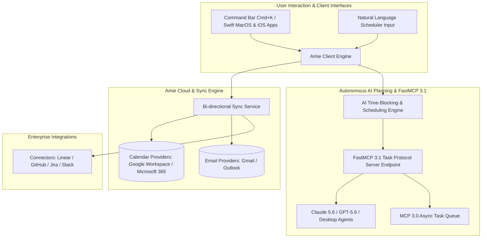

# Amie

## What it is
Amie is an enterprise-grade, design-centric productivity platform that unifies calendar management, task orchestration, email communications, and team scheduling into a single high-velocity interface. Built with a "keyboard-first" UX philosophy, Amie streamlines daily planning, time-blocking, and asynchronous collaboration across personal and corporate environments.

By early January 2027, Amie has deeply integrated frontier artificial intelligence models—including [Claude 5.6](../ai_knowledge/claude.md), [GPT-5.6](../ai_knowledge/openai.md), [Gemini 4.0 Ultra](../ai_knowledge/gemini.md), DeepSeek-V4, Qwen 3.6 VL, and local open-weights engines like [Gemma 4](../ai_knowledge/local_llms.md)—to offer autonomous calendar scheduling, proactive time-blocking, natural language event creation, and cross-organization meeting negotiation. Operating natively with the **FastMCP 3.1 Task Protocol** and Model Context Protocol (MCP 3.0), Amie serves as an intelligent scheduling hub that connects personal productivity workflows with corporate project management platforms ([Linear](../agents/index.md), Jira, GitHub, Slack).



## What problem it solves
Amie directly eliminates the administrative overhead and "planning fatigue" that degrade modern knowledge worker productivity:

1. **Context Fragmentation across Planning Tools**: Replaces the disjoined workflow of managing separate calendar apps, task managers (Todoist, TickTick), and email inboxes by consolidating events, tasks, and messages into a unified visual timeline.
2. **Manual Time-Blocking Friction**: Eliminates the manual effort required to break down project tasks into discrete calendar slots. Amie's AI Planner evaluates task priorities, estimated durations, and user energy patterns to automatically schedule focus time.
3. **Email-to-Task Conversion Bottlenecks**: Allows users to drag actionable email threads directly onto calendar time slots, converting raw messages into time-blocked tasks with automatically attached email deep-links.
4. **Cross-Company Scheduling Friction**: Replaces back-and-forth scheduling emails with dynamic, AI-negotiated availability windows via FastMCP 3.1 protocols.
5. **Slow UI Navigation**: Features sub-50ms interaction latencies and comprehensive keyboard shortcuts (`Cmd + K`), minimizing mouse clicks for high-volume calendar management.

## Where it fits in the stack
Amie operates at the **Personal Productivity & Personal Knowledge Management (PKM) Layer**:

- **Data Aggregation Layer**: Bi-directionally syncs with underlying calendar protocol infrastructures (CalDAV, Google Calendar API, Microsoft Graph API) and IMAP/OAuth email services.
- **Task Integration Layer**: Connects with developer issue trackers ([Linear](../agents/index.md), Jira, GitHub Issues) and team messaging platforms (Slack).
- **Agentic Protocol Interface**: Exposes calendar availability and task mutation capabilities to AI agent orchestrators via [FastMCP 3.1](../automation_orchestration/mcp.md).
- **Client Presentation Layer**: Native desktop (macOS Swift) and mobile (iOS) applications providing offline-first caching and real-time synchronization.

## Typical use cases
- **Autonomous Daily Time-Blocking**: Automatically distributing a weekly backlog of Linear engineering tasks across available focus blocks on a developer's calendar.
- **Natural Language Calendar Management**: Typing `"Schedule 45m code review with @Alex tomorrow afternoon"` in the `Cmd + K` palette to instantly reserve an optimal open calendar slot.
- **Email-Driven Sprint Planning**: Dragging urgent client requests from the inbox directly onto tomorrow's morning schedule to block out dedicated execution time.
- **Agentic Meeting Scheduling via FastMCP 3.1**: Granting AI agents (e.g., [Claude 5.6](../ai_knowledge/claude.md) running in Cursor) access to query free/busy availability and insert calendar holds without exposing private event details.
- **Cross-Timezone Team Coordination**: Visualizing multi-timezone team availability overlays during sprint planning meetings.

## Strengths
- **Frontier AI Time-Blocking Integration**: Native support for [Claude 5.6](../ai_knowledge/claude.md), GPT-5.6, Gemini 4.0 Ultra, DeepSeek-V4, Qwen 3.6 VL, and [Gemma 4](../ai_knowledge/local_llms.md) for natural language scheduling and task estimation.
- **Flawless Design & High-Velocity UX**: Ultra-polished user interface with micro-animations, keyboard-first navigation, and immediate responsiveness.
- **Unification of Calendar, Tasks, and Email**: Seamless integration of three core productivity pillars into a single timeline.
- **FastMCP 3.1 & MCP 3.0 Protocol Support**: Exposes standardized tools for calendar availability lookup and task creation for external AI agents.
- **Deep Developer Tool Connectors**: First-class sync support for Linear, GitHub, Jira, and Slack.

## Limitations
- **Proprietary SaaS Infrastructure**: Closed-source commercial platform requiring cloud synchronization; no self-hosted or air-gapped deployment option.
- **Platform Availability Variance**: Native client experience is heavily optimized for Apple Silicon macOS and iOS; Android and Windows web experiences are evolving.
- **Closed Database Access**: Direct SQL database queries are not supported; integrations must pass through Amie's REST API or FastMCP 3.1 endpoints.

## When to use it
- When seeking a unified, design-forward platform that merges Google/Outlook calendars, task lists, and emails into one view.
- When you want AI models to automatically handle time-blocking and daily schedule optimization.
- When working heavily within the macOS / iOS ecosystem alongside modern developer tools like Linear and GitHub.
- When requiring a FastMCP 3.1 compliant calendar interface for AI agents.

## When not to use it
- In strict privacy-first or air-gapped environments where external cloud processing of calendar and email data is forbidden (use open-source [Vikunja](../../services/vikunja.md) or [Radicale](../../services/radicale-automation.md)).
- If your organization mandates self-hosted open-source software stacks.
- For complex enterprise project portfolio management requiring Gantt charts and resource allocation matrices — use Jira or Microsoft Project.

## Getting started

### 1. Account Setup & Onboarding
1. Visit the [Amie Web Portal](https://amie.so/) and authenticate using your primary Google Workspace or Microsoft 365 account.
2. Complete the onboarding wizard to connect secondary calendars, email accounts, and issue trackers (Linear, GitHub).
3. Download the native macOS application package and drag `Amie.app` into your `/Applications` directory.

### 2. Enabling the AI Planner
1. Open Amie and press `Cmd + ,` to open **Preferences**.
2. Navigate to **AI & Automation > AI Planner**.
3. Select your preferred intelligence provider (e.g., Claude 5.6 or GPT-5.6) and toggle **Automatic Time-Blocking** on.

### 3. Basic Keyboard Shortcuts
- `Cmd + K`: Open the Command Palette for natural language event/task creation.
- `C`: Create a new calendar event.
- `T`: Create a new task.
- `E`: Complete / archive selected task.
- `D`: Switch to Day view.
- `W`: Switch to Week view.

## CLI examples
While Amie operates primarily as a desktop and mobile GUI application, developers interact with Amie via the `Cmd + K` Command Bar and command-line API integrations.

```bash
# Natural Language Shortcuts in Amie Cmd + K Palette
"Plan my day" -> Triggers Gemma 4 / Qwen 3.6 VL to distribute backlog tasks into open calendar slots.
"Focus time 2 hours tomorrow at 9am" -> Creates a recurring calendar block with notifications muted.
"Sync Linear assigned issues" -> Triggers immediate bi-directional sync with Linear workspace.

# Triggering manual calendar sync via cURL REST API
curl -X POST "https://api.amie.so/v1/sync/calendar" \
  -H "Authorization: Bearer ${AMIE_API_KEY}" \
  -H "Content-Type: application/json" \
  -d '{"full_resync": false, "provider": "google"}'
```

## API examples

### 1. FastMCP 3.1 Server for Amie Calendar & Task Management
The following complete Python script constructs a FastMCP 3.1 server exposing Amie availability lookup and task creation tools for AI agents:

```python
import os
import asyncio
from datetime import datetime, timedelta
from typing import List, Optional
from pydantic import BaseModel, Field, ValidationError
from fastmcp import FastMCP

# Initialize FastMCP 3.1 Server
mcp_server = FastMCP(
    name="Amie-Productivity-Bridge",
    version="3.1.0",
    description="FastMCP 3.1 Server providing calendar availability and task orchestration tools"
)

class TimeSlot(BaseModel):
    start_time: str = Field(..., description="ISO 8601 start timestamp")
    end_time: str = Field(..., description="ISO 8601 end timestamp")
    is_free: bool = Field(default=True, description="Whether slot is available")

class AmieAvailabilityQuery(BaseModel):
    target_date: str = Field(..., description="Target date in YYYY-MM-DD format")
    duration_minutes: int = Field(default=30, ge=15, le=480, description="Required event duration")
    timezone: str = Field(default="UTC", description="Target timezone string")

class AmieTaskCreateRequest(BaseModel):
    title: str = Field(..., min_length=1, description="Title of task")
    estimated_minutes: int = Field(default=30, ge=5, description="Estimated execution duration")
    due_date: Optional[str] = Field(default=None, description="Optional ISO due date string")
    priority: str = Field(default="HIGH", pattern="^(HIGH|MEDIUM|LOW)$")

@mcp_server.tool()
async def query_calendar_availability(query: AmieAvailabilityQuery) -> str:
    """Queries Amie calendar to find open availability windows for meeting scheduling."""
    # Mocking availability computation
    start_dt = datetime.strptime(query.target_date, "%Y-%m-%d")
    slot1_start = (start_dt + timedelta(hours=10)).isoformat() + "Z"
    slot1_end = (start_dt + timedelta(hours=10, minutes=query.duration_minutes)).isoformat() + "Z"

    slots = [
        TimeSlot(start_time=slot1_start, end_time=slot1_end, is_free=True)
    ]
    return f"Found {len(slots)} free slot(s) on {query.target_date}: {slots[0].start_time} to {slots[0].end_time}"

@mcp_server.tool()
async def create_timeblocked_task(request: AmieTaskCreateRequest) -> str:
    """Creates a new task in Amie and schedules a time-blocked slot on the user's calendar."""
    print(f"Creating Amie task: '{request.title}' ({request.estimated_minutes} mins)")
    return f"Successfully created task '{request.title}' (ID: amie-task-99201) and scheduled on calendar."

if __name__ == "__main__":
    print("Starting Amie FastMCP 3.1 Bridge on http://localhost:8000/sse")
    mcp_server.run(transport="sse", port=8000)
```

### 2. Client Side Pydantic v2 Schema Validation for Amie API Payloads
This script validates structured responses received from Amie's calendar synchronization API:

```python
from typing import List, Optional
from pydantic import BaseModel, Field, ValidationError

class CalendarEvent(BaseModel):
    event_id: str = Field(..., description="Unique event identifier string")
    title: str = Field(..., description="Title of calendar event")
    start_timestamp: str = Field(..., description="ISO 8601 start time")
    end_timestamp: str = Field(..., description="ISO 8601 end time")
    attendees_count: int = Field(default=1, ge=1)
    is_recurring: bool = Field(default=False)
    source_provider: str = Field(default="google", pattern="^(google|outlook|amie)$")

class AmieCalendarSyncResponse(BaseModel):
    user_id: str = Field(..., description="Unique user account ID")
    sync_timestamp: str = Field(..., description="ISO 8601 execution timestamp")
    events_synced: List[CalendarEvent] = Field(default_factory=list)
    tasks_timeblocked_count: int = Field(..., ge=0)

def validate_amie_sync_response(raw_payload: dict) -> AmieCalendarSyncResponse:
    try:
        validated_data = AmieCalendarSyncResponse.model_validate(raw_payload)
        print("Pydantic v2 Validation Passed for Amie Sync Response!")
        print(f"User: {validated_data.user_id} | Synced {len(validated_data.events_synced)} event(s)")
        for evt in validated_data.events_synced:
            print(f"  - Event: '{evt.title}' ({evt.start_timestamp} -> {evt.end_timestamp})")
        return validated_data
    except ValidationError as err:
        print(f"Validation Error: {err}")
        raise

if __name__ == "__main__":
    sample_response = {
        "user_id": "usr_amie_88201",
        "sync_timestamp": "2027-01-07T13:00:00Z",
        "events_synced": [
            {
                "event_id": "evt_101",
                "title": "Architecture Sync: FastMCP 3.1 Integration",
                "start_timestamp": "2027-01-08T14:00:00Z",
                "end_timestamp": "2027-01-08T15:00:00Z",
                "attendees_count": 4,
                "is_recurring": False,
                "source_provider": "google"
            }
        ],
        "tasks_timeblocked_count": 3
    }

    validate_amie_sync_response(sample_response)
```

## Related tools / concepts
- [Sunsama](sunsama.md) — Daily planning tool focused on intentional work rituals.
- [Akiflow](akiflow.md) — Time-blocking and task aggregation competitor.
- [Reclaim.ai](reclaim.md) — Automated AI calendar scheduling tool.
- [Morgen](morgen.md) — Multi-calendar and task manager application.
- [Motion](motion.md) — Algorithmic project scheduling and task management app.
- [Vikunja](../../services/vikunja.md) — Open-source self-hosted task management platform.
- [FastMCP 3.1](../automation_orchestration/mcp.md) — Protocol for agent tools.

## Sources / references
- [Amie Official Platform Website](https://www.amie.so/)
- [Amie Product Help & Documentation Center](https://amie.so/help)
- [FastMCP 3.1 Specification & Task Protocol](https://modelcontextprotocol.io/)
- [Modern AI Daily Planning Benchmark Analysis](https://www.usecarly.com/blog/best-ai-tools-daily-planning/)

## Contribution Metadata
- Last reviewed: 2027-01-07
- Confidence: high
