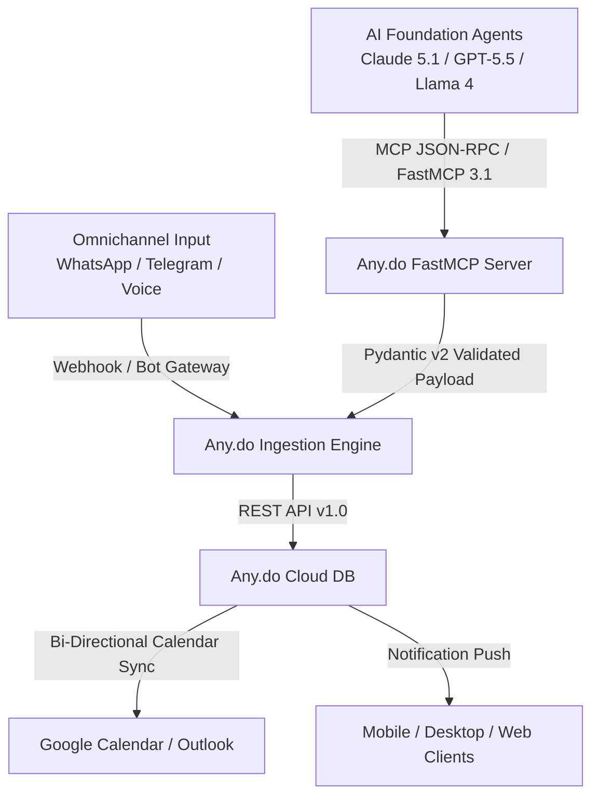

# Any.do

## What it is
Any.do is an all-in-one task management, personal planner, and calendar platform engineered for individual productivity and team task execution. Known for pioneering direct messaging task capture via WhatsApp and Telegram bots, Any.do as of early 2027 provides full support for **FastMCP 3.1** (Model Context Protocol), enabling AI agents (**Claude 5.1**, **GPT-5.5**, **Llama 4**) to ingest, categorize, and track tasks across mobile, desktop, and web interfaces.

## What problem it solves
Capturing ideas and task requests from chat applications or voice messages usually involves manual copying, fragmented lists, and missed deadlines. Any.do eliminates input friction through native messaging bots, intelligent natural language event/task parsing, and bi-directional calendar synchronization with [Google Calendar](google_calendar.md) and [Outlook](outlook.md).

## Where it fits in the stack
**Category**: Calendar & Tasks / Task Management. Acts as an omnichannel task capture and scheduling hub connecting user chat interfaces, calendar backends ([Google Calendar](google_calendar.md), [Outlook](outlook.md)), and agentic workflow runtimes using FastMCP 3.1.

## System Architecture

The following Mermaid diagram maps the message ingestion layer, FastMCP 3.1 agent connectivity, validation models, and Any.do cloud sync backends:



## Typical use cases
- **Messaging-Based Task Capture**: Turn WhatsApp or Telegram messages into scheduled tasks instantly using Any.do's chat bot integration.
- **Agentic Task Delegation**: Connect Any.do to **Claude 5.1** or **GPT-5.5** via FastMCP 3.1 to decompose sprint goals into daily actionable check-items.
- **Family & Small Team Coordination**: Share household or project task lists, assign owners, and track completion progress in real time.
- **Daily Workspace Planning**: Use the "Any.do Moment" feature to review, prioritize, and time-block morning task lists.

## Strengths
- **Omnichannel Chat Integration**: Seamless WhatsApp and Telegram task creation reduces context switching.
- **FastMCP 3.1 Protocol Native**: Plug-and-play agent tooling support for task creation, query, and completion.
- **Clean Cross-Platform UI**: Consistent, low-friction user experience across iOS, Android, web, macOS, and Windows.
- **Unified Task & Calendar View**: Combines personal tasks and cloud calendar events into a single daily agenda view.

## Limitations
- **Closed Commercial SaaS**: Closed-source backend requiring subscription for premium messaging and team features; no self-hosted option.
- **API Rate Governance**: Public REST API tiers impose rate limits for high-frequency automated agent loops.
- **Limited Complex PM Features**: Lacks native Gantt charts or complex issue dependency graphs (better suited for GTD/task lists than enterprise software tracking).

## When to use it
- When capturing tasks directly from chat apps (WhatsApp/Telegram) is a core part of your workflow.
- When pairing a personal task manager with AI agents using FastMCP 3.1 tools.
- When you want an intuitive, visually clean daily task and calendar agenda.

## When not to use it
- If your policy requires 100% open-source, local-first air-gapped data hosting (consider [Vikunja](../../services/vikunja.md)).
- For managing high-concurrency software development backlogs (prefer GitHub Issues or Jira).

## Getting started

### Account Setup & API Tokens
1. Create an Any.do account at [Any.do](https://www.any.do/).
2. Enable developer integrations and generate your **API Access Token**.
3. Test API authentication via cURL:
   ```bash
   curl -X GET https://api.any.do/v1/tasks \
     -H "Authorization: Bearer $ANYDO_TOKEN"
   ```

## CLI examples

### Direct Task Creation via Terminal
Users can dispatch quick tasks or build shell aliases targeting the Any.do REST API:

```bash
# Create a high-priority task via cURL
curl -X POST https://api.any.do/v1/tasks \
  -H "Authorization: Bearer $ANYDO_TOKEN" \
  -H "Content-Type: application/json" \
  -d '{
    "title": "Review FastMCP 3.1 security schema with GPT-5.5",
    "priority": "High",
    "dueDate": "2027-01-20T10:00:00Z"
  }'
```

## API examples

### Pydantic v2 Task Validation & Creation
Programmatic task generation should be validated with **Pydantic v2** models before POSTing to Any.do endpoints under early 2027 standards.

```python
import os
import requests
from typing import Literal, Optional
from pydantic import BaseModel, Field, ValidationError

class AnyDoTaskPayload(BaseModel):
    title: str = Field(..., min_length=1, max_length=150, description="Task headline or action summary")
    notes: Optional[str] = Field(default=None, max_length=5000, description="Detailed Markdown notes")
    priority: Literal["Low", "Normal", "High"] = Field(default="Normal", description="Task priority tier")
    status: Literal["UNCHECKED", "CHECKED"] = Field(default="UNCHECKED", description="Task completion status")
    dueDate: Optional[str] = Field(default=None, description="ISO 8601 formatted string e.g. 2027-01-20T10:00:00Z")

# Incoming payload from an AI agent or automated webhook
raw_task_input = {
    "title": "Perform quarterly backup audit on local Kubernetes clusters",
    "notes": "Inspect offsite snapshots and verify restored database tables.",
    "priority": "High",
    "status": "UNCHECKED",
    "dueDate": "2027-01-25T14:00:00Z"
}

try:
    # Execute Pydantic v2 schema validation
    validated_task = AnyDoTaskPayload.model_validate(raw_task_input)
    print(f"Validated Any.do task payload: '{validated_task.title}' [Priority: {validated_task.priority}]")

    # API Dispatch logic:
    token = os.getenv("ANYDO_TOKEN", "mock_token")
    headers = {
        "Authorization": f"Bearer {token}",
        "Content-Type": "application/json"
    }
    # response = requests.post("https://api.any.do/v1/tasks", headers=headers, json=validated_task.model_dump(exclude_none=True))
except ValidationError as e:
    print(f"Schema validation error: {e}")
```

### FastMCP 3.1 Agent Integration
Configure Any.do tools inside an agent environment (**Claude 5.1**, **GPT-5.5**) via MCP config (`claude_desktop_config.json`):

```json
{
  "mcpServers": {
    "anydo": {
      "command": "npx",
      "args": ["-y", "@anydo/mcp-server"],
      "env": {
        "ANYDO_API_TOKEN": "YOUR_ANYDO_TOKEN"
      }
    }
  }
}
```

## Licensing and cost
- **Open Source**: No
- **Cost**: Freemium (Basic features free; Premium / Teams tier available)
- **Self-hostable**: No

## Related tools / concepts
- [TickTick](ticktick.md) — Comprehensive task manager with built-in Habit & Pomodoro tools.
- [Todoist](todoist.md) — Natural language task entry and agentic task engine.
- [Microsoft To Do](microsoft-todo.md) — Microsoft 365 task management ecosystem.
- [Google Tasks](google-tasks.md) — Simple task tracking in Google Workspace.
- [Motion](motion.md) — AI calendar and task auto-scheduling engine.
- [Reclaim.ai](reclaim.md) — Adaptive time-blocking and habit synchronization.
- [Vikunja](../../services/vikunja.md) — Open-source, self-hosted task management alternative.
- [Model Context Protocol](../../knowledge_base/patterns/tool-calling-and-mcp.md) — FastMCP 3.1 agent specification.

## Sources / references
- [Any.do Official Website](https://www.any.do/)
- [Any.do Developer Portal](https://developer.any.do/)
- [Any.do WhatsApp Integration Page](https://www.any.do/whatsapp/)

---
## Contribution Metadata
- Last reviewed: 2027-01-07
- Confidence: high
