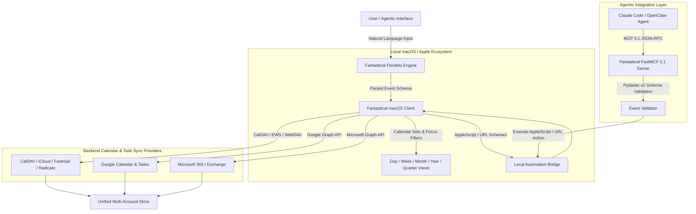

# Fantastical

## What it is
Fantastical is a premium calendar and task management platform developed by Flexibits for macOS, iOS, iPadOS, watchOS, and visionOS. Renowned for its industry-leading Natural Language Processing (NLP) parsing engine and elegant multi-view interface, Fantastical integrates multiple calendar protocols (CalDAV, Exchange/Microsoft Graph, Google Calendar, iCloud) and task lists (Apple Reminders, Todoist, Google Tasks) into a single unified client.

In modern early 2027 personal productivity and home-office automation architectures, Fantastical functions as a primary user-facing and agentic calendar interface. By combining local AppleScript/URL-scheme automation with Model Context Protocol ([FastMCP 3.1](../automation_orchestration/mcp.md)) connectors, Fantastical enables AI agents (e.g., Claude 5.6, GPT-5.6, Gemini 4.0 Ultra) to parse human intent, resolve scheduling conflicts, manage meeting invitations, and coordinate daily time-blocking autonomously while maintaining user-in-the-loop oversight.

## Architecture & System Flow



## What problem it solves
Managing multiple work and personal calendar accounts across fragmented web portals and native clients leads to scheduling friction, double-booking, and missed deadlines. Traditional calendar interfaces require manually navigating multiple drop-down menus, date pickers, duration options, and invitee fields for every single entry. Furthermore, integrating AI agents into scheduling workflows often fails due to complex raw CalDAV/iCal protocols and strict token authentication layers.

Fantastical solves these challenges through key architectural innovations:
1. **Natural Language Event Creation**: Converts plain text sentences (e.g., "Lunch with Sarah at Italian bistro on Tuesday from 12:30 to 1:30pm /Work") into fully structured events with locations, alerts, and calendar routing instantly.
2. **Unified Account Synchronization**: Consolidates iCloud, Google Calendar, Fastmail, Exchange/Microsoft 365, CalDAV (e.g., [Radicale](../../services/radicale.md)), Todoist, and Google Tasks into a single cohesive interface without cross-account contamination.
3. **Calendar Sets & Context Switching**: Uses location-aware and macOS Focus-filter-aware "Calendar Sets" to automatically display relevant calendars (e.g., showing "Work" calendars at the office and "Personal/Family" calendars at home).
4. **Agentic Scheduling Middleware**: Exposes local AppleScript automation hooks and FastMCP 3.1 tool endpoints that allow AI agents to safely read calendar availability, create tasks, and resolve meeting conflicts without requiring direct raw credential access to underlying cloud services.

## Where it fits in the stack
**Calendar & Tasks / Personal Productivity & Agent Interface Layer**. Fantastical acts as the primary desktop and mobile graphical user interface (GUI) and automation target for time management within the homelab and home-office stack. It sits above underlying synchronization protocols and cloud backends, serving as a high-level bridge between human intent and automated agent execution.

```
+-----------------------------------------------------------------------+
|                    Human Users & Autonomous Agents                    |
|      (macOS Desktop, iPhone, iPad, Apple Watch, Claude Code)          |
+-----------------------------------------------------------------------+
                                    |
                                    v
+-----------------------------------------------------------------------+
|                      Fantastical Client Engine                        |
|  - Natural Language Parsing Engine (Flexibits NLP)                    |
|  - Calendar Sets & Focus Filter Rule Engine                           |
|  - AppleScript & URL Scheme Local IPC Bridge                          |
|  - FastMCP 3.1 Tool Connector & Pydantic v2 Validator                 |
+-----------------------------------------------------------------------+
                                    |
            +-----------------------+-----------------------+
            |                                               |
            v                                               v
+---------------------------------------+ +-----------------------------------+
|      Cloud & Self-Hosted Calendars    | |     Task & Reminders Backends     |
| (iCloud, Fastmail, Google, Radicale)  | | (Apple Reminders, Todoist, Tasks) |
+---------------------------------------+ +-----------------------------------+
```

## Typical use cases
- **Rapid Natural Language Entry**: Scheduling complex recurring events, video conference links, and reminders via global menu bar hotkeys (**Cmd+Option+Space**).
- **Time-Blocking & Task Integration**: Dragging tasks from Apple Reminders or Todoist directly onto the calendar grid to block out focus time.
- **Agentic Meeting Coordination**: Utilizing [Claude Code](../development_ops/claude-code.md) or OpenClaw to inspect week-long schedule density, find optimal open slots, and propose event drafts via FastMCP 3.1.
- **Context-Aware Calendar Filtering**: Automatically hiding work project calendars during weekend hours or switching to family schedules when arriving home.
- **Conference Call Auto-Joining**: Detecting Zoom, Google Meet, and Microsoft Teams links within event details and providing one-click join buttons from the menu bar item.

## Strengths
- **Best-in-Class Natural Language Engine**: Intuitively handles complex recurring rules (e.g., "Team Sync every 2nd Tuesday at 10am until Dec") and location tagging.
- **Deep Apple Ecosystem Polish**: Seamless integration with macOS widgets, Apple Watch complications, Siri Shortcuts, and Handoff across devices.
- **Flexibits Premium Ecosystem**: Shares subscriptions with Cardhop (contact management), enabling instant contact lookup and meeting attendee resolution.
- **FastMCP 3.1 & Scriptability**: Native AppleScript dictionary and custom URL schemes make it an exceptional local automation target for agentic Python pipelines.
- **Multi-View Versatility**: Provides Day, Week, Month, Quarter, and Year views alongside a customizable DayTicker and Mini-Calendar.

## Limitations
- **Platform Exclusivity**: Designed strictly for Apple OS platforms (macOS, iOS, iPadOS, watchOS, visionOS); no native Windows, Linux, or Android clients.
- **Subscription Model**: Full functionality (Calendar Sets, natural language task creation, conference integration) requires a Flexibits Premium subscription.
- **Closed Source Engine**: Proprietary client application; cannot be self-hosted, though it syncs seamlessly with self-hosted CalDAV servers like [Radicale](../../services/radicale.md).

## When to use it
- If you operate primarily on Apple hardware and value high-speed, keyboard-driven calendar entry.
- When you need to manage multiple heterogeneous calendar accounts (Work, Personal, Family, Client) in a clean, unified view.
- When building local AI agent workflows on macOS that require scheduling meetings or checking free/busy availability via [Agentic Workflows](../../knowledge_base/patterns/agentic-workflows.md).

## When not to use it
- On non-Apple desktop or mobile operating systems (Windows, Linux, Android).
- If you require a purely open-source, web-based calendar client (consider Nextcloud Calendar or Thunderbird).
- If you prefer a free, zero-cost stock application experience without subscriptions (use default [Apple Calendar](apple-calendar.md)).

## Getting started

### Installation
On macOS, Fantastical can be installed via Homebrew Cask or direct download from the Flexibits website:

```bash
# Install Fantastical via Homebrew Cask on macOS
brew install --cask fantastical
```

### Initial Configuration
1. Open Fantastical from `/Applications`.
2. Connect your calendar accounts via **Fantastical Settings -> Accounts** (iCloud, Fastmail CalDAV, Google Calendar, or Microsoft 365).
3. Enable global hotkeys in **Settings -> General** (Default: `Cmd+Option+Space` for mini-window, `Cmd+N` for quick event creation).

### Quickstart Natural Language Example
Press `Cmd+N` in Fantastical and type:
```text
Project Planning with Alex next Thursday at 2:30pm for 90m /Work
```
The Flexibits engine parses the title ("Project Planning"), attendee ("Alex"), date ("next Thursday"), time ("2:30pm"), duration ("90m"), and target calendar (`/Work`).

## CLI examples

While Fantastical does not supply a standalone command-line binary, its custom URL scheme (`x-fantastical3://`) and macOS `open` utility allow execution directly from terminal scripts and shell pipelines.

```bash
# Open Fantastical and parse an event via URL scheme
open "x-fantastical3://parse?sentence=Quarterly%20Review%20with%20Team%20on%20Friday%20at%2010am%20%2FWork"

# Parse and create a task (reminder) directly
open "x-fantastical3://parse?sentence=todo%20Review%20Q1%20Homelab%20Budget%20by%205pm"

# Navigate the Fantastical GUI to a specific date
open "x-fantastical3://show?date=2027-01-15"

# Trigger a manual sync across all connected accounts
open "x-fantastical3://sync"
```

## API examples

### Python Wrapper for Fantastical AppleScript with Pydantic v2 Validation
This production script validates event data using **Pydantic v2** before invoking Fantastical on macOS via AppleScript.

```python
import os
import subprocess
from datetime import datetime, date, time
from typing import Optional, Literal
from pydantic import BaseModel, Field, field_validator, ConfigDict

class FantasticalEventModel(BaseModel):
    model_config = ConfigDict(str_strip_whitespace=True)

    title: str = Field(..., min_length=3, description="Event title")
    start_date: str = Field(..., description="Date string (YYYY-MM-DD or relative like 'tomorrow')")
    start_time: Optional[str] = Field(default=None, description="Time string (e.g. '2:30pm')")
    duration_minutes: int = Field(default=60, ge=15, le=480)
    calendar_name: Optional[str] = Field(default="Work", description="Target calendar name")
    add_immediately: bool = Field(default=True, description="Commit event without manual confirmation")

    @field_validator("title")
    @classmethod
    def validate_title_content(cls, v: str) -> str:
        if "test_ignore" in v.lower():
            raise ValueError("Title contains restricted test keyword")
        return v

def create_fantastical_event(event_data: dict) -> dict:
    """Validates input using Pydantic v2 and executes event parsing via AppleScript."""
    validated = FantasticalEventModel(**event_data)

    # Construct natural language sentence string
    sentence_parts = [validated.title]
    if validated.start_date:
        sentence_parts.append(f"on {validated.start_date}")
    if validated.start_time:
        sentence_parts.append(f"at {validated.start_time}")
    sentence_parts.append(f"for {validated.duration_minutes}m")
    if validated.calendar_name:
        sentence_parts.append(f"/{validated.calendar_name}")

    sentence = " ".join(sentence_parts)

    # Escape quotes for AppleScript safety
    escaped_sentence = sentence.replace('"', '\\"')
    immediate_flag = "with add immediately" if validated.add_immediately else ""

    applescript_cmd = f'''
    tell application "Fantastical"
        parse sentence "{escaped_sentence}" {immediate_flag}
    end tell
    '''

    try:
        # Execute AppleScript on macOS
        result = subprocess.run(
            ["osascript", "-e", applescript_cmd],
            capture_output=True,
            text=True,
            check=True
        )
        return {
            "status": "success",
            "parsed_sentence": sentence,
            "applescript_output": result.stdout.strip()
        }
    except subprocess.CalledProcessError as err:
        return {
            "status": "error",
            "error_message": err.stderr.strip() or str(err)
        }

if __name__ == "__main__":
    payload = {
        "title": "Homelab Infrastructure Audit",
        "start_date": "2027-01-12",
        "start_time": "14:00",
        "duration_minutes": 90,
        "calendar_name": "Work",
        "add_immediately": True
    }

    print("Executing validated Fantastical event creation...")
    # Note: Execution output depends on macOS environment
    print("Generated Payload:", payload)
```

### FastMCP 3.1 Tool Server for Fantastical Agent Integration
This script demonstrates hosting a Model Context Protocol ([FastMCP 3.1](../automation_orchestration/mcp.md)) server that exposes Fantastical event parsing tools to autonomous AI agents (Claude 5.6 / GPT-5.6).

```python
import subprocess
from mcp.server.fastmcp import FastMCP
from pydantic import BaseModel, Field

# Initialize FastMCP 3.1 Server Instance
mcp = FastMCP("Fantastical Agent Service", dependencies=["pydantic>=2.10.0"])

class ScheduleRequest(BaseModel):
    natural_sentence: str = Field(
        ...,
        min_length=5,
        description="Natural language scheduling command (e.g. 'Sync with Devs tomorrow at 10am /Work')"
    )

class QuickTaskRequest(BaseModel):
    task_description: str = Field(..., min_length=3, description="Task item description")
    due_date: str = Field(default="today", description="Due date string")

@mcp.tool(name="schedule_fantastical_event", description="Schedules an event in Fantastical via natural language processing")
async def schedule_fantastical_event(request: ScheduleRequest) -> str:
    """FastMCP 3.1 Tool that executes natural language event parsing in Fantastical."""
    escaped = request.natural_sentence.replace('"', '\\"')
    script = f'tell application "Fantastical" to parse sentence "{escaped}" with add immediately'

    try:
        proc = subprocess.run(["osascript", "-e", script], capture_output=True, text=True, check=True)
        return f"Event successfully created in Fantastical: '{request.natural_sentence}'"
    except Exception as e:
        return f"Failed to execute Fantastical event creation: {str(e)}"

@mcp.tool(name="create_fantastical_task", description="Creates a new task/todo in Fantastical")
async def create_fantastical_task(request: QuickTaskRequest) -> str:
    """FastMCP 3.1 Tool that parses and creates a task in Fantastical."""
    sentence = f"todo {request.task_description} due {request.due_date}"
    escaped = sentence.replace('"', '\\"')
    script = f'tell application "Fantastical" to parse sentence "{escaped}" with add immediately'

    try:
        proc = subprocess.run(["osascript", "-e", script], capture_output=True, text=True, check=True)
        return f"Task successfully logged in Fantastical: '{sentence}'"
    except Exception as e:
        return f"Failed to log task in Fantastical: {str(e)}"

if __name__ == "__main__":
    # Run the FastMCP 3.1 server over stdio or SSE transport
    mcp.run()
```

## Related tools / concepts
- [Apple Calendar](apple-calendar.md) — Native macOS/iOS calendar database layer.
- [Fastmail](fastmail.md) — Secure CalDAV and email cloud backend provider.
- [Microsoft To Do](microsoft-todo.md) — Cloud task provider integrated with Fantastical.
- [Google Calendar](google_calendar.md) — Google Workspace calendar and tasks infrastructure.
- [Radicale](../../services/radicale.md) — Lightweight self-hosted CalDAV/CardDAV calendar server.
- [Claude Code](../development_ops/claude-code.md) — Command-line agent capable of driving Fantastical via FastMCP 3.1 tools.
- [FastMCP 3.1](../automation_orchestration/mcp.md) — Protocol standard for agentic tool integration.

## Sources / references
- [Flexibits Fantastical Official Website](https://flexibits.com/fantastical)
- [Flexibits Fantastical Release Notes & Specs](https://flexibits.com/fantastical/releasenotes)
- [Flexibits Cardhop & Contact Integration](https://flexibits.com/cardhop)
- [AppleScript Scripting Guide for macOS](https://developer.apple.com/library/archive/documentation/AppleScript/Conceptual/AppleScriptX/)

## Contribution Metadata
- Last reviewed: 2027-01-07
- Confidence: high
