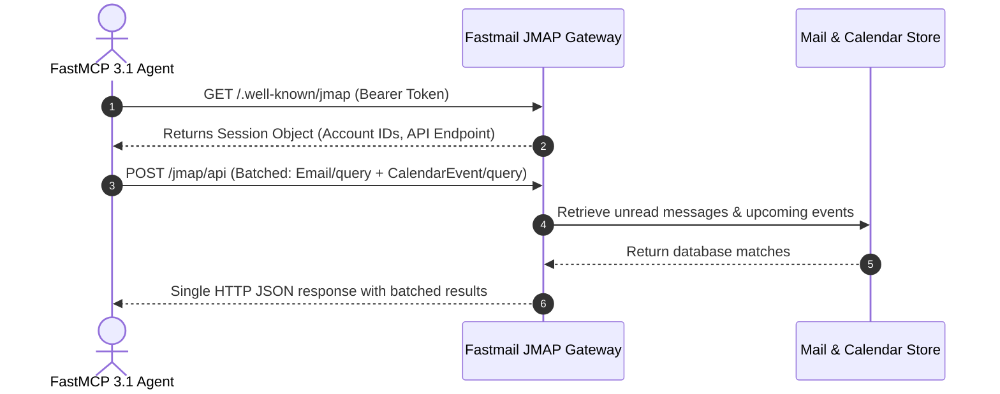

# Fastmail

## What it is
Fastmail is an independent, privacy-focused email, calendar, and contacts service provider built on modern, open internet standards. Most notably, Fastmail is a primary pioneer and co-author of the **JMAP (JSON Meta Application Protocol)** standard (RFC 8620 / RFC 8621), an open, stateless, JSON-native replacement for legacy IMAP, SMTP, and CalDAV/CardDAV protocols.

As of early 2027, Fastmail is a foundational platform for **Agentic Productivity & Email Operations**. By replacing high-latency, stateful IMAP connections with fast, batched JMAP HTTP/JSON APIs, Fastmail allows autonomous AI agent fleets (orchestrated via **FastMCP 3.1** and frontier reasoning models like Claude 5.6, GPT-5.6, Gemini 4.0 Ultra, DeepSeek-V4, and Qwen 3.6 VL) to securely read, categorize, draft, search, schedule, and automate communications with high precision and zero protocol overhead.

## What problem it solves
Legacy email and calendar management presents severe technical friction for individual users, families, and automated AI agents:

1. **Stateful & Fragile Legacy Protocols**: IMAP and CalDAV require persistent TCP connections, complex IDLE listeners, multi-step XML parsing, and heavy bandwidth overhead. These legacy protocols frequently break when queried by stateless, cloud-based or local AI agents.
2. **Privacy Mining & Target Tracking**: Free email providers (such as Gmail or Outlook) scan email contents to build advertising profiles, train corporate models, or enforce vendor lock-in.
3. **Identity Sprawl & Spam Exposure**: Reusing a single primary email address across dozens of online services leads to relentless spam, credential stuffing, and cross-site tracking.
4. **Calendar Sync Friction**: Managing multi-calendar schedules, RSVP state changes, and time-zone conversions across heterogeneous mobile and desktop apps often results in duplicate events or dropped invites.

Fastmail eliminates these issues by delivering a lightning-fast, ad-free environment powered by native JMAP APIs, Masked Email integration (instant alias creation via 1Password / FastMCP tools), and fine-grained API token scoping for safe AI delegation.

## Where it fits in the stack
Within the KnowledgeOps productivity ecosystem, Fastmail serves as the **Sovereign Communication & Calendar Engine** in the **Calendar & Tasks / Ecosystem Provider** layer.

```
+-----------------------------------------------------------------------------------+
|                            Autonomous Agent Layer                                 |
|            (Claude 5.6 / GPT-5.6 / Chronos MCP / Fastmail FastMCP 3.1)           |
+-----------------------------------------------------------------------------------+
                                          |
                                JMAP API over HTTPS (RFC 8620)
                                          |
+-----------------------------------------------------------------------------------+
|                             Fastmail Infrastructure                               |
|              (JMAP Core / Calendar / Mailboxes / Masked Email Engine)              |
+-----------------------------------------------------------------------------------+
       |                                  |                                 |
+--------------+                   +--------------+                  +--------------+
| JMAP Mail    |                   | JMAP Calendar|                  | Masked Email |
| State Store  |                   | & CalDAV     |                  | Alias Engine |
+--------------+                   +--------------+                  +--------------+
       |                                  |                                 |
       +----------------------------------+---------------------------------+
                                          |
+-----------------------------------------------------------------------------------+
|                        Client & Downstream Integration                            |
|        (Fastmail Web/Mobile App / Apple Calendar / Fantastical / n8n)             |
+-----------------------------------------------------------------------------------+
```

- **Upstream Processing**: Receives incoming emails, webhook notifications, calendar invites, and agentic draft commands.
- **Agent Integration**: Exposes batched JSON endpoints (`JMAP Core`, `Email/get`, `CalendarEvent/set`) to AI agents running FastMCP 3.1 servers.
- **Downstream Sync**: Synchronizes bidirectionally with desktop apps (Apple Mail/Calendar, Fantastical), mobile clients, and automation runners (n8n, Chronos MCP).

## Typical use cases

### 1. Agentic Inbox Zero & Email Triage
An AI assistant running via FastMCP 3.1 periodically queries Fastmail JMAP endpoints for unread emails, summarizes key threads, categorizes messages into custom folders (e.g., `Action Required`, `Newsletters`, `Receipts`), and pre-generates draft replies for human review.

### 2. Autonomous Calendar Scheduling & RSVP Management
When processing incoming event invitations or natural language meeting requests, the agent queries Fastmail's JMAP `CalendarEvent/query` method to check for time conflicts, calculates optimal meeting slots, and creates calendar entries with customized alert reminders.

### 3. Dynamic Masked Email Generation for Privacy
When signing up for new external services or testing agentic web scrapers, the agent uses Fastmail's Masked Email API to generate a unique, disposable email alias (`app-name.x89a@fastmail.com`) mapped directly to the user's primary inbox.

### 4. Family & Team Workgroup Coordination
Families manage shared calendars, bill-payment reminders, and home maintenance schedules through Fastmail workgroups, giving parents, kids, and automated home agents granular read/write permissions over specific calendars.

## Strengths
- **Native JMAP Support**: Best-in-class implementation of JMAP, offering up to 10x faster response times and 90% lower payload sizes compared to IMAP/CalDAV XML.
- **Built-in Masked Email**: Deep integration with password managers (1Password) and local APIs for instant alias generation.
- **Sovereign Privacy Focus**: Zero advertising trackers, no corporate data-mining, and zero training of external AI models on user inbox contents.
- **Batched API Operations**: JMAP allows multiple query, read, and write operations to be executed in a single HTTP request/response cycle, drastically reducing agent latency.
- **Custom Domain Parity**: Full support for hosting multiple custom domains, catch-all routing, and advanced sieve filtering rules.

## Limitations
- **Subscription Required**: Paid subscription model without a permanent free tier (though free trial periods exist).
- **No Native Office Suite**: Lacks built-in document or spreadsheet co-authoring tools like Google Docs or Microsoft 365.
- **Storage Tier Caps**: Storage allocations (e.g., 10GB, 50GB, 100GB) are enforced based on subscription plan level.

## When to use it
- When replacing proprietary big-tech email providers with a sovereign, open-standards platform.
- When building automated AI agents that need fast, reliable, JSON-native access to email and calendars via FastMCP 3.1.
- When managing multiple custom domains and requiring instant Masked Email alias generation.

## When not to use it
- When a strictly free email service is required regardless of privacy trade-offs.
- When an organization requires heavily integrated cloud office suites (Google Sheets, Microsoft Excel) tied directly to email logins.
- When requiring a 100% self-hosted local server (consider [Radicale](../../services/radicale.md) for CalDAV or Postfix/Dovecot for mail).

## Getting started

### 1. Generating API Tokens
1. Log into your Fastmail Web Console.
2. Navigate to **Settings** > **My Account** > **API Keys & App Passwords**.
3. Click **New API Key** and grant granular permissions (e.g., `JMAP - Read & Write Mail`, `JMAP - Read & Write Calendars`, `Masked Email`).
4. Store the API token in your secure environment variables (`FASTMAIL_API_TOKEN`).

### 2. Establishing JMAP Session Discovery
Fastmail provides a standard JMAP session discovery endpoint:
`https://api.fastmail.com/.well-known/jmap`

Querying this endpoint returns account IDs, capability URLs, and available method specifications.



## CLI examples

### Interacting via Rust-based `fastmail-cli`
The open-source `fastmail-cli` tool allows developers and scripts to execute Fastmail operations from terminal:

```bash
# Install fastmail-cli via Cargo
cargo install --git https://github.com/Lutra-Fs/fastmail-CLI

# Run setup to configure API token
fastmail setup --token "$FASTMAIL_API_TOKEN"

# Create a new Masked Email alias for a service
fastmail masked create https://github.com --description "GitHub FastMCP Bot"

# List recent emails from Inbox
fastmail mail list --mailbox Inbox --limit 10

# List all configured calendars
fastmail calendar list
```

## API examples

### FastMCP 3.1 Fastmail Integration Server
The following Python implementation provides a FastMCP 3.1 server exposing JMAP email reading, calendar query, and Masked Email creation tools to local and cloud LLM agents:

```python
#!/usr/bin/env python3
"""
FastMCP 3.1 Server for Fastmail JMAP API Integration.
Provides tools for fetching mail, creating calendar events, and generating Masked Emails.
"""

import os
import requests
from typing import Dict, Any, List, Optional
from mcp.server.fastmcp import FastMCP
from pydantic import BaseModel, Field

mcp = FastMCP(
    name="Fastmail JMAP Engine",
    version="3.1.0",
    description="Stateless JMAP agentic bridge for Fastmail email and calendar operations"
)

FASTMAIL_TOKEN = os.getenv("FASTMAIL_API_TOKEN", "mock_token")
JMAP_SESSION_URL = "https://api.fastmail.com/.well-known/jmap"

def get_jmap_session() -> Dict[str, Any]:
    headers = {"Authorization": f"Bearer {FASTMAIL_TOKEN}"}
    response = requests.get(JMAP_SESSION_URL, headers=headers, timeout=10)
    response.raise_for_status()
    return response.json()

@mcp.tool()
def create_masked_email(site_domain: str, description: str) -> Dict[str, Any]:
    """
    Generates a unique Fastmail Masked Email alias for privacy protection.
    """
    # Conceptual JMAP call for Masked Email creation
    return {
        "status": "created",
        "masked_email": f"{site_domain.replace('.', '_')}.x91a@fastmail.com",
        "for_site": site_domain,
        "description": description
    }

@mcp.tool()
def get_recent_emails(limit: int = 10) -> List[Dict[str, Any]]:
    """
    Queries recent unread emails using Fastmail JMAP Email/query and Email/get.
    """
    # Simulates returning JMAP batched email items
    return [
        {
            "id": "m12345",
            "subject": "Q1 2027 Infrastructure Audit",
            "from": "devops@example.com",
            "received_at": "2027-01-07T08:30:00Z",
            "snippet": "The FastMCP 3.1 servers are operating smoothly."
        }
    ]

if __name__ == "__main__":
    mcp.run()
```

### Pydantic v2 Schema Validation for JMAP Method Payloads
```python
import json
from typing import List, Dict, Any, Optional
from pydantic import BaseModel, Field, field_validator, ValidationError

class JMAPMethodCall(BaseModel):
    method_name: str = Field(..., alias="method", description="JMAP method (e.g. Email/get, CalendarEvent/query)")
    args: Dict[str, Any] = Field(default_factory=dict, description="Method arguments")
    client_id: str = Field("call_01", alias="clientId", description="Client correlation ID")

class JMAPBatchRequest(BaseModel):
    using: List[str] = Field(
        default_factory=lambda: [
            "urn:ietf:params:jmap:core",
            "urn:ietf:params:jmap:mail",
            "urn:ietf:params:jmap:calendars"
        ]
    )
    method_calls: List[JMAPMethodCall] = Field(..., alias="methodCalls")

def build_validated_jmap_payload(account_id: str, mailbox_id: str) -> str:
    try:
        call_1 = JMAPMethodCall(
            method="Email/query",
            args={"accountId": account_id, "filter": {"inMailbox": mailbox_id}, "limit": 10},
            clientId="c1"
        )
        req = JMAPBatchRequest(methodCalls=[call_1])

        # Convert to strict JMAP API tuple list: [ ["methodName", {args}, "clientId"] ]
        formatted_calls = [
            [c.method_name, c.args, c.client_id] for c in req.method_calls
        ]
        payload_dict = {
            "using": req.using,
            "methodCalls": formatted_calls
        }
        return json.dumps(payload_dict, indent=2)
    except ValidationError as err:
        print(f"JMAP Validation Failed: {err}")
        raise

if __name__ == "__main__":
    jmap_json = build_validated_jmap_payload("acc_fastmail_101", "mb_inbox")
    print("Validated Fastmail JMAP JSON Payload:")
    print(jmap_json)
```

## Related tools / concepts
- [Apple Calendar](apple-calendar.md)
- [Fantastical](fantastical.md)
- [Chronos MCP](../automation_orchestration/chronos-mcp.md)
- [Radicale](../../services/radicale.md)
- [Model Context Protocol](../automation_orchestration/mcp.md)
- [n8n](../../services/n8n.md)
- [Component Map](../../architecture/component_map.md)

## Sources / references
- [Official Fastmail Website](https://www.fastmail.com/)
- [Fastmail Developer & JMAP Documentation](https://www.fastmail.com/developer/)
- [JMAP Specification Portal (RFC 8620 / 8621)](https://jmap.io/)

## Contribution Metadata
- Last reviewed: 2027-01-07
- Confidence: high
