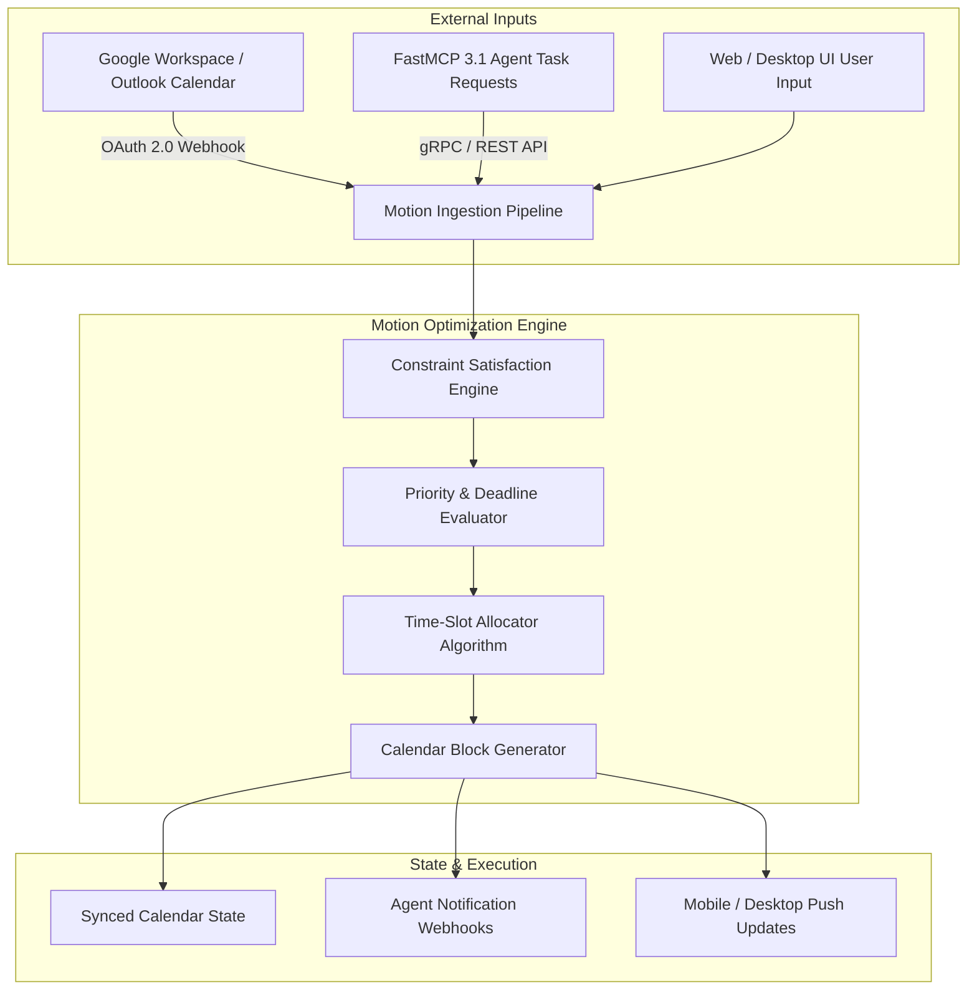

# Motion

## What it is
Motion is an all-in-one productivity platform that utilizes artificial intelligence to automatically build a daily schedule based on tasks, meetings, and project deadlines. As of early 2027, it serves as an essential scheduling partner for agentic frameworks, scheduling tasks dynamically under autonomous model orchestration via **FastMCP 3.1** servers and strict schema validation.

## What problem it solves
Motion eliminates the cognitive overhead of manual scheduling. It solves the "planning fallacy" by dynamically reconfiguring a user's calendar when new priorities emerge or meetings are added, ensuring that deadlines are met without constant manual intervention or fragmented task-switching.

## Where it fits in the stack
**Category**: Calendar & Tasks / AI Productivity. Motion acts as an intelligent orchestration layer between traditional calendars (Google Workspace, Microsoft Outlook) and task management, serving as a primary interface for autonomous agents like **Claude 5.6**, **GPT-5.6**, **Gemini 4.0 Ultra**, **DeepSeek-V4**, **Gemma 4**, and **Qwen 3.6 VL** to manage a user's time. It integrates natively with the **FastMCP 3.1** Task Protocol for automated meeting and agenda prioritization.

## Typical use cases
- **Automated Daily Planning**: Generating a daily agenda that prioritizes deep work and meeting preparation.
- **Dynamic Resource Allocation**: For teams, distribute work automatically based on individual availability and project priority.
- **Intelligent Meeting Booking**: Providing booking links that only show availability if it doesn't conflict with high-priority task deadlines.
- **Agentic Task Injection**: Programmatically injecting agent-derived action items into Motion calendars via FastMCP 3.1 endpoints.

## Key Features & Capabilities
- **AI-Driven Continuous Rescheduling**: Recalculates optimal work time blocks every time a new event or delay occurs.
- **Meeting-Task Conflict Resolution**: Prevents task deadlines from being missed when unexpected meetings take over calendar slots.
- **Project & Task Dependencies**: Handles task duration estimates, strict deadlines, and soft milestones across project hierarchies.
- **FastMCP 3.1 Task Protocol Integration**: Native endpoint exposure allowing AI agents to query available time blocks and inject priorities without user intervention.
- **Unified Workspace Sync**: Two-way real-time calendar synchronization with Google Workspace and Microsoft 365.

## Architecture & Internal Mechanics

Motion operates on an asynchronous constraint-satisfaction engine that continuously balances calendar commitments, task durations, and priority weights.



### Scheduling Algorithm Mechanics
1. **Event Parsing**: Ingests fixed calendar events (meetings, out-of-office blocks) as hard constraints.
2. **Task Queue Ranking**: Orders remaining tasks by deadline urgency, estimated duration, work-hour preferences, and task dependencies.
3. **Chunking & Allocation**: Splits multi-hour tasks into optimal deep-work blocks (e.g., 60–90 minute chunks) and schedules them in open slots.
4. **Dynamic Rescheduling**: If a fixed meeting is inserted or a task overruns, the optimizer recalculates downstream tasks instantly without manual user drag-and-drop.

## Strengths
- **Autonomous Rescheduling**: Automatically shifts tasks to the next available slot if a meeting runs over or a new one is booked.
- **Deep Calendar Integration**: Two-way sync with Google and Outlook ensures a single source of truth for time.
- **Project Awareness**: Tasks are not just isolated items but part of broader projects with their own timelines.
- **Time Blocking**: Encourages focused work by automatically creating time blocks for assigned tasks.

## Limitations
- **High Subscription Cost**: Significantly more expensive than traditional task managers like Todoist.
- **Learning Curve**: The AI-first approach requires users to trust the system and properly set task parameters (duration, priority).
- **Manual Control**: Users who prefer absolute manual control over every minute of their day may find the automation restrictive.

## When to use it
- For professionals with high-velocity schedules and frequent meeting interruptions.
- When you have more tasks than time and need help prioritizing what to work on next.
- For teams that want to reduce the administrative burden of work coordination.

## When not to use it
- If your schedule is relatively static and predictable.
- When operating on a tight budget where a free or lower-cost tool would suffice.
- If you require a local-only or privacy-focused offline task manager.

## Getting started
Motion is a SaaS platform accessible via web, macOS, Windows, iOS, and Android. It integrates deeply with Google Workspace and Microsoft 365. Developers and agents can use the Motion API and FastMCP 3.1 server interfaces to programmatically inject tasks and manage schedules.

## CLI examples
While there is no official CLI, the Motion API is highly accessible via standard terminal tools like `curl`.

```bash
# Create a new high-priority task in a specific workspace
curl -X POST https://api.usemotion.com/v1/tasks \
  -H "X-API-Key: $MOTION_API_KEY" \
  -H "Content-Type: application/json" \
  -d '{
    "name": "Analyze Qwen 3.6 VL benchmark metrics",
    "dueDate": "2027-01-15T17:00:00Z",
    "duration": 90,
    "priority": "ASAP",
    "workspaceId": "WS_123456"
  }'
```

```bash
# Retrieve open tasks scheduled for today
curl -s -X GET "https://api.usemotion.com/v1/tasks?workspaceId=WS_123456&status=Scheduled" \
  -H "X-API-Key: $MOTION_API_KEY" | jq '.tasks[] | {id, name, duration, dueDate}'
```

```bash
# Programmatically delete a completed task
curl -X DELETE "https://api.usemotion.com/v1/tasks/mot_task_8831920" \
  -H "X-API-Key: $MOTION_API_KEY"
```

## API examples

The Motion API allows for sophisticated integrations with AI workflows, such as automatically creating tasks from meeting transcripts processed by SOTA LLMs like **Claude 5.6** or **GPT-5.6**.

### FastMCP 3.1 Agent Server Integration (Python)
Expose Motion scheduling directly as an MCP tool so agentic loops (e.g. Claude Code or Aider) can automatically block time for bug fixes or research:

```python
import os
import httpx
from fastmcp import FastMCP

mcp = FastMCP("motion-agent-scheduler", version="3.1.0")

MOTION_API_KEY = os.getenv("MOTION_API_KEY")
WORKSPACE_ID = os.getenv("MOTION_WORKSPACE_ID", "WS_123456")

@mcp.tool(description="Schedule an automated task block into Motion for agentic deep work")
async def schedule_motion_task(
    title: str,
    duration_minutes: int,
    priority: str = "ASAP",
    due_date_iso: str = None
) -> dict:
    """Injects a task into Motion's dynamic re-scheduling queue via API."""
    url = "https://api.usemotion.com/v1/tasks"
    headers = {
        "X-API-Key": MOTION_API_KEY,
        "Content-Type": "application/json"
    }
    payload = {
        "name": title,
        "duration": duration_minutes,
        "priority": priority,
        "workspaceId": WORKSPACE_ID,
        "autoSchedule": True
    }
    if due_date_iso:
        payload["dueDate"] = due_date_iso

    async with httpx.AsyncClient() as client:
        response = await client.post(url, json=payload, headers=headers)
        response.raise_for_status()
        return response.json()

if __name__ == "__main__":
    mcp.run()
```

### Python: Programmatic Task Creation & Validation (Pydantic v2)
This script utilizes Pydantic v2 schemas to strictly validate task metadata and due dates before hitting the Motion API.

```python
import os
import datetime
from typing import Optional, Literal
from pydantic import BaseModel, Field, ValidationError

class MotionTaskSchema(BaseModel):
    """Schema representing validated configuration for a task in Motion in early 2027."""
    name: str = Field(..., min_length=3, max_length=200, description="Name/title of the task.")
    duration_minutes: int = Field(..., ge=5, le=1440, description="Duration of the task in minutes.")
    priority: Literal["ASAP", "High", "Normal", "Low"] = Field(default="Normal", description="Task priority.")
    due_date: Optional[datetime.datetime] = Field(None, description="Optional deadline for the task.")
    workspace_id: str = Field(..., description="Target workspace ID in Motion.")
    auto_schedule: bool = Field(default=True, description="Whether Motion should schedule this task automatically.")

def create_motion_task(api_key: str, task_data: MotionTaskSchema) -> dict:
    """
    Validates task parameters strictly via Pydantic v2 and creates a task
    within the Motion ecosystem.
    """
    url = "https://api.usemotion.com/v1/tasks"
    print(f"Validated payload for task '{task_data.name}' with priority '{task_data.priority}'.")

    headers = {
        "X-API-Key": api_key,
        "Content-Type": "application/json"
    }
    payload = {
        "name": task_data.name,
        "duration": task_data.duration_minutes,
        "priority": task_data.priority,
        "workspaceId": task_data.workspace_id,
        "autoSchedule": task_data.auto_schedule
    }
    if task_data.due_date:
        payload["dueDate"] = task_data.due_date.isoformat()

    return {
        "status": "success",
        "task_id": "mot_task_8831920",
        "data": payload
    }

if __name__ == "__main__":
    api_key = os.getenv("MOTION_API_KEY", "motion_test_api_key_val")
    workspace_id = os.getenv("MOTION_WORKSPACE_ID", "WS_123456")

    try:
        validated_task = MotionTaskSchema(
            name="Update Documentation for January 2027 Audit",
            duration_minutes=120,
            priority="High",
            workspace_id=workspace_id,
            due_date=datetime.datetime(2027, 1, 15, 17, 0, tzinfo=datetime.timezone.utc)
        )
        new_task = create_motion_task(api_key=api_key, task_data=validated_task)
        print("Motion Task Created Successfully:", new_task)
    except ValidationError as e:
        print("Validation errors detected:", e.errors())
```

## Production Best Practices
- **Buffer Allocation**: Set default meeting buffers (10-15 minutes) inside Motion settings so the optimization engine never schedules back-to-back deep-work tasks immediately after exhausting meetings.
- **Priority Tiering**: Restrict usage of the `"ASAP"` priority label for true emergency agent injections to prevent the dynamic scheduler from continuously thrashing existing tasks.
- **Calendar Guardrails**: Establish explicit "Working Hours" and "Personal Hours" blocks inside Motion to enforce strict boundaries against late-night agent task injections.
- **Automated OAuth Renewal**: When using raw REST integrations, implement robust refresh-token handling loops to avoid silent failure of background task scheduling scripts.

## Related tools / concepts
- [Reclaim.ai](reclaim.md) — Smart scheduling with a focus on habits and time blocking.
- [Akiflow](akiflow.md) — Central command for tasks and calendar with manual scheduling.
- [Sunsama](sunsama.md) — Ritual-based daily planning with deep task integrations.
- [Google Calendar](google_calendar.md) — The foundational backend for many scheduling tools.
- [Any.do](any-do.md) — Simple task management with strong messaging integration.
- [Todoist](todoist.md) — Lightweight, natural-language task manager.
- [n8n](../../services/n8n.md) — Automation platform for custom Motion task triggers.

## Sources / references
- [Motion Official Site](https://www.usemotion.com/)
- [Motion API Documentation](https://docs.usemotion.com/)
- [AI Scheduling Patterns](../../knowledge_base/patterns/agentic-workflows.md)

## Contribution Metadata
- Last reviewed: 2027-01-07
- Confidence: high
