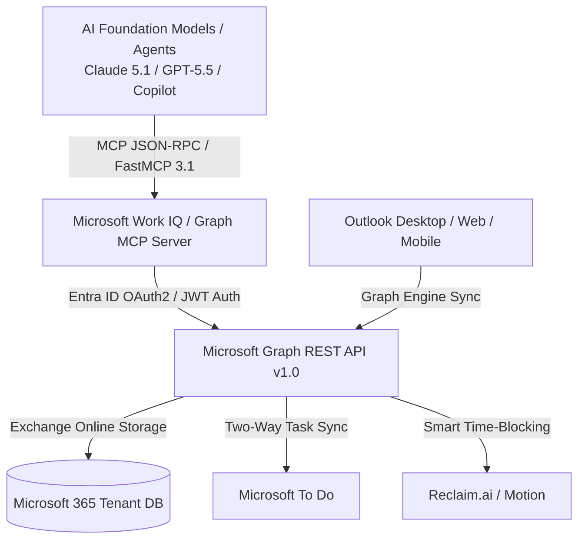

# Microsoft Outlook Calendar

## What it is
Microsoft Outlook Calendar is the enterprise-standard scheduling and time management platform within the Microsoft 365 ecosystem. As of early 2027, Outlook Calendar is deeply integrated with **Microsoft Work IQ** and Microsoft Graph API endpoints, exposing mail, meeting, and resource data to AI agents via **FastMCP 3.1** (Model Context Protocol) specifications.

## What problem it solves
Large organizations and individual power users face complex scheduling constraints, cross-tenant availability conflicts, resource booking (conference rooms, equipment), and compliance policies. Outlook Calendar simplifies these challenges through centralized governance, automated meeting transcription/summarization via Microsoft 365 Copilot, and agentic calendar orchestration.

## Where it fits in the stack
**Category**: Calendar & Tasks / Personal Information Management. Serves as the core enterprise calendar infrastructure connecting enterprise directories (Entra ID), task services ([Microsoft To Do](microsoft-todo.md)), workflow engines ([n8n](../../services/n8n.md)), and AI agent frameworks via Microsoft Graph FastMCP 3.1 servers.

## System Architecture

The following Mermaid diagram maps the agent interaction flow, Microsoft Entra ID OAuth layer, Microsoft Graph REST endpoints, and Work IQ MCP integration:



## Typical use cases
- **Enterprise Meeting Orchestration**: Schedule complex multi-attendee meetings, reserve physical conference rooms, and automatically attach Microsoft Teams links.
- **Agentic Schedule Optimization**: Allow AI assistants (**Claude 5.1**, **GPT-5.5**) to find optimal open slots using Microsoft Work IQ `findMeetingTimes` Graph calls.
- **Hybrid Workplace Management**: Set remote vs. in-office work locations and automatically adjust meeting room configurations.
- **Meeting Lifecycle Automation**: Extract key action items and meeting transcripts using Copilot and push follow-up tasks to [Microsoft To Do](microsoft-todo.md).

## Strengths
- **Microsoft 365 Ecosystem Alignment**: Native integration with Teams, SharePoint, OneDrive, and Entra ID (Azure AD).
- **Enterprise-Grade Governance**: Centralized IT security controls, retention policies, and eDiscovery compliance.
- **FastMCP 3.1 Work IQ Integration**: First-party FastMCP 3.1 servers enable secure agentic reasoning over enterprise schedules.
- **Flexible Client Interfaces**: Desktop (macOS/Windows), Web (Outlook.com / M365), and mobile apps (iOS/Android).

## Limitations
- **API Authentication Setup**: Consuming the Microsoft Graph API requires registering Entra ID Applications and handling OAuth2 consent flows.
- **Closed Cloud Platform**: Closed-source proprietary service; self-hosting Exchange Server is obsolete for modern cloud-native M365 features.
- **Complex UI Configuration**: Custom tenant configurations and delegate permissions require IT admin expertise.

## When to use it
- If your enterprise or team relies on Microsoft 365, Teams, and Entra ID identity management.
- When requiring corporate eDiscovery, audit compliance, and enterprise delegate access controls.
- When enabling AI agents to coordinate meetings securely across organizational boundaries via FastMCP 3.1.

## When not to use it
- For personal, non-corporate scheduling where [Google Calendar](google_calendar.md) or [Proton Calendar](proton_calendar.md) are preferred.
- If your policy demands a 100% self-hosted, local-first calendar engine (consider [Vikunja](../../services/vikunja.md)).

## Getting started

### CLI for Microsoft 365 Setup
1. Install the CLI for Microsoft 365 globally via npm:
   ```bash
   npm install -g @pnp/cli-microsoft365
   ```
2. Log in using your tenant credentials:
   ```bash
   m365 login
   ```
3. Test connectivity by listing upcoming events:
   ```bash
   m365 outlook event list
   ```

## CLI examples

### Running the Official FastMCP 3.1 Server
Launch the CLI for Microsoft 365 directly in FastMCP 3.1 server mode to provide agents with secure, authenticated calendar tools:

```bash
# Start CLI in FastMCP 3.1 server mode
m365 mcp start
```

### Administrative Calendar Commands
```bash
# List available conference rooms in a specific location
m365 outlook room list --placeName "Executive Boardroom"

# Add a calendar event with a native Teams meeting link
m365 outlook event add \
  --subject "Quarterly FastMCP 3.1 Governance Audit" \
  --start "2027-01-22T10:00:00" \
  --end "2027-01-22T11:00:00" \
  --isOnlineMeeting true
```

## API examples

### Pydantic v2 Payload Validation for Microsoft Graph API
Programmatic event creation against the Microsoft Graph REST API `v1.0/me/events` endpoint must be validated using **Pydantic v2** schemas under early 2027 guidelines.

```python
import os
import requests
from datetime import datetime
from typing import List, Optional
from pydantic import BaseModel, Field, EmailStr, ValidationError

class DateTimeTimeZone(BaseModel):
    dateTime: str = Field(..., description="ISO 8601 formatted datetime string e.g. 2027-01-22T14:00:00Z")
    timeZone: str = Field(default="UTC", description="Timezone identifier e.g. UTC or Eastern Standard Time")

class EmailAddress(BaseModel):
    name: str = Field(..., description="Attendee full name")
    address: EmailStr = Field(..., description="Attendee corporate email address")

class Attendee(BaseModel):
    emailAddress: EmailAddress
    type: str = Field(default="required", description="Attendee type: required, optional, resource")

class OutlookEventPayload(BaseModel):
    subject: str = Field(..., min_length=1, max_length=150, description="Meeting title")
    bodyPreview: Optional[str] = Field(default=None, description="Event body preview string")
    start: DateTimeTimeZone
    end: DateTimeTimeZone
    attendees: List[Attendee] = Field(default_factory=list)
    isOnlineMeeting: bool = Field(default=True, description="Automatically generate Teams meeting link")

# Raw payload from AI agent or workflow script
raw_graph_payload = {
    "subject": "Microsoft Graph & FastMCP 3.1 Architecture Review",
    "bodyPreview": "Validating Outlook Calendar models and Work IQ integration.",
    "start": {
        "dateTime": "2027-01-22T14:00:00Z",
        "timeZone": "UTC"
    },
    "end": {
        "dateTime": "2027-01-22T15:00:00Z",
        "timeZone": "UTC"
    },
    "attendees": [
        {
            "emailAddress": {
                "name": "Jane Doe",
                "address": "jane.doe@contoso.com"
            },
            "type": "required"
        }
    ],
    "isOnlineMeeting": True
}

try:
    # Execute strict Pydantic v2 schema validation
    validated_event = OutlookEventPayload.model_validate(raw_graph_payload)
    print(f"Validated Outlook event payload successfully: '{validated_event.subject}'")

    # API Dispatch logic:
    token = os.getenv("MICROSOFT_GRAPH_TOKEN", "mock_token")
    headers = {
        "Authorization": f"Bearer {token}",
        "Content-Type": "application/json"
    }
    # response = requests.post("https://graph.microsoft.com/v1.0/me/events", headers=headers, json=validated_event.model_dump(by_alias=True))
except ValidationError as e:
    print(f"Schema validation error: {e}")
```

### FastMCP 3.1 Work IQ Integration
Microsoft provides official **Work IQ FastMCP servers** for M365 enterprise tenants.

**MCP Server Configuration (`claude_desktop_config.json`)**:
```json
{
  "mcpServers": {
    "microsoft_graph": {
      "command": "m365",
      "args": ["mcp", "start"]
    }
  }
}
```

**Exposed MCP Agent Tools**:
- `mcp_outlook_list_events`: Retrieve user calendar events for a specific timeframe.
- `mcp_outlook_create_event`: Schedule meetings with automatic Teams integration.
- `mcp_outlook_find_meeting_times`: Find optimal meeting slots for multi-user groups.

## Licensing and cost
- **Open Source**: No
- **Cost**: Commercial (Included in Microsoft 365 Business / Enterprise suites; free tier available for personal Outlook.com accounts)
- **Self-hostable**: No (Cloud M365)

## Related tools / concepts
- [Google Calendar](google_calendar.md) — Main cloud calendar alternative.
- [Microsoft Graph](../providers/microsoft-graph.md) — Unified Microsoft 365 API portal.
- [Microsoft To Do](microsoft-todo.md) — Task management integration partner.
- [Reclaim.ai](reclaim.md) — AI time-blocking partner for Outlook.
- [Notion Calendar](notion-calendar.md) — High-speed keyboard-driven calendar frontend.
- [Model Context Protocol](../../knowledge_base/patterns/tool-calling-and-mcp.md) — FastMCP 3.1 specification.
- [n8n](../../services/n8n.md) — Enterprise workflow automation engine.

## Sources / references
- [Microsoft Outlook Official Portal](https://outlook.live.com/)
- [Microsoft Graph API Reference](https://developer.microsoft.com/en-us/graph)
- [CLI for Microsoft 365 Documentation](https://pnp.github.io/cli-microsoft365/)

---
## Contribution Metadata
- Last reviewed: 2027-01-07
- Confidence: high
