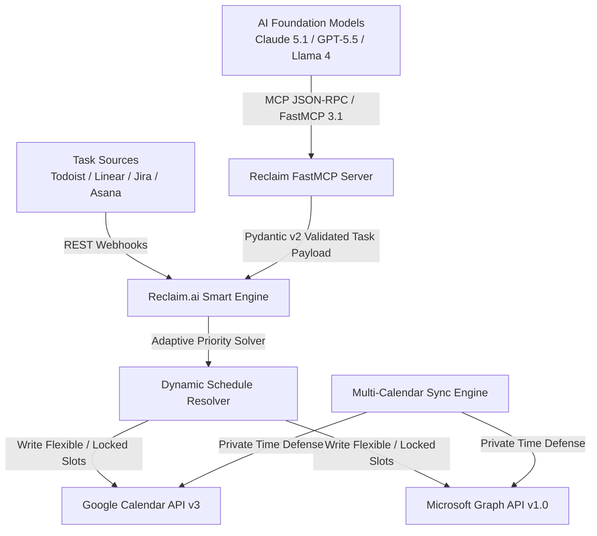

# Reclaim.ai

## What it is
Reclaim.ai is an AI-driven adaptive calendar and time-blocking engine that integrates with [Google Calendar](google_calendar.md) and [Outlook](outlook.md) to automatically schedule tasks, recurring habits, buffer time, and focus blocks. Following its acquisition by **Dropbox** (July 2024) and integration into Dropbox Workspaces, Reclaim provides enterprise scheduling intelligence while maintaining native **FastMCP 3.1** (Model Context Protocol) capabilities for autonomous AI agents (**Claude 5.1**, **GPT-5.5**, **Llama 4**).

## What problem it solves
Managing packed calendars requires constant manual adjustment as meetings shift, priorities conflict, and task deadlines approach ("calendar tetris"). Reclaim solves this by dynamically making scheduled tasks flexible ("Ideal" vs. "Locked" status), automatically shifting focus time and habits around incoming high-priority meeting invites without exposing private calendar details across multiple accounts.

## Where it fits in the stack
**Category**: Calendar & Tasks / Scheduling Automation. Sits between upstream task managers ([Todoist](todoist.md), Asana, Linear, Jira) and downstream cloud calendar backends ([Google Calendar](google_calendar.md), [Outlook](outlook.md)).

## System Architecture

The following Mermaid diagram maps the task ingestion pipeline, priority solver, calendar sync layer, and FastMCP 3.1 agent tools:



## Typical use cases
- **Adaptive Time-Blocking**: Automatically schedule task duration blocks from [Todoist](todoist.md) or Linear directly onto work calendars.
- **Dynamic Habit Protection**: Maintain recurring health, exercise, or learning habits that shift automatically when meeting conflicts arise.
- **Cross-Account Calendar Defense**: Protect personal appointments on work calendars by auto-blocking generic "Personal Commitment" slots across Google Calendar and Outlook.
- **Agentic Schedule Orchestration**: Allow AI assistants (**Claude 5.1**, **GPT-5.5**) to adjust task deadlines or add emergency deep work blocks using FastMCP 3.1 tool calls.

## Strengths
- **Dynamic Priority Engine**: Differentiates between flexible "Ideal" times and locked hard deadlines.
- **Native Multi-Calendar Sync**: Real-time bi-directional sync protecting personal calendars on enterprise work accounts.
- **Deep Upstream Ecosystem**: Pre-built native integrations for Todoist, Linear, Asana, Jira, and Slack.
- **FastMCP 3.1 Agent Readiness**: First-class Model Context Protocol integration for agentic schedule control.

## Limitations
- **Closed Cloud Platform**: Proprietary SaaS engine without a self-hosted open-source version.
- **Control Trade-Off**: Fully automated rescheduling can feel intrusive for users who demand fixed manual slot placement.
- **iCloud Ecosystem Limits**: Primarily optimized for Google Workspace and Microsoft 365, with limited Apple iCloud calendar support.

## When to use it
- When you struggle to protect uninterrupted deep work time on a busy calendar.
- When syncing personal and professional schedules across separate Google Workspace and Microsoft 365 accounts.
- When building an agentic scheduling setup using **Claude 5.1** or **GPT-5.5** via FastMCP 3.1.

## When not to use it
- If you prefer a completely manual, fixed-time calendar setup without AI automation.
- If your policy demands a 100% self-hosted, local-first calendar tool (consider [Vikunja](../../services/vikunja.md)).

## Getting started

### API Access Setup
1. Sign up at [Reclaim.ai](https://reclaim.ai/).
2. Navigate to **Settings > Integrations > API** to copy your Personal API Key.
3. Verify account connection using Python:

```python
import os
import requests

api_key = os.getenv("RECLAIM_API_KEY", "your_api_key")
headers = {
    "Authorization": f"Bearer {api_key}",
    "Content-Type": "application/json"
}

response = requests.get("https://api.app.reclaim.ai/api/users/current", headers=headers)
if response.status_code == 200:
    print(f"Connected to Reclaim as: {response.json().get('email')}")
```

## CLI examples

### cURL API Commands
Interact with Reclaim tasks and settings directly via command line HTTP calls:

```bash
# 1. Fetch current authenticated user info
curl -s -H "Authorization: Bearer $RECLAIM_API_KEY" \
  https://api.app.reclaim.ai/api/users/current

# 2. Query all currently scheduled tasks
curl -s -H "Authorization: Bearer $RECLAIM_API_KEY" \
  https://api.app.reclaim.ai/api/tasks

# 3. Create a new task with focus time duration
curl -s -X POST -H "Authorization: Bearer $RECLAIM_API_KEY" \
  -H "Content-Type: application/json" \
  -d '{
    "title": "Perform FastMCP 3.1 Security Review",
    "eventCategory": "WORK",
    "timeChunksRequired": 4,
    "priority": "P1"
  }' \
  https://api.app.reclaim.ai/api/tasks
```

## API examples

### Pydantic v2 Schema Validation for Reclaim Tasks
Programmatic task creation should be validated using **Pydantic v2** models before POSTing to the Reclaim REST API endpoints under early 2027 standards.

```python
import os
import requests
from datetime import datetime
from typing import Optional, Literal
from pydantic import BaseModel, Field, field_validator, ValidationError

class ReclaimTaskPayload(BaseModel):
    title: str = Field(..., min_length=1, max_length=150, description="Task title string")
    priority: Literal["P1", "P2", "P3", "P4"] = Field(default="P2", description="Priority tier: P1 (urgent) to P4 (low)")
    eventCategory: Literal["WORK", "PERSONAL"] = Field(default="WORK", description="Event classification")
    timeChunksRequired: int = Field(default=2, ge=1, le=32, description="Number of 15-min time chunks e.g. 4 = 1 hour")
    due: datetime = Field(..., description="Target completion deadline timestamp")
    notes: Optional[str] = Field(default=None, description="Markdown description or agent notes")

    @field_validator("due")
    @classmethod
    def validate_due_date(cls, v: datetime) -> datetime:
        if v.timestamp() < datetime.now().timestamp():
            raise ValueError("Due date timestamp must be in the future.")
        return v

# Raw incoming data from AI agent or automation pipeline
raw_task_data = {
    "title": "Perform Quarterly FastMCP 3.1 Audit with Claude 5.1",
    "priority": "P1",
    "eventCategory": "WORK",
    "timeChunksRequired": 6,  # 1.5 hours
    "due": "2027-01-25T17:00:00Z",
    "notes": "Verify Pydantic v2 schemas and relative link integrity across docs."
}

try:
    # Execute strict Pydantic v2 validation
    validated_task = ReclaimTaskPayload.model_validate(raw_task_data)
    print(f"Validated Reclaim task successfully: '{validated_task.title}' [Chunks: {validated_task.timeChunksRequired}]")

    # API Dispatch logic:
    api_key = os.getenv("RECLAIM_API_KEY", "mock_key")
    headers = {
        "Authorization": f"Bearer {api_key}",
        "Content-Type": "application/json"
    }
    # response = requests.post("https://api.app.reclaim.ai/api/tasks", headers=headers, json=validated_task.model_dump(mode="json"))
except ValidationError as e:
    print(f"Validation error: {e}")
```

### FastMCP 3.1 Integration
Integrate Reclaim.ai with agent desktop runtimes (**Claude 5.1**, **GPT-5.5**) via MCP config (`claude_desktop_config.json`):

```json
{
  "mcpServers": {
    "reclaim": {
      "command": "npx",
      "args": ["-y", "reclaim-mcp-server"],
      "env": {
        "RECLAIM_API_KEY": "YOUR_RECLAIM_API_KEY"
      }
    }
  }
}
```

**Exposed FastMCP Tools**:
- `reclaim_list_tasks`: Inspect active and upcoming scheduled tasks.
- `reclaim_create_task`: Insert a new task with duration, priority, and deadline.
- `reclaim_add_time`: Dynamically extend focus duration on an existing task.

## Licensing and cost
- **Open Source**: No
- **Cost**: Freemium (Personal starter free; Paid plans for team features & advanced integrations)
- **Self-hostable**: No

## Related tools / concepts
- [Google Calendar](google_calendar.md) — Backend cloud calendar provider.
- [Microsoft Outlook](outlook.md) — Enterprise cloud calendar provider.
- [Todoist](todoist.md) — Task management integration partner.
- [Motion](motion.md) — AI calendar auto-scheduling alternative.
- [Notion Calendar](notion-calendar.md) — Fast calendar client frontend.
- [Vikunja](../../services/vikunja.md) — Open-source, self-hosted task alternative.
- [Model Context Protocol](../../knowledge_base/patterns/tool-calling-and-mcp.md) — FastMCP 3.1 specification.

## Sources / references
- [Reclaim.ai Official Site](https://reclaim.ai/)
- [Reclaim Developer API Documentation](https://api.app.reclaim.ai/api/docs)
- [Reclaim FastMCP Server Repository](https://github.com/jj3ny/reclaim-mcp-server)

---
## Contribution Metadata
- Last reviewed: 2027-01-07
- Confidence: high
