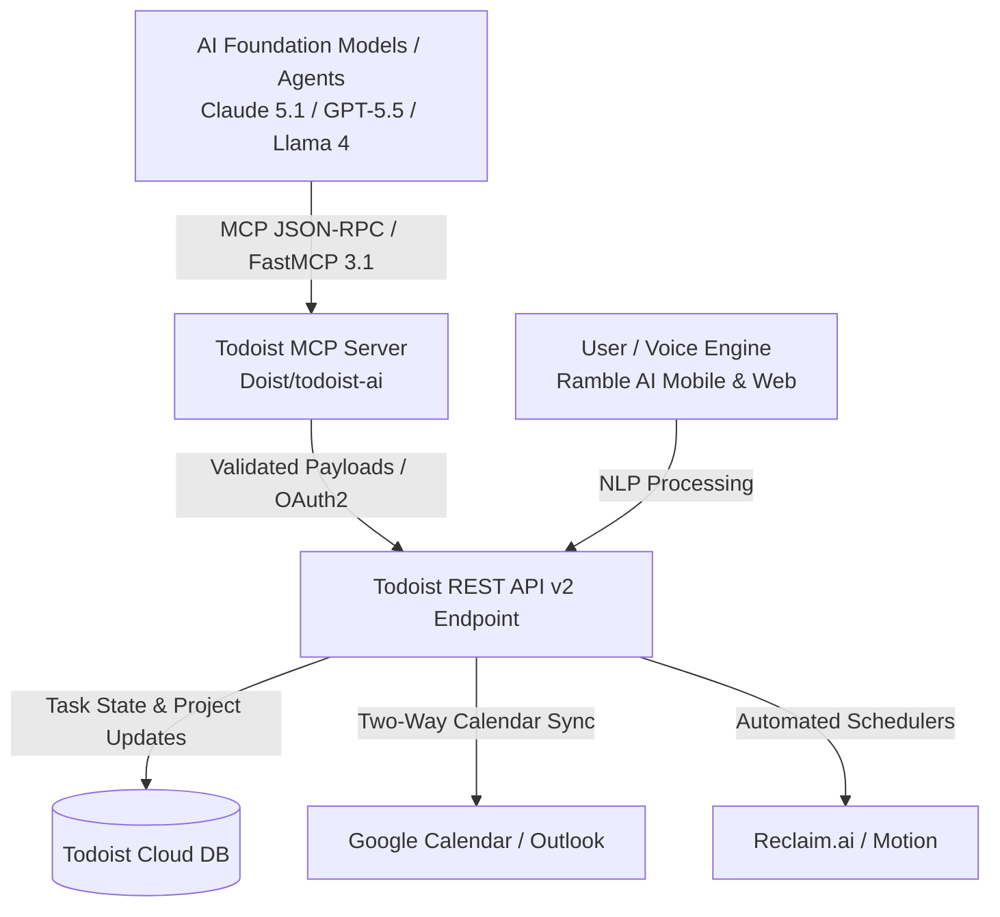

# Todoist

## What it is
Todoist is a task management platform designed for individuals and teams to organize projects, track deadlines, and automate personal or enterprise workflows. As of early 2027, Todoist features deep integration with AI ecosystem standards including **FastMCP 3.1** (Model Context Protocol), **Ramble AI** high-accuracy voice-to-task capture across 38 languages, and dynamic natural language parsing engines.

## What problem it solves
Capturing ideas, tasks, and complex recurring schedules often suffers from UI friction, inconsistent multi-device synchronization, or rigid input forms. Todoist resolves this by offering intuitive natural language processing (e.g., "Review Q3 security policy every 2nd Tuesday at 4pm p1 #security"), real-time multi-platform sync, and structured API endpoints that allow AI agents to manage tasks autonomously.

## Where it fits in the stack
**Category**: Calendar & Tasks / Task Management. Serves as a centralized execution and task state repository connecting calendar engines ([Google Calendar](google_calendar.md), [Outlook](outlook.md)), automated schedulers ([Reclaim.ai](reclaim.md)), and AI frameworks via FastMCP 3.1.

## System Architecture

The following Mermaid diagram outlines the FastMCP 3.1 integration architecture between AI foundation models, local client agents, and the Todoist REST API v2 infrastructure:



## Typical use cases
- **Personal and Team Task Capture**: Organize cross-functional work into hierarchical projects, sections, and sub-tasks with color-coded labels and priority tags.
- **Autonomous Agent Workflows**: Allow AI assistants (**Claude 5.1**, **GPT-5.5**) to inspect task queues, decompose high-level objectives into sub-tasks, and update task status via MCP tools.
- **Voice-to-Task Ingestion**: Hands-free capture using the **Ramble AI** voice engine, automatically extracting due dates, project tags, and assignee metadata.
- **System Maintenance & Audit Logging**: Track homelab maintenance, infrastructure health checks, and recurring compliance audits through scheduled recurring tasks.

## Strengths
- **FastMCP 3.1 Native Protocol**: Full Model Context Protocol compatibility enabling plug-and-play agentic task management.
- **Best-in-Class NLP**: Industry-leading natural language parsing for scheduling, labels, priorities, and projects in a single line.
- **Extensive Ecosystem Integrations**: Native bi-directional sync with Google Calendar, Outlook, Reclaim.ai, and n8n workflow engines.
- **Cross-Platform Availability**: Web, desktop (macOS, Windows, Linux), iOS, Android, and wearable apps.

## Limitations
- **Closed-Source SaaS**: Proprietary backend cloud infrastructure; not available for self-hosted local deployments (consider [Vikunja](../../services/vikunja.md) for self-hosted environments).
- **Freemium Tier Limits**: Reminders, activity history, and custom filters require a Pro or Business subscription tier.
- **Simple Dependency Modeling**: Lacks native Gantt chart visualization or complex dependency graph tracking out of the box.

## When to use it
- When you need a reliable, fast task management hub accessible across all user devices.
- When pairing task capture with AI agents that manipulate task queues via FastMCP 3.1.
- When natural language date and time parsing is essential for rapid entry.

## When not to use it
- If your policy demands 100% self-hosted, local-first air-gapped data retention (use [Vikunja](../../services/vikunja.md)).
- For complex, multi-team software issue tracking requiring custom workflow transitions and sprint boards (use Jira or GitHub Issues).

## Getting started

### API Access Setup
1. Log into Todoist and navigate to **Settings > Integrations > Developer**.
2. Copy your **API Token**.
3. Verify basic API connectivity via cURL:
   ```bash
   curl -X GET https://api.todoist.com/rest/v2/projects \
     -H "Authorization: Bearer $TODOIST_API_TOKEN"
   ```

## CLI examples

### Official Todoist CLI Usage
Power users and script automation workflows can interact directly with Todoist via CLI binaries:

```bash
# Install via Homebrew
brew install todoist-cli

# Authenticate with API Token
todoist auth $TODOIST_API_TOKEN

# List all tasks due today
todoist list --filter "today"

# Add a task with project, priority, and due date
todoist add "Run weekly database backup audit" --project "Homelab" --priority 4 --date "every Sunday at 02:00"
```

## API examples

### Pydantic v2 Task Creation & Validation
Programmatic task creation should be validated using **Pydantic v2** prior to making REST API v2 calls under early 2027 standards.

```python
import os
import requests
from typing import List, Optional
from pydantic import BaseModel, Field, ValidationError

class TodoistTaskPayload(BaseModel):
    content: str = Field(..., min_length=1, max_length=500, description="Task summary or title")
    description: Optional[str] = Field(default=None, max_length=15000, description="Detailed Markdown notes")
    project_id: Optional[str] = Field(default=None, description="Target Todoist project ID")
    section_id: Optional[str] = Field(default=None, description="Target section ID within project")
    parent_id: Optional[str] = Field(default=None, description="Parent task ID for sub-tasks")
    order: Optional[int] = Field(default=None, description="Task position index")
    labels: List[str] = Field(default_factory=list, description="List of label strings")
    priority: int = Field(default=1, ge=1, le=4, description="Priority integer: 1 (normal) to 4 (urgent)")
    due_string: Optional[str] = Field(default=None, description="Natural language due string e.g. 'tomorrow at 3pm'")

# Raw incoming data payload from AI Agent or pipeline
raw_payload = {
    "content": "Perform quarterly security audit on FastMCP 3.1 endpoints",
    "description": "Verify OAuth2 tokens, rate limits, and SSL certificate expiration dates.",
    "labels": ["security", "infrastructure", "ai-ops"],
    "priority": 4,
    "due_string": "next Monday at 09:00"
}

try:
    # Perform strict Pydantic v2 validation
    validated_task = TodoistTaskPayload.model_validate(raw_payload)
    print(f"Validated task payload: '{validated_task.content}'")

    # Dispatch request to Todoist API v2
    api_token = os.getenv("TODOIST_API_TOKEN", "mock_token")
    headers = {
        "Authorization": f"Bearer {api_token}",
        "Content-Type": "application/json"
    }

    # Request execution logic:
    # response = requests.post(
    #     "https://api.todoist.com/rest/v2/tasks",
    #     headers=headers,
    #     json=validated_task.model_dump(exclude_none=True)
    # )
except ValidationError as e:
    print(f"Payload validation failed: {e}")
```

### Model Context Protocol (FastMCP 3.1) Integration
Integrate Todoist with AI agent runtimes (**Claude 5.1**, **GPT-5.5**, **Llama 4**) using FastMCP 3.1 tools.

**FastMCP Server Package**: `Doist/todoist-ai` or community server `shockedrope/todoist-mcp`.

**MCP Server Configuration (`claude_desktop_config.json`)**:
```json
{
  "mcpServers": {
    "todoist": {
      "command": "npx",
      "args": ["-y", "@doist/todoist-mcp-server"],
      "env": {
        "TODOIST_API_TOKEN": "YOUR_TODOIST_API_TOKEN"
      }
    }
  }
}
```

**Exposed MCP Agent Tools**:
- `create_task`: Create a task with natural language due date parsing.
- `list_tasks`: Query tasks filtered by project, label, priority, or date filter expression.
- `close_task`: Complete a task by ID.
- `update_task`: Modify existing task metadata, priority, or due dates.

## Licensing and cost
- **Open Source**: No
- **Cost**: Freemium (Free tier available; Pro tier at ~$4/mo; Business tier for teams)
- **Self-hostable**: No

## Related tools / concepts
- [Reclaim.ai](reclaim.md) — Smart AI calendar time-blocking and Todoist sync engine.
- [Google Calendar](google_calendar.md) — Two-way event and task sync partner.
- [Outlook](outlook.md) — Microsoft email and task integration partner.
- [Vikunja](../../services/vikunja.md) — Open-source, self-hosted task management alternative.
- [n8n](../../services/n8n.md) — Workflow automation engine for custom Todoist triggers.
- [Model Context Protocol](../../knowledge_base/patterns/tool-calling-and-mcp.md) — FastMCP 3.1 agent architecture standard.

## Sources / references
- [Todoist Official Site](https://todoist.com/)
- [Todoist REST API v2 Reference](https://developer.todoist.com/rest/v2/)
- [Doist Todoist AI FastMCP Server Repository](https://github.com/Doist/todoist-ai)
- [Ramble AI Voice Feature Guide](https://todoist.com/help/articles/ramble-ai)

---
## Contribution Metadata
- Last reviewed: 2027-01-07
- Confidence: high
