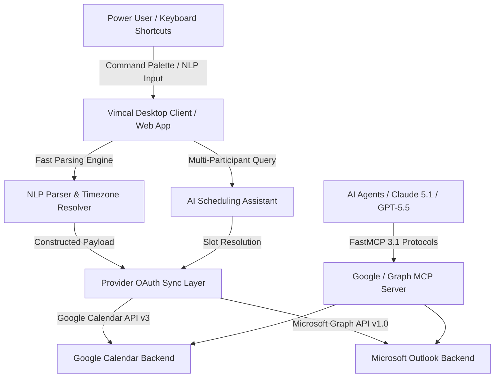

# Vimcal

## What it is
Vimcal is a high-speed calendar application designed for power users, featuring custom keyboard navigation, multi-time-zone coordination, and integrated scheduling workflows. It provides a command-palette-driven interface ("the fastest calendar in the world") paired with an advanced **AI Scheduling Assistant** that coordinates multi-participant availability across [Google Calendar](google_calendar.md) and [Outlook](outlook.md) backends.

## What problem it solves
Manual scheduling across global distributed teams creates friction, requires constant context switching, and involves repetitive mouse interactions. Vimcal eliminates this overhead by enabling instant natural language event entry, fast availability snippet generation, and automated cross-timezone visual overlay mapping.

## Where it fits in the stack
**Category**: Calendar & Tasks / Productivity Interface. Functions as a high-speed frontend client over underlying calendar provider backends ([Google Calendar](google_calendar.md) and [Outlook](outlook.md)).

## System Architecture

The following Mermaid diagram illustrates the client interaction flow, natural language engine, AI scheduling assistant, and provider sync layer:



## Typical use cases
- **Rapid Event Booking**: Create meetings in seconds using natural language parsing (e.g., "Strategy sync with Sarah tomorrow at 3pm EST").
- **Global Team Scheduling**: Visualize overlapping working hours across multiple global time zones using horizontal timezone overlays.
- **Instant Availability Sharing**: Generate plain-text or Markdown availability snippets (`Cmd+F`) to paste directly into chat apps or emails.
- **Agentic Scheduling Workflows**: Coordinate agent-managed calendar slots via underlying Google Calendar or Microsoft Graph MCP servers using **FastMCP 3.1**.

## Strengths
- **Keyboard-First Design**: Vim-inspired navigation keys and command palette (`Cmd+K`) maximize cognitive efficiency.
- **Superior Time Zone Support**: Real-time conversion, visual drag-and-drop overlays, and automated daylight savings adjustment.
- **High-Precision NLP Engine**: Accurately extracts titles, dates, durations, locations, and attendee lists from raw text input.
- **AI Scheduling Assistant**: Intelligently analyzes attendee free/busy states to propose optimal slot combinations.

## Limitations
- **Proprietary Commercial SaaS**: Closed-source subscription product ($15-$20/month per user); no self-hosted option.
- **No Direct Developer REST API**: Direct API access relies on underlying provider endpoints (Google Calendar API or Microsoft Graph API).
- **Focused Feature Scope**: Designed specifically for calendar scheduling rather than heavy task board management (best paired with [Todoist](todoist.md)).

## When to use it
- When calendar navigation speed and keyboard shortcuts are critical to your daily workflow.
- When coordinating frequent meetings across multiple international time zones.
- When you want an intelligent overlay over existing enterprise Google Workspace or Microsoft 365 accounts.

## When not to use it
- If your team requires a free or self-hosted, open-source calendar tool (consider [Vikunja](../../services/vikunja.md) or [Proton Calendar](proton_calendar.md)).
- If you require direct public REST API access without going through Google or Microsoft API layers.

## Getting started

### Installation & Client Setup
1. Download the Vimcal desktop client (macOS or Windows) from [Vimcal.com](https://www.vimcal.com/).
2. Authenticate using your enterprise **Google Workspace** or **Microsoft 365** account.
3. Launch the command palette (`Cmd+K` on Mac, `Ctrl+K` on Windows) to configure secondary time zones and calendar views.

## CLI examples

### Launcher Extensions & Automation
Power users automate Vimcal actions via system launchers such as Raycast or Alfred:

```bash
# Example Raycast command for quick event booking
raycast "Create Vimcal Event" --title "FastMCP 3.1 Architecture Review" --time "14:00"

# Key Vimcal Application Shortcuts:
# F - Toggle Free Slots mode
# S - Copy availability snippet to clipboard
# A - Launch AI Scheduling Assistant
# Z - Add or toggle primary timezone overlay
```

## API examples

### Pydantic v2 Schema Validation for Provider Event Sync
Because Vimcal operates as a client over Google Calendar or Microsoft Graph backends, API automation is executed using provider endpoints. Below is a complete Python example using **Pydantic v2** to validate event objects before pushing them to the Google Calendar API:

```python
import os
from datetime import datetime
from typing import List, Optional
from pydantic import BaseModel, Field, EmailStr, ValidationError

class EventAttendee(BaseModel):
    email: EmailStr
    responseStatus: Optional[str] = Field(default="needsAction", description="Status: accepted, declined, tentative, needsAction")

class EventTime(BaseModel):
    dateTime: datetime = Field(..., description="ISO 8601 formatted timestamp")
    timeZone: str = Field(default="UTC", description="IANA timezone name e.g. America/New_York")

class VimcalCompatibleEventPayload(BaseModel):
    summary: str = Field(..., min_length=1, max_length=255, description="Event title")
    location: Optional[str] = Field(default=None, description="Physical location or video call URL")
    description: Optional[str] = Field(default=None, description="Event body notes")
    start: EventTime
    end: EventTime
    attendees: List[EventAttendee] = Field(default_factory=list)

# Raw dictionary payload representing an AI-assisted booking request
raw_event_data = {
    "summary": "Vimcal Architecture Sync with Claude 5.1",
    "location": "https://meet.google.com/xyz-abc-def",
    "description": "Discussion on FastMCP 3.1 provider schemas and calendar integration.",
    "start": {
        "dateTime": "2027-01-15T15:00:00Z",
        "timeZone": "UTC"
    },
    "end": {
        "dateTime": "2027-01-15T16:00:00Z",
        "timeZone": "UTC"
    },
    "attendees": [
        {"email": "alex@example.com", "responseStatus": "accepted"},
        {"email": "engineer@example.com", "responseStatus": "needsAction"}
    ]
}

try:
    # Execute Pydantic v2 validation
    validated_event = VimcalCompatibleEventPayload.model_validate(raw_event_data)
    print(f"Validated Vimcal-compatible event: '{validated_event.summary}' for {validated_event.start.dateTime}")

    # Payload format ready for Google Calendar API v3 event insertion
    google_api_body = validated_event.model_dump(mode="json")
except ValidationError as e:
    print(f"Validation error: {e}")
```

### FastMCP 3.1 Agent Integration
AI agents (**Claude 5.1**, **GPT-5.5**) manage calendar events reflected in Vimcal by interacting directly with the provider's FastMCP 3.1 server:

```bash
# Run official Google Calendar FastMCP server
npx @modelcontextprotocol/server-google-calendar
```

## Licensing and cost
- **Open Source**: No
- **Cost**: Commercial SaaS subscription (~$15-$20/month per user)
- **Self-hostable**: No

## Related tools / concepts
- [Notion Calendar](notion-calendar.md) — Fast integrated calendar client for Notion workspaces.
- [Reclaim.ai](reclaim.md) — AI-driven adaptive time-blocking engine.
- [Todoist](todoist.md) — High-efficiency task capture and management.
- [Google Calendar](google_calendar.md) — Underlying cloud calendar backend provider.
- [Outlook](outlook.md) — Enterprise cloud calendar backend provider.
- [Model Context Protocol](../../knowledge_base/patterns/tool-calling-and-mcp.md) — FastMCP 3.1 agent architecture standard.

## Sources / references
- [Vimcal Official Site](https://www.vimcal.com/)
- [Vimcal Features & Documentation](https://docs.vimcal.com/)
- [Vimcal Shortcuts Reference](https://www.vimcal.com/shortcuts)

---
## Contribution Metadata
- Last reviewed: 2027-01-07
- Confidence: high
