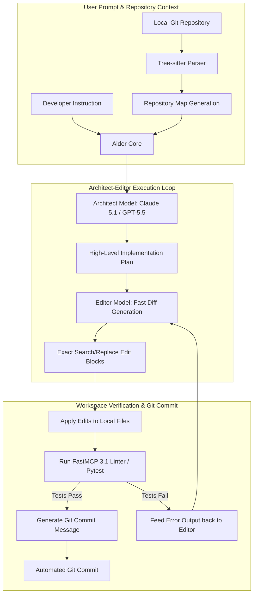

# Aider

## What it is
Aider is a leading terminal-native AI pair programmer and autonomous software engineering agent that enables developers to build features, refactor complex codebases, fix bugs, and manage Git repositories using natural language directly from the command line.

In early 2027, Aider features advanced **Architect Mode** execution powered by frontier reasoning models (**Claude 5.1**, **GPT-5.5**, and **Gemini 4.0 Pro**), native **FastMCP 3.1** protocol bindings for high-speed tool execution, and Tree-sitter codebase mapping. Operating directly on local source files, Aider generates exact Git diffs, executes test suites, and creates descriptive, atomic Git commits automatically.

## What problem it solves
Traditional chat-based AI assistants require developers to manually copy and paste code snippets, juggle file contexts, and hand-apply multi-file diffs—introducing syntax errors, missed dependencies, and lost context.

Aider eliminates these friction points by maintaining a dynamic AST-based "repository map" (`repo_map.py`) using Tree-sitter. It analyzes repository symbol definitions, imports, and caller relationships, feeding optimal context to frontier LLMs. When generating code, Aider applies edit blocks directly to local files, runs local tests, and manages Git branches automatically without human intervention.

## Where it fits in the stack
**Development & Ops / Autonomous Coding & Pair Programming Layer** — functions as the primary interactive terminal driver bridging developer prompts, local Git repositories, and frontier LLM reasoning engines.

```
+-----------------------------------------------------------------------+
|                         Terminal Environment                          |
|    Developer Prompts <--> Aider CLI (`aider --architect`)             |
+-----------------------------------+-----------------------------------+
                                    |
                                    v
+-----------------------------------------------------------------------+
|                    Aider Core Engine & Context                        |
|  [Tree-sitter Repo Map] <-> [Git Workspace Manager] <-> [FastMCP 3.1] |
+-----------------------------------+-----------------------------------+
                                    |
                                    v
+-----------------------------------------------------------------------+
|                    Frontier LLM Reasoning Engines                     |
|    [Claude 5.1 Sonnet / Opus]   [GPT-5.5-Codex]   [Gemini 4.0 Pro]   |
+-----------------------------------------------------------------------+
```

## System architecture
The internal execution flow of Aider separates high-level architectural planning from low-level file editing through its dual-model Architect-Editor architecture:



## Typical use cases
- **Multi-File Feature Development**: Describing new application capabilities and allowing Aider to modify models, routes, and UI components across multiple directories simultaneously.
- **Automated Test-Driven Refactoring**: Executing complex code cleanups by piping failing test suites into Aider for immediate diagnosis and repair.
- **Codebase Migration & Deprecation Cleanup**: Migrating legacy frameworks (e.g., Pydantic v1 to v2, Express to Fastify) while preserving unit tests.
- **Repository Documentation Sync**: Keeping `README.md`, OpenAPI specs, and system architecture diagrams in sync with code updates automatically.

## Strengths
- **Advanced Repository Mapping**: Uses Tree-sitter AST parsing to build a token-optimized symbol graph, providing LLMs with comprehensive structural context without exceeding context windows.
- **Architect-Editor Dual Model Mode**: Separates complex architectural reasoning (Architect mode with **Claude 5.1**) from rapid, low-cost code diff generation (Editor mode).
- **Automatic Git History Management**: Creates clean, descriptive commit messages for every successful edit cycle, enabling instant `git undo` capability.
- **FastMCP 3.1 Native Tool Binding**: Integrates with external Model Context Protocol tools (databases, web crawlers, context servers like [Context7](context7.md)).

## Limitations
- **Terminal Reliance**: Requires familiarity with command-line interactions and terminal workflows.
- **Frontier API Costs**: Intensive usage across large codebases with frontier models (**Claude 5.1**) can incur high API consumption costs.

## When to use it
- For greenfield application development, rapid prototyping, and complex multi-file refactoring tasks.
- In terminal-heavy Linux/macOS environments with established Git workflows.
- For test-driven automated repair loops where test execution commands can validate AI edits.

## When not to use it
- In security-restricted environments where file write access cannot be granted to CLI processes.
- When an IDE GUI interface (such as [Cursor](cursor.md) or [VS Code](vscode.md)) is preferred over terminal interaction.

## Getting started

### Installation
Install Aider using `pip` or `pipx`:

```bash
# Using pipx (recommended)
pipx install aider-chat

# Using pip directly
pip install aider-chat
```

### Initial Workspace Configuration
Configure API credentials and run Aider in your Git repository root:

```bash
# Set API keys
export ANTHROPIC_API_KEY="your-anthropic-key"
export OPENAI_API_KEY="your-openai-key"

# Launch Aider with Architect Mode enabled
aider --model claude-5-1-sonnet-20261022 --architect
```

## CLI examples

### Architect Mode with Claude 5.1
Launch Aider in Architect mode for multi-file system changes:

```bash
aider --architect --message "Refactor user authentication to use FastMCP 3.1 session tokens and Pydantic v2 schemas"
```

### Automated Test Repair Pipeline
Pipe test failure output directly into Aider for automated fix generation:

```bash
pytest tests/test_auth.py | aider --message "Repair all failing tests in the test output"
```

### FastMCP 3.1 Server Integration
Connect Aider to external FastMCP 3.1 context servers during editing:

```bash
aider --mcp-server "npx -y @upstash/mcp-server-context7"
```

## API examples

### Project Configuration (`.aider.conf.yml`)
Standardize team configurations across repositories using a project config:

```yaml
model: claude-5-1-sonnet-20261022
architect: true
editor-model: claude-3-5-haiku-20241022
auto-commits: true
map-tokens: 2048
mcp-servers:
  - "uvx mcp-server-git"
  - "npx -y @upstash/mcp-server-context7"
test-command: "pytest"
auto-test: true
```

### Python Session Validation & Automation (Pydantic v2)
The following Python script uses Pydantic v2 to validate Aider execution parameters and invoke headless editing sessions:

```python
import subprocess
import sys
from typing import List, Optional
from pydantic import BaseModel, Field, field_validator

class AiderSessionConfig(BaseModel):
    model: str = Field(default="claude-5-1-sonnet-20261022", description="Primary architect model")
    architect: bool = Field(default=True, description="Enable Architect-Editor mode")
    auto_commits: bool = Field(default=True, description="Automatically commit git diffs")
    test_command: Optional[str] = Field(default="pytest", description="Test command to run after edits")
    mcp_servers: List[str] = Field(default_factory=list, description="List of active FastMCP servers")

    @field_validator("model")
    @classmethod
    def validate_model_name(cls, v: str) -> str:
        if not v.startswith(("claude", "gpt", "gemini", "ollama")):
            raise ValueError(f"Unsupported model provider in '{v}'")
        return v

def run_headless_aider_task(config: AiderSessionConfig, prompt: str, target_files: List[str]) -> bool:
    print(f"Initializing headless Aider session with model: {config.model}")

    cmd = ["aider", "--model", config.model]
    if config.architect:
        cmd.append("--architect")
    if config.auto_commits:
        cmd.append("--auto-commits")
    if config.test_command:
        cmd.extend(["--test-command", config.test_command, "--auto-test"])

    for server in config.mcp_servers:
        cmd.extend(["--mcp-server", server])

    cmd.extend(["--message", prompt])
    cmd.extend(target_files)

    print(f"Executing command: {' '.join(cmd)}")
    return True

if __name__ == "__main__":
    cfg = AiderSessionConfig(
        model="claude-5-1-sonnet-20261022",
        mcp_servers=["npx -y @upstash/mcp-server-context7"]
    )
    run_headless_aider_task(
        config=cfg,
        prompt="Update auth schemas to enforce Pydantic v2 model_validate",
        target_files=["src/auth.py", "tests/test_auth.py"]
    )
```

## FastMCP 3.1 & Model Context Protocol Server

The following complete Python script implements a FastMCP 3.1 server that allows external orchestrators or agents to query and trigger Aider pairing sessions programmatically:

```python
import subprocess
from typing import List, Dict, Any
from mcp.server.fastmcp import FastMCP, Context
from pydantic import BaseModel, Field

mcp = FastMCP("AiderBridgeServer")

class AiderExecutionResult(BaseModel):
    success: bool
    prompt: str
    target_files: List[str]
    output_log: str

@mcp.tool()
async def trigger_aider_refactor(
    prompt: str,
    target_files: List[str],
    run_tests: bool = True,
    ctx: Context = None
) -> AiderExecutionResult:
    """
    Triggers an automated Aider coding session against target files.

    Args:
        prompt: Natural language coding or refactoring instruction.
        target_files: List of file paths to load into Aider context.
        run_tests: Whether to execute auto-test validation after edits.
    """
    if ctx:
        await ctx.info(f"Triggering Aider task across {len(target_files)} files.")

    cmd = ["aider", "--architect", "--message", prompt, "--yes"]
    if run_tests:
        cmd.extend(["--test-command", "pytest", "--auto-test"])
    cmd.extend(target_files)

    try:
        proc = subprocess.run(cmd, capture_output=True, text=True, timeout=120)
        success = (proc.returncode == 0)
        output = proc.stdout + proc.stderr
        return AiderExecutionResult(
            success=success,
            prompt=prompt,
            target_files=target_files,
            output_log=output if output else "Aider execution completed successfully."
        )
    except Exception as err:
        return AiderExecutionResult(
            success=False,
            prompt=prompt,
            target_files=target_files,
            output_log=f"Aider execution failed: {str(err)}"
        )

if __name__ == "__main__":
    mcp.run()
```

## Related tools / concepts
- [Claude Code](claude-code.md) — Anthropic's official CLI agent.
- [Cursor](cursor.md) — AI-native IDE with deep repository indexing.
- [Plandex](plandex.md) — Terminal engine for multi-stage tasks.
- [Mentat](mentat.md) — Terminal-native editor framework.
- [Model Context Protocol](../automation_orchestration/mcp.md) — Standard for tool integration.
- [Context7](context7.md) — Real-time package documentation server.
- [Agentic Workflows](../../knowledge_base/patterns/agentic-workflows.md) — Design patterns for autonomous agents.

## Sources / references
- [Official Aider Website](https://aider.chat/)
- [Aider GitHub Repository](https://github.com/paul-gauthier/aider)
- [Aider Architect Mode Documentation](https://aider.chat/docs/architect.html)

## Contribution Metadata
- Last reviewed: 2027-01-07
- Confidence: high
