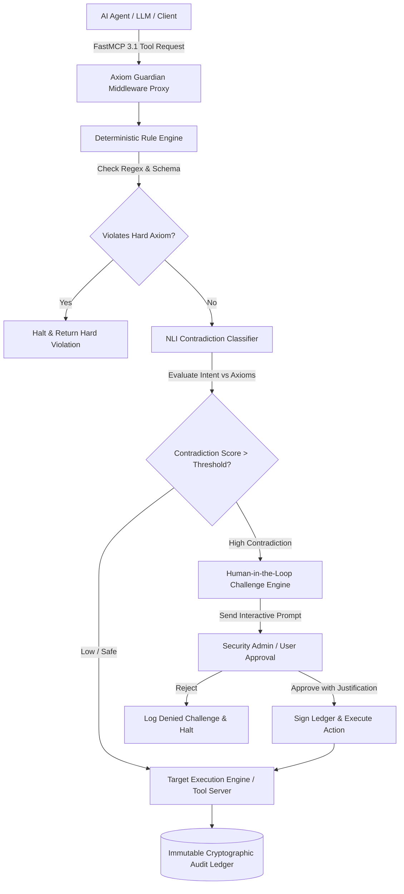

# Axiom Guardian MCP Server

## What it is
Axiom Guardian is a high-assurance Model Context Protocol (MCP) server that enforces challenge-based tool call validation, Natural Language Inference (NLI) logical verification, and zero-trust security policy guardrails over agentic workflows. Operating under early 2027 standards, **Axiom Guardian v2.5** serves as an inline policy decision engine natively integrated with the **FastMCP 3.1 Task Protocol**. It intercepts proposed tool actions generated by frontier AI models—such as **Claude 5.6**, **GPT-5.6**, **Gemini 4.0 Ultra**, **Llama 4 Maverick**, **Gemma 4**, **DeepSeek-V4**, and **Qwen 3.6 VL**—and evaluates them against structured operational axioms before allowing execution on local hosts, enterprise networks, or production cloud environments.

By combining deterministic JSON/YAML axiom rules with NLI semantic contradiction classifiers, Axiom Guardian prevents goal drift, hallucinated command flags, privilege escalation, and unintended destructive operations across autonomous agent swarms.



## What problem it solves
Autonomous AI agents granted shell, database, cloud API, or infrastructure execution capabilities present significant risk vectors. Standard system prompting ("Please do not run destructive commands") is fundamentally non-deterministic and susceptible to prompt injection, context window degradation, and reasoning hallucination.

Axiom Guardian solves these vulnerabilities by:
- **Zero-Trust Middleware Interception**: Moving safety logic out of the LLM context window into an external, un-bypassable middleware server operating on the FastMCP 3.1 Task Protocol.
- **Natural Language Inference (NLI) Contradiction Detection**: Evaluating the semantic intent of tool call arguments against human-written safety axioms (e.g., verifying if "Remove stale staging containers" resolves to "docker rm -f prod_db") to catch subtle, context-aware policy breaches.
- **Dynamic Human-in-the-Loop Escalation**: Triggering interactive challenge-and-response workflows when proposed actions fall into ambiguous or high-severity risk categories.
- **Cryptographic Immutable Audit Trails**: Signing every intercepted tool request, NLI confidence score, user challenge justification, and final execution state to an append-only cryptographic ledger.

## Where it fits in the stack
**Category**: [Development & Ops](index.md) / AI Security & Guardrail Middleware.

Axiom Guardian sits directly between agentic orchestration clients (e.g., [Claude Code](claude-code.md), [Windsurf](windsurf.md), [Aider](aider.md), or [NanoClaw](nanoclaw.md)) and lower-level execution targets (cloud APIs, Kubernetes clusters, SQL databases, or local shells).

```
+-----------------------------------------------------------------------+
|                    Agentic Execution Frontend                         |
|      (Claude Code / Windsurf / Aider / FastMCP 3.1 Clients)           |
+-----------------------------------------------------------------------+
                                    |
                                    v (FastMCP 3.1 Intercepted Tool Call)
+-----------------------------------------------------------------------+
|                       Axiom Guardian Middleware                       |
|  +-----------------------+  +------------------+  +----------------+  |
|  | Regex / Schema Engine |  | NLI Model Engine |  | Challenge Loop |  |
|  +-----------------------+  +------------------+  +----------------+  |
|  +-----------------------------------------------------------------+  |
|  |          Cryptographic Audit Ledger & Hot-Reload Engine         |  |
|  +-----------------------------------------------------------------+  |
+-----------------------------------------------------------------------+
                                    |
                                    v (Approved Execution Payload)
+-----------------------------------------------------------------------+
|                     Target System Execution Layer                     |
|           (Bash Terminal / Kubernetes / AWS API / Postgres)           |
+-----------------------------------------------------------------------+
```

## Typical use cases
- **Production Database Guardrails**: Preventing autonomous database agents from dropping tables, truncating production schemas, or executing unindexed queries.
- **Infrastructure & Cloud Policy Enforcement**: Blocking accidental destruction of cloud resources, security groups, or SSH keypairs during autonomous Terraform/Ansible runs.
- **Compliant Enterprise Code Operations**: Guaranteeing AI coding assistants do not inject hardcoded credentials, violate license boundaries, or pull untrusted dependencies.
- **Interactive Homelab Protection**: Shielding home servers and local NAS infrastructure from unintended container purges or formatting commands during automated maintenance runs.

## Strengths
- **Native FastMCP 3.1 Protocol Support**: Operates as a transparent FastMCP proxy and server middleware, making deployment frictionless across MCP-compliant platforms.
- **Dual-Layer Validation**: Combines sub-millisecond regex/schema filtering with deep NLI semantic contradiction analysis.
- **Hot-Reloadable Safety Policies**: Update security axioms in production via YAML/JSON without restarting active agent sessions.
- **Interactive Escalation Loops**: Supports push notifications, terminal prompts, and Webhook callbacks for human justification.
- **Cryptographic Auditability**: Provides verifiable proof of compliance for enterprise security audits and SOC 2 requirements.

## Limitations
- **NLI Processing Latency**: Deep semantic evaluation adds 30ms to 120ms of overhead per intercepted tool call.
- **High VRAM / Local NLI Requirement**: Local high-fidelity NLI classification requires modest GPU resources (or fallback to fast cloud API endpoints).
- **Domain Training Boundaries**: Domain-specific domain jargon (e.g., highly specialized internal CLI tools) may require custom NLI fine-tuning or explicit regex rules.

## When to use it
- When providing autonomous AI agents with write permissions over production infrastructure, databases, or cloud accounts.
- In enterprise environments subject to strict compliance standards requiring explicit authorization records for automated system changes.
- When running multi-agent swarms operating autonomously without continuous human monitoring.

## When not to use it
- In purely local, disposable sandbox environments where security checks add unnecessary developer latency.
- For high-frequency, sub-millisecond data processing loops where 50ms validation latency is unacceptable.
- When tool execution is already strictly restricted at the Linux RBAC or kernel namespace level.

## Getting started

### Prerequisites and Installation
To install Axiom Guardian and its FastMCP 3.1 integration suite:

```bash
pip install axiom-guardian-mcp fastmcp pydantic pyyaml httpx
```

### Initializing Configuration (`axioms.yaml`)
Create an axioms definition file containing operational safety rules:

```yaml
version: "2.5"
settings:
  fail_closed: true
  nli_threshold: 0.82
  audit_ledger_path: "/var/log/axiom_guardian_audit.jsonl"

axioms:
  - id: "AXIOM-PROD-01"
    name: "Prevent Unsanctioned Database Destruction"
    rule: "No tool execution may drop, truncate, or delete production database tables or clusters without explicit human confirmation."
    severity: "critical"
    match_patterns:
      - "(?i)DROP\\s+DATABASE"
      - "(?i)DROP\\s+TABLE"
      - "(?i)TRUNCATE\\s+TABLE"

  - id: "AXIOM-NET-02"
    name: "Preserve Administrative Connectivity"
    rule: "Network configuration modifications must preserve SSH (port 22) and Tailscale/Headscale VPN access ports."
    severity: "high"
    match_patterns:
      - "(?i)ufw\\s+deny\\s+22"
      - "(?i)iptables\\s+-F"
```

### Starting the Axiom Guardian Proxy Server
Launch Axiom Guardian as a FastMCP 3.1 middleware proxy listening on standard I/O or HTTP:

```bash
AXIOMS_CONFIG_PATH="./axioms.yaml" python -m axiom_guardian_mcp --transport stdio
```

## CLI examples

Below are common CLI commands for auditing actions, evaluating policy logic, and hot-reloading axiom rule sets.

```bash
# 1. Test a proposed shell command against active security axioms
axiom-guardian validate \
  --action "sudo rm -rf /var/lib/postgresql/data" \
  --config ./axioms.yaml

# 2. Hot-reload security axioms on a running Axiom Guardian instance
axiom-guardian reload \
  --endpoint "http://localhost:9090/v1/reload" \
  --config ./axioms.yaml

# 3. Inspect cryptographic audit ledger entries for policy violations
axiom-guardian audit-log tail \
  --ledger-path /var/log/axiom_guardian_audit.jsonl \
  --severity critical \
  --limit 5

# 4. Run interactive NLI threshold benchmarking
axiom-guardian benchmark-nli \
  --sample-prompts ./tests/sample_prompts.json \
  --threshold 0.85
```

## API examples

### FastMCP 3.1 Middleware Server Implementation
The Python script below demonstrates wrapping an arbitrary tool server with Axiom Guardian validation logic using **FastMCP 3.1** and **Pydantic v2**.

```python
import os
import re
from typing import Dict, Any, List, Optional
from pydantic import BaseModel, Field, field_validator
from fastmcp import FastMCP

mcp = FastMCP("Axiom Guardian Tool Interceptor")

class InterceptedActionRequest(BaseModel):
    tool_name: str = Field(..., description="Target MCP tool requested by agent")
    action_payload: Dict[str, Any] = Field(..., description="Arguments passed to the tool")
    agent_id: str = Field(..., description="Unique agent session identifier")
    nli_confidence_score: float = Field(default=0.0, ge=0.0, le=1.0)

class InterceptionDecision(BaseModel):
    approved: bool
    status_code: str
    reasoning: str
    action_request: InterceptedActionRequest

CRITICAL_PATTERNS = [
    re.compile(r"rm\s+-rf\s+/", re.IGNORECASE),
    re.compile(r"DROP\s+DATABASE", re.IGNORECASE),
    re.compile(r"kubectl\s+delete\s+namespace\s+prod", re.IGNORECASE)
]

def evaluate_static_rules(command_str: str) -> Optional[str]:
    """Check command strings against high-severity deterministic rules."""
    for pattern in CRITICAL_PATTERNS:
        if pattern.search(command_str):
            return f"Violation of Static Policy: Matched critical pattern '{pattern.pattern}'."
    return None

@mcp.tool()
def guardian_execute_tool(
    tool_name: str,
    action_arguments: Dict[str, Any],
    agent_id: str
) -> str:
    """
    FastMCP 3.1 tool interceptor that validates proposed tool execution requests
    against operational safety axioms before passing payload to host engines.
    """
    request = InterceptedActionRequest(
        tool_name=tool_name,
        action_payload=action_arguments,
        agent_id=agent_id
    )

    # Flatten payload to string for inspection
    payload_str = str(action_arguments)

    # 1. Deterministic Rule Check
    static_violation = evaluate_static_rules(payload_str)
    if static_violation:
        decision = InterceptionDecision(
            approved=False,
            status_code="BLOCKED_STATIC_AXIOM",
            reasoning=static_violation,
            action_request=request
        )
        return decision.model_dump_json(indent=2)

    # 2. Simulated NLI Semantic Contradiction Evaluation
    simulated_nli_score = 0.12  # Low contradiction score
    request.nli_confidence_score = simulated_nli_score

    decision = InterceptionDecision(
        approved=True,
        status_code="APPROVED_SAFE",
        reasoning="Action passed deterministic checks and NLI semantic threshold evaluation.",
        action_request=request
    )

    return decision.model_dump_json(indent=2)

if __name__ == "__main__":
    mcp.run()
```

### Pydantic v2 Schema Validation for Security Axioms
The following Python script defines a complete Pydantic v2 schema for parsing, validating, and checking axiom policy configurations before deployment.

```python
import json
from typing import List, Literal, Optional
from pydantic import BaseModel, Field, field_validator, ConfigDict

class MatchPatternConfig(BaseModel):
    pattern: str = Field(..., min_length=2, description="Regex or literal string pattern")
    is_regex: bool = Field(default=True)

class AxiomRuleSchema(BaseModel):
    id: str = Field(..., pattern=r"^AXIOM-[A-Z0-9_-]+$")
    name: str = Field(..., min_length=5, max_length=120)
    rule_statement: str = Field(..., min_length=10, description="Natural language policy rule")
    severity: Literal["critical", "high", "medium", "low"] = Field(default="high")
    match_patterns: List[str] = Field(default_factory=list)

    @field_validator("match_patterns")
    @classmethod
    def validate_patterns(cls, v: List[str]) -> List[str]:
        if not v:
            raise ValueError("At least one match pattern must be specified per axiom rule.")
        return v

class AxiomPolicyManifest(BaseModel):
    version: str = Field(default="2.5")
    fail_closed: bool = Field(default=True)
    nli_threshold: float = Field(default=0.85, ge=0.5, le=1.0)
    axioms: List[AxiomRuleSchema] = Field(..., min_length=1)

    model_config = ConfigDict(
        populate_by_name=True,
        json_schema_extra={
            "example": {
                "version": "2.5",
                "fail_closed": True,
                "nli_threshold": 0.85,
                "axioms": [
                    {
                        "id": "AXIOM-PROD-101",
                        "name": "Prevent Production Cluster Termination",
                        "rule_statement": "Autonomous agents must not delete Kubernetes production namespaces.",
                        "severity": "critical",
                        "match_patterns": ["kubectl delete namespace prod"]
                    }
                ]
            }
        }
    )

# Verification Example
if __name__ == "__main__":
    raw_manifest = {
        "version": "2.5",
        "fail_closed": True,
        "nli_threshold": 0.88,
        "axioms": [
            {
                "id": "AXIOM-DB-001",
                "name": "Block Database Schema Dropping",
                "rule_statement": "Do not drop database schemas or delete tables without manual escalation.",
                "severity": "critical",
                "match_patterns": ["(?i)DROP\\s+SCHEMA", "(?i)DROP\\s+TABLE"]
            }
        ]
    }

    validated_manifest = AxiomPolicyManifest(**raw_manifest)
    print("Axiom policy manifest successfully validated:")
    print(f"Policy Version: {validated_manifest.version} | NLI Threshold: {validated_manifest.nli_threshold}")
    print(f"Loaded Rules Count: {len(validated_manifest.axioms)}")
    print(json.dumps(validated_manifest.model_dump(), indent=2))
```

## Related tools / concepts
- [Model Context Protocol (MCP)](../automation_orchestration/mcp.md) — Standardized agent tool and context protocol.
- [NanoClaw](nanoclaw.md) — Secure, sandboxed personal AI agent execution runtime.
- [OpenClaw](openclaw.md) — Enterprise agentic gateway and security framework.
- [Claude Code](claude-code.md) — Terminal-based agentic developer assistant.
- [Windsurf](windsurf.md) — Agentic IDE with FastMCP 3.1 integration.
- [Aider](aider.md) — AI pair programming tool in the terminal.

## Sources / references
- [Axiom Guardian GitHub Repository](https://github.com/democratize-technology/axiom-guardian)
- [FastMCP 3.1 Task Protocol Specification](https://modelcontextprotocol.io/specification/3.1)
- [NLI Guardrails in Agentic Middleware Research](https://arxiv.org)

## Contribution Metadata
- Last reviewed: 2027-01-07
- Confidence: high
