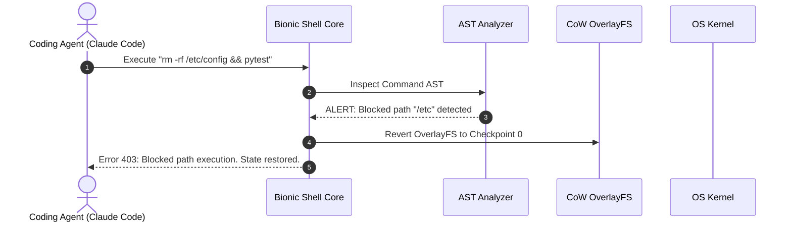

# Bionic Shell

## What it is
Bionic Shell (`/bin/bionic-sh`) is a security-first terminal shell runtime, AST-based command analyzer, and agentic sandbox engine designed to enforce real-time command safety, prevent destructive system mutations, and restrict host privilege escalation during autonomous AI software execution. Developed to bridge the safety gap between autonomous developer agents (such as [Claude Code](claude-code.md), [Aider](aider.md), and [OpenCode](opencode.md)) and host operating systems, Bionic Shell sits directly between agent execution loops and system kernels.

As of early 2027, Bionic Shell is a standard isolation layer for **Agentic Software Engineering & CI/CD Pipelines**. Integrating natively with the **Model Context Protocol (FastMCP 3.1)** and leveraging copy-on-write (CoW) filesystem snapshots (OverlayFS, Btrfs, ZFS), Bionic Shell allows autonomous agent fleets driven by frontier reasoning models (Claude 5.6, GPT-5.6, Gemini 4.0 Ultra, DeepSeek-V4, and Qwen 3.6 VL) to run terminal commands, execute build scripts, and install dependencies with guaranteed instant rollback capabilities and zero risk of host compromise.

## What problem it solves
Granting autonomous AI agents unconstrained terminal shell access introduces critical operational and security risks:

1. **Accidental & Unrecoverable System Destruction**: Agents frequently generate destructive terminal commands (e.g., unintended `rm -rf /`, accidental `git reset --hard HEAD~10`, or unvetted `dd` disk operations) due to hallucinated flags or incorrect path parsing.
2. **Untrusted Curl-to-Bash Ingestion**: LLMs often synthesize shell commands that download unvetted remote shell scripts via `curl | bash` or `wget | sh`, introducing supply chain malware or remote code execution (RCE) vectors.
3. **Privilege Escalation & Credential Leaks**: Unsanitized terminal commands executed by agents can inadvertently read environment variables containing cloud tokens (`AWS_SECRET_ACCESS_KEY`, `FASTMAIL_API_TOKEN`) or execute `sudo` calls that modify host security settings.
4. **Environment Pollution in CI/CD Runners**: Multi-step agent loops modify host file systems, leave orphaned processes running, and pollute shared build environments, leading to non-reproducible test runs.

Bionic Shell solves these vulnerabilities by parsing shell Abstract Syntax Trees (AST) prior to execution, evaluating command intent against declarative YAML security policies, intercepting unsafe system calls, enforcing dry-run simulations, and managing atomic, sub-second snapshot rollbacks.

## Where it fits in the stack
Within the KnowledgeOps and modern agentic engineering architecture, Bionic Shell occupies the **Development & Ops / Agent Sandboxing & Runtime Security Layer**.

```
+-----------------------------------------------------------------------------------+
|                            Autonomous Coding Agent                                |
|              (Claude Code / Aider / OpenCode / FastMCP 3.1 Client)                |
+-----------------------------------------------------------------------------------+
                                          |
                              Raw Command Request (`bionic-sh -c "..."`)
                                          |
+-----------------------------------------------------------------------------------+
|                              Bionic Shell Core Engine                             |
|      (AST Intent Parser / Policy Evaluator / CoW Snapshot Controller)            |
+-----------------------------------------------------------------------------------+
       |                                  |                                 |
+--------------+                   +--------------+                  +--------------+
| AST Command  |                   | FastMCP 3.1  |                  | OverlayFS /  |
| Analyzer     |                   | Security Gate|                  | ZFS Snapshot |
+--------------+                   +--------------+                  +--------------+
       |                                  |                                 |
       +----------------------------------+---------------------------------+
                                          |
                                          v
+-----------------------------------------------------------------------------------+
|                             Host Operating System / Kernel                        |
|                     (Linux Kernel / macOS POSIX / Container Host)                 |
+-----------------------------------------------------------------------------------+
```

- **Upstream Layer**: Receives terminal execution requests from AI developer assistants, local CLI wrappers, or FastMCP 3.1 tool servers.
- **Security Engine**: Intercepts commands, validates AST structures against policy rules, masks secret tokens in stdout/stderr, and isolates file writes in CoW overlays.
- **Downstream Kernel**: Passes approved commands to underlying host shells (`/bin/bash` or `/bin/zsh`) or aborts execution and triggers automatic snapshot recovery on policy violations.

## Typical use cases

### 1. Guardrail Protection for Autonomous Refactoring
When running multi-turn coding agents like Claude Code or Aider on large repositories, Bionic Shell intercepts any destructive git commands or mass file deletions, ensuring that unvetted code modifications can be reverted instantly with a single checkpoint rollback.

### 2. CI/CD Pipeline Agent Isolation
Enterprise build systems run agentic code generation pipelines inside Bionic Shell sandboxes. Bionic Shell enforces restricted network egress policies, preventing agents from sending host secrets or source code to unauthorized external IP addresses.

### 3. Dry-Run Terminal Command Analysis
DevOps engineers use Bionic Shell to perform AST analysis on complex, AI-synthesized shell scripts prior to deployment, inspecting simulated filesystem mutations and blocked system calls in a safe dry-run mode.

### 4. FastMCP 3.1 System Tool Gate
Homelab and cloud developers expose terminal execution tools to local LLMs via FastMCP 3.1, using Bionic Shell as the underlying execution wrapper to restrict commands to safe workspace directories.

## Strengths
- **Deterministic AST Command Inspection**: Parses full POSIX shell syntax trees before kernel execution, detecting obfuscated destructive calls (e.g. `eval $(echo ...)` or base64-decoded commands).
- **Sub-Second Copy-on-Write Rollbacks**: Leverages OverlayFS, ZFS, or Btrfs snapshots to restore clean environment states in under 100 milliseconds following an agent error.
- **Fine-Grained Declarative YAML Policies**: Allows engineers to specify allowed/blocked path trees, environment variable masks, allowed outbound ports, and maximum execution timeouts.
- **Native FastMCP 3.1 Integration**: Exposes structured JSON safety reports and tool interfaces directly to LLM orchestrators.
- **POSIX Drop-In Compatibility**: Acts as a transparent replacement for `/bin/sh` or `/bin/bash` with zero changes required to standard build scripts.

## Limitations
- **Copy-on-Write Overhead**: Heavy disk write workloads (e.g., compiling massive C++ codebases or unpacking gigabyte tars) experience slight write latency from overlay layers.
- **Subshell Obfuscation Edge Cases**: Highly dynamic nested subshells utilizing custom compiled C binaries require explicit policy whitelist definitions.

## When to use it
- When allowing autonomous AI agents to execute arbitrary terminal commands in local developer workspaces.
- When running automated agentic coding pipelines in shared multi-tenant CI/CD environments.
- When requiring audit logging, secret masking, and sub-second rollbacks for agent terminal sessions.

## When not to use it
- For raw disk performance benchmarking where overlay filesystem layers introduce non-negligible I/O latency.
- In minimal scratch micro-containers where no agent interaction occurs and standard `/bin/sh` is hardcoded.

## Getting started

### 1. Installation
Install the Bionic Shell runtime binary and CLI utility:

```bash
# Install Bionic Shell binary via official installation script
curl -fsSL https://bionicshell.dev/install.sh | sh

# Verify installation and driver support
bionic-sh --version
```

### 2. Configuring Security Policy (`policy.yaml`)
Create an agent isolation policy specifying allowed commands and blocked filesystem paths:

```yaml
version: "1.0"
security_level: "Strict"
allowed_commands:
  - "git"
  - "pytest"
  - "npm"
  - "cargo"
  - "python3"
blocked_paths:
  - "/etc"
  - "/usr"
  - "~/.ssh"
  - "~/.aws"
secret_masking:
  enabled: true
  patterns:
    - "sk-[a-zA-Z0-9]{48}"
    - "FASTMAIL_[A-Z0-9_]+"
network_egress:
  allow_local: true
  allowed_domains:
    - "github.com"
    - "registry.npmjs.org"
```



## CLI examples

### 1. Wrapping Agent Sessions in Bionic Sandbox
```bash
# Execute Claude Code inside Bionic Shell sandbox with strict policy
bionic-sh --policy ./policy.yaml -c "claude-code --auto-approve"
```

### 2. Analyzing Command AST in Dry-Run Mode
```bash
# Evaluate AI-generated shell script without executing on host
bionic-sh analyze --script deploy_stack.sh --format json
```

### 3. Managing Snapshot Checkpoints
```bash
# Create manual snapshot checkpoint prior to running risky build task
bionic-sh checkpoint create --name "pre-agent-refactor"

# Restore clean state after agent failure
bionic-sh checkpoint restore --name "pre-agent-refactor"
```

## API examples

### FastMCP 3.1 Bionic Shell Security Tool Server
The following Python implementation provides a FastMCP 3.1 server exposing safe terminal command execution to AI coding agents via Bionic Shell:

```python
#!/usr/bin/env python3
"""
FastMCP 3.1 Bionic Shell Tool Server.
Provides sandboxed command execution and snapshot management for AI agents.
"""

import subprocess
import json
from typing import Dict, Any, List, Optional
from mcp.server.fastmcp import FastMCP
from pydantic import BaseModel, Field

mcp = FastMCP(
    name="Bionic Shell Sandbox",
    version="3.1.0",
    description="AST-guarded sandboxed terminal execution server for developer agents"
)

@mcp.tool()
def execute_sandboxed_command(command: str, policy_path: str = "./policy.yaml") -> Dict[str, Any]:
    """
    Executes a shell command safely inside Bionic Shell AST sandbox environment.
    """
    try:
        res = subprocess.run(
            ["bionic-sh", "--policy", policy_path, "--json", "-c", command],
            capture_output=True,
            text=True,
            timeout=30
        )
        output_data = json.loads(res.stdout) if res.stdout else {}
        return {
            "status": "success" if res.returncode == 0 else "failed",
            "return_code": res.returncode,
            "stdout": output_data.get("stdout", res.stdout),
            "stderr": output_data.get("stderr", res.stderr),
            "safety_verdict": output_data.get("safety_status", "PASSED"),
            "mutations_count": output_data.get("filesystem_mutations", 0)
        }
    except Exception as e:
        return {"status": "error", "message": str(e)}

if __name__ == "__main__":
    mcp.run()
```

### Pydantic v2 Contract Validation for Bionic Reports
```python
import sys
from typing import List, Optional
from pydantic import BaseModel, Field, field_validator, ValidationError

class ASTCommandEvaluation(BaseModel):
    raw_command: str = Field(..., description="Original raw command text")
    is_ast_safe: bool = Field(..., description="True if AST passes policy heuristics")
    blocked_calls: List[str] = Field(default_factory=list, description="Intercepted unsafe calls")
    filesystem_mutations: int = Field(0, description="Count of modified files")

class BionicSandboxReport(BaseModel):
    session_id: str = Field(..., description="Unique sandbox session UUID")
    security_level: str = Field("Strict", description="Active security profile")
    evaluation: ASTCommandEvaluation
    rollback_ready: bool = Field(True, description="True if snapshot checkpoint is active")

    @field_validator("security_level")
    @classmethod
    def validate_level(cls, v: str) -> str:
        allowed = {"Permissive", "Moderate", "Strict", "AirGapped"}
        if v not in allowed:
            raise ValueError(f"Invalid security level: {v}")
        return v

def validate_bionic_execution_report(payload_dict: dict) -> str:
    try:
        report = BionicSandboxReport.model_validate(payload_dict)
        return report.model_dump_json(indent=2)
    except ValidationError as err:
        print(f"Validation Failure for Bionic Report: {err}", file=sys.stderr)
        raise

if __name__ == "__main__":
    sample_payload = {
        "session_id": "bionic_sess_9901_az",
        "security_level": "Strict",
        "evaluation": {
            "raw_command": "npm test && git status",
            "is_ast_safe": True,
            "blocked_calls": [],
            "filesystem_mutations": 4
        },
        "rollback_ready": True
    }

    validated_json = validate_bionic_execution_report(sample_payload)
    print("Successfully validated Bionic Shell Sandbox Report:")
    print(validated_json)
```

## Related tools / concepts
- [Claude Code Container MCP](claude-code-container-mcp.md)
- [Axiom Guardian](axiom-guardian.md)
- [Claude Code](claude-code.md)
- [Aider](aider.md)
- [OpenCode](opencode.md)
- [Free Will MCP](free-will-mcp.md)
- [Component Map](../../architecture/component_map.md)

## Sources / references
- [The New Stack: Bionic Shell Command Safety Standard](https://thenewstack.io/bionic-shell-command-safety/)
- [POSIX Shell Security Standards (IEEE Std 1003.1)](https://pubs.opengroup.org/onlinepubs/9699919799/)
- [Bionic Shell Official Documentation](https://bionicshell.dev/docs)

## Contribution Metadata
- Last reviewed: 2027-01-07
- Confidence: high
