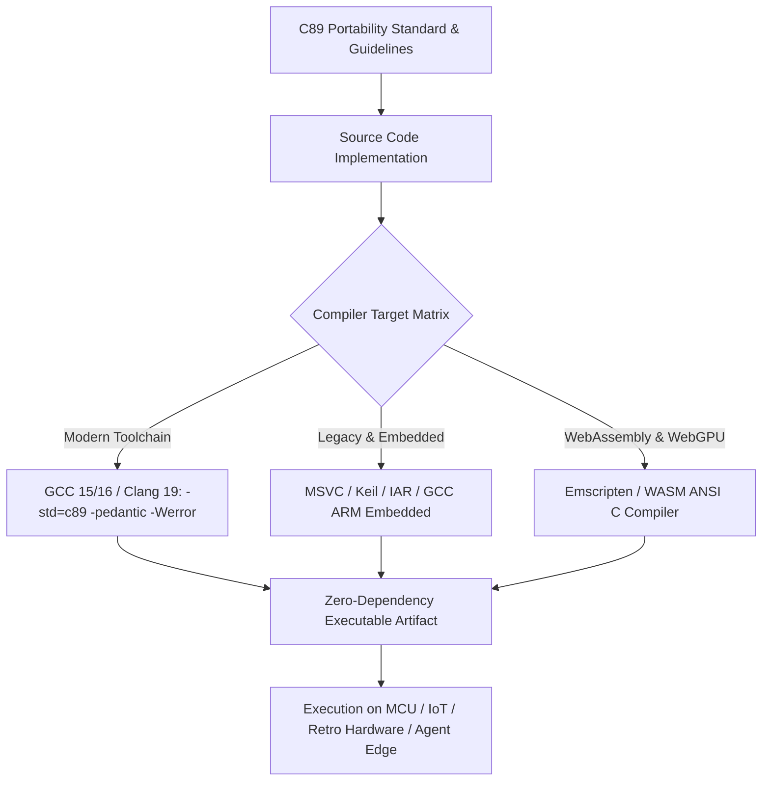

# C89 Portability Guide

## What it is

The C89 Portability Guide is an operational engineering standard, coding reference, and best-practices rulebook for building zero-dependency, ultra-portable software in ANSI C (C89 / ISO C90). It defines compiler-agnostic conventions, memory allocation constraints, pointer safety rules, and type abstraction patterns required to guarantee that C source code compiles cleanly across legacy embedded microcontrollers, retro computing hardware, modern RTOS environments, and modern toolchains like GCC 15/16, Clang 19, and MSVC.

By enforcing strict adherence to the ISO/IEC 9899:1990 standard without compiler-specific extensions, the C89 Portability Guide enables developers to build core algorithms—such as edge AI inference runtimes, mathematical linear algebra engines, and communication protocol parsers—that execute identically across heterogeneous CPU architectures without external dependencies.

## What problem it solves

Modern C and C++ codebases frequently rely on C99 or C11 features (such as inline variable declarations inside `for` loops, variable-length arrays, single-line `//` comments, atomic primitives, and complex `<stdint.h>` header dependencies) or POSIX operating system calls. When compiling code for resource-constrained microcontrollers, specialized DSPs, legacy industrial controllers, or proprietary embedded toolchains, these modern language features trigger compilation errors or mandate heavy runtime libraries.

The C89 Portability Guide eliminates these pain points by restricting language features to the universal baseline supported by virtually every C compiler developed since 1989. This ensures deterministic compilation, zero hidden runtime overhead, fixed memory layouts, and long-term source code preservation across decades of technological shifts.

## Where it fits in the stack

**Development & Ops / Standards & Conventions**. The C89 Portability Guide operates as a foundational software engineering standard in the Development & Ops stack, providing the operational blueprints for zero-dependency inference runtimes like [AnsIGPT](../ai_knowledge/ansigpt.md) and low-level embedded utilities.



## Typical use cases

- **Zero-Dependency Edge AI Runtimes**: Implementing lightweight neural network inference engines (such as [AnsIGPT](../ai_knowledge/ansigpt.md) or custom quantized tensor utilities) that execute directly on bare-metal microcontrollers without OS support.
- **Cross-Platform Math & Cryptography Libraries**: Developing core linear algebra, hashing, or data compression algorithms that must build cleanly across Windows, Linux, macOS, Android, iOS, and embedded RTOS systems.
- **Legacy Industrial Hardware Maintenance**: Writing or refactoring portable utility binaries for older architecture families (MIPS, ARM Cortex-M0/M3, PowerPC, SuperH) where modern Python or C++20 standard runtimes are unavailable.
- **Safety-Critical Sandboxing**: Creating deterministic memory management routines that avoid dynamic `malloc`/`free` heap fragmentation and undefined pointer behavior in automotive or aerospace firmware.

## Strengths

- **Universal Compiler Support**: Source code compiles without modification on virtually any C compiler created in the past 35+ years.
- **Zero Hidden Overhead**: Guarantees no runtime initialization code, garbage collection pauses, or hidden heap allocation overhead.
- **Deterministic Memory Footprint**: Mandates explicit static buffer allocation and explicit struct padding, ensuring predictable RAM usage on microcontrollers.
- **Maximum Longevity**: Code written to strict C89 standards remains valid and maintainable without syntax deprecation risks over decades.
- **Simplified Auditability**: Straightforward language mechanics simplify manual code inspection, formal mathematical verification, and security auditing.

## Limitations

- **Syntax Verbosity**: Demands that all variable declarations occur at the beginning of a code block (prior to executable statements) and disallows C99 single-line `//` comments.
- **No Native Fixed-Width Types**: Standard C89 lacks `<stdint.h>` types (`int32_t`, `uint8_t`), requiring explicit custom `typedef` header abstractions.
- **Manual Pointer Arithmetic**: Lacks modern high-level abstractions, requiring explicit bounds checking and careful array index management.
- **No Built-In Concurrency**: Standard C89 does not define threading or atomic memory primitives; concurrency must be handled via platform-specific wrappers.

## When to use it

- When implementing low-level embedded firmware, bare-metal IoT runtimes, or edge AI execution engines.
- When writing core mathematical or cryptographic algorithms that must compile natively across heterogeneous operating systems and architectures.
- When long-term software preservation, zero external runtime dependencies, and toolchain independence are primary project requirements.
- When targeting specialized or legacy compiler toolchains that lack full C99 or C11 support.

## When not to use it

- For high-level web backends, database orchestrators, or agent workflow scripts where Python or TypeScript offer significantly higher developer productivity.
- When developing modern GPU-accelerated high-performance computing software where CUDA, C++20, or Rust are required.
- When modern standard library abstractions or POSIX features (such as native thread pools or async I/O) are strictly necessary.

## Getting started

### Standard C89 Compilation Flags
To enforce strict ISO C89 portability during build execution, configure compiler flags across your target toolchains:

```bash
# GCC 15/16 strict C89 verification flags
gcc -std=c89 -pedantic -Wall -Wextra -Werror -Wno-long-long main.c -o app

# Clang 19 strict C89 build
clang -std=c80 -pedantic -Wall -Wextra -Werror main.c -o app
```

### Portable Fixed-Width Types Header Pattern
Create a portable `c89_types.h` header to abstract fixed-width integers across modern and legacy compilers:

```c
#ifndef C89_TYPES_H
#define C89_TYPES_H

/* Portable Fixed-Width Types for C89/C90 */
#if defined(__STDC_VERSION__) && __STDC_VERSION__ >= 199901L
  #include <stdint.h>
  typedef uint8_t   u8;
  typedef int8_t    i8;
  typedef uint16_t  u16;
  typedef int16_t   i16;
  typedef uint32_t  u32;
  typedef int32_t   i32;
#else
  typedef unsigned char      u8;
  typedef signed char        i8;
  typedef unsigned short     u16;
  typedef signed short       i16;
  typedef unsigned long      u32;
  typedef signed long        i32;
#endif

typedef float  f32;
typedef double f64;

#endif /* C89_TYPES_H */
```

## CLI examples

Auditing source files for C89 compliance and symbol dependencies:

```bash
# Verify C89 syntax compliance using GCC pedantic check
gcc -std=c89 -pedantic -fsyntax-only src/tensor_math.c

# Inspect symbol table of object file to ensure zero unwanted libc dependencies
nm -u tensor_math.o

# Run cppcheck static analyzer with C89 standard flag
cppcheck --std=c89 --enable=all --suppress=missingIncludeSystem src/
```

## API examples

### Portable C89 Matrix Multiplication Engine
The following C89 source code demonstrates a fully compliant matrix multiplication routine where all variable declarations are placed at block scope entry:

```c
#include <stdio.h>
#include "c89_types.h"

/* Self-contained, C89-compliant floating-point matrix multiplication */
void c89_matmul(const f32 *A, const f32 *B, f32 *C, int M, int N, int K) {
    int i, j, k;
    f32 sum;

    /* C89 requires all variable declarations at the start of the block */
    for (i = 0; i < M; ++i) {
        for (j = 0; j < N; ++j) {
            sum = 0.0f;
            for (k = 0; k < K; ++k) {
                sum += A[i * K + k] * B[k * N + j];
            }
            C[i * N + j] = sum;
        }
    }
}
```

### FastMCP 3.1 Tool Server for C89 Code Verification
The following Python script defines a **FastMCP 3.1** server that wraps compiler verification commands to validate C89 compliance automatically during agentic code generation loops.

```python
import subprocess
from fastmcp import FastMCP
from pydantic import BaseModel, Field

# Initialize FastMCP Server for C89 auditing
mcp = FastMCP("C89 Code Audit Server")

class AuditRequest(BaseModel):
    code_snippet: str = Field(..., min_length=10, description="C source code snippet to audit")
    compiler_flags: str = Field("-std=c89 -pedantic -Wall -Werror", description="Compiler verification flags")

class AuditResult(BaseModel):
    is_compliant: bool
    compiler_output: str

@mcp.tool()
def audit_c89_compliance(request: AuditRequest) -> AuditResult:
    """Compile-check C source snippet for strict ISO C89 compliance using GCC."""
    # Write snippet to temporary file
    temp_file = "/tmp/c89_audit_temp.c"
    with open(temp_file, "w") as f:
        f.write(request.code_snippet)

    cmd = f"gcc {request.compiler_flags} -fsyntax-only {temp_file}"
    res = subprocess.run(cmd, shell=True, capture_output=True, text=True)

    return AuditResult(
        is_compliant=(res.returncode == 0),
        compiler_output=res.stderr if res.stderr else "C89 Syntax Audit Passed Successfully."
    )

if __name__ == "__main__":
    mcp.run()
```

### Python: Toolchain Config Validation with Pydantic v2
Use strict **Pydantic v2** validation to model compiler options for code generator scripts targeting embedded C89 targets:

```python
from typing import Literal
from pydantic import BaseModel, Field, field_validator

class C89BuildOptions(BaseModel):
    compiler_std: Literal["c89", "c90", "ansi"] = Field("c89", description="Target C standard dialect")
    pedantic_warnings: bool = Field(True, description="Enable strict ISO standard warnings")
    allow_dynamic_alloc: bool = Field(False, description="Disallow malloc/free for deterministic memory")
    optimization_level: Literal["-O0", "-O1", "-O2", "-O3", "-Os"] = Field("-O3")
    target_arch: str = Field("cortex-m0", description="Target architecture family")

    @field_validator("target_arch")
    @classmethod
    def validate_architecture(cls, v: str) -> str:
        allowed = {"cortex-m0", "cortex-m3", "riscv32", "x86_64", "mips32"}
        if v.lower() not in allowed:
            raise ValueError(f"Architecture {v} not in tested target set: {allowed}")
        return v.lower()

# Validate build configuration
config = C89BuildOptions(
    compiler_std="c89",
    pedantic_warnings=True,
    allow_dynamic_alloc=False,
    optimization_level="-O3",
    target_arch="cortex-m0"
)

print(f"Validated C89 Build Options: Target={config.target_arch}, Dialect={config.compiler_std}, Pedantic={config.pedantic_warnings}")
```

## Related tools / concepts

- [AnsIGPT](../ai_knowledge/ansigpt.md) — Portable C89 implementation of MicroGPT.
- [MicroGPT](../ai_knowledge/microgpt.md) — Educational GPT implementation serving as baseline.
- [Ripgrep](ripgrep.md) — High-performance CLI search utility.
- [Claude Code](claude-code.md) — Terminal-based AI agent for code modification.
- [GNU Make](../automation_orchestration/gnu-make.md) — Classic build automation tool.
- [Docker](../infrastructure/docker.md) — Containerization tool for multi-arch toolchains.
- [Python](../ai_knowledge/python.md) — Scripting language for code generation and verification.

## Sources / references

- [ANSI C Standard Specification (ISO/IEC 9899:1990)](https://www.iso.org/standard/17782.html)
- [GCC Dialect Options Documentation](https://gcc.gnu.org/onlinedocs/gcc/C-Dialect-Options.html)

## Contribution Metadata

- Last reviewed: 2027-01-07
- Confidence: high
