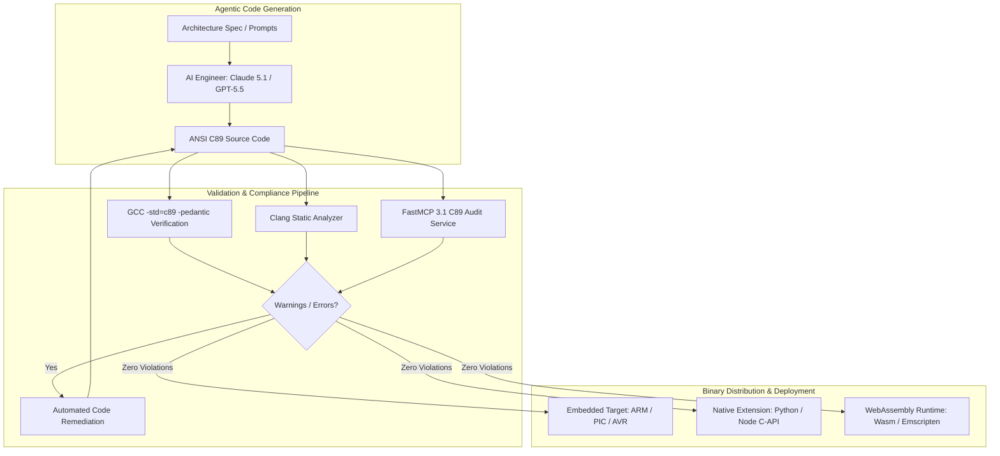

# C89 Portability Guide

## What it is
The C89 Portability Guide defines software engineering practices, coding standards, memory safety abstractions, and cross-compilation idioms for writing strictly conforming ANSI C (C89 / ISO C90) source code. Standardized by ANSI in 1989 and ISO in 1990, standard C89 serves as the universal baseline language standard natively supported by every C compiler, embedded RTOS toolchain, micro-controller SDK, and legacy Unix architecture ever deployed.

In early 2027, within agentic software engineering pipelines and AI-assisted low-level code generation (utilizing frontier reasoning models such as **Claude 5.1**, **GPT-5.5**, and **Gemini 4.0 Pro**), targeting strict C89 compliance guarantees maximum portability. It allows generated code, native extensions, and cryptographic or low-level primitives to compile cleanly without modification across constrained microcontrollers (AVR, PIC, ARM Cortex-M), air-gapped legacy systems, POSIX environments, and modern WebAssembly/LLVM runtimes.

## What problem it solves
Developing low-level software for heterogeneous platforms frequently fails due to compiler-specific extensions, non-portable memory alignment, endianness assumptions, mid-block variable declarations introduced in C99, and missing standard headers (`stdint.h`, `stdbool.h`). These issues cause compilation breaks or silent runtime corruption when moving code between modern x86_64/ARM64 servers and 8-bit or 32-bit embedded targets.

Following strict C89 portability guidelines eliminates compiler ambiguity. By enforcing top-of-block variable declarations, explicit byte-order management, standard block comments (`/* ... */`), and portable header guards, standard C89 code builds warning-free across GCC, Clang, MSVC, and proprietary vendor toolchains without requiring modern language runtime abstractions.

## Where it fits in the stack
**Development & Ops / Low-Level Runtimes & Portability Standards** — functions as the foundational code quality, compliance, and cross-compilation standard for embedded firmware, native language extensions, system CLI utilities, and ultra-portable edge runtimes.

```
+-----------------------------------------------------------------------+
|                 Agentic / High-Level Design Layer                     |
|  [AI Coding Agents: Claude 5.1 / GPT-5.5] --> [C89 Source Generation]  |
+-----------------------------------+-----------------------------------+
                                    |
                                    v
+-----------------------------------------------------------------------+
|                 C89 Portability Compliance Pipeline                   |
|  [gcc -std=c89 -pedantic -Werror] <-> [Clang Static Analyzer / Cppcheck]
+-----------------------------------+-----------------------------------+
                                    |
                                    v
+-----------------------------------------------------------------------+
|                     Target Execution Platforms                        |
|  [8/16/32-bit Microcontrollers]  [Legacy Unix / POSIX]  [Wasm / LLVM] |
+-----------------------------------------------------------------------+
```

## System architecture
The software validation and cross-compilation lifecycle for C89 portable code follows a deterministic verification matrix:



## Typical use cases
- **Cross-Platform Native C Extensions**: Writing ultra-portable C bindings for high-level language runtimes (Python C-API, Node.js N-API, Rust FFI) that compile cleanly on Windows, Linux, macOS, and BSD.
- **Embedded & IoT Firmware**: Developing firmware for resource-constrained microcontrollers using legacy GCC cross-compilers or vendor-locked IDEs.
- **System Utilities & AI Edge Agents**: Writing low-footprint CLI tools (such as `ansigpt` or IPC daemons) designed to run on arbitrary Unix-like systems without external runtime dependencies.
- **Cryptographic & High-Assurance Modules**: Implementing zero-dependency mathematical and cryptographic algorithms where predictable stack layouts and deterministic memory access are required.

## Strengths
- **Universal Toolchain Interoperability**: Compatible with 100% of C compilers developed over the past 35+ years.
- **Deterministic Memory Allocation**: Strict top-of-block variable declarations ensure predictable stack framing, stack usage analysis, and deterministic execution.
- **Zero Runtime Overhead**: Minimal footprint without requiring dynamic runtime libraries, runtime reflection, or modern language runtime overhead.
- **Unrivaled Long-Term Stability**: Code written in strict C89 remains buildable and maintainable indefinitely without suffering from language deprecation.

## Limitations
- **Syntax Restrictions**: Strict C89 forbids variable declarations inside `for` loops or mid-block code lines, requiring discipline in variable scope management.
- **Absence of Modern Standard Types**: Lacks native `<stdint.h>` integer types (`uint32_t`, `int64_t`) or `<stdbool.h>` booleans unless fallback type definitions are provided.
- **Comment Restrictions**: Strictly prohibits C99 single-line comments (`//`), requiring multi-line block comments (`/* ... */`).

## When to use it
- When writing shared libraries, embedded firmware, cross-language FFI bindings, or low-level utilities intended for arbitrary target platforms.
- When generating C code via AI models (`ansigpt`) where target environment compiler capabilities are unknown or constrained.
- When long-term maintainability, zero external dependencies, and absolute cross-compiler safety are required.

## When not to use it
- When developing modern enterprise server applications where modern C11/C17/C23 features (such as standard threads, generic selections, atomic operations) are required.
- When working strictly in high-level managed memory environments (Python, TypeScript, Go) where C compilation is unnecessary.

## Getting started

### Compiler Verification Flags
To verify strict C89 compliance during local development, pass strict ISO/ANSI flags to GCC or Clang:

```bash
# GCC strict C89 compilation
gcc -std=c89 -pedantic -Wall -Wextra -Werror -Wno-long-long main.c -o main_c89

# Clang strict C89 compilation
clang -std=c89 -pedantic -Wall -Wextra -Werror main.c -o main_c89
```

### Portable Boilerplate Header (`c89_portable.h`)
Include standard type fallback definitions when building portable C89 code:

```c
#ifndef C89_PORTABLE_H
#define C89_PORTABLE_H

/* Detect compiler standard compliance */
#if defined(__STDC__)
#  define C89_STRICT 1
#endif

/* Fallback integer definitions for legacy environments lacking stdint.h */
#if defined(_MSC_VER) && (_MSC_VER < 1600)
typedef unsigned __int8   c89_uint8;
typedef unsigned __int16  c89_uint16;
typedef unsigned __int32  c89_uint32;
typedef signed   __int32  c89_int32;
#else
typedef unsigned char      c89_uint8;
typedef unsigned short     c89_uint16;
typedef unsigned long      c89_uint32;
typedef signed   long      c89_int32;
#endif

/* Boolean type definition */
typedef int c89_bool;
#ifndef C89_TRUE
#  define C89_TRUE  1
#  define C89_FALSE 0
#endif

#endif /* C89_PORTABLE_H */
```

## CLI examples

### Automated Compliance Auditing Commands
Run static code auditing and cross-compilation checks:

```bash
# 1. Compile C89 core module with strict pedantic warnings
gcc -std=c89 -pedantic -Wall -Wextra -c src/ansigpt_core.c -o build/ansigpt_core.o

# 2. Check exported global symbols using nm
nm -g build/ansigpt_core.o

# 3. Perform static analysis using cppcheck in C89 mode
cppcheck --enable=all --std=c89 src/

# 4. Cross-compile for bare-metal ARM target
arm-none-eabi-gcc -std=c89 -pedantic -Wall -c src/ansigpt_core.c -o build/ansigpt_arm.o
```

## API examples

### Complete Portable C89 String Processing Engine
The following fully conforming C89 code demonstrates top-of-block variable declarations, safe pointer arithmetic, and portable memory management:

```c
#include <stdio.h>
#include <stdlib.h>
#include <string.h>

/* Top-of-block variable declarations required in C89 */
int c89_transform_buffer(const char *src, char *dest, size_t max_size) {
    size_t i;
    size_t src_len;

    /* Validate pointer inputs */
    if (src == NULL || dest == NULL || max_size == 0) {
        return -1;
    }

    src_len = strlen(src);
    if (src_len >= max_size) {
        return -2; /* Buffer overflow protection */
    }

    /* Perform transformation safely */
    for (i = 0; i < src_len; i++) {
        char ch;
        ch = src[i];
        if (ch >= 'a' && ch <= 'z') {
            dest[i] = (char)(ch - ('a' - 'A'));
        } else {
            dest[i] = ch;
        }
    }
    dest[src_len] = '\0';

    return 0;
}

int main(void) {
    char input_str[128];
    char output_str[128];
    int status;

    strcpy(input_str, "c89 portability guide verification engine");
    status = c89_transform_buffer(input_str, output_str, sizeof(output_str));

    if (status == 0) {
        printf("Source: %s\n", input_str);
        printf("Transformed: %s\n", output_str);
    } else {
        printf("Transformation failed with status: %d\n", status);
    }

    return 0;
}
```

### Python Automated C89 Compliance Auditor (Pydantic v2)
The following Python script uses Pydantic v2 to inspect C source files and detect C89 compliance violations (such as single-line comments `//` or mid-block declarations):

```python
import re
import sys
from pathlib import Path
from typing import List, Dict
from pydantic import BaseModel, Field

class C89Violation(BaseModel):
    file_path: str = Field(..., description="Path to C source file")
    line_number: int = Field(..., description="Line number where violation occurred")
    violation_type: str = Field(..., description="Type of C89 violation (e.g. C99_COMMENT)")
    line_content: str = Field(..., description="Raw text of the offending line")

class AuditReport(BaseModel):
    scanned_files: int = Field(default=0)
    violations: List[C89Violation] = Field(default_factory=list)
    is_compliant: bool = Field(default=True)

def audit_c89_compliance(source_dir: str) -> AuditReport:
    report = AuditReport()
    path = Path(source_dir)
    c99_comment_regex = re.compile(r"^\s*//")

    for file_p in path.glob("**/*.[ch]"):
        report.scanned_files += 1
        with open(file_p, "r", encoding="utf-8", errors="ignore") as f:
            for idx, line in enumerate(f, 1):
                if c99_comment_regex.search(line):
                    report.violations.append(C89Violation(
                        file_path=str(file_p),
                        line_number=idx,
                        violation_type="C99_SINGLE_LINE_COMMENT",
                        line_content=line.strip()
                    ))
                    report.is_compliant = False

    return report

if __name__ == "__main__":
    report = audit_c89_compliance("src")
    print(f"Scanned {report.scanned_files} files. Compliant: {report.is_compliant}")
    for v in report.violations:
        print(f"[{v.violation_type}] {v.file_path}:{v.line_number} -> {v.line_content}")
```

## FastMCP 3.1 & Model Context Protocol Integration

The following FastMCP 3.1 server exposes an automated C89 compliance checker tool directly to coding agents (**Claude 5.1**, **GPT-5.5**), enabling agentic refactoring pipelines to verify standard C89 conformance during code generation sessions:

```python
import subprocess
from pathlib import Path
from typing import List, Dict, Any
from mcp.server.fastmcp import FastMCP, Context
from pydantic import BaseModel, Field

mcp = FastMCP("C89PortabilityChecker")

class C89CheckResult(BaseModel):
    filename: str
    passed: bool
    compiler_output: str
    error_count: int

@mcp.tool()
async def verify_c89_code(file_path: str, ctx: Context = None) -> C89CheckResult:
    """
    Compiles a C source file using strict GCC C89 flags to verify standard ANSI C compliance.

    Args:
        file_path: Relative path to the C file to verify.
    """
    path = Path(file_path)
    if not path.exists():
        return C89CheckResult(
            filename=file_path,
            passed=False,
            compiler_output=f"File not found: {file_path}",
            error_count=1
        )

    if ctx:
        await ctx.info(f"Running GCC -std=c89 -pedantic against {file_path}")

    cmd = ["gcc", "-std=c89", "-pedantic", "-Wall", "-Wextra", "-Werror", "-c", str(path), "-o", "/dev/null"]

    try:
        proc = subprocess.run(cmd, capture_output=True, text=True)
        passed = (proc.returncode == 0)
        output = proc.stdout + proc.stderr
        error_count = 0 if passed else output.count("error:")

        return C89CheckResult(
            filename=file_path,
            passed=passed,
            compiler_output=output if output else "Compilation successful with zero errors/warnings.",
            error_count=error_count
        )
    except Exception as err:
        return C89CheckResult(
            filename=file_path,
            passed=False,
            compiler_output=str(err),
            error_count=1
        )

if __name__ == "__main__":
    mcp.run()
```

## Operational Build Integration & Playbooks

### Generic Cross-Platform Makefile Standard
Standardize C89 compilation across build environments using GNU Make:

```makefile
# Cross-platform C89 Makefile
CC ?= gcc
CFLAGS = -std=c89 -pedantic -Wall -Wextra -Werror -O2
INCLUDES = -Iinclude
SRC_DIR = src
BUILD_DIR = build

SRCS = $(wildcard $(SRC_DIR)/*.c)
OBJS = $(patsubst $(SRC_DIR)/%.c, $(BUILD_DIR)/%.o, $(SRCS))
TARGET = $(BUILD_DIR)/libc89_core.a

.PHONY: all clean audit

all: $(TARGET)

$(BUILD_DIR)/%.o: $(SRC_DIR)/%.c
	@mkdir -p $(BUILD_DIR)
	$(CC) $(CFLAGS) $(INCLUDES) -c $< -o $@

$(TARGET): $(OBJS)
	ar rcs $@ $(OBJS)

audit:
	cppcheck --enable=all --std=c89 $(SRC_DIR)/

clean:
	rm -rf $(BUILD_DIR)
```

## Related tools / concepts
- [ansigpt](../ai_knowledge/ansigpt.md) — Minimalistic ANSI C GPT CLI implementation.
- [ripgrep](ripgrep.md) — High-performance Rust search utility.
- [GNU Make](../automation_orchestration/gnu-make.md) — Standard build automation system.
- [Makefile MCP](../automation_orchestration/makefile-mcp.md) — MCP server for makefile execution.
- [Aider](aider.md) — Terminal-native pair programmer.
- [Claude Code](claude-code.md) — Anthropic CLI agent.
- [VS Code](vscode.md) — IDE code editor.

## Sources / references
- [ANSI C Wikipedia Overview](https://en.wikipedia.org/wiki/ANSI_C)
- [ISO/IEC 9899:1990 Programming Languages - C](https://www.iso.org/standard/17782.html)
- [GCC Standard C Language Options](https://gcc.gnu.org/onlinedocs/gcc/C-Dialect-Options.html)

## Contribution Metadata
- Last reviewed: 2027-01-07
- Confidence: high
