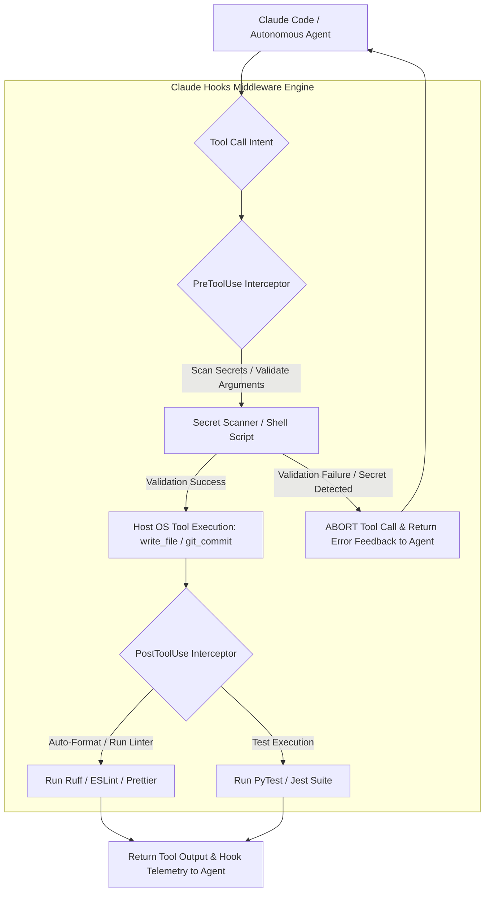

# Claude Hooks

## What it is
Claude Hooks are deterministic middleware lifecycle event handlers, configuration schemas, and shell execution standards used to wrap autonomous agent sessions (such as **Claude Code**, **Claude 5.1**, and **GPT-5.5**) with verifiable, security-hardened guardrails. Claude Hooks allow developers and engineering teams to inject automated logic into agent execution pipelines via JSON definitions (`.claude/hooks.json`). They support lifecycle events including `PreToolUse`, `PostToolUse`, `PromptTransform`, and `SessionTermination`.

Natively compatible with **FastMCP 3.1** protocol schemas, Claude Hooks act as an interceptor layer between the AI agent's reasoning loop and the host operating system. They guarantee that safety policies, secret scanning, repository linting rules, and build validation checks are strictly enforced before or after any tool (such as file modifications, shell executions, or Git commits) is allowed to run.

## What problem it solves
Autonomous software development agents possess broad system permissions to create files, execute arbitrary shell scripts, modify package dependencies, and make Git commits. This capability creates several critical operational risks:
1. **Accidental Credential Leaks**: Agents may unintentionally commit API keys, private passwords, or environment variables to public or internal code repositories.
2. **Violations of Repository Standards**: Autonomous code modifications can violate team formatting rules (`prettier`, `eslint`, `ruff`, `black`), breaking continuous integration (CI) builds.
3. **Destructive System Operations**: Unchecked tool execution can overwrite critical configuration files or delete essential database artifacts.
4. **Lack of Automated Verification**: Without post-execution hooks, agents must rely on probabilistic self-inspection to confirm whether code changes compile or pass unit tests.

Claude Hooks solve these issues by enforcing deterministic, non-LLM shell scripts and FastMCP middleware. Regardless of model confidence or system prompt wording, hook scripts intercept tool execution payloads, inspect parameters, run static analysis checks, and return pass/fail flags to the agentic controller.

## Where it fits in the stack
**Category**: Development & Operations / Workflow Guardrails & Agent Security. Claude Hooks sit at the **Security & Interception Layer**, operating directly between the agent runtime and the local shell environment.



## Typical use cases
- **Automated Pre-Commit Secret Scanning**: Intercepting `git_commit` tool calls to scan staged files for hardcoded API keys, tokens, or PII using `gitleaks` or `trufflehog` before allowing commits.
- **Post-Write Code Formatting & Linting**: Automatically running `ruff format`, `black`, `eslint --fix`, or `prettier` immediately after an agent executes `write_file` or `replace_in_file`.
- **Destructive Command Interception**: Blocking attempts to execute dangerous bash commands (e.g., `rm -rf /`, `chmod 777`, or drops of production database tables) via `PreToolUse` bash inspectors.
- **Automatic Test Feedback Loops**: Triggering test runner execution (`pytest`, `npm test`) following major code edits and returning test stdout directly into the agent's context window for immediate bug fixing.
- **Audit Logging & Slack/Webhook Alerts**: Dispatching telemetry events to internal logging dashboards or team messaging channels whenever an agent modifies sensitive infrastructure files.

## Strengths
- **100% Deterministic Security**: Policy rules are executed via standard shell binaries and scripts, completely bypassing LLM non-determinism.
- **FastMCP 3.1 Interoperability**: Seamlessly intercepts standard Model Context Protocol tool requests and responses.
- **Transparent JSON Configuration**: Standardized, version-controlled `.claude/hooks.json` schemas that can be shared across developer repositories.
- **Rich Language & Tooling Ecosystem**: Supports any local executable, Python script, Node.js script, or custom compiled binary as a hook action handler.
- **Automated Self-Correction**: Returning stderr or validation failure details from hooks automatically prompts the agent to attempt intelligent code remediation.

## Limitations
- **Local Tool Dependencies**: Hook scripts rely on local developer binaries (e.g., `python3`, `node`, `ruff`, `gitleaks`) being present in the user's `$PATH`.
- **Execution Latency Overhead**: Running heavy static analysis or extensive test suites on every `write_file` call can slow down overall agent iteration speed.
- **Configuration Maintenance**: Highly complex multi-hook setups require ongoing maintenance as project builds and repository structures evolve.

## When to use it
- In multi-developer team environments where consistent coding standards and security gates must be enforced across human and AI contributions.
- When granting autonomous agents permission to execute terminal commands, modify source code, or perform Git operations.
- When building safety-critical workflows involving Infrastructure-as-Code (IaC), database migrations, or financial APIs.

## When not to use it
- During early-stage, rapid prototyping where strict rules or linter failures slow down exploratory code discovery.
- In minimal single-file scripts where natural language prompt instructions are sufficient and security risks are negligible.
- In isolated, temporary sandbox environments where full container isolation already mitigates destructive risks.

## Getting started

### Repository Setup
Create the `.claude/` directory inside your repository root and initialize `hooks.json`:

```bash
# Create configuration directory
mkdir -p .claude

# Create empty hooks configuration file
touch .claude/hooks.json
```

### Basic Hook Configuration (`.claude/hooks.json`)
Configure a basic `PreToolUse` hook to scan secrets before Git commits and a `PostToolUse` hook to format Python code:

```json
{
  "version": "0.5",
  "hooks": [
    {
      "name": "Pre-Commit Secret Audit",
      "type": "PreToolUse",
      "tool": "git_commit",
      "action": "scripts/scan_secrets.sh",
      "on_failure": "abort"
    },
    {
      "name": "Post-Write Python Formatting",
      "type": "PostToolUse",
      "tool": "write_file",
      "action": "ruff format {{filepath}}",
      "on_failure": "warn"
    }
  ]
}
```

### Implementing the Hook Script (`scripts/scan_secrets.sh`)
Create a simple bash script that inspects staged Git files for potential credentials:

```bash
#!/usr/bin/env bash
set -e

echo "Executing PreToolUse hook: Scanning staged files for API keys..."

if git diff --cached | grep -E "(BEGIN PRIVATE KEY|AWS_SECRET_ACCESS_KEY|sk-proj-)"; then
  echo "CRITICAL SECURITY ERROR: Potential secret or private key detected in staged diff!" >&2
  exit 1
fi

echo "Secret scan passed successfully."
exit 0
```

## CLI examples

### Validating Hook Environment Dependencies
Verify that all CLI utilities required by your Claude Hooks pipeline are available in the active environment:

```bash
which gitleaks ruff prettier pytest python3
```

### Testing Hook Execution Manually
Execute a pre-commit secret scan manually to verify behavior prior to launching an agent session:

```bash
bash scripts/scan_secrets.sh
```

### Monitoring Live Hook Execution Logs
Stream hook output logs during an active Claude Code or agentic refactoring session:

```bash
tail -f .claude/hooks.log
```

## API examples

### Python: FastMCP 3.1 Hook Telemetry Interceptor with Pydantic v2
This production-ready Python script demonstrates implementing a FastMCP 3.1 middleware server that validates Claude Hooks JSON payloads, checks tool arguments against security rules, and logs telemetry using Pydantic v2 schemas:

```python
import sys
import json
from typing import Dict, Any, Optional, Literal
from pydantic import BaseModel, Field, field_validator
from mcp.server.fastmcp import FastMCP

mcp = FastMCP("ClaudeHooksMiddlewareServer")

class HookPayloadSchema(BaseModel):
    hook_name: str = Field(..., description="Unique label identifying the executed hook")
    event_type: Literal["PreToolUse", "PostToolUse", "PromptTransform"] = Field(..., description="Lifecycle event phase")
    tool_name: str = Field(..., description="Target tool name being intercepted")
    arguments: Dict[str, Any] = Field(default_factory=dict, description="Captured tool call argument payload")
    environment: Optional[str] = Field(default="development", description="Execution context environment")

    @field_validator("arguments")
    def inspect_protected_paths(cls, v: Dict[str, Any], info) -> Dict[str, Any]:
        target_path = str(v.get("filepath") or v.get("path") or "")
        if "protected/" in target_path or "secrets/" in target_path:
            raise ValueError(f"Modification of protected path '{target_path}' is forbidden by hook security policy.")
        return v

class HookEvaluationResult(BaseModel):
    hook_name: str
    allowed: bool
    status_code: int
    message: str
    modified_arguments: Optional[Dict[str, Any]] = None

@mcp.tool()
def process_hook_event(payload_json: str) -> str:
    """Processes incoming Claude Hook lifecycle events, validates arguments, and returns execution permission."""
    try:
        data = json.loads(payload_json)
        payload = HookPayloadSchema(**data)

        # Destructive bash tool restriction logic
        if payload.tool_name == "bash_exec":
            command = str(payload.arguments.get("command", ""))
            if "rm -rf /" in command or "drop database" in command.lower():
                result = HookEvaluationResult(
                    hook_name=payload.hook_name,
                    allowed=False,
                    status_code=403,
                    message="Destructive system command intercepted and blocked by PreToolUse hook."
                )
                return result.model_dump_json(indent=2)

        result = HookEvaluationResult(
            hook_name=payload.hook_name,
            allowed=True,
            status_code=200,
            message="Hook evaluation succeeded. Tool execution approved."
        )
        return result.model_dump_json(indent=2)
    except Exception as e:
        error_result = HookEvaluationResult(
            hook_name="UnknownHook",
            allowed=False,
            status_code=400,
            message=f"Hook validation error: {str(e)}"
        )
        return error_result.model_dump_json(indent=2)

if __name__ == "__main__":
    mcp.run()
```

## Related tools / concepts
- [Claude Code](claude-code.md) — The primary agentic software engineering CLI.
- [Model Context Protocol](../automation_orchestration/mcp.md) — Standardization protocol for extending agent capabilities.
- [Aider](aider.md) — Terminal-based pair-programming assistant with hook capabilities.
- [Desktop Commander MCP](desktop-commander-mcp.md) — Desktop automation and command execution tool.
- [GitHub Actions](../../architecture/infrastructure.md) — CI/CD automation pipeline platform.
- [Playwright](playwright.md) — Browser automation engine often run inside post-execution hooks.
- [Agentic Workflows](../../knowledge_base/patterns/agentic-workflows.md) — Structural design patterns for autonomous agent safety.

## Sources / references
- [Claude Hooks Pattern Library](https://github.com/johnlindquist/claude-hooks)
- [Anthropic: Tool Use Middleware Patterns](https://docs.anthropic.com/claude/docs/tool-use-middleware)
- [Awesome Claude Code Community Tools](https://github.com/hesreallyhim/awesome-claude-code)
- [Model Context Protocol Specification](https://modelcontextprotocol.io/introduction)

---
## Contribution Metadata
- Last reviewed: 2027-01-07
- Confidence: high
