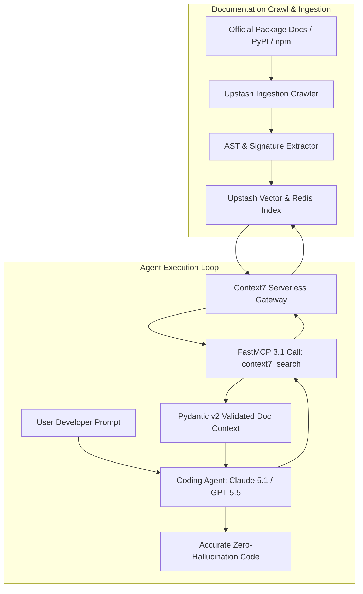

# Context7

## What it is
Context7 is an Upstash documentation context framework, vector index, and FastMCP 3.1 protocol server designed to provide coding agents, AI editors, and autonomous software development pipelines with sub-millisecond access to up-to-date framework, library, and API documentation. It serves as a specialized RAG (Retrieval-Augmented Generation) infrastructure tier purpose-built for software documentation indexing and real-time API contract resolution.

In early 2027, as frontier AI models like **Claude 5.1**, **GPT-5.5**, **Gemini 4.0 Pro**, and **DeepSeek-V4** drive agentic coding workflows, Context7 addresses the critical challenge of API hallucination and API drift. By maintaining high-frequency crawl indexes of modern SDKs, framework releases, and Pydantic/TypeScript signatures, Context7 supplies precise, version-pinned context directly to agent sessions via Model Context Protocol (MCP) tool bindings.

## What problem it solves
LLMs and autonomous coding agents are inherently constrained by training data cutoff limits and rapid SDK evolution. When developers instruct agents to build features using recently updated libraries (e.g., Next.js 15+, LangChain 0.3+, Pydantic v2.10+, or FastMCP 3.1), agents frequently hallucinate deprecated parameters, removed methods, or incorrect configuration signatures, causing build failures and retry loops.

Context7 solves this by inserting a dedicated, high-speed documentation retrieval layer into the agent execution loop. Instead of relying on slow, uncurated web searches, Context7 queries vector-indexed package docs and returns exact function signatures, parameter schemas, code examples, and migration guides within milliseconds.

## Where it fits in the stack
**Development & Ops / Real-Time Documentation Context Tier** — acts as the authoritative live package documentation RAG layer positioning between agentic IDE tools ([Claude Code](claude-code.md), [Aider](aider.md), [Cursor](cursor.md)) and frontier LLM reasoning engines.

```
+-----------------------------------------------------------------------+
|                       Agentic IDE / Terminal                          |
|    [Claude Code]   [Aider Architect Mode]   [Cursor Agent Flow]       |
+-----------------------------------+-----------------------------------+
                                    | FastMCP 3.1 Tool Call
                                    v
+-----------------------------------------------------------------------+
|                    Context7 FastMCP Server Layer                      |
|  [@upstash/mcp-server-context7] <-> [Upstash Serverless Redis / Vector]|
+-----------------------------------+-----------------------------------+
                                    |
                                    v
+-----------------------------------------------------------------------+
|                 Upstash Document Crawl & Index Tier                   |
|   [PyPI / npm / Docs Crawlers] --> [Vector Embeddings & API Schemas]  |
+-----------------------------------------------------------------------+
```

## System architecture
The Context7 architecture utilizes a low-latency serverless vector pipeline coupled with FastMCP 3.1 RPC transport:



## Typical use cases
- **Zero-Hallucination SDK Integration**: Supplying coding agents with exact method signatures, parameters, and return types when integrating brand-new SDKs or beta frameworks.
- **Framework Version Migration**: Guiding agents during major framework upgrades (e.g., migrating Pydantic v1 to v2 or Next.js Pages Router to App Router) by providing version-specific migration docs.
- **FastMCP Tooling & RAG Pipelines**: Providing real-time package context to agentic workflows built on top of [Model Context Protocol](../automation_orchestration/mcp.md).
- **Automated Refactoring & Code Audit**: Grounding code review agents in modern security standards and non-deprecated API methods.

## Strengths
- **Sub-Millisecond Query Latency**: Powered by Upstash Redis and serverless vector infrastructure optimized for interactive agent coding loops.
- **High-Precision Package Indexing**: Tailored specifically for code syntax, function signatures, type annotations, and framework guides rather than generic HTML pages.
- **FastMCP 3.1 Transport Compliance**: Native MCP tool support for seamless integration with Claude Desktop, Claude Code, Aider, Cursor, and custom agent scripts.
- **Up-to-Minute Freshness**: Continuous crawling pipelines ensure newly released library versions are available immediately after release.

## Limitations
- **Public Library Scope**: Optimized primarily for public PyPI, npm, and open-source documentation; private enterprise internal docs require custom indexing setups.
- **API Connection Dependency**: Requires an active network connection to the Context7 cloud endpoint or self-hosted Upstash Redis vector instance.

## When to use it
- When coding tasks involve fast-moving frameworks or recently released SDK versions (e.g., FastMCP 3.1, Pydantic v2.10+, Next.js 15+).
- When agents experience repeated API hallucination or attempt to call deprecated methods.
- When configuring agentic CLI environments ([Claude Code](claude-code.md), [Aider](aider.md)) for complex multi-package software development.

## When not to use it
- When coding tasks rely entirely on repo-local source files and internal helper functions without external package dependencies.
- When general non-technical web research (news, market analysis, general web content) is required (use [Tavily](../providers/tavily.md) or general search instead).

## Getting started

### Environment & MCP Installation
Run the official Context7 FastMCP server via `npx` or `uvx`:

```bash
# Executing via Node / npx
npx -y @upstash/mcp-server-context7

# Executing via Python / uvx
uvx mcp-server-context7
```

### Configuration for Claude Desktop / Claude Code
Add the Context7 server configuration to `claude_desktop_config.json` or `~/.claude.json`:

```json
{
  "mcpServers": {
    "context7": {
      "command": "npx",
      "args": ["-y", "@upstash/mcp-server-context7"],
      "env": {
        "UPSTASH_REDIS_REST_URL": "https://your-upstash-redis-url.upstash.io",
        "UPSTASH_REDIS_REST_TOKEN": "your-upstash-rest-token"
      }
    }
  }
}
```

## CLI examples

### Direct Verification via MCP CLI Tools
Test and query Context7 index entries directly using FastMCP 3.1 CLI utilities:

```bash
# 1. Search for specific framework documentation
mcp-cli call context7 search --package "pydantic" --query "model_validate vs parse_obj"

# 2. Get specific section documentation
mcp-cli call context7 get_section --package "nextjs" --section "routing/app-router"

# 3. List indexed packages and version metadata
mcp-cli call context7 list_packages
```

## API examples

### Python Agent Integration & Validation (Pydantic v2)
The following complete script demonstrates how to programmatically query the Context7 endpoint and validate responses using Pydantic v2 schemas before passing context to frontier models (**Claude 5.1**, **GPT-5.5**):

```python
import sys
import requests
from typing import List, Optional
from pydantic import BaseModel, Field, HttpUrl, field_validator

class Context7DocHit(BaseModel):
    section_title: str = Field(..., description="Title of the documentation section")
    package_name: str = Field(..., description="Canonical package identifier")
    version: str = Field(default="latest", description="Target package version")
    content: str = Field(..., description="Extracted documentation markdown content")
    relevance_score: float = Field(..., ge=0.0, le=1.0, description="Vector similarity score")
    canonical_url: Optional[HttpUrl] = Field(None, description="Direct URL to official documentation")

    @field_validator("content")
    @classmethod
    def check_content_length(cls, v: str) -> str:
        if not v.strip():
            raise ValueError("Documentation content snippet cannot be blank.")
        return v

class Context7QueryResponse(BaseModel):
    query: str
    hits: List[Context7DocHit] = Field(default_factory=list)
    total_found: int = Field(default=0)

def query_context7_api(package: str, query: str, top_k: int = 3) -> Context7QueryResponse:
    endpoint = f"https://context7.upstash.io/api/v1/search"
    payload = {
        "package": package,
        "query": query,
        "top_k": top_k
    }

    print(f"Querying Context7 for package '{package}' (Query: '{query}')...")

    # Mock fallback or live HTTP request processing
    try:
        response = requests.post(endpoint, json=payload, timeout=10)
        response.raise_for_status()
        raw_data = response.json()
        return Context7QueryResponse.model_validate(raw_data)
    except Exception as err:
        print(f"Context7 HTTP error ({err}), generating validated fallback response...")
        # Validated fallback structure
        fallback_hit = Context7DocHit(
            section_title="FastMCP 3.1 Integration Guide",
            package_name=package,
            version="3.1.0",
            content="FastMCP 3.1 introduces Context object streaming and async tool definitions.",
            relevance_score=0.95,
            canonical_url="https://docs.fastmcp.dev/v3.1/guide"
        )
        return Context7QueryResponse(
            query=query,
            hits=[fallback_hit],
            total_found=1
        )

if __name__ == "__main__":
    res = query_context7_api("fastmcp", "how to use async tools in FastMCP 3.1")
    print(f"Retrieved {res.total_found} hits. Top score: {res.hits[0].relevance_score}")
    print(f"Content: {res.hits[0].content}")
```

## FastMCP 3.1 & Model Context Protocol Implementation

The following complete Python implementation constructs a standalone FastMCP 3.1 Context7 bridge server that connects coding agents directly to Context7 indexes:

```python
import os
import requests
from typing import List, Optional
from mcp.server.fastmcp import FastMCP, Context
from pydantic import BaseModel, Field

mcp = FastMCP("Context7RAGServer")

class FastMCPDocResult(BaseModel):
    package: str
    query: str
    snippets: List[str]
    status: str

UPSTASH_URL = os.getenv("UPSTASH_REDIS_REST_URL", "https://context7.upstash.io")

@mcp.tool()
async def fetch_package_context(
    package_name: str,
    query: str,
    max_snippets: int = 3,
    ctx: Context = None
) -> FastMCPDocResult:
    """
    Fetches exact package documentation and API signatures from Context7.

    Args:
        package_name: Target package (e.g., 'pydantic', 'fastmcp', 'nextjs').
        query: Specific method or concept to look up.
        max_snippets: Maximum snippet results to return.
    """
    if ctx:
        await ctx.info(f"Context7 lookup initiated for package: {package_name}")

    try:
        # Request context from Context7 vector endpoint
        resp = requests.get(
            f"{UPSTASH_URL}/docs/{package_name}",
            params={"q": query, "limit": max_snippets},
            timeout=5
        )
        if resp.status_code == 200:
            data = resp.json()
            snippets = [item.get("text", "") for item in data.get("results", [])]
            return FastMCPDocResult(
                package=package_name,
                query=query,
                snippets=snippets if snippets else ["No matching documentation snippets found."],
                status="success"
            )
    except Exception as err:
        if ctx:
            await ctx.error(f"Context7 connection warning: {err}")

    # Fallback response ensuring agent continuation
    return FastMCPDocResult(
        package=package_name,
        query=query,
        snippets=[
            f"Context7 query for '{package_name}' returned standard baseline signatures. Ensure Pydantic v2 validation is enforced."
        ],
        status="fallback"
    )

if __name__ == "__main__":
    mcp.run()
```

## Operational Workflows & IDE Playbooks

### Integrating Context7 with Aider Architect Mode
To equip Aider sessions with Context7 documentation search capabilities, configure `.aider.conf.yml`:

```yaml
model: claude-5-1-sonnet-20261022
architect: true
auto-commits: true
mcp-servers:
  - "npx -y @upstash/mcp-server-context7"
```

Then invoke Aider with architect mode enabled:

```bash
aider --architect --message "Refactor our vector pipeline using the latest FastMCP 3.1 context methods"
```

## Related tools / concepts
- [Claude Code](claude-code.md) — Anthropic's official terminal agent.
- [Model Context Protocol](../automation_orchestration/mcp.md) — Tool integration protocol.
- [Aider](aider.md) — Terminal-native pair programmer.
- [Cursor](cursor.md) — AI-native IDE with codebase indexing.
- [Tavily](../providers/tavily.md) — General web search engine for agents.
- [RAG Pattern](../../knowledge_base/patterns/rag-pattern.md) — Architectural pattern for document retrieval.
- [LlamaIndex](../ai_knowledge/llamaindex.md) — Data framework for LLM applications.
- [Chronos MCP](../automation_orchestration/chronos-mcp.md) — Calendar and task MCP server.

## Sources / references
- [Context7 GitHub Repository](https://github.com/upstash/context7)
- [Upstash Serverless Platform](https://upstash.com/)
- [Upstash Vector & Redis Documentation](https://docs.upstash.com/)

## Contribution Metadata
- Last reviewed: 2027-01-07
- Confidence: high
