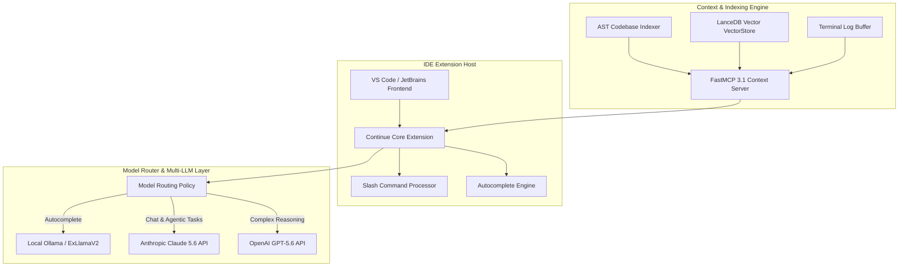

# Continue.dev

## What it is
Continue is an open-source AI code assistant and IDE extension that enables developers to integrate frontier LLMs directly into VS Code and JetBrains. As of early January 2027, Continue is model-agnostic, supporting local inference (via [Ollama](../../services/ollama.md)) and remote APIs ([Anthropic](../providers/anthropic.md), [OpenAI](../ai_knowledge/openai.md), Gemini), with support for frontier models including **Claude 5.6**, **GPT-5.6**, and **Gemini 4.0 Ultra**, and provides deep codebase context through a customizable FastMCP 3.1 "Context Provider" system.

## What problem it solves
Continue solves the problem of vendor lock-in by providing a flexible, open-source layer between the IDE and the AI provider. It enables privacy-conscious development by allowing 100% local operation and addresses the "context awareness" challenge by providing a framework to pull in documentation, GitHub issues, and terminal logs directly into the AI's prompt.

## Where it fits in the stack
**Development & Ops / [Development Environment](index.md)**. It acts as an extensible AI companion inside existing IDEs, serving as an open alternative to [GitHub Copilot](github_copilot.md) and [Cursor](cursor.md).

## Typical use cases
- **Privacy-First Coding**: Using local Llama 4, Gemma 4, or Starcoder 2 models via [Ollama](../../services/ollama.md) for enterprise development.
- **Context-Aware Debugging**: Pulling in terminal output and recent file history automatically to help the AI diagnose errors.
- **Documentation Q&A**: Adding specific documentation URLs as context providers to ask questions about new libraries.
- **Custom Workflow Automation**: Defining project-specific slash commands for repetitive tasks like unit test generation or code review under FastMCP 3.1 Task Protocol.
- **Enterprise Model Routing**: Routing different tasks to different models (e.g., small models for autocomplete, large models for chat).

## Key Features & Capabilities
- **Model Agnosticism & Routing**: Seamlessly switch or route traffic across local LLMs (via Ollama, vLLM, ExLlamaV2) and cloud APIs (Anthropic Claude 5.6, OpenAI GPT-5.6, Google Gemini 4.0 Ultra).
- **Extensible FastMCP 3.1 Context Engine**: Dynamic integration of external tools and data sources through Model Context Protocol v3.1 context providers, supporting real-time codebase indexing, AST indexing, and web documentation parsing.
- **Custom Slash Commands & Automated Workflows**: Define customized actions (e.g., `/test`, `/doc`, `/refactor`) mapped to custom prompts or FastMCP task execution protocols.
- **Tab Autocomplete with Specialized Small Models**: High-speed, sub-50ms code completion powered by specialized small language models like StarCoder2, DeepSeek-Coder, or Qwen 2.5-Coder.
- **Fine-Grained Telemetry & Privacy Controls**: Complete control over token logging, local privacy filtering, and enterprise audit trails without forced remote analytics.

## Architecture & Internal Mechanics

The core architecture of Continue separates the IDE extension host, the background indexing daemon, the FastMCP 3.1 Context Engine, and the unified model routing layer.



### Context Pipeline Flow
1. **User Input / Action**: The developer invokes Continue via chat, slash command, or inline edit request.
2. **Context Resolution**: Continue queries active context providers (codebase AST index, FastMCP 3.1 tools, documentation, open tabs, terminal output).
3. **Prompt Synthesis**: The context provider outputs formatted Markdown blocks with strict source line numbers and metadata.
4. **Router Execution**: The unified prompt is sent to the designated backend model according to routing rules defined in `config.json`.
5. **Stream Rendering & Diff Applying**: Responses are streamed back to the IDE interface, displaying side-by-side diffs or inline token completions.

## Strengths
- **Model Agnostic**: Seamlessly switch between local and cloud providers.
- **Extensible Context**: High-performance "Context Providers" for codebases, docs, terminal, and [FastMCP 3.1](../automation_orchestration/mcp.md).
- **Open Source**: Fully transparent and community-driven, under the Apache 2.0 license.
- **IDE Support**: Native extensions for both VS Code and the full JetBrains suite.
- **Customizable**: Deep configuration via a standard `config.json` for team-wide consistency.

## Limitations
- **Manual Configuration**: Requires more setup effort than "turnkey" alternatives like [Cursor](cursor.md).
- **UX Consistency**: As an extension, it is sometimes limited by the host IDE's UI constraints compared to a standalone AI-native IDE.
- **Inference Speed**: Local model performance is limited by the developer's hardware.

## When to use it
- When you require full control over which models are used and where your data is sent.
- When you want to combine multiple model providers (e.g., local for completions, cloud for complex logic).
- When you prefer to stay in your existing, highly-tuned VS Code or JetBrains environment.

## When not to use it
- If you want a zero-configuration, "it just works" experience (consider [Cursor](cursor.md) or [Windsurf](windsurf.md)).
- If you need a fully autonomous, terminal-first agent (consider [Claude Code](claude-code.md) or [Aider](aider.md)).

## Getting started

### Installation
Continue is installed via the IDE marketplace:

```bash
# VS Code
code --install-extension continue.continue

# JetBrains
# Search for "Continue" in the Settings > Plugins menu
```

### Initial Configuration
Open your `config.json` (via the gear icon in the Continue sidebar) to define your providers.

## CLI examples

### Running the Continue Headless Indexer
Continue includes a CLI for indexing large repositories for team-wide use:

```bash
npx continue-index .
```

### Updating Configuration via CLI
You can use the Continue CLI to manage your local config programmatically:

```bash
continue config set models.default "anthropic/claude-5.6"
```

### Checking Context Provider Health
Validate that your configured documentation and codebase indices are healthy:

```bash
continue doctor
```

### Direct Headless Evaluation
Evaluate prompt responses against Continue indexing engine:

```bash
continue eval --config ./continue-config.json --test-suite ./evals/prompts.yaml
```

## API examples

### config.json with Native FastMCP 3.1 Support
Continue supports [Model Context Protocol](../automation_orchestration/mcp.md) servers directly in the configuration, incorporating SOTA FastMCP 3.1 Task Protocol features:

```json
{
  "models": [
    {
      "title": "Claude 5.6",
      "provider": "anthropic",
      "model": "claude-5.6",
      "apiKey": "${ANTHROPIC_API_KEY}"
    },
    {
      "title": "Local Autocomplete",
      "provider": "ollama",
      "model": "qwen2.5-coder:7b",
      "apiBase": "http://localhost:11434"
    }
  ],
  "contextProviders": [
    {
      "name": "mcp",
      "params": {
        "url": "http://localhost:3000/mcp"
      }
    },
    {
      "name": "codebase",
      "params": {
        "nFinal": 20,
        "useSubmodule": false
      }
    }
  ],
  "customCommands": [
    {
      "name": "refactor-clean",
      "prompt": "Refactor the selected code following clean architecture patterns and FastMCP 3.1 standards.",
      "description": "Clean code refactor workflow"
    }
  ]
}
```

### FastMCP 3.1 Server Integration (Python)
Expose custom enterprise documentation or database contexts directly to Continue via a FastMCP 3.1 server:

```python
import asyncpg
from fastmcp import FastMCP

mcp = FastMCP("continue-enterprise-context", version="3.1.0")

@mcp.tool(description="Fetch architectural decisions and schema guidelines for Continue context provider")
async def get_architecture_guidelines(topic: str) -> str:
    """Retrieves architectural decision records (ADRs) matching topic."""
    # Connect to internal enterprise database or vector store
    guidelines = {
        "auth": "ADR-012: All external requests must use JWT OAuth2 tokens verified by Auth0 middleware.",
        "database": "ADR-018: Read queries must target read-replicas; writes use PostgreSQL primary.",
        "api": "ADR-025: Endpoints must implement FastMCP 3.1 task contract validation with Pydantic v2."
    }
    return guidelines.get(topic.lower(), f"No specific ADR found for topic '{topic}'. Follow standard PEP-8/Clean Code.")

if __name__ == "__main__":
    mcp.run()
```

### Programmatic Setup with Pydantic v2
Validate the `config.json` structure programmatically to ensure flawless IDE extension loading:

```python
from pydantic import BaseModel, Field, ConfigDict
from typing import List, Optional, Dict, Any

class ModelConfig(BaseModel):
    model_config = ConfigDict(extra="forbid", populate_by_name=True)

    title: str
    provider: str
    model: str
    api_key: Optional[str] = Field(default=None, alias="apiKey")
    api_base: Optional[str] = Field(default=None, alias="apiBase")

class ContextProviderConfig(BaseModel):
    model_config = ConfigDict(extra="forbid", populate_by_name=True)

    name: str
    params: Dict[str, Any] = Field(default_factory=dict)

class CustomCommandConfig(BaseModel):
    model_config = ConfigDict(extra="forbid", populate_by_name=True)

    name: str
    prompt: str
    description: Optional[str] = None

class ContinueConfig(BaseModel):
    model_config = ConfigDict(extra="forbid", populate_by_name=True)

    models: List[ModelConfig] = Field(default_factory=list)
    context_providers: List[ContextProviderConfig] = Field(default_factory=list, alias="contextProviders")
    custom_commands: List[CustomCommandConfig] = Field(default_factory=list, alias="customCommands")

# Validate a potential config payload
raw_data = {
    "models": [
        {"title": "Claude 5.6", "provider": "anthropic", "model": "claude-5.6", "apiKey": "sk-ant-test"},
        {"title": "Local Autocomplete", "provider": "ollama", "model": "qwen2.5-coder:7b", "apiBase": "http://localhost:11434"}
    ],
    "contextProviders": [
        {"name": "mcp", "params": {"url": "http://localhost:3000/mcp"}},
        {"name": "codebase", "params": {"nFinal": 20}}
    ],
    "customCommands": [
        {"name": "refactor-clean", "prompt": "Refactor code according to clean code standards."}
    ]
}

parsed_config = ContinueConfig.model_validate(raw_data)
print(f"Validated models count: {len(parsed_config.models)}")
print(f"First model title: {parsed_config.models[0].title}")
print(f"Custom command registered: {parsed_config.custom_commands[0].name}")
```

## Enterprise & Production Best Practices
- **Shared Team Configurations**: Check in a standardized `.continue/config.json` into project root directories to enforce identical model routing, context providers, and prompt conventions across developer workstations.
- **Isolated Local Indexing**: For confidential enterprise repositories, host a central LanceDB/FastMCP 3.1 context server internally to eliminate duplicate AST indexing overhead on individual developer laptops.
- **Model Cost & Traffic Routing**: Direct low-latency autocomplete calls to local GPU instances running vLLM or Ollama while reserving high-tier frontier APIs (Claude 5.6 / GPT-5.6) for complex chat and agentic refactoring commands.
- **Strict Key Management**: Avoid committing raw API keys in `config.json`. Always utilize environment variable interpolation (`${ANTHROPIC_API_KEY}`) or enterprise secrets management tools.

## Related tools / concepts
- [Cursor](cursor.md) — The leading AI-native IDE fork.
- [Zed](zed.md) — High-performance Rust editor with native AI features.
- [Aider](aider.md) — Terminal-native pair programmer.
- [Ollama](../../services/ollama.md) — Recommended for local model serving with Continue.
- [Model Context Protocol](../automation_orchestration/mcp.md) — Supported for context extension.
- [VS Code](vscode.md) — The primary host IDE.
- [Tabnine](tabnine.md) — Alternative autocomplete-focused extension.
- [Windsurf](windsurf.md) — IDE with persistent context "Flows".
- [Chronos MCP](../automation_orchestration/chronos-mcp.md) — For agentic calendar orchestration.
- [Free Will MCP](free-will-mcp.md) — For AI autonomy and self-prompting.

## Sources / references
- [Continue Official Site](https://www.continue.dev/)
- [Continue Documentation](https://docs.continue.dev/)
- [Continue GitHub Repository](https://github.com/continuedev/continue)
- [MCP Integration Guide](https://docs.continue.dev/customization/context-providers#mcp)

## Contribution Metadata
- Last reviewed: 2027-01-07
- Confidence: high
