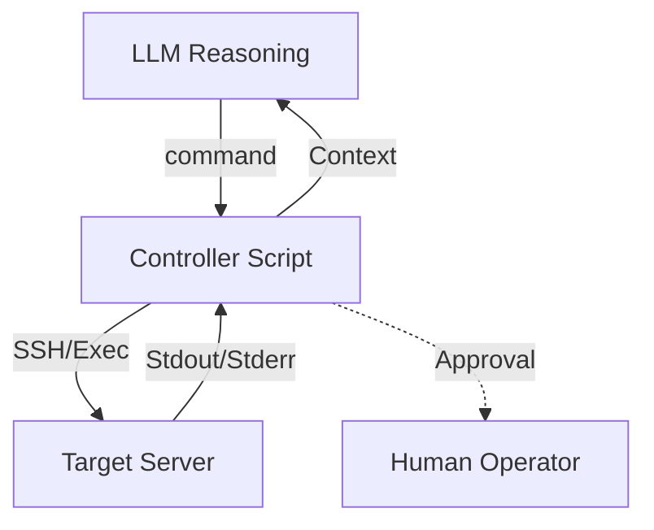

# Custom Agents (SSH + LLM Loop)

## What it is
A "Custom Agent" is a lightweight Python script or automation (e.g., n8n) that implements a basic loop: Prompt LLM -> Receive Command -> Execute via SSH -> Return Output to LLM. It represents the most fundamental implementation of the Model Context Protocol (MCP) concepts without requiring a formal server structure.

## What problem it solves
Provides a tailored, minimal orchestration layer for specific infrastructure tasks without the overhead or complexity of full agent platforms. It allows for precise control over the security and execution plane, specifically addressing the "Reasoning vs. Execution" gap in local homelab management.

## Where it fits in the stack
**Agent / Orchestration Layer**. It is the logic that coordinates the LLM (Reasoning) and the target machine (Execution via SSH). It acts as a bridge between high-level intent and low-level system commands.

## Architecture overview
The loop typically consists of a system prompt defining the available tools (as shell commands) and a controller that manages the connection and output parsing.



## Getting Started (Python Example)
A basic custom agent using `paramiko` and `openai` (or `langchain`):

```python
import paramiko
from openai import OpenAI

# Initialize SSH and LLM
ssh = paramiko.SSHClient()
ssh.set_missing_host_key_policy(paramiko.AutoAddPolicy())
ssh.connect('192.168.1.10', username='admin', key_filename='~/.ssh/id_rsa')
client = OpenAI()

def execute_remote(command):
    stdin, stdout, stderr = ssh.exec_command(command)
    return stdout.read().decode()

# Simple Agent Loop
query = "What is the CPU usage on the server?"
prompt = f"You are a system admin. Use 'exec <command>' to run shell commands. Output: {execute_remote('top -bn1 | grep Cpu')}"
# ... LLM interaction logic ...
```

## Typical use cases
- **Server Maintenance**: "Check disk space on all nodes and clear logs if above 90%."
- **Configuration Updates**: "Update the nginx config on the proxy server and reload the service."
- **Diagnostics**: "Analyze why the service on the Raspberry Pi is failing to start."
- **Automated Patching**: Rolling updates across a k3s cluster with health checks.

## Strengths
- **Simplicity**: Easy to understand and modify without specialized agent frameworks.
- **Security**: You control exactly which commands are allowed and how SSH is handled.
- **Portability**: Can run as a small script anywhere, including within n8n.
- **Transparency**: Every step of the loop is visible and can be logged easily for auditing.

## Limitations
- **Manual Work**: Requires writing and maintaining the controller script and error handling.
- **Context Management**: Needs manual handling of history and state (unlike Aider or OpenHands).
- **Tooling**: Lacks the advanced "repo map" or "browser" tools of larger frameworks.

## When to use it
- For specific, repetitive infrastructure tasks where full agent framework overhead is not desired.
- When you need a high degree of security and explicit human-in-the-loop approval.
- For lightweight automation on resource-constrained devices (e.g., Raspberry Pi Zero).

## When not to use it
- For general software engineering or coding tasks (use [Aider](aider.md) or [OpenHands](openhands.md)).
- When the task requires complex reasoning across hundreds of files or repo-wide understanding.

## Security Considerations
- **SSH Key Safety**: The script needs access to SSH keys; protect these with extreme care (use HashiCorp Vault or environment secrets).
- **Command Injection**: Ensure the LLM output is parsed safely; use an allow-list of commands if possible.
- **Least Privilege**: The SSH user should only have the permissions necessary for the task (Sudo restricted to specific binaries).
- **Human-in-the-Loop**: Implement mandatory approval gates for destructive commands (`rm`, `reboot`, `systemctl stop`).

## Comparison with Frameworks

| Feature | Custom Agent | Aider / OpenHands | n8n Sub-workflow |
| :--- | :--- | :--- | :--- |
| **Setup Overhead** | Low | Medium | High |
| **Control** | Absolute | Limited by toolset | Visual/Workflow based |
| **Scalability** | Manual | High | High |

## Related tools / concepts

- [SSH Execution Patterns](../../architecture/ssh_execution_patterns.md)
- [Raspberry Pi Kiosk Automation](../../playbooks/raspberry-pi-kiosk-automation.md)
- [OpenAI](../ai_knowledge/openai.md)
- [Codeium](codeium.md)
- [Claude Code — Project Setup Guide](claude-code-setup.md)
- [Model Context Protocol (MCP)](../../knowledge_base/patterns/tool-calling-and-mcp.md)
- [Agentic Workflows](../../knowledge_base/patterns/agentic-workflows.md)
- [n8n Error Handling](../../knowledge_base/patterns/n8n-error-handling.md)

## Sources / References

- [Paramiko Documentation](https://docs.paramiko.org/)
- [SSH Agent Loop Patterns (GitHub)](https://github.com/joanmarcriera/Home-office-automations)
- [LLM Tool Calling Best Practices (Anthropic)](https://docs.anthropic.com/claude/docs/tool-use)

## Contribution Metadata

- Last reviewed: 2026-06-01
- Confidence: high
