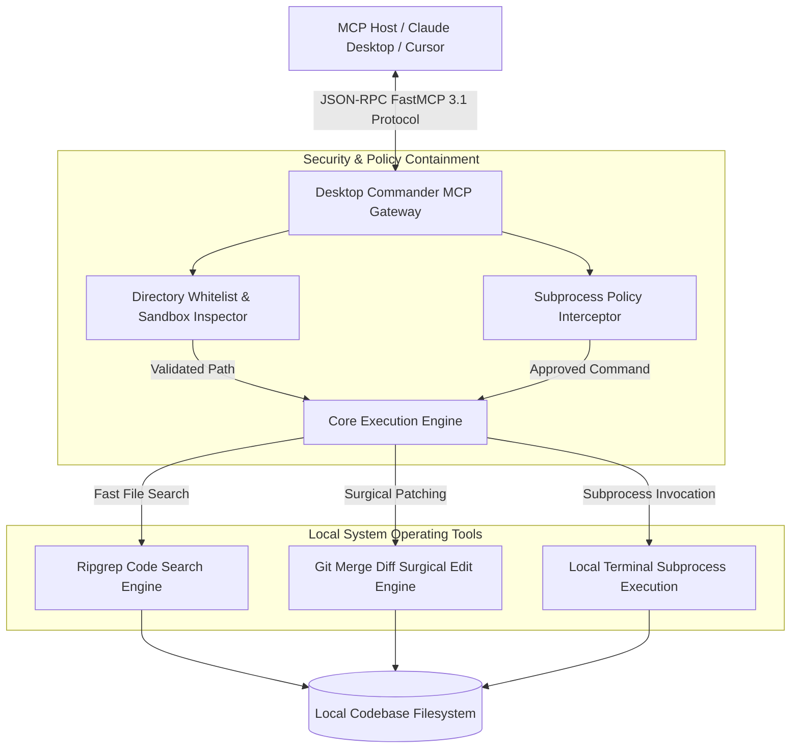

# Desktop Commander MCP

## What it is
Desktop Commander MCP is a zero-telemetry, privacy-first Model Context Protocol (FastMCP 3.1) tool server that gives AI coding assistants surgical command over local terminal environments, filesystems, and codebases. Designed specifically as the local operational interface for frontier reasoning models like Claude 3.7 Sonnet, GPT-4.5, and Gemini 2.5 Pro, Desktop Commander acts as the "local hands" for autonomous coding agents running in host applications such as Claude Desktop, Cursor, VS Code, or Zed.

Unlike standard developer utility tools, Desktop Commander operates under strict air-gapped constraints: zero external network analytics, zero usage telemetry, and zero data leakage. It equips agents with targeted tools for executing subprocess commands, performing high-speed codebase pattern searches via native `ripgrep` integration, inspecting directory trees, and applying precise, idempotent code modifications via git merge diff SEARCH/REPLACE blocks.



## What problem it solves
Giving autonomous AI agents direct system access introduces critical security, privacy, and precision challenges:

1. **Telemetry & Data Leakage Risks**: Many commercial developer tools embed analytics telemetry that sends code context, local file paths, and environment metadata to cloud servers without developer consent.
2. **Imprecise Code Editing**: Full-file rewrites generated by LLMs are prone to hallucinating away surrounding code lines, corrupting imports, and introducing subtle syntax bugs during large refactoring tasks.
3. **Unbounded Subprocess Execution**: Unrestricted terminal execution risks accidental deletion of critical data (`rm -rf /`), arbitrary network fetches, or execution of destructive system scripts.
4. **Context Discovery Latency**: Naive file searching over large repositories consumes excessive LLM context tokens and stalls agent execution loops.

Desktop Commander MCP resolves these obstacles by providing a zero-telemetry execution environment, surgical SEARCH/REPLACE editing blocks that modify only target code sections, strict directory containment whitelisting, and ultra-fast code search using embedded `ripgrep` routines.

## Where it fits in the stack
**Category**: Development & Ops / Local Agent Tooling & Subprocess Execution.

Desktop Commander MCP sits directly between local developer host applications and the host operating system kernel:

- **Upstream Host**: Integrates with MCP-compliant desktop agents (Claude Desktop, Cursor, Zed, Windsurf, or custom FastMCP 3.1 clients) via standard IO (stdio) or WebSocket transport protocols.
- **Internal Security Tier**: Filters incoming JSON-RPC tool calls through path containment verifiers and shell command policy matchers.
- **Downstream OS Kernel**: Invokes native binary subprocesses (`rg`, `git`, `python`, `npm`), manages file locks, and streams standard output/error buffers back to the agent context.

## Typical use cases
- **Privacy-Restricted Local Development**: Giving AI coding assistants full filesystem and terminal control in enterprise environments where cloud telemetry is legally prohibited.
- **Automated Refactoring & Surgical Editing**: Applying exact multi-file edits, type refactoring, and import rewrites without touching unedited file sections.
- **Fast Pattern Discovery in Massive Repositories**: Using `ripgrep`-backed pattern matching to locate class declarations, function signatures, or configuration keys in sub-millisecond execution times.
- **Agentic Testing & Build Iteration**: Running build scripts (`npm test`, `pytest`, `cargo check`), capturing error outputs, and automatically editing broken source files until tests pass.
- **Local Infrastructure Management**: Executing Docker container commands, managing local database migrations, and checking system daemon status safely.

## Strengths
- **Zero-Telemetry Guarantee**: Complete air-gap architecture with zero phone-home calls, analytics tracking, or external data logging.
- **FastMCP 3.1 Task Protocol Compliant**: Built on the latest MCP specification, supporting structured tool parameters, progress notifications, and resource inspection.
- **Surgical Patch Engine (`edit_block`)**: Uses git merge diff conflict markers (`<<<<<<< SEARCH`, `=======`, `>>>>>>> REPLACE`) for exact, fail-safe code modifications.
- **Path Whitelisting Containment**: Enforces strict directory boundaries (`ALLOWED_DIRECTORIES`), rejecting any attempt to traverse outside approved folder trees.
- **Embedded Ripgrep Acceleration**: Native pattern searching that bypasses slow JavaScript file loops, delivering near-instant code search results across massive codebases.
- **Configurable Shell Command Policies**: Allows administrators to block dangerous binary commands (`rm`, `sudo`, `dd`, `curl | sh`) via environment variables.

## Limitations
- **User Permission Boundary**: Operates with the full permissions of the launching user account; it does not replace kernel-level sandbox isolation (e.g., Docker or Firecracker).
- **Manual Whitelist Maintenance**: Requires explicit configuration of allowed directories; unlisted project folders will be rejected by safety checks.
- **Local OS Execution Scope**: Designed for on-device local development; remote cloud server management requires SSH tunneling or additional security layer setup.

## When to use it
- When providing AI agents with local development capabilities in privacy-sensitive or regulated corporate environments.
- When performing multi-file codebase refactoring that demands surgical precision rather than full-file replacements.
- When running local agent loops that require continuous terminal execution, build verification, and test debugging.
- When building FastMCP 3.1 workflows where local terminal and filesystem operations are required.

## When not to use it
- In untrusted environments where agents are given elevated root permissions without container sandboxing.
- If your agent setup requires cloud-native orchestration across distributed clusters (use [Superconductor](superconductor.md) or Kubernetes agents instead).
- For pure web browser automation tasks (use dedicated browser testing frameworks like [Playwright](playwright.md)).

## Getting started

### 1. Global Installation
Install Desktop Commander MCP via npm:

```bash
npm install -g @democratize-technology/desktop-commander-mcp
```

### 2. Configure Host Application
Add the server definition to your `claude_desktop_config.json` (or equivalent Cursor / VS Code configuration):

```json
{
  "mcpServers": {
    "desktop-commander": {
      "command": "desktop-commander-mcp",
      "args": [],
      "env": {
        "ALLOWED_DIRECTORIES": "/home/developer/projects:/tmp/agent-workspace",
        "BLOCKED_COMMANDS": "sudo:rm -rf:dd:mkfs"
      }
    }
  }
}
```

### 3. Verify Server Startup
Launch the server in debug mode from terminal to verify directory whitelisting and active tool endpoints:

```bash
desktop-commander-mcp --list-allowed
```

## CLI examples

### 1. Start Desktop Commander on Custom TCP Port
Run the server listening on a local TCP socket for remote MCP client testing:

```bash
desktop-commander-mcp --port 3000 --allowed-dirs "/home/developer/repo"
```

### 2. Verify Tool Availability with MCP CLI
Use the `mcp-cli` utility to verify that the tool server exposes `search_code`, `edit_block`, and `run_command`:

```bash
mcp-cli list-tools --server desktop-commander
```

### 3. Execute Remote Ripgrep Pattern Search via MCP CLI
Invoke code pattern matching programmatically from CLI:

```bash
mcp-cli call desktop-commander search_code \
  --path "." \
  --query "class FastMCP" \
  --file-pattern "*.py"
```

### 4. Execute Shell Command with Path Context
Run a test runner inside an approved project folder:

```bash
mcp-cli call desktop-commander run_command \
  --cwd "/home/developer/projects/app" \
  --command "pytest tests/unit -v"
```

## API examples

### FastMCP 3.1 Desktop Commander Implementation (Python)
This complete FastMCP 3.1 Python server replicates the core capabilities of Desktop Commander, featuring path containment checks, ripgrep code search, and surgical edit-block execution:

```python
from typing import Dict, Any, List, Optional
from mcp.server.fastmcp import FastMCP
from pydantic import BaseModel, Field, field_validator
import subprocess
import os
import re

mcp = FastMCP(
    "Desktop-Commander-Python",
    instructions="Privacy-first FastMCP 3.1 server providing surgical local filesystem editing, ripgrep code search, and terminal execution."
)

ALLOWED_DIRS = os.getenv("ALLOWED_DIRECTORIES", os.getcwd()).split(":")

class SurgicalEditRequest(BaseModel):
    filepath: str = Field(..., description="Target file path relative to allowed project directories")
    edit_block: str = Field(..., description="Git merge diff SEARCH/REPLACE block")

    @field_validator("edit_block")
    @classmethod
    def validate_diff_structure(cls, v: str) -> str:
        if "<<<<<<< SEARCH" not in v or "=======" not in v or ">>>>>>> REPLACE" not in v:
            raise ValueError("Edit block must contain exact diff markers: <<<<<<< SEARCH, =======, >>>>>>> REPLACE")
        return v

class CodeSearchRequest(BaseModel):
    query: str = Field(..., description="Regex or text string to search for via ripgrep")
    target_dir: str = Field(default=".", description="Target folder path")
    file_pattern: Optional[str] = Field(None, description="Optional file extension filter, e.g. *.py")

class TerminalCommandRequest(BaseModel):
    command: str = Field(..., description="Shell command string to execute")
    cwd: str = Field(default=".", description="Working directory")

def is_path_whitelisted(target_path: str) -> bool:
    resolved_target = os.path.realpath(target_path)
    for allowed in ALLOWED_DIRS:
        resolved_allowed = os.path.realpath(allowed)
        if resolved_target == resolved_allowed or resolved_target.startswith(resolved_allowed + os.sep):
            return True
    return False

@mcp.tool()
async def search_code(request: CodeSearchRequest) -> Dict[str, Any]:
    """
    Executes a high-speed codebase search using ripgrep within whitelisted path boundaries.
    """
    if not is_path_whitelisted(request.target_dir):
        return {"error": f"Path '{request.target_dir}' is outside allowed directories: {ALLOWED_DIRS}"}

    cmd = ["rg", "--line-number", "--column", request.query, request.target_dir]
    if request.file_pattern:
        cmd.extend(["-g", request.file_pattern])

    try:
        result = subprocess.run(cmd, capture_output=True, text=True, check=False)
        return {
            "status": "success",
            "matches": result.stdout.splitlines()[:100],
            "match_count": len(result.stdout.splitlines())
        }
    except Exception as e:
        return {"error": f"Ripgrep execution failed: {str(e)}"}

@mcp.tool()
async def edit_block(request: SurgicalEditRequest) -> Dict[str, Any]:
    """
    Applies surgical SEARCH/REPLACE text edits to a target file.
    """
    if not is_path_whitelisted(request.filepath):
        return {"error": f"Path '{request.filepath}' is outside allowed directories."}

    if not os.path.exists(request.filepath):
        return {"error": f"File '{request.filepath}' does not exist."}

    with open(request.filepath, "r", encoding="utf-8") as f:
        content = f.read()

    search_part = request.edit_block.split("<<<<<<< SEARCH\n")[1].split("\n=======\n")[0]
    replace_part = request.edit_block.split("\n=======\n")[1].split("\n>>>>>>> REPLACE")[0]

    if search_part not in content:
        return {"error": "SEARCH block content was not found in target file. No changes made."}

    updated_content = content.replace(search_part, replace_part, 1)

    with open(request.filepath, "w", encoding="utf-8") as f:
        f.write(updated_content)

    return {"status": "success", "message": f"Successfully applied surgical edit to {request.filepath}"}

if __name__ == "__main__":
    mcp.run()
```

### Pydantic v2 Command & Security Policy Schema Validator
Strict Pydantic v2 model for validating Desktop Commander environment configs and security permissions:

```python
from pydantic import BaseModel, Field, field_validator, DirectoryPath
from typing import List, Optional
import os

class SecurityPolicyManifest(BaseModel):
    allowed_directories: List[str] = Field(..., description="List of approved filesystem paths")
    blocked_commands: List[str] = Field(
        default_factory=lambda: ["sudo", "rm -rf", "dd", "mkfs"],
        description="Forbidden command patterns"
    )
    max_output_length_bytes: int = Field(default=1048576, description="Max command output log size")
    read_only_mode: bool = Field(default=False, description="Restrict server to read-only tool calls")

    @field_validator("allowed_directories")
    @classmethod
    def validate_paths_exist(cls, paths: List[str]) -> List[str]:
        validated = []
        for p in paths:
            resolved = os.path.abspath(p)
            if not os.path.exists(resolved):
                raise ValueError(f"Whitelisted directory path does not exist: {p}")
            validated.append(resolved)
        return validated

# Example Policy Validation
raw_policy_data = {
    "allowed_directories": [os.getcwd()],
    "blocked_commands": ["sudo", "rm -rf", "shutdown", "reboot"],
    "read_only_mode": False
}

policy = SecurityPolicyManifest.model_validate(raw_policy_data)
print(f"Policy validated successfully for {len(policy.allowed_directories)} directories.")
print(f"Blocked dangerous commands: {', '.join(policy.blocked_commands)}")
```

## Related tools / concepts
- [Claude Code](claude-code-setup.md) — Anthropic's agentic command-line interface.
- [Model Context Protocol (MCP)](../automation_orchestration/mcp.md) — Open protocol standard governing AI tool integration.
- [Aider](aider.md) — Git-integrated local AI coding assistant.
- [Superconductor](superconductor.md) — Cloud-native agent orchestration platform.
- [Playwright](playwright.md) — Web browser automation framework.

## Sources / references
- [Desktop Commander MCP GitHub Repository](https://github.com/democratize-technology/DesktopCommanderMCP)
- [Model Context Protocol Standard Specification](https://modelcontextprotocol.io/)
- [FastMCP Python SDK Documentation](https://github.com/jlowin/fastmcp)
- [Ripgrep User Guide](https://github.com/BurntSushi/ripgrep)

## Contribution Metadata
- Last reviewed: 2027-01-07
- Confidence: high
