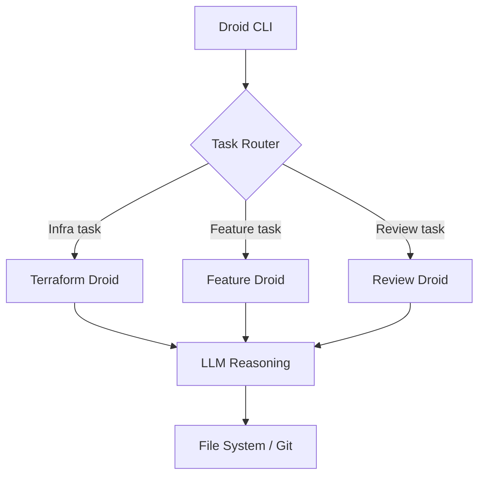

# Factory AI Droid CLI

## What it is
An AI-powered coding agent that works directly within your project to perform tasks like code reviews, security scans, and feature implementation. Droid leverages LLMs (typically Claude) to interact with your codebase and supports specialized "droids" (sub-agents) for specific domains like infrastructure, security, or frontend development. It is designed to be a "knowledge-aware" agent that understands project-specific context through a `droid.yml` configuration.

## What problem it solves
Automates repetitive development tasks such as code review, security scanning, and feature implementation by delegating them to specialized AI sub-agents. It solves the "blank page" problem for new features and the "tedium" problem for routine maintenance.

## Where it fits in the stack
**Development & Ops**. Acts as a CLI-based AI coding agent with domain-specific sub-agents. It sits alongside tools like Aider but focuses more on autonomous multi-step tasks.

## Architecture overview
Droid uses a controller-worker architecture where the main CLI orchestrates specialized "droids" based on the task description.



## Getting Started (droid.yml)
Configuration is handled via a `droid.yml` file in the repository root:

```yaml
version: 1
project:
  name: "My Awesome App"
  stack: ["python", "fastapi", "postgresql"]
droids:
  - id: "security-reviewer"
    type: "reviewer"
    rules:
      - "Ensure all API endpoints have authentication"
      - "Check for SQL injection patterns in raw queries"
  - id: "feature-builder"
    type: "coder"
    context: ["docs/api_specs/", "src/models/"]
```

## CLI Usage Examples
- **Run a security scan**:
  ```bash
  droid run security-reviewer --target ./src
  ```
- **Implement a feature**:
  ```bash
  droid build "Add a new endpoint to list users with pagination"
  ```
- **Interactive session**:
  ```bash
  droid chat --context "current-file"
  ```

## Typical use cases
- Automated code reviews and security scans in CI/CD pipelines.
- Bootstrapping new modules or features from a specification.
- Domain-specific tasks using specialized droids (infrastructure, security, frontend).
- Refactoring legacy code according to new style guidelines.

## Strengths
- **Specialized Sub-agents**: Domain-specific droids provide higher accuracy than general-purpose agents.
- **CLI-first Design**: Integrates seamlessly with existing terminal workflows and CI/CD (GitHub Actions).
- **Knowledge Awareness**: Uses `droid.yml` to maintain persistent project context.

## Limitations
- **Model Dependency**: Performance is tied to external LLM providers (typically Claude).
- **Complexity**: Requires initial configuration for complex multi-droid workflows.
- **Ecosystem**: Smaller community compared to mainstream tools like GitHub Copilot.

## When to use it
- When you want AI-driven automation for code reviews, security scans, or feature work.
- When you need domain-specific AI agents within a CI/CD pipeline.
- For large-scale refactorings where consistency is paramount.

## When not to use it
- For quick, single-line completions (use GitHub Copilot or Codeium).
- When you require full local model execution (see [Llama.cpp](../ai_knowledge/llama-cpp.md)).

## Related tools / concepts

- [Claude Code](claude-code.md)
- [Aider](aider.md)
- [Codeium](codeium.md)
- [Claude Code — Project Setup Guide](claude-code-setup.md)
- [OpenCode (Oh My OpenCode Ecosystem)](opencode.md)
- [Software Factories](../../knowledge_base/patterns/software-factories.md)
- [Agentic Workflows](../../knowledge_base/patterns/agentic-workflows.md)

## Sources / references
- [Factory AI Website](https://www.factory.ai/)
- [GitHub - Droid Action](https://github.com/Factory-AI/droid-action)
- [Droid Documentation Portal](https://docs.factory.ai/)

## Contribution Metadata

- Last reviewed: 2026-06-01
- Confidence: high
