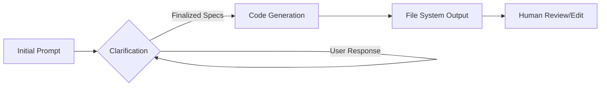

# GPT Engineer

## What it is
An AI tool that can build entire applications from a single prompt. It focuses on the "bootstrapping" phase of development, where it asks clarifying questions to refine requirements before generating a complete, functional codebase for a project.

## What problem it solves
Reduces the time to bootstrap a new project by generating a complete codebase from a natural language description. It solves the "configuration hell" and boilerplate overhead associated with starting new applications, especially for prototypes and MVPs.

## Where it fits in the stack
**Development & Ops**. Functions as an AI-driven project scaffolding and code generation tool. It is often the first tool used in the "Software Factory" pipeline.

## Architecture overview
GPT Engineer follows an iterative refinement loop before execution.



## Getting Started (CLI)
1. **Install via pip**:
   ```bash
   pip install gpt-engineer
   ```
2. **Create a new project folder**:
   ```bash
   mkdir my-new-project
   touch my-new-project/prompt
   ```
3. **Add your prompt** to the `prompt` file (e.g., "Build a snake game in Python using pygame").
4. **Run GPT Engineer**:
   ```bash
   gpt-engineer my-new-project
   ```

## Advanced Usage & Patterns
- **Interactive Refinement**: GPT Engineer will ask questions like "Which database should I use?" or "Do you want a frontend?" based on the complexity of the prompt.
- **Project Structure**: It generates a standard directory structure including `README.md`, `requirements.txt`, and entry points.
- **Custom Learning**: You can provide example code in the `.gpteng` directory to influence the generation style.

## Typical use cases
- Generating a full project codebase from a prompt.
- Rapid prototyping of new applications (PoC development).
- Exploring different architectural approaches quickly by generating variations.
- Generating boilerplate for complex microservices.

## Strengths
- **End-to-end Generation**: Creates complete, runnable projects rather than just snippets.
- **Iterative Logic**: Interactive clarifying questions significantly improve output quality compared to "one-shot" generators.
- **Open Source**: Transparent logic and community-driven improvements.

## Limitations
- **Maintenance**: Generated code can be difficult to maintain if the logic is complex or non-standard.
- **Hallucinations**: Like all LLM tools, it may occasionally use deprecated libraries or invent non-existent APIs.
- **Scalability**: Best suited for small-to-medium projects; large-scale systems still require significant manual architectural design.

## When to use it
- When bootstrapping a new project from scratch (Greenfield development).
- When rapid prototyping is more important than production-hardened code.
- For learning new frameworks by seeing how the AI structures a project.

## When not to use it
- When making incremental changes to an existing codebase (use [Aider](aider.md) or [Plandex](plandex.md) instead).
- When precise, enterprise-grade control over code structure and security is required from day one.

## Related tools / concepts

- [Plandex](plandex.md)
- [OpenHands](openhands.md)
- [Codeium](codeium.md)
- [Claude Code — Project Setup Guide](claude-code-setup.md)
- [OpenCode (Oh My OpenCode Ecosystem)](opencode.md)
- [Software Factories](../../knowledge_base/patterns/software-factories.md)
- [GPT-4o / Claude 3.5 Sonnet](../ai_knowledge/openai.md)

## Sources / references
- [GPT Engineer GitHub Repository](https://github.com/AntonOsika/gpt-engineer)
- [Official Documentation](https://gpt-engineer.readthedocs.io/)
- [Project Wiki & Examples](https://github.com/AntonOsika/gpt-engineer/wiki)

## Contribution Metadata

- Last reviewed: 2026-06-01
- Confidence: high
