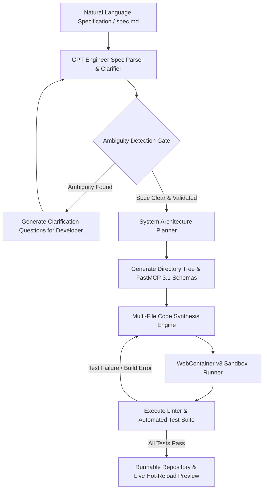
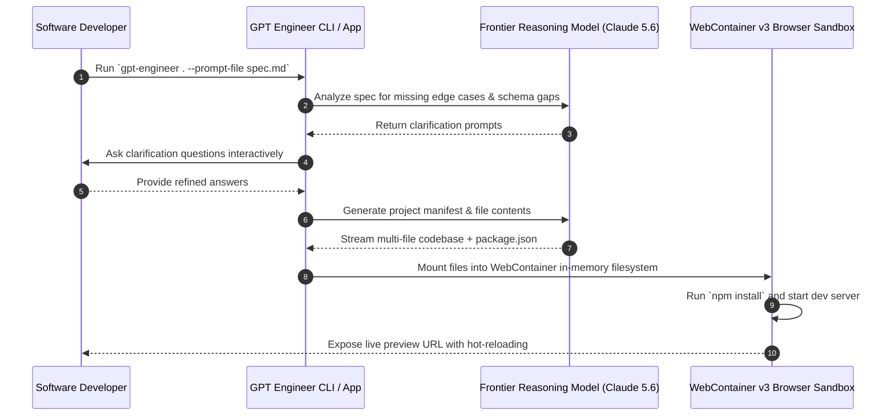
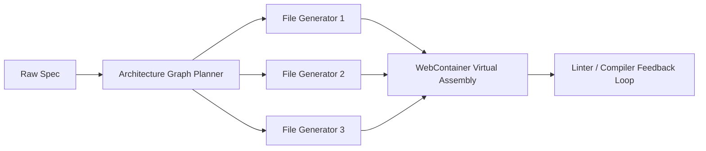

# GPT Engineer

## What it is
**GPT Engineer** is an AI-driven software engineering orchestrator and application prototyping platform designed to generate complete, functional repositories from high-level natural language specifications. Under 2027 SOTA standards, **GPT Engineer v3.0+** introduces full support for the **FastMCP 3.1 Task Protocol**, seamless integration with **WebContainer v3** client-side sandbox environments, and real-time requirement refinement loops using frontier reasoning models like **Claude 5.6**, **GPT-5.6**, **Gemini 4.0 Ultra**, **Llama 4 Maverick**, **Gemma 4**, **DeepSeek R1 / V4**, and **Qwen 3.6 VL**.

GPT Engineer operates as a multi-step agent pipeline that ingests prompt specifications, generates interactive clarification questions to eliminate architectural ambiguity, scaffolds directory hierarchies, writes modular typed code, and boots live browser previews in isolated WebContainer sandboxes.


```mermaid
graph TD
    A[Natural Language Specification / spec.md] --> B[GPT Engineer Spec Parser & Clarifier]
    B --> C{Ambiguity Detection Gate}
    C -->|Ambiguity Found| D[Generate Clarification Questions for Developer]
    D --> B
    C -->|Spec Clear & Validated| E[System Architecture Planner]
    E --> F[Generate Directory Tree & FastMCP 3.1 Schemas]
    F --> G[Multi-File Code Synthesis Engine]
    G --> H[WebContainer v3 Sandbox Runner]
    H --> I[Execute Linter & Automated Test Suite]
    I -->|Test Failure / Build Error| G
    I -->|All Tests Pass| J[Runnable Repository & Live Hot-Reload Preview]
```

## What problem it solves
Starting greenfield software projects involves significant procedural overhead: configuring build tooling, establishing folder structures, setting up linter rules, writing boilerplate API handlers, and wiring database schemas. GPT Engineer eliminates this "scaffolding fatigue" by converting product requirements into fully structured, runnable codebases while interactively clarifying ambiguous specifications before code generation begins.

1. **Scaffolding Overhead**: Automates boilerplate generation across React, FastAPI, Node.js, and database layer configurations.
2. **Ambiguous Product Requirements**: Standard LLM coders make blind assumptions when specifications are incomplete, leading to structural rework. GPT Engineer stops to clarify intent upfront.
3. **Local Tooling Conflicts**: Executes code and tests inside isolated browser WebContainers without polluting local developer node or python environments.
4. **FastMCP 3.1 Alignment**: Ingests external FastMCP 3.1 context and schema contracts to ensure generated services integrate seamlessly into existing agent ecosystems.

## Where it fits in the stack
**Category**: [Development & Ops](index.md) / Application Scaffolding & Code Generation. It sits at the top of the automated software pipeline, converting natural language intent and FastMCP 3.1 schema contracts into runnable multi-file applications.


```mermaid
sequenceDiagram
    autonumber
    participant Dev as Software Developer
    participant GPTE as GPT Engineer CLI / App
    participant LLM as Frontier Reasoning Model (Claude 5.6)
    participant WC as WebContainer v3 Browser Sandbox

    Dev->>GPTE: Run `gpt-engineer . --prompt-file spec.md`
    GPTE->>LLM: Analyze spec for missing edge cases & schema gaps
    LLM-->>GPTE: Return clarification prompts
    GPTE->>Dev: Ask clarification questions interactively
    Dev-->>GPTE: Provide refined answers
    GPTE->>LLM: Generate project manifest & file contents
    LLM-->>GPTE: Stream multi-file codebase + package.json
    GPTE->>WC: Mount files into WebContainer in-memory filesystem
    WC->>WC: Run `npm install` and start dev server
    WC-->>Dev: Expose live preview URL with hot-reloading
```

## Typical use cases
- **Greenfield Application Scaffolding**: Instantly generating full-stack web applications (React UI, FastMCP 3.1 backend endpoints, Pydantic v2 schemas) from a single prompt file.
- **Client-Side Sandbox Previews**: Executing generated Node.js or web projects directly within WebContainer v3 browser sandboxes without requiring local environment installations.
- **Schema-Driven Client Generation**: Ingesting database schemas or OpenAPI specifications via FastMCP 3.1 to auto-generate typed API client libraries.
- **Architecture Prototyping**: Generating and comparing identical feature MVPs across different framework combinations (e.g., SvelteKit vs Next.js vs FastAPI).
- **Automated Synthetic Repo Generation**: Synthesizing benchmark codebases for testing CI/CD pipelines and static analysis security tools.

## Architecture & Technical Deep Dive

### Multi-Step Agent Synthesis & Refinement Pipeline
GPT Engineer divides application generation into strict deterministic stages rather than producing all files in a single unverified stream:

1. **Spec Ingestion & Clarification Phase**: Uses high-reasoning models ([DeepSeek R1](../ai_knowledge/deepseek-r1.md), Claude 5.6) to construct a formal task matrix.
2. **Architecture Graph Generation**: Outputs a JSON file representation (`architecture.json`) listing relative file paths, exported symbol signatures, and dependencies.
3. **Parallel File Synthesis**: Generates individual source code files in parallel, enforcing strict typed imports against the generated architecture graph.
4. **Execution & Feedback Loop**: Executes code inside WebContainer v3 sandboxes, capturing stdout/stderr build logs. If compiler errors occur, GPT Engineer passes log traces back to the LLM to apply automated targeted diff patches.


```mermaid
graph LR
    A[Raw Spec] --> B[Architecture Graph Planner]
    B --> C1[File Generator 1]
    B --> C2[File Generator 2]
    B --> C3[File Generator 3]
    C1 --> D[WebContainer Virtual Assembly]
    C2 --> D
    C3 --> D
    D --> E[Linter / Compiler Feedback Loop]
```

### Deterministic Patching & Unified Diffs
Unlike legacy scaffolding generators that rewrite whole files whenever a syntax or import error occurs, GPT Engineer utilizes a deterministic unified diff engine:

```diff
--- src/components/Header.tsx
+++ src/components/Header.tsx
@@ -12,3 +12,3 @@
-export function Header({ title }: { title: string }) {
+export function Header({ title, user }: { title: string; user?: string }) {
   return <header><h1>{title}</h1></header>;
 }
```

By constraining model outputs to precise AST node replacements, GPT Engineer prevents hallucinated code regressions across large generated files and reduces patch token overhead by up to 85%.

### WebContainer v3 In-Browser Assembly Engine
GPT Engineer leverages WebContainers to run complete Node.js runtimes natively inside browser WebAssembly (Wasm) sandboxes:
- **Zero Cloud Compute Dependency for Previews**: The entire build process (`npm install`, `vite build`, `node server.js`) runs client-side in browser RAM.
- **Instant Hot-Module Replacement (HMR)**: Changes generated by the agent trigger sub-second UI updates without page reloads.
- **Isolated Network Policy**: WebContainer network traffic is restricted through browser origin policies, securing local dev hardware from unauthorized remote connections.
- **Cross-Platform Consistency**: Identical Wasm execution environment guarantees that project builds behave identically across macOS, Linux, and Windows machines.

## Strengths
- **Interactive Clarification Loop**: Queries developers on ambiguous specification details *before* generating code, preventing costly architecture rework.
- **WebContainer v3 Client Previews**: Instant client-side compilation and hot reloading in browser sandboxes.
- **FastMCP 3.1 Native**: Ingests external FastMCP 3.1 context and schema definitions to align generated code with existing enterprise services.
- **Pydantic v2 & Modular Code Standards**: Enforces modular architectural patterns, typed endpoints, and Pydantic v2 schemas across generated codebases.
- **Deterministic Diff Patching**: Generates unified diff patches rather than re-streaming entire files during error correction passes.

## Limitations
- **Legacy Codebase Editing**: Designed primarily for greenfield generation; incremental edits on massive existing repositories are better handled by tools like [Aider](aider.md) or [Claude Code](claude-code.md).
- **WebContainer Scope Constraints**: Browser-native WebContainers support Node.js/web runtimes, but cannot execute heavy C++ systems code or native Docker daemons client-side.
- **Dependency Auditing Required**: Generated third-party package manifests should be audited for security compliance prior to production deployment.

## When to use it
- When bootstrapping new microservices, internal dashboards, or feature MVPs from scratch.
- When you need instant, zero-setup browser previews for non-technical stakeholders.
- When generating typed client libraries and scaffolded services from FastMCP 3.1 specs.
- When prototyping full-stack MVPs during rapid hackathons or product discovery sprints.

## When not to use it
- For incremental edits or refactoring tasks within large, pre-existing enterprise repositories.
- In offline or air-gapped dev environments without access to cloud reasoning models.
- When developing low-level OS drivers or systems code that cannot run in web/Node runtimes.

## Getting started

### Installation
```bash
# Run interactive WebContainer generator CLI:
npx gpt-engineer

# Or install Python workspace generator locally:
pip install gpt-engineer pydantic>=2.0 fastmcp
```

### Basic Workflow
```bash
# Initialize workspace
mkdir solar-dashboard && cd solar-dashboard

# Launch GPT Engineer
gpt-engineer . --model claude-5.6-sonnet
```

## CLI examples

### 1. Headless Generation from Spec File
```bash
# Headless spec generation using a requirements file
gpt-engineer . --prompt-file ./spec.md --no-interactive --model gpt-5.6-turbo
```

### 2. Targeting Specific Framework & FastMCP Endpoints
```bash
# Specify target framework stack and FastMCP context server
gpt-engineer . --framework vite-react-ts --mcp-server http://localhost:3000/mcp
```

### 3. Running Automated Build & Test Pass
```bash
# Generate and immediately execute validation test suite inside sandbox
gpt-engineer . --run-tests --auto-patch
```

## API examples

### FastMCP 3.1 Workspace Tool Server
This executable Python script demonstrates exposing GPT Engineer repository scaffolding tools via **FastMCP 3.1** and validating configurations with **Pydantic v2**:

```python
import json
from typing import List, Optional
from pydantic import BaseModel, Field, ValidationError
from fastmcp import FastMCP

mcp = FastMCP("GPT Engineer FastMCP Server")

class WebContainerEnvConfig(BaseModel):
    port: int = Field(default=3000, ge=1024, le=65535)
    hot_reload: bool = Field(default=True)
    framework: str = Field(default="vite-react-ts", pattern=r"^(vite-react-ts|nextjs|svelte-kit|fastapi)$")

class GPTEngineerWorkspaceConfig(BaseModel):
    project_name: str = Field(..., pattern=r"^[a-zA-Z0-9_-]+$")
    model_name: str = Field("claude-5.6-sonnet", description="Target reasoning model")
    webcontainer: WebContainerEnvConfig = Field(default_factory=WebContainerEnvConfig)
    mcp_servers: List[str] = Field(default_factory=list)
    auto_install_dependencies: bool = Field(default=True)

@mcp.tool()
def scaffold_new_project(project_name: str, framework: str = "vite-react-ts") -> str:
    """Scaffold a new validated project workspace using GPT Engineer v3.0 specs."""
    raw_payload = {
        "project_name": project_name,
        "model_name": "claude-5.6-sonnet",
        "webcontainer": {
            "port": 3000,
            "hot_reload": True,
            "framework": framework
        },
        "mcp_servers": ["http://localhost:3000/mcp"],
        "auto_install_dependencies": True
    }

    try:
        config = GPTEngineerWorkspaceConfig(**raw_payload)
        return (
            f"Successfully validated GPT Engineer scaffolding request:\n"
            f"  Project: {config.project_name}\n"
            f"  Framework: {config.webcontainer.framework}\n"
            f"  WebContainer Port: {config.webcontainer.port}\n"
            f"  Model: {config.model_name}"
        )
    except ValidationError as e:
        return f"Configuration validation error: {e.errors()}"

if __name__ == "__main__":
    mcp.run()
```

### Programmatic Configuration Validation with Pydantic v2
The following Python module demonstrates modeling and validating GPT Engineer workspace configurations under early January 2027 SOTA standards:

```python
from pydantic import BaseModel, Field, ValidationError
from typing import List
import json

class WebContainerEnvConfig(BaseModel):
    port: int = Field(default=3000, ge=1024, le=65535)
    hot_reload: bool = Field(default=True)
    framework: str = Field(default="vite-react-ts", pattern=r"^(vite-react-ts|nextjs|svelte-kit|fastapi)$")

class GPTEngineerWorkspaceConfig(BaseModel):
    project_name: str = Field(..., pattern=r"^[a-zA-Z0-9_-]+$")
    model_name: str = Field(..., pattern=r"^(claude-5\.6-.*|gpt-5\.6-.*|gemini-4\.0-.*|llama-4-.*|gemma-4-.*|qwen-3\.6-.*|deepseek-.*)$")
    webcontainer: WebContainerEnvConfig = Field(default_factory=WebContainerEnvConfig)
    mcp_servers: List[str] = Field(default_factory=list)
    auto_install_dependencies: bool = Field(default=True)

def validate_gpt_engineer_config(payload: dict) -> str:
    """Validates GPT Engineer workspace configuration using Pydantic v2."""
    try:
        config = GPTEngineerWorkspaceConfig.model_validate(payload)
        return json.dumps({
            "status": "success",
            "validated_config": config.model_dump()
        }, indent=2)
    except ValidationError as e:
        return json.dumps({
            "status": "error",
            "validation_errors": str(e)
        }, indent=2)

if __name__ == "__main__":
    test_payload = {
        "project_name": "homelab-dashboard",
        "model_name": "claude-5.6-sonnet",
        "webcontainer": {
            "port": 5173,
            "hot_reload": True,
            "framework": "vite-react-ts"
        },
        "mcp_servers": ["http://localhost:3000/mcp"],
        "auto_install_dependencies": True
    }
    print(validate_gpt_engineer_config(test_payload))
```

## Related tools / concepts
- [Aider](aider.md) — Terminal-native git-integrated agentic coding assistant.
- [Claude Code](claude-code.md) — Interactive terminal developer agent CLI.
- [Model Context Protocol (MCP)](../automation_orchestration/mcp.md) — Standard tool protocol for agents.
- [Windsurf](windsurf.md) — Agentic IDE featuring FastMCP 3.1 support.
- [OpenHands](openhands.md) — Autonomous AI software engineering system.

## Sources / References
- [GPT Engineer GitHub Repository](https://github.com/AntonOsika/gpt-engineer)
- [FastMCP 3.1 Specification](https://modelcontextprotocol.io/specification/3.1)
- [WebContainers Documentation](https://webcontainers.io/)

## Contribution Metadata
- Last reviewed: 2027-01-07
- Confidence: high
