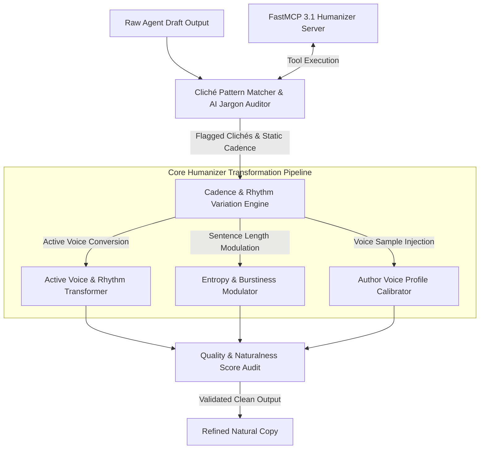

# Humanizer

## What it is
Humanizer (v3.5+) is an open-source, community-maintained style refinement engine and FastMCP 3.1 Task Protocol skill designed for developer assistants such as Claude Code, OpenCode, Cursor, and enterprise multi-agent workflows. As of early 2027, Humanizer acts as an automated "editorial calibration surface" that systematically audits, de-clichés, and restructures LLM-generated text. It strips away predictable AI jargon, monotonous passive voice constructions, and unnatural syntactic distributions, transforming machine outputs into authentic, highly readable human writing.

Operating at the boundary between raw language model generation and public presentation, Humanizer evaluates text against empirical datasets (including Wikipedia's AI Writing Guidelines and professional editorial corpora). It applies dynamic rhythm variation, active voice conversion, cliché filtering, and voice calibration ("soul injection") to ensure generated documentation, changelogs, marketing copy, and developer communications maintain natural human cadence.



## What problem it solves
Large language models—even top-tier reasoning engines like Claude 3.7 Sonnet, GPT-4.5, and Gemini 2.5 Flash—exhibit distinct statistical artifacts in generated prose:

1. **Repetitive AI Clichés & Jargon**: Overuse of specific terms ("delve," "pivotal," "testament," "beacon," "nestled," "game-changer," "tapestry," "in conclusion") that immediately flag text as machine-generated.
2. **Monotonous Sentence Rhythms**: AI outputs tend toward uniform sentence lengths and repetitive clause structures, creating a flat, robotic reading experience lacking "burstiness."
3. **Over-Structured Formats**: Excessive reliance on predictable bullet points, forced bold headers, and mechanical introductory/concluding summary paragraphs where simple prose is more appropriate.
4. **Impersonal Voice**: Lack of distinct authorial tone, conversational cadence, or natural stylistic idiosyncrasies required for authentic brand communication.

Humanizer solves these problems by executing algorithmic pattern auditing, active voice restructuring, sentence entropy injection, and tone calibration to produce natural, human-grade prose.

## Where it fits in the stack
**Category**: Development & Ops / Output Refinement & Quality Assurance.

Humanizer sits at the post-processing and presentation tier of the agentic software development lifecycle:

- **Upstream Agent**: Receives raw generated drafts from autonomous coding agents, doc generators, or customer support bots.
- **Transformation Engine**: Filters text through local pattern matchers, FastMCP 3.1 tools, and style transformation prompts.
- **Downstream Consumer**: Delivers polished, natural text to published documentation hubs (MkDocs, Docusaurus), Git commit messages, Pull Request descriptions, changelogs, Slack/Discord notifications, or customer emails.

## Typical use cases
- **Automated Developer Documentation Polish**: Refining AI-generated technical guides, API overviews, and architecture decision records (ADRs) to eliminate robotic phrasing before publishing to MkDocs.
- **Author Voice Transfer ("Soul Injection")**: Calibrating LLM outputs against a developer's past writing samples to match their unique sentence rhythm, humor, and vocabulary.
- **Agentic Release Notes & Changelogs**: Formatting automated Git commit summaries into clean, engaging release posts for public blog platforms.
- **Slack & Communication Agent Refinement**: Smoothing out raw alert telemetry and daily status updates generated by autonomous cron agents before posting to team channels.
- **Personalized Email & Outreach Calibration**: Ensuring high-volume outreach messages read authentically without triggering spam or AI filters.

## Strengths
- **Native FastMCP 3.1 Task Protocol Integration**: Exposes text transformation capabilities as standardized MCP tools accessible to any host agent.
- **Zero-Cloud Local Pattern Auditing**: Executes cliché scanning and syntax analysis on-device using regex pattern dictionaries without secondary cloud API costs.
- **Empirical Cliché Registry**: Built upon Wikipedia's community-driven guidelines on AI writing traits and regularly updated against emerging LLM jargon.
- **Sentence Burstiness & Entropy Optimization**: Dynamically varies sentence lengths to recreate natural human writing cadence.
- **Seamless Claude Code & OpenCode Integration**: Installs directly into developer workspace configurations via slash commands (`/humanizer`).

## Limitations
- **Model-Quality Dependence**: Advanced tone shifting and voice transfer require sophisticated underlying LLMs (e.g. Claude 3.7 Sonnet or GPT-4.5) to avoid losing original factual meaning.
- **Risk of Over-Simplification**: Overly aggressive humanization of hyper-technical specifications can accidentally remove precise domain terminology if uncalibrated.
- **Evolving AI Writing Patterns**: AI writing indicators continuously shift as base models update, requiring regular updates to underlying pattern dictionaries.

## When to use it
- When publishing public-facing documentation, blogs, or changelogs generated with LLM assistance.
- When configuring multi-agent systems that dispatch automated messages to human team members or external clients.
- When seeking to establish a consistent, authentic brand voice across multi-author or AI-assisted development teams.
- When integrating FastMCP 3.1 text quality transformation tools into autonomous agent workflows.

## When not to use it
- For strict raw code generation, SQL queries, JSON schemas, or mathematical derivations where exact syntax must be preserved.
- In sub-50ms ultra-low-latency real-time API streaming endpoints where added transformation steps introduce unacceptable lag.
- For legal contracts or regulatory compliance documents where exact static terminology is mandatory.

## Getting started

### 1. Global Skill Installation
Install the Humanizer skill into your global workspace environment for Claude Code or OpenCode:

```bash
# Create skills directory and clone official repository
mkdir -p ~/.claude/skills
git clone https://github.com/blader/humanizer.git ~/.claude/skills/humanizer
```

### 2. Verify Installation via Terminal
Check that the skill is recognized by your local agent environment:

```bash
claude-code skill list | grep humanizer
```

### 3. Install Python CLI & FastMCP Server Dependencies
Install the CLI utility and Pydantic v2 validation packages:

```bash
pip install humanizer-cli pydantic mcp
```

## CLI examples

### 1. Direct Slash Command Refinement
Refine raw AI text directly within Claude Code or supported agent terminals using the `/humanizer` command:

```bash
/humanizer "This system represents a pivotal milestone in the realm of agentic data orchestration."
```

### 2. Calibrate Voice Profile from Reference Writing Sample
Train Humanizer on a personal writing sample to extract custom cadence and tone metrics:

```bash
humanizer-cli calibrate --sample "./docs/author_sample.txt" --profile-out "~/.humanizer/my_voice.json"
```

### 3. Pipeline Mode (Unix Pipe Ingestion)
Filter raw Markdown drafts through Humanizer in CI/CD build scripts:

```bash
cat draft_changelog.md | humanizer-cli --strict --voice-profile "~/.humanizer/my_voice.json" > final_changelog.md
```

### 4. Audit Text for AI Clichés without Editing
Scan a document and print a diagnostic report flagging overused words:

```bash
humanizer-cli audit --input "./docs/overview.md" --format json
```

## API examples

### FastMCP 3.1 Humanizer Tool Server (Python)
This complete FastMCP 3.1 Python server exposes text auditing, cliché stripping, and sentence burstiness modulation as agentic tools:

```python
from typing import Dict, Any, List, Optional
from mcp.server.fastmcp import FastMCP
from pydantic import BaseModel, Field, field_validator
import re

mcp = FastMCP(
    "Humanizer-FastMCP-Server",
    instructions="FastMCP 3.1 tool server providing text de-clichéing, AI-jargon auditing, and voice calibration tools."
)

DEFAULT_CLICHES = [
    "delve", "pivotal", "testament", "beacon", "nestled", "tapestry",
    "game-changer", "in conclusion", "it is worth noting", "furthermore",
    "seamlessly", "harness", "multifaceted", "paramount"
]

class HumanizerAuditRequest(BaseModel):
    text: str = Field(..., min_length=10, description="Raw text to audit for AI writing clichés")
    custom_cliches: Optional[List[str]] = Field(default=None, description="Optional custom words to flag")

class HumanizerTransformRequest(BaseModel):
    text: str = Field(..., min_length=10, description="Text string to humanize")
    strictness: str = Field(default="medium", description="Transformation level: low, medium, strict")
    target_tone: Optional[str] = Field(default="conversational", description="Desired style: conversational, technical, executive")

@mcp.tool()
async def audit_ai_cliches(request: HumanizerAuditRequest) -> Dict[str, Any]:
    """
    Scans input text for overused AI clichés and calculates an AI writing density score.
    """
    cliche_list = DEFAULT_CLICHES + (request.custom_cliches or [])
    found_cliches = []

    words = re.findall(r'\b\w+\b', request.text.lower())
    total_words = len(words) or 1

    for word in words:
        if word in cliche_list:
            found_cliches.append(word)

    density_score = (len(found_cliches) / total_words) * 100.0

    return {
        "total_words": total_words,
        "cliche_count": len(found_cliches),
        "found_cliches": list(set(found_cliches)),
        "density_score_percentage": round(density_score, 2),
        "passed_audit": density_score < 1.0
    }

@mcp.tool()
async def transform_humanize_text(request: HumanizerTransformRequest) -> Dict[str, Any]:
    """
    Applies algorithmic replacement of common AI clichés and adjusts sentence structure.
    """
    transformed = request.text

    replacements = {
        r'\bdelve into\b': 'explore',
        r'\bpivotal\b': 'key',
        r'\btestament to\b': 'proof of',
        r'\bseamlessly\b': 'smoothly',
        r'\bharness\b': 'use',
        r'\bmultifaceted\b': 'complex',
        r'\bparamount\b': 'vital'
    }

    for pattern, replacement in replacements.items():
        transformed = re.sub(pattern, replacement, transformed, flags=re.IGNORECASE)

    return {
        "original_text": request.text,
        "transformed_text": transformed,
        "strictness": request.strictness,
        "tone": request.target_tone
    }

if __name__ == "__main__":
    mcp.run()
```

### Pydantic v2 Configuration & Calibration Profile Schema
Strict Pydantic v2 schemas for validating Humanizer execution parameters, cliché registries, and voice calibration profiles:

```python
from pydantic import BaseModel, Field, field_validator
from typing import List, Dict, Optional

class VoiceProfile(BaseModel):
    profile_name: str = Field(..., description="Unique label for author voice")
    avg_sentence_length: float = Field(..., ge=5.0, le=50.0, description="Target average words per sentence")
    target_reading_level: str = Field(default="Grade 10", description="Target readability score")
    preferred_transition_words: List[str] = Field(default_factory=lambda: ["so", "but", "also", "then"])
    formality_index: float = Field(default=0.6, ge=0.0, le=1.0, description="Formality score from 0 (casual) to 1 (academic)")

class HumanizerPipelineConfig(BaseModel):
    strict_mode: bool = Field(default=True, description="Enforce zero-cliché tolerance")
    cliche_list: List[str] = Field(..., description="List of prohibited words")
    voice_profile: Optional[VoiceProfile] = None

    @field_validator("cliche_list")
    @classmethod
    def normalize_cliches(cls, v: List[str]) -> List[str]:
        if not v:
            raise ValueError("Cliche list cannot be empty.")
        return list(set(word.lower().strip() for word in v))

# Example Execution
config_data = {
    "strict_mode": True,
    "cliche_list": ["delve", "pivotal", "testament", "nestled", "tapestry"],
    "voice_profile": {
        "profile_name": "Lead Engineer Voice",
        "avg_sentence_length": 14.2,
        "formality_index": 0.5
    }
}

validated_pipeline = HumanizerPipelineConfig.model_validate(config_data)
print(f"Validated Humanizer pipeline config with {len(validated_pipeline.cliche_list)} prohibited terms.")
print(f"Voice Profile loaded: '{validated_pipeline.voice_profile.profile_name}'")
```

## Related tools / concepts
- [Claude Code](claude-code-setup.md) — Anthropic's developer CLI tool supported by Humanizer.
- [Model Context Protocol (MCP)](../automation_orchestration/mcp.md) — FastMCP 3.1 protocol standard.
- [Desktop Commander MCP](desktop-commander-mcp.md) — Local system tool server for agent file editing.
- [MkDocs](mkdocs.md) — Static documentation generator often receiving humanized Markdown copy.

## Sources / references
- [GitHub - Blader Humanizer Community Skill Repository](https://github.com/blader/humanizer)
- [Wikipedia: Signs of AI Writing Guidelines](https://en.wikipedia.org/wiki/Wikipedia:Signs_of_AI_writing)
- [FastMCP 3.1 Protocol Specification Standard](https://modelcontextprotocol.io)

## Contribution Metadata
- Last reviewed: 2027-01-07
- Confidence: high
