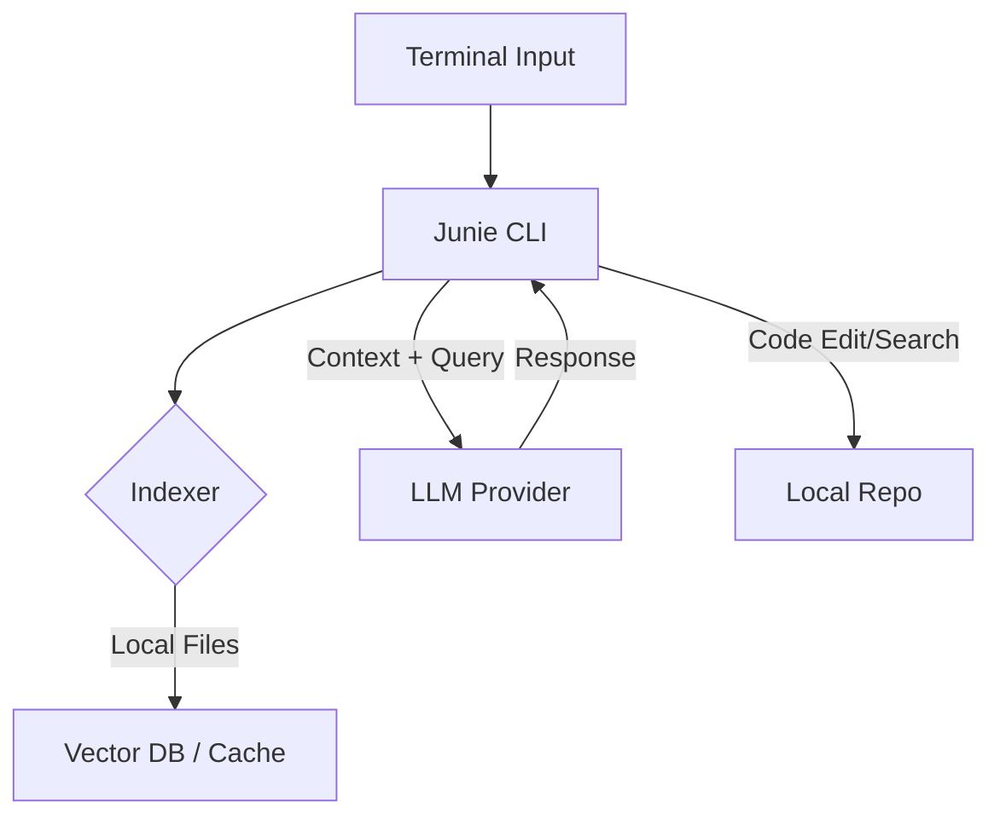

# Junie CLI

## What it is
An AI coding assistant designed to live in the terminal and assist with repository-wide tasks. It provides tools for navigating code, understanding dependencies, and making changes across multiple files, focusing on being lightweight and integrated with the developer's existing terminal workflow. Junie acts as a "second brain" for the CLI, optimized for codebase exploration.

## What problem it solves
Brings AI-assisted coding directly into the terminal, enabling repository-wide understanding and multi-file changes without leaving the command line. It solves the "context switching" tax by keeping the AI where the code is executed.

## Where it fits in the stack
**Development & Ops**. Functions as a terminal-native AI coding assistant. It bridges the gap between basic shell commands and high-level project reasoning.

## Architecture overview
Junie leverages local indexing and LLM-driven search to provide context-aware responses.



## Typical use cases
- Repository-wide code navigation and understanding.
- Multi-file changes and refactoring from the terminal.
- Dependency analysis and architectural exploration over SSH.
- Rapid onboarding to new codebases via AI-guided walkthroughs.

## Getting Started (CLI)
- **Search for patterns**:
  ```bash
  junie search "How is authentication handled in the API?"
  ```
- **Explain a file**:
  ```bash
  junie explain src/auth/provider.py
  ```
- **Propose changes**:
  ```bash
  junie propose "Update all error messages to use the new Localization framework"
  ```

## Repository-wide Tasks
- **Dependency Mapping**: Ask Junie to map how a specific module affects the rest of the repository.
- **Onboarding**: "Give me a high-level overview of this project's architecture."
- **Audit**: "Find all places where we use hardcoded credentials."

## Strengths
- **Terminal Native**: No need for a heavy IDE; works over SSH or in minimal environments.
- **Workflow Integration**: Can be piped to and from other terminal tools (`grep`, `cat`, etc.).
- **Context Awareness**: Efficiently handles repository-wide context without high latency.

## Limitations
- **No GUI**: Lacks the visual file diffing and project tree navigation of Cursor or VS Code.
- **Learning Curve**: Requires familiarity with terminal commands to get the most value.
- **Tooling ecosystem**: Fewer plugins compared to IDE-based assistants.

## When to use it
- When you prefer a terminal-first development workflow (Vim, Tmux users).
- When performing repository-wide tasks that span multiple files over SSH.
- For quick codebase exploration without opening an IDE.

## When not to use it
- When you prefer a graphical IDE experience with real-time linting and visual debugging.
- When performing complex UI/Frontend work that benefits from visual feedback.

## Related tools / concepts

- [Aider](aider.md)
- [Superconductor](superconductor.md)
- [Codeium](codeium.md)
- [Claude Code — Project Setup Guide](claude-code-setup.md)
- [OpenCode (Oh My OpenCode Ecosystem)](opencode.md)
- [Model Context Protocol (MCP)](../../knowledge_base/patterns/tool-calling-and-mcp.md)
- [Filesystem Context](../../knowledge_base/patterns/filesystem-context.md)

## Sources / references
- [Junie CLI Home Page](https://junie.jetbrains.com/)
- [JetBrains AI Lab Research](https://blog.jetbrains.com/ai/)
- [GitHub - Junie CLI Discussions](https://github.com/jetbrains/junie)

## Contribution Metadata

- Last reviewed: 2026-05-15
- Confidence: high
