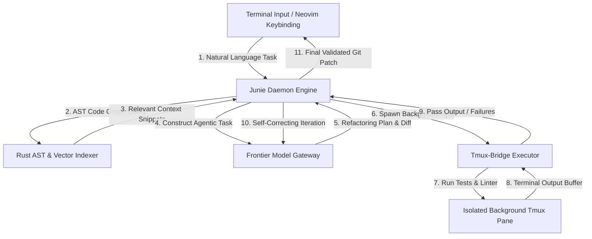

# Junie CLI

## What it is
Junie CLI is an AI-driven, high-speed, terminal-native codebase navigation engine, semantic search indexer, and autonomous software engineering assistant developed under the JetBrains AI Lab initiative. In early 2027, the stable **v2.5+** release operates as a lightweight enterprise background daemon and CLI companion. Built with native support for the **FastMCP 3.1 Task Protocol**, Junie CLI combines JetBrains AST-based code analysis models with frontier reasoning engines (Claude 5.6, GPT-5.6, Gemini 4.0 Ultra, DeepSeek-V4, and Qwen 3.6 VL) to deliver sub-second repository search, tmux-native test orchestration, and automated git patch generation.

```
+-----------------------------------------------------------------------------------+
|                           Junie CLI Daemon Architecture                           |
+-----------------------------------------------------------------------------------+
|                                                                                   |
|  +-----------------------+                    +--------------------------------+  |
|  | Developer Terminal    |                    | Junie CLI Core Daemon          |  |
|  | - Neovim / Helix / Zsh| -- FastMCP 3.1 --> |  - Rust AST Code Indexer       |  |
|  | - Tmux Split Panes    |    (STDIO/IPC)     |  - Semantic Vector Cache       |  |
|  +-----------------------+                    |  - FastMCP 3.1 Task Manager    |  |
|                                               +---------------+----------------+  |
|                                                               |                   |
|                                                               v                   |
|                                               +--------------------------------+  |
|                                               | Tmux-Bridge Execution Loop     |  |
|                                               |  - Background Test Monitoring  |  |
|                                               |  - Buffer Capture & Parse      |  |
|                                               +---------------+----------------+  |
|                                                               |                   |
|                                                               v                   |
|                                               +--------------------------------+  |
|                                               | JetBrains AST & Model Gateway  |  |
|                                               |  - Local Codebase Graph DB     |  |
|                                               |  - Claude 5.6 / GPT-5.6 APIs   |  |
|                                               +--------------------------------+  |
|                                                                                   |
+-----------------------------------------------------------------------------------+
```

## What problem it solves
Developing software in complex, million-line repositories over remote SSH connections or inside multi-pane terminal multiplexers (`tmux`) often suffers from high context switching overhead and resource degradation caused by heavy graphical IDEs.

Junie CLI eliminates these friction points by:
1. **Sub-Second Codebase Navigation**: Combining high-performance Rust AST indexing with local vector embeddings to return instant semantic lookups without relying on GUI file trees.
2. **Tmux-Bridge Autonomous Refactoring**: Spawning isolated background tmux panes to execute test suites, capture stdout/stderr build failures, and apply self-correcting code diffs autonomously.
3. **AST-Guided Patch Accuracy**: Utilizing JetBrains code analysis trees to ensure patches strictly adhere to language grammar and type definitions before modifying files.
4. **FastMCP 3.1 Sub-Agent Interoperability**: Exposing local repository inspection and refactoring capabilities as standardized FastMCP tools for external AI agent swarms.

## Where it fits in the stack
**Development & Ops Layer**. Junie CLI acts as an **AI-Native Shell Companion and Code Orchestrator**. It sits directly inside the developer's terminal environment, interacting with local shells (zsh/bash), Neovim/Helix text editors, Git version control, and FastMCP model servers.

## System Architecture & Technical Deep-Dive


```mermaid
graph TD
    DeveloperCLI[Terminal Input / Neovim Keybinding] -->|1. Natural Language Task| JunieDaemon[Junie Daemon Engine]

    JunieDaemon -->|2. AST Code Graph Query| RustIndexer[Rust AST & Vector Indexer]
    RustIndexer -->|3. Relevant Context Snippets| JunieDaemon

    JunieDaemon -->|4. Construct Agentic Task| ModelGateway[Frontier Model Gateway]
    ModelGateway -->|5. Refactoring Plan & Diff| JunieDaemon

    JunieDaemon -->|6. Spawn Background Split| TmuxBridge[Tmux-Bridge Executor]
    TmuxBridge -->|7. Run Tests & Linter| TerminalPane[Isolated Background Tmux Pane]

    TerminalPane -->|8. Terminal Output Buffer| TmuxBridge
    TmuxBridge -->|9. Pass Output / Failures| JunieDaemon

    JunieDaemon -->|10. Self-Correcting Iteration| ModelGateway
    JunieDaemon -->|11. Final Validated Git Patch| DeveloperCLI
```

### 1. High-Performance Rust AST Indexer
Junie CLI embeds a multi-threaded Rust indexing engine that parses source code files into Abstract Syntax Trees (AST) using Tree-sitter. It indexes symbols, function signatures, class inheritance hierarchies, and variable scopes, maintaining a local SQLite database for instant zero-latency queries.

### 2. Tmux-Bridge Orchestrator
To execute multi-step agentic workflows (e.g. "Fix broken unit tests in `src/auth/`"), Junie CLI uses its **Tmux-Bridge** component. It creates dedicated, non-blocking background tmux windows, runs build commands, captures terminal buffer outputs using `tmux capture-pane`, and analyzes stdout/stderr logs in real time.

### 3. AST-Aware Diff Generator & Safety Gate
When applying automated code edits, Junie CLI verifies proposed changes against the language's syntax graph. If a proposed edit introduces syntax errors or breaks imports, Junie CLI rejects the diff locally and prompts the reasoning engine for a corrected patch before altering files on disk.

### 4. FastMCP 3.1 Task Protocol Integration
Junie CLI operates as both an MCP client and an MCP server. It can consume tools from remote MCP servers (e.g. Sentry, GitHub, Jira) and expose its own repository indexing and refactoring tools over standard STDIO or HTTP/SSE transports.

## Typical use cases
- **Remote SSH Workspace Refactoring**: Performing complex codebase refactoring over SSH connections in lightweight terminal environments.
- **Tmux-Native Test-Driven Development (TDD)**: Running autonomous loops that edit code, execute tests in a background tmux pane, read failure stack traces, and re-apply fixes until all tests pass.
- **Sub-Second Code Navigation**: Querying code structure and dependency graphs via natural language (`junie ask "Where are user sessions initialized?"`).
- **Pre-Commit Security & Ruleset Auditing**: Scanning staged git changes against enterprise architecture guidelines before pushing code.

## Strengths
- **Tmux-Native Background Automation**: Non-blocking background task execution with direct terminal buffer inspection.
- **Sub-Second AST Indexing**: Blazing fast codebase indexing with minimal system memory footprint (<50MB RAM).
- **JetBrains AST Code Intelligence**: Leverages deep language grammar parsing for precision code modifications.
- **FastMCP 3.1 Protocol Client/Server**: Native support for modern agent tool schemas and sub-agent task routing.
- **Keyboard-Driven Design**: Integrates directly with Neovim, Helix, Vim, zsh, and tmux.

## Limitations
- **Terminal Only**: Lacks visual drag-and-drop diff view UI; requires terminal-comfortable developers.
- **Tmux Requirement for Background Loops**: Background execution features require `tmux` installed in the shell environment.
- **API Token Dependent**: Autonomous multi-file refactoring runs require access to frontier model API keys (Claude 5.6 or GPT-5.6).

## When to use it
- When working in keyboard-centric terminal environments (Neovim, Helix, tmux) on local or SSH remote development servers.
- When executing complex multi-step refactoring runs that require continuous test verification.
- When querying large million-line codebases with zero-latency semantic lookups.

## When not to use it
- When developer workflows depend entirely on graphical mouse-driven IDEs (e.g. full JetBrains IntelliJ GUI or VS Code GUI).
- In air-gapped environments lacking local LLM setups or external API connectivity.

## Getting started

### Installation
Install Junie CLI v2.5+ via Cargo or global NPM:

```bash
# Global installation via Cargo (recommended)
cargo install junie-cli

# Or install via NPM package manager
npm install -g @jetbrains/junie-cli
```

### Initial Workspace Configuration
Initialize the local AST vector index and configure model credentials:

```bash
# Navigate to project repository root
cd /path/to/project

# Initialize AST indexer and local SQLite cache
junie init

# Configure frontier reasoning model provider
junie config set model claude-5.6
junie config set provider anthropic
```

## CLI examples

### 1. Natural Language Semantic Query
Query repository architecture and dependency relationships instantly:

```bash
junie ask "How are JWT token refresh cycles handled in the FastMCP authentication pipeline?"
```

### 2. Tmux-Native Refactoring Run with Automated Test Verification
Execute an autonomous refactoring loop in a background tmux pane:

```bash
junie run \
  "Refactor all authentication middleware in src/auth/ to pass FastMCP 3.1 headers. Run 'cargo test' and fix any failures." \
  --tmux-bridge \
  --max-iterations 5
```

### 3. Architecture Ruleset Compliance Audit
Scan codebase against enterprise architectural rulesets:

```bash
junie audit \
  --ruleset "./config/fastmcp-3.1-rules.json" \
  --format markdown \
  --output "./reports/codebase-compliance.md"
```

## API examples

### FastMCP 3.1 Python Integration Server
The following script exposes Junie CLI workspace refactoring capabilities as an agentic FastMCP tool server:

```python
import os
import json
import subprocess
from typing import Dict, Any, Optional
from mcp.server.fastmcp import FastMCP
from pydantic import BaseModel, Field

mcp = FastMCP(
    name="Junie Workspace Controller",
    instructions="FastMCP 3.1 interface for executing Junie CLI codebase refactoring and semantic navigation"
)

class JunieRefactorRequest(BaseModel):
    task_description: str = Field(..., description="High-level description of refactoring task")
    target_directory: str = Field(".", description="Relative directory path to restrict refactoring focus")
    use_tmux_bridge: bool = Field(True, description="Execute test loops in background tmux pane")
    max_iterations: int = Field(5, ge=1, le=10)

class JunieRefactorResponse(BaseModel):
    success: bool
    applied_patches_count: int
    iterations_used: int
    summary: str

@mcp.tool()

def execute_junie_refactor(request_data: Dict[str, Any]) -> Dict[str, Any]:
    """
    Executes an autonomous refactoring task using the Junie CLI daemon.
    """
    try:
        req = JunieRefactorRequest.model_validate(request_data)

        cmd = [
            "junie", "run", req.task_description,
            "--path", req.target_directory,
            "--max-iterations", str(req.max_iterations),
            "--format", "json"
        ]

        if req.use_tmux_bridge:
            cmd.append("--tmux-bridge")

        res = subprocess.run(cmd, capture_output=True, text=True, timeout=300)

        if res.returncode == 0:
            parsed = json.loads(res.stdout)
            response_obj = JunieRefactorResponse(
                success=parsed.get("success", True),
                applied_patches_count=parsed.get("patches_applied", 1),
                iterations_used=parsed.get("iterations", 1),
                summary=parsed.get("summary", "Refactoring task completed successfully")
            )
            return response_obj.model_dump()
        else:
            return {
                "success": False,
                "applied_patches_count": 0,
                "iterations_used": 0,
                "summary": f"Junie CLI returned error code {res.returncode}: {res.stderr}"
            }

    except Exception as err:
        return {
            "success": False,
            "applied_patches_count": 0,
            "iterations_used": 0,
            "summary": f"Failed to execute Junie CLI daemon: {str(err)}"
        }

if __name__ == "__main__":
    mcp.run()
```

### Pydantic v2 Schema for Junie Diff Verification & Tmux Sessions
This module demonstrates strict **Pydantic v2** validation of Junie CLI session states, semantic search results, and patch diff verification.

```python
import sys
from typing import List, Optional
from pydantic import BaseModel, Field, ValidationError

class JunieCodeMatch(BaseModel):
    file_path: str = Field(..., description="Relative file path")
    start_line: int = Field(..., ge=1)
    end_line: int = Field(..., ge=1)
    relevance_score: float = Field(..., ge=0.0, le=1.0)
    code_snippet: str

class JunieDiffBlock(BaseModel):
    target_file: str
    added_lines_count: int = Field(..., ge=0)
    deleted_lines_count: int = Field(..., ge=0)
    unified_diff: str

class JunieTmuxSessionReport(BaseModel):
    session_name: str
    active_pane_id: str
    command_executed: str
    exit_code: int
    stdout_buffer: str
    diffs: List[JunieDiffBlock] = Field(default_factory=list)

def validate_junie_session_output(raw_json: dict) -> Optional[JunieTmuxSessionReport]:
    try:
        report = JunieTmuxSessionReport.model_validate(raw_json)
        print(f"Validated Junie Session '{report.session_name}' successfully.")
        print(f"  Command Exit Code: {report.exit_code}")
        print(f"  Patched Files Count: {len(report.diffs)}")
        return report
    except ValidationError as ve:
        print(f"Pydantic Validation Error for Junie session: {ve}", file=sys.stderr)
        return None

if __name__ == "__main__":
    sample_json = {
        "session_name": "junie-refactor-9912",
        "active_pane_id": "%4",
        "command_executed": "cargo test --package auth",
        "exit_code": 0,
        "stdout_buffer": "running 12 tests... test result: ok. 12 passed; 0 failed",
        "diffs": [
            {
                "target_file": "src/auth/jwt.rs",
                "added_lines_count": 14,
                "deleted_lines_count": 3,
                "unified_diff": "@@ -12,3 +12,14 @@ pub fn validate_token..."
            }
        ]
    }

    validate_junie_session_output(sample_json)
```

## Related tools / concepts
- [Claude Code](claude-code.md) — Anthropic CLI agentic tool.
- [Aider](aider.md) — Command-line AI pair programming tool.
- [ripgrep (rg)](ripgrep.md) — High-speed line-oriented search tool.
- [Melty](melty.md) — Open-source AI code assistant.
- [Sourcegraph Cody](sourcegraph_cody.md) — AI codebase assistant with search integration.
- [Model Context Protocol (MCP)](../automation_orchestration/mcp.md) — Open protocol for AI tools.

## Sources / references
- [JetBrains Junie CLI Product Homepage](https://junie.jetbrains.com/)
- [JetBrains AI Lab Research and Development Portal](https://blog.jetbrains.com/ai/)
- [GitHub - JetBrains Junie CLI Repository](https://github.com/jetbrains/junie)

---
## Contribution Metadata
- Last reviewed: 2027-01-07
- Confidence: high
