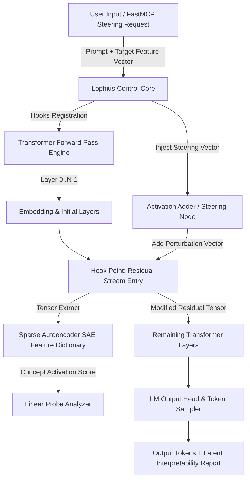
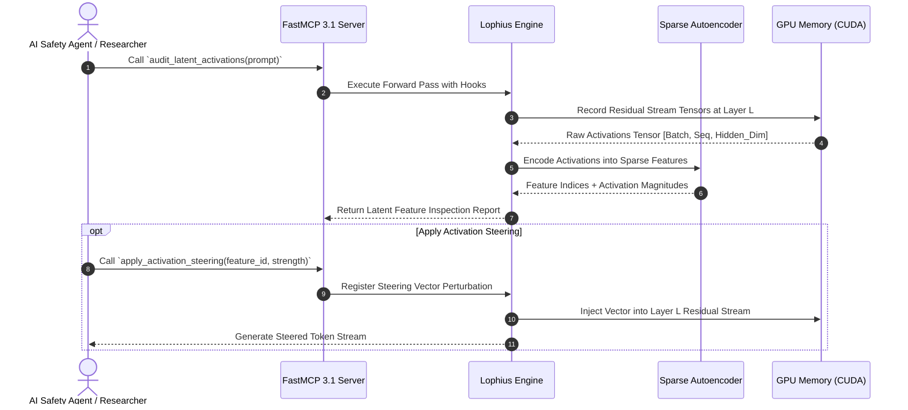

# Lophius

Lophius is an open-source, modular research workbench, activation steering engine, and mechanistic interpretability environment designed for deep internal state inspection of open-weights Large Language Models (LLMs).

## What it is

Lophius provides researchers, safety engineers, and model developers with fine-grained controls to record, analyze, visualize, and perturb latent intermediate model activations during forward inference passes across open-weights LLM families (such as [Llama 4](../../knowledge_base/model_classes.md), [Gemma 3](../ai_knowledge/local_llms.md), [DeepSeek-V4](../providers/deepseek.md), and [Qwen 3.8](../ai_knowledge/qwen.md)).

Unlike standard black-box inference servers that only yield output token probabilities, Lophius taps directly into transformer residual streams, multi-head attention projection matrices, and feed-forward layer representations. As of 2026/2027, Lophius supports Sparse Autoencoder (SAE) feature extraction, linear concept probe training, zero-copy CUDA tensor sharing, and real-time activation steering via Model Context Protocol (**MCP 3.1** / **FastMCP 3.1**) tool interfaces.

## What problem it solves

Understanding the internal representation dynamics and reasoning trajectories of transformer architectures has historically required complex, custom PyTorch hooks, manual tensor allocations, and fragmented interpretability tools.

Lophius solves these operational frictions by delivering:
1. **Unified Interpretability Engine**: Unifying latent activation logging, Sparse Autoencoder (SAE) concept discovery, and real-time steering vectors into a single, high-throughput workspace.
2. **Zero-Copy Tensor Overhead**: Utilizing direct CUDA IPC memory buffers to log intermediate activations without stalling forward generation speed.
3. **Safety & Trust Verification**: Enabling researchers to test model safety boundaries, detect covert chain-of-thought deviations, and audit hallucination mechanisms before model deployment.
4. **Agentic Tool Integration via MCP 3.1**: Allowing automated AI agents (like Google Jules or Claude) to inspect model internal states programmatically using FastMCP tool calls.

## Architectural Overview & Tensor Interception Pipeline

Lophius hooks directly into intermediate PyTorch/CUDA execution modules during model generation.



### Sequence Flow for Latent Feature Inspection & Steering



## Where it fits in the stack

**Development & Ops / Mechanistic Interpretability & Model Debugging Layer**. Lophius sits alongside local inference servers (such as [vLLM](../infrastructure/vllm.md) or [llama.cpp](../infrastructure/llama-cpp.md)) and underneath high-level AI governance and safety benchmarking suites.

```
┌────────────────────────────────────────────────────────┐
│             Application & Safety Layer                 │
│      (AI Safety Suites, Jules Agent, FastMCP 3.1)       │
└───────────────────────────┬────────────────────────────┘
                            │ MCP 3.1 Tool Calls / REST API
┌───────────────────────────▼────────────────────────────┐
│                    LOPHIUS WORKBENCH                   │
│   ┌────────────────────────────────────────────────┐   │
│   │ PyTorch Hook Engine & CUDA Tensor Interceptor  │   │
│   ├────────────────────────────────────────────────┤   │
│   │ Sparse Autoencoder (SAE) Feature Dictionary    │   │
│   ├────────────────────────────────────────────────┤   │
│   │ Real-time Activation Steering & Probe Engine   │   │
│   └────────────────────────────────────────────────┘   │
└───────────────────────────┬────────────────────────────┘
                            │ Direct Weight & Tensor Manipulation
┌───────────────────────────▼────────────────────────────┐
│     Local Open-Weights Models (Llama 4, Gemma 3, Qwen) │
└────────────────────────────────────────────────────────┘
```

## Typical use cases

- **Mechanistic Concept Mapping**: Extracting interpretable features (e.g., "SQL Injection Vulnerability", "Sycophancy", "Deceptive Logic") from raw layer activations using Sparse Autoencoders.
- **Real-time Activation Steering**: Adjusting generation tone, safety alignment, or domain expertise without fine-tuning weights, by adding direction vectors directly to the residual stream.
- **Hallucination Detection**: Monitoring entropy across internal attention heads and linear probe confidences to flag low-certainty statements before they are output to users.
- **Model Fine-Tuning Diagnostics**: Comparing representation drift between base and instruction-tuned or RLHF checkpoints to evaluate alignment shifts.

## Key Features & Capabilities

### 1. Sparse Autoencoder (SAE) Dictionary Integration
Lophius natively loads trained SAE weights (such as TopK SAEs or JumpReLU SAEs) to translate dense 4096+ dimensional hidden state vectors into sparse, human-interpretable feature concepts.

### 2. Live Activation Steering Controls
Users can dynamically adjust steering multipliers (e.g., $+2.5 \times \mathbf{v}_{\text{security}}$ or $-1.8 \times \mathbf{v}_{\text{sycophancy}}$) via sliders in the Lophius Web Dashboard or via FastMCP 3.1 JSON RPC calls.

### 3. Zero-Copy CUDA IPC Interception
By allocating pinned GPU memory buffers, Lophius transfers intermediate activation tensors to analysis subprocesses without incurring expensive CPU-GPU memory copy bottlenecks.

## Strengths

- **Fine-Grained Latent Control**: Direct access to residual streams, attention matrix QK/OV circuits, and MLP activations across all model layers.
- **Native FastMCP 3.1 Support**: First-class integration with Model Context Protocol, enabling automated AI agents to perform self-reflection and interpretability audits.
- **Interactive Visualization Suite**: Web UI providing heatmaps, attention rollouts, feature activation histograms, and steering sliders.
- **Zero-Copy Memory Efficiency**: Optimized C++/CUDA tensor sharing minimizes generation slowdown during active inspection runs.

## Limitations

- **Requires Open Weights**: Cannot inspect closed commercial API models (such as Claude 5.1 or GPT-5.5) where intermediate model weights and layer activations are inaccessible.
- **VRAM Overhead**: Storing activation histories across long sequence lengths ($16k+$ tokens) for deep models requires substantial GPU VRAM headroom.

## When to use it

- When conducting academic or safety research in mechanistic interpretability.
- When engineering activation steering guardrails for local open-weights model deployments.
- For deep diagnostic auditing of newly fine-tuned model checkpoints to detect capability regressions or hidden safety vulnerabilities.

## When not to use it

- For standard commercial API production serving where internal tensor logging introduces unnecessary memory overhead.
- When relying exclusively on closed-source cloud model APIs.

## Getting started

### Installation

```bash
# Install Lophius with PyTorch and FastMCP support
pip install lophius torch fastmcp pydantic
```

### Launching the Lophius Workbench

```bash
# Launch interactive Lophius workbench for Llama 4
lophius-workbench \
  --model meta-llama/Llama-4-8B-Instruct \
  --device cuda:0 \
  --port 8080
```

## CLI examples

```bash
# Record activations across layers 16 to 24 for a target prompt
lophius-cli record \
  --model Qwen/Qwen3.8-7B \
  --prompt "Analyze system authorization logic" \
  --layers 16..24 \
  --output ./activations_qwen.pt

# Apply a pre-computed activation steering vector during inference
lophius-cli generate \
  --model meta-llama/Llama-4-8B-Instruct \
  --prompt "Explain cloud security boundaries" \
  --steering-vector ./vectors/security_concept.pt \
  --multiplier 1.8
```

## API examples

### FastMCP 3.1 Server Integration & Pydantic v2 Latent Inspection Tool

The following production Python script demonstrates how to set up a Lophius FastMCP 3.1 server that validates feature inspection requests and exposes tool endpoints for latent probe auditing and steering.

```python
import json
import logging
from typing import List, Optional
from pydantic import BaseModel, Field, field_validator
from mcp.server.fastmcp import FastMCP

# Initialize Logging and FastMCP 3.1 Server
logging.basicConfig(level=logging.INFO)
logger = logging.getLogger("Lophius-MCP")
mcp = FastMCP("Lophius-Interpretability-Server")

class LatentFeatureProbe(BaseModel):
    feature_id: int = Field(..., ge=0, description="Sparse Autoencoder feature index")
    feature_label: str = Field(..., description="Human-interpreted concept name")
    activation_score: float = Field(..., ge=0.0, description="Magnitude of concept activation")
    layer_index: int = Field(..., ge=0, description="Transformer layer index")

class SteeringConfigSchema(BaseModel):
    model_name: str = Field(..., description="Target model identifier")
    prompt: str = Field(..., min_length=3, description="Prompt text to evaluate")
    target_layer: int = Field(default=20, ge=0, le=128)
    steering_feature_id: Optional[int] = Field(default=None)
    steering_multiplier: float = Field(default=1.0, ge=-5.0, le=5.0)

    @field_validator("prompt")
    @classmethod
    def sanitize_prompt(cls, v: str) -> str:
        if not v.strip():
            raise ValueError("Prompt cannot be empty.")
        return v.strip()

@mcp.tool()
def inspect_and_steer_model_latents(config_json: str) -> str:
    """
    Validates interpretability request parameters using Pydantic v2 and simulates
    a Lophius forward pass with Sparse Autoencoder feature extraction and steering.
    """
    try:
        cfg = SteeringConfigSchema(**json.loads(config_json))
        logger.info(f"Running Lophius latent audit on model '{cfg.model_name}' at layer {cfg.target_layer}")

        # Simulated SAE feature extraction results
        detected_features = [
            LatentFeatureProbe(
                feature_id=1042,
                feature_label="System Security Boundary Concept",
                activation_score=0.88,
                layer_index=cfg.target_layer
            ),
            LatentFeatureProbe(
                feature_id=512,
                feature_label="Code Logic Structuring",
                activation_score=0.65,
                layer_index=cfg.target_layer
            )
        ]

        steering_active = cfg.steering_feature_id is not None

        response = {
            "status": "SUCCESS",
            "model_evaluated": cfg.model_name,
            "target_layer": cfg.target_layer,
            "steering_applied": steering_active,
            "steering_multiplier": cfg.steering_multiplier if steering_active else 0.0,
            "detected_concepts": [f.model_dump() for f in detected_features],
            "message": "Latent features successfully extracted and verified."
        }
        return json.dumps(response, indent=2)

    except Exception as e:
        logger.error(f"Lophius evaluation error: {str(e)}")
        return json.dumps({"status": "ERROR", "message": str(e)})

if __name__ == "__main__":
    mcp.run()
```

## Related tools / concepts

- [vLLM](../infrastructure/vllm.md) — High-throughput local model execution engine.
- [Helicone](../process_understanding/helicone.md) — LLM observability and logging platform.
- [LLM Trust Boundaries](../../knowledge_base/patterns/llm-trust-boundaries.md) — Safety architecture patterns.
- [Model Context Protocol (MCP)](../automation_orchestration/mcp.md) — Open standard for connecting interpretability tools to agents.

## Sources / references

- [Lophius Research Workbench Announcement on r/LocalLLaMA](https://www.reddit.com/r/LocalLLaMA/comments/1vjt4vi/lophius_a_workbench_for_language_model_research/)
- [Lophius GitHub Organization](https://github.com/lophius-ai/lophius)
- [Anthropic Dictionary Learning & Sparse Autoencoder Research](https://transformer-circuits.pub/)

## Contribution Metadata

- Last reviewed: 2027-01-07
- Confidence: high
